Below diagram show the windowing effect and sampling


>  **discrete-time frequency**: $\hat{\omega}=\omega T_s$, units are ***radians per sample***


## warmup

|                       | Continuous-time signals $x_c(t)$ | Discrete-time signals $x[n]$    |
| :-------------------- | :------------------------------- | ------------------------------- |
| **Aperiodic signals** | Continuous Fourier transform     | Discrete-time Fourier transform |
| **Periodic signals**  | Fourier series                   | Discrete Fourier transform      |


### Fourier Series (FS)

$$\begin{align}
a_k &= \frac{1}{T}\int_T x(t)e^{-jk(2\pi/T)) t}dt \\
x(t) &= \sum_{k=-\infty}^{+\infty}a_ke^{jk(2\pi/T) t}
\end{align}$$


### Continuous-Time Fourier transform (CTFT)

$$\begin{align}
X(j\omega) &=\int_{-\infty}^{+\infty}x(t)e^{-j\omega t}dt \\
x(t)&= \frac{1}{2\pi}\int_{-\infty}^{+\infty}X(j\omega)e^{j\omega t}d\omega
\end{align}$$


> [[https://www.rose-hulman.edu/class/ee/yoder/ece380/Handouts/Fourier%20Transform%20Tables%20w.pdf](https://www.rose-hulman.edu/class/ee/yoder/ece380/Handouts/Fourier%20Transform%20Tables%20w.pdf)]
>
> 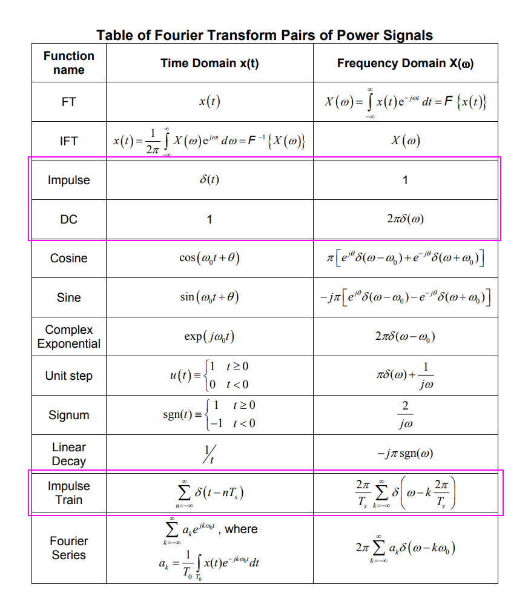


### Discrete-Time Fourier Transform (DTFT)


$$\begin{align}
X(e^{j\hat{\omega}}) &=\sum_{n=-\infty}^{+\infty}x[n]e^{-j\hat{\omega} n} \\
x[n] &= \frac{1}{2\pi}\int_{2\pi}X(e^{j\hat{\omega}})e^{j\hat{\omega} n}d\hat{\omega}
\end{align}$$


*DTFT is defined for infinitely long signals as well as finite-length signal*

*DTFT is **continuous** in the frequency domain*


We could verify that is the correct inverse DTFT relation by substituting the definition of the
DTFT and rearranging terms


---

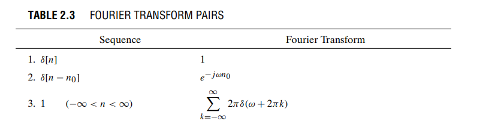


### Discrete-Time Fourier Series (DTFS)


### Discrete Fourier Transform (DFT)

> Two steps are needed to change the DTFT sum into a computable form: 
>
> 1. the continuous frequency variable $\hat{\omega}$ must be sampled
> 2. the limits on the DTFT sum must be finite

$$\begin{align}
X[k] &= \sum_{n=0}^{N-1}x[n]e^{-j(2\pi/N)kn}\space\space\space k=0,1,...,N-1 \\
x[n] &= \frac{1}{N}\sum_{k=0}^{N-1}X[k]e^{j(2\pi/N)kn} \space\space\space n=0,1,...,N-1 
\end{align}$$


Part of the proof is given by the following step:

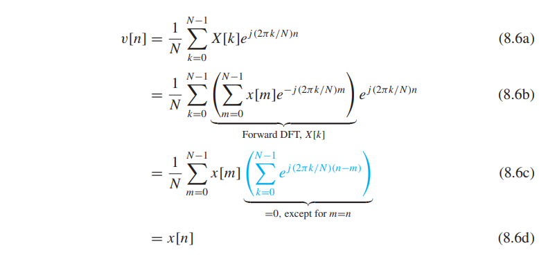


*DFT  $X[k]$ is a **sampled** version of the DTFT $X(e^{j\hat{\omega}})$, where $\hat{\omega_k} = \frac{2\pi k}{N}$*


### impulse train

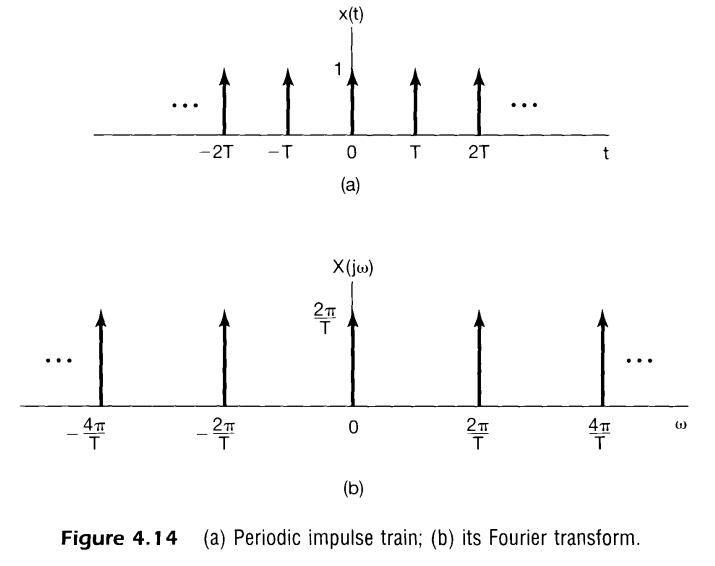

> using time-sampling property
>
> 


### impulse scaling

$$
\delta(\omega /T) = T\delta(\omega)
$$


### impulse invariance

$$
h[n] = Th_c(nT)
$$

When $h[n]$ and $h_c(t)$ are related through the above equation, i.e., the impulse response of the discrete-time  system is a *scaled*, *sampled* version of $h_c(t)$, the ***discrete-time system*** is said to be an **impulse-invariant** version of the ***continuous-time system***

we have
$$
H(e^{j\hat{\omega}}) = H_c\left(j\frac{\hat{\omega}}{T}\right)
$$


### Multiplication Property

> aka *Modulation Property*

$$
x_1(t)x_2(t)\overset{FT}{\longrightarrow}\frac{1}{2\pi}X_1(\omega)*X_2(\omega)
$$


### Parseval's Relation

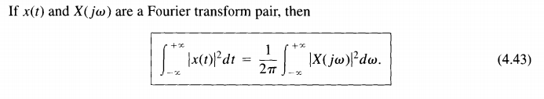

---

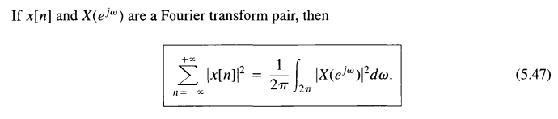

### Eigenfunctions & frequency response

*Complex exponentials* are **eigenfunctions** of LTI systems, that is,

continuous time: $e^{j\omega t}\to H(j\omega)e^{j\omega t}$

discrete time: $e^{j\hat{\omega}n} \to H(e^{j\hat{\omega}})e^{j\hat{\omega}n}$

where $H(j\omega)$,  $H(e^{j\hat{\omega}})$ is **frequency response** of *continuous-time systems* and *discrete-time systems*, which is the function of $\omega$ and $\hat{\omega}$
$$\begin{align}
H(j\omega) &= \int_{-\infty}^{+\infty}h(t)e^{-j\omega t}dt \\ \\
H(e^{j\hat{\omega}}) &= \sum_{n=-\infty}^{+\infty}h[n]e^{-j\hat{\omega} n}
\end{align}$$


The *frequency response* of *discrete-time LTI systems* is always a **periodic function** of the frequency variable $\hat{\omega}$ with period $2\pi$


### Sampling Theorem

**time-sampling theorem**:  applies to *bandlimited signals*

**spectral sampling theorem**: applies to *timelimited signals*


### Aliasing

The frequencies $f_{\text{sig}}$ and $Nf_s \pm f_{\text{sig}}$ ($N$ integer), are **indistinguishable** in the **discrete time domain**.

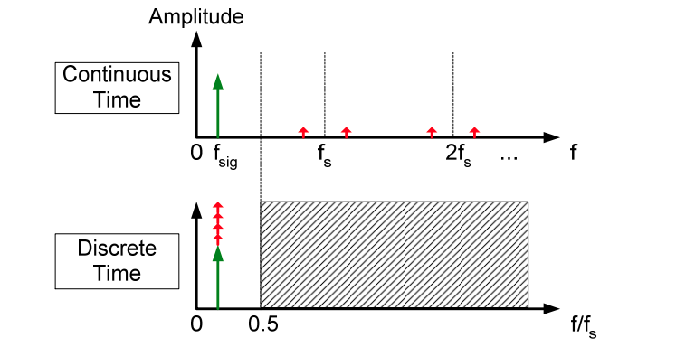

Given below sequence
$$
X[n] =A e^{j\omega T_s n}
$$


1. $kf_s + \Delta f$

​		$$\begin{align}
x[n] &= Ae^{j\left( kf_s+\Delta f \right)2\pi T_sn} + Ae^{j\left( -kf_s-\Delta f \right)2\pi T_sn} \\
&= Ae^{j\Delta f\cdot 2\pi T_sn} + Ae^{-j\Delta f\cdot 2\pi T_sn}
\end{align}$$

2. $kf_s - \Delta f$

​		$$\begin{align}
x[n] &= Ae^{j\left( kf_s-\Delta f \right)2\pi T_sn} + Ae^{j\left( -kf_s+\Delta f \right)2\pi T_sn} \\
&= Ae^{-j\Delta f\cdot 2\pi T_sn} + Ae^{j\Delta f\cdot 2\pi T_sn}
\end{align}$$


> *complex signal*
>
> $$\begin{align}
> A e^{j(\omega_s + \Delta \omega) T_s n} &= A e^{j(k\omega_s + \Delta \omega) T_s n} \\
> A e^{j(\omega_s - \Delta \omega) T_s n} &= A e^{j(k\omega_s - \Delta \omega) T_s n}
> \end{align}$$
>
> 


## spectral sampling

Fourier transform of a periodic signal with Fourier series coefficients $\{a_k\}$ can be interpreted as a train of *impulses* occurring at the harmonically related frequencies and for which the area of the impulse at the $k$th harmonic frequency $k\omega_0$ is $2\pi$ times the $k$th Fourier series coefficient $a_k$

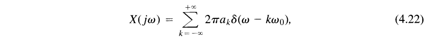

---


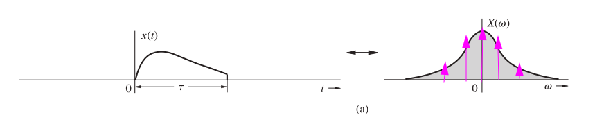

spectral sampling by $\omega_0$, and $\frac{2\pi}{\omega_0} \gt \tau$
$$
X_{n\omega_0}(\omega) = \sum_{n=-\infty}^{\infty}X(n\omega_0)\delta(\omega - n\omega_0)
$$
Periodic repetition of $x(t)$ is
$$
x_{n\omega_0}(t) = \frac{1}{\omega_0}\sum_{n=-\infty}^{\infty}x(t -n\frac{2\pi}{\omega_0})=\frac{T_0}{2\pi}\sum_{n=-\infty}^{\infty}x(t -nT_0)
$$


Then, if $x_{T_0} (t)$, a periodic signal formed by repeating $x(t)$ every $T_0$ seconds ($T_0 \gt \tau$​), its CTFT is
$$
X_{T_0}(\omega) = \frac{2\pi}{T_0} \cdot X_{n\omega_0}(\omega) = \frac{2\pi}{T_0}\sum_{n=-\infty}^{\infty}X(n\omega_0)\delta(\omega - n\omega_0)
$$
Then $x_{T_0} (t)$ can be expressed with inverse CTFT as
$$\begin{align}
x_{T_0} (t) &= \frac{1}{2\pi}\int_{-\infty}^{\infty}X_{T_0}(\omega)e^{j\omega t}d\omega \\
&= \frac{1}{T_0}\sum_{n=-\infty}^{\infty}X(n\omega_0)e^{jn\omega_0 t} =\sum_{n=-\infty}^{\infty}\frac{1}{T_0}X(n\omega_0)e^{jn\omega_0 t}
\end{align}$$

i.e.  the coefficients of the Fourier series for $x_{T_0} (t)$ is $D_n =\frac{1}{T_0}X(n\omega_0)$


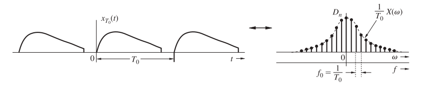

> alternative method by direct Fourier series
>
> 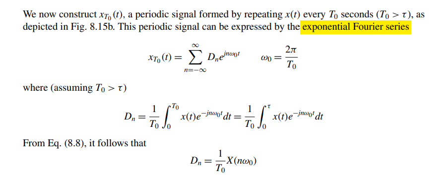


## Why DFT ?

*We can use DFT to compute DTFT samples and CTFT samples*

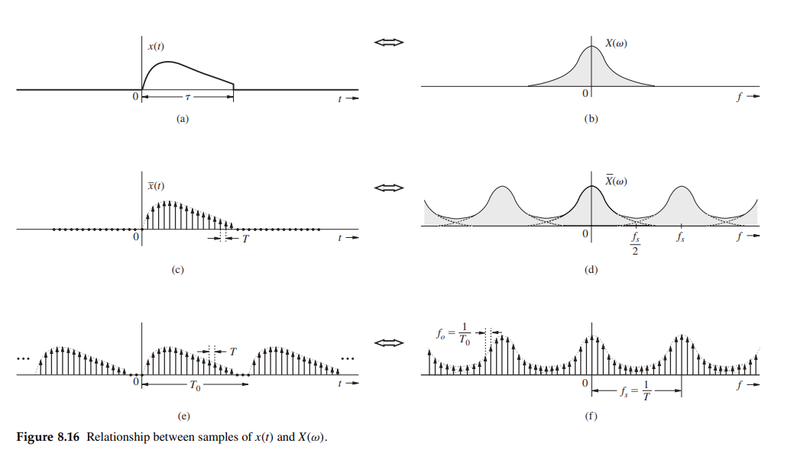

$$
\overline{x}(t) = \sum_{n=0}^{N_0-1}x(nT)\delta(t-nT)
$$
applying the Fourier transform yieds
$$
\overline{X}(\omega) = \sum_{n=0}^{N_0-1}x[n]e^{-jn\omega T}
$$
But $\overline{X}(\omega)$, the Fourier transform of $\overline{x}(t)$ is $X(\omega)/T$,  assuming negligible aliasing. Hence,
$$
X(\omega) = T\overline{X}(\omega) = T\sum_{n=0}^{N_0-1}x[n]e^{-jn\omega T}
$$
and
$$
X(k\omega_0) =  T\sum_{n=0}^{N_0-1}x[n]e^{-jn k\omega_0 T}
$$
with $\hat{\omega}_0 = \omega_0 T$
$$
X(k\omega_0) = T\sum_{n=0}^{N_0-1}x[n]e^{-jn k\hat{\omega}_0}
$$
*i.e. the relationship between CTFT and DFT is $X(k\omega_0) = T\cdot X[k]$, DFT is a tool for computing the samples of CTFT*


## C/D

Sampling with a periodic impulse train, followed by conversion to a discrete-time sequence

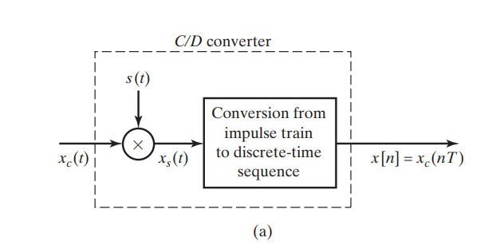

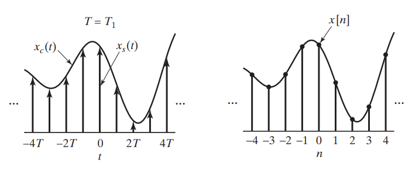

The periodic impulse train is
$$
s(t) = \sum_{n=-\infty}^{\infty}\delta(t-nT)
$$
$x_s(t)$ can be expressed as
$$
x_s(t) = \sum_{n=-\infty}^{\infty}x_c(nT)\delta(t-nT)
$$
i.e., *the size (area) of the impulse* at sample time $nT$ is equal to the value of the continuous-time signal at that time. 

> $x_s(t)$​ is, in a sense, a *continuous-time* signal (specifically, an impulse train) 
>
> **samples of $x_c(t)$** are represented by *finite numbers* in $x[n]$ rather than as the *areas of impulses,* as with $x_s(t)$


### Frequency-Domain Representation of Sampling

The relationship between the Fourier transforms of the input and the output of the impulse train modulator 
$$
X_s(j\omega) = \frac{1}{T}\sum_{k=-\infty}^{\infty}X_c(j(\omega -k\omega_s))
$$
where $\omega_s$ is the sampling frequency in *radians/s*

---

$X(e^{j\hat{\omega}})$, the discrete-time Fourier transform (DTFT) of the sequence $x[n]$, in terms of $X_s(j\omega)$ and $X_c(j\omega)$

| continuous-time Fourier transform                            | discrete-time Fourier transform                              |
| ------------------------------------------------------------ | ------------------------------------------------------------ |
| $x_s(t) = \sum_{n=-\infty}^{\infty}x_c(nT)\delta(t-nT)$      | $x[n]=x_c(nT)$                                               |
| $X_s(j\omega)=\sum_{n=-\infty}^{\infty}x_c(nT)e^{-j\omega Tn}$ | $X(e^{j\hat{\omega}})=\sum_{n=-\infty}^{\infty}x_c(nT)e^{-j\hat{\omega} n}$ |


$$
X(e^{j\omega T}) = \frac{1}{T}\sum_{k=-\infty}^{\infty}X_c(j(\omega-k\omega_s))
$$
or equivalently,
$$
X(e^{j\hat{\omega}}) = \frac{1}{T}\sum_{k=-\infty}^{\infty}X_c(j(\frac{\hat{\omega}}{T}-\frac{2\pi k}{T}))
$$

$X(e^{j\hat{\omega}})$ is a frequency-scaled version of $X_s(j\omega)$ with the frequency scaling specified by $\hat{\omega} =\omega T$


> Ref. 9.5 DTFT connection with the CTFT
>
> 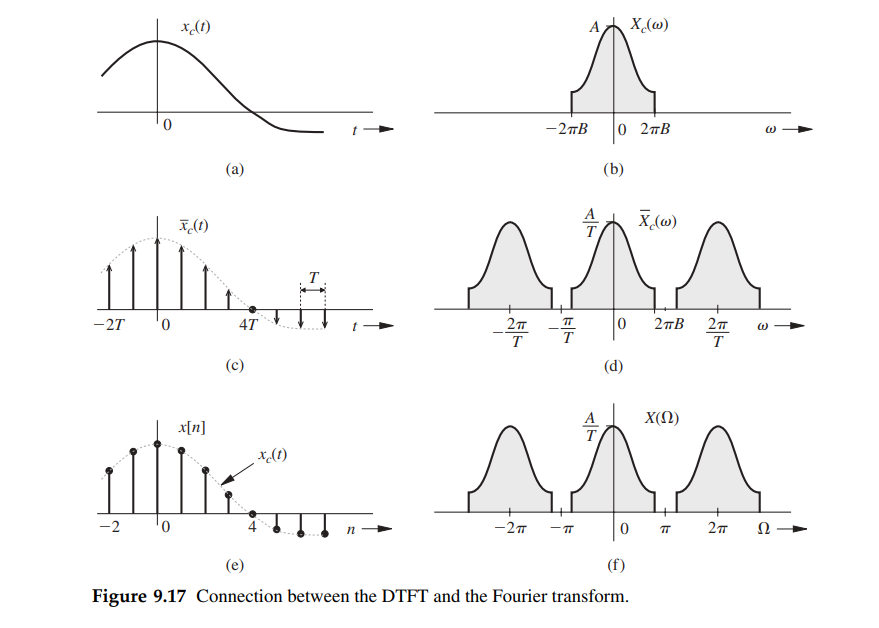
>
> *Here, $\Omega = \omega T$*


The factor $\frac{1}{T}$ in $X(e^{j\hat{\omega}})$ is **misleading**,  actually $x[n]$ is not scaled by $\frac{1}{T}$ when taking $\hat{\omega}$ variable of integration into account
$$\begin{align}
x_r[n] &= \frac{1}{2\pi} \int_{2\pi}X(e^{j\hat{\omega}})e^{j\hat{\omega} n}d\hat{\omega} \\
&= \frac{1}{2\pi}\int_{2\pi}\frac{1}{T}\sum_{k=-\infty}^{+\infty}X_c \left[ j\left(\frac{\hat{\omega}}{T} - \frac{2\pi k}{T}\right)\right] e^{j\hat{\omega} n}d\hat{\omega} \\
&\approx \frac{1}{2\pi}\frac{1}{T}\int_{2\pi}X_c (\frac{\hat{\omega}}{T} ) e^{j\hat{\omega}  n} d\hat{\omega} \\
&=\frac{1}{2\pi} \frac{1}{T}\int_{2\pi} \left[ \int_{\infty}X_c(\Phi)\delta (\Phi - \frac{\hat{\omega}}{T} )d\Phi \right]  e^{j\hat{\omega}  n} d\hat{\omega} \\
&=\frac{1}{2\pi} \frac{1}{T} \int_{\infty}X_c(\Phi)d\Phi \int_{2\pi}\delta (\Phi - \frac{\hat{\omega}}{T} )e^{j\hat{\omega}  n} d\hat{\omega} \\
&=\frac{1}{2\pi} \frac{1}{T} \int_{\infty}X_c(\Phi)d\Phi \int_{2\pi}T\cdot \delta (\Phi T - \hat{\omega} )e^{j\hat{\omega}  n} d\hat{\omega} \\
&=\frac{1}{2\pi} \int_{\infty}X_c(\Phi) e^{j\Phi T n}d\Phi
\end{align}$$

That is
$$\begin{align}
x_r[n] &= \frac{1}{2\pi}\int_{2\pi} \frac{1}{T}X_c (\frac{\hat{\omega}}{T} ) e^{j\hat{\omega}  n} d\hat{\omega} \\
&= \frac{1}{2\pi} \int_{\infty}X_c(\omega) e^{j\omega T n}d\omega \tag{31}
\end{align}$$

> assuming Nyquist–Shannon sampling theorem is met

$$\begin{align}
x_r[n] &= \frac{1}{2\pi} \int_{\infty}X_c(\omega) e^{j\omega T n}d\omega \\
&= \frac{1}{2\pi} \int_{\infty}X_c(\omega) e^{j\omega t}d\omega \\
&= x_c(t)
\end{align}$$

where $t = T n$, then $x_r[n] = x_c(nT)$

---

Assuming $x_c(t) = \cos(\omega_0 t)$, $x_s(t)= \sum_{n=-\infty}^{\infty}x_c(nT)\delta(t-nT)$ and $x[n]=x_c(nT)$, that is
$$\begin{align}
x_c(t) & = \cos(\omega_0 t) \\
x_s(t) &= \sum_{n=-\infty}^{\infty}\cos(\omega_0 nT)\delta(t-nT) \\
x[n] &= \cos(\omega_0 nT)
\end{align}$$

- $X_c(j\omega)$, the Fourier Transform of $x_c(t)$
  $$
  X_c(j\omega) = \pi[\delta(\omega - \omega_0) + \delta(\omega + \omega_0)]
  $$

- $X(e^{j\hat{\omega}})$, the the discrete-time Fourier transform (DTFT) of the sequence $x[n]$
  $$
  X(e^{j\hat{\omega}}) =\sum_{k=-\infty}^{+\infty}\pi[\delta(\hat{\omega} - \hat{\omega}_0-2\pi k) + \delta(\hat{\omega} + \hat{\omega}_0-2\pi k)]
  $$

- $X_s(j\omega)$, the Fourier Transform of $x_s(t)$
  $$
  X_s(j\omega)= \frac{1}{T}\sum_{k=-\infty}^{+\infty}\pi[\delta(\omega - \omega_0-k\omega_s) + \delta(\omega + \omega_0-k\omega_s)]
  $$

Express $X(e^{j\hat{\omega}})$ in terms of $X_s(j\omega)$ and $X_c(j\omega)$
$$
X(e^{j\hat{\omega}}) = \frac{1}{T}\sum_{k=-\infty}^{+\infty}\pi[\delta(\frac{\hat{\omega}}{T} - \omega_0-k\omega_s) + \delta(\frac{\hat{\omega}}{T} + \omega_0-k\omega_s)]
$$
Inverse $X(e^{j\hat{\omega}})$
$$\begin{align}
x_r[n] &= \frac{1}{2\pi} \int_{2\pi}X(e^{j\hat{\omega}}) e^{j\hat{\omega} n} d\hat{\omega} \\
&= \frac{1}{2\pi}\int_{2\pi} \pi[\delta(\frac{\hat{\omega}}{T} - \omega_0) + \delta(\frac{\hat{\omega}}{T} + \omega_0)]e^{j\hat{\omega} n} d\frac{\hat{\omega}}{T} \\
&= \frac{1}{2\pi}\int_{2\pi} \pi[\delta(\frac{\hat{\omega}}{T} - \omega_0)e^{j\hat{\omega}_0 n} + \delta(\frac{\hat{\omega}}{T} + \omega_0)e^{-j\hat{\omega}_0 n}] d\frac{\hat{\omega}}{T} \\
&= \frac{1}{2}[ e^{j\hat{\omega}_0 n}\int_{2\pi} [\delta(\frac{\hat{\omega}}{T} - \omega_0)d\frac{\hat{\omega}}{T} + e^{-j\hat{\omega}_0 n}\int_{2\pi} [\delta(\frac{\hat{\omega}}{T} + \omega_0)d\frac{\hat{\omega}}{T}] \\
&= \frac{1}{2}[ e^{j\hat{\omega}_0 n} + e^{-j\hat{\omega}_0 n} ] \\
&= \cos(\hat{\omega}_0 n)
\end{align}$$

or follow EQ.(31)

$$\begin{align}
x_r[n] &= \frac{1}{2\pi} \int_{\infty}X_c(\omega) e^{j\omega T n}d\omega \\
&= \frac{1}{2\pi} \int_{\infty} \pi[\delta(\omega - \omega_0) + \delta(\omega + \omega_0)]e^{j\omega T n}d\omega \\
&= \frac{1}{2}(e^{j\omega_0 T n}+e^{-j\omega_0 T n}) \\
&= \cos(\hat{\omega}_0 n)
\end{align}$$

where $\hat{\omega}_0 = \omega_0 T$


## D/C

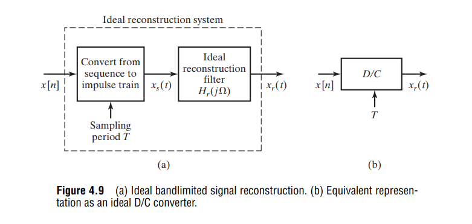

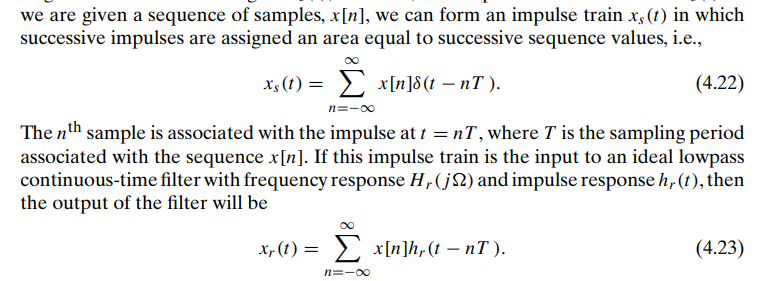

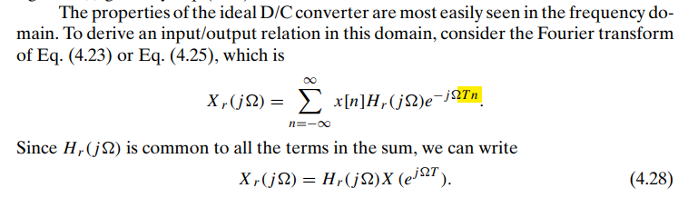


##  zero padding

This option increases $N_0$, the number of samples of $x(t)$, by adding dummy samples of 0 value. This addition of dummy samples is known as zero padding.

We should keep in mind that even if the fence were transparent, we would see a reality distorted by **aliasing**. 

Zero padding only allows us to look at more samples of that imperfect reality


## Transfer function

### sampled impulse response

The below equation demonstrates how to obtain **continuous Fourier Transform** from **DTFT** .
$$
X_c(\omega) = T \cdot X(\omega)
$$

> $T$ is sample period, follow previous equation

### useful functions

- using `fft`

  The outputs of the DFT are **samples** of the DTFT

- using `freqz`

  modeling as **FIR filter**, and the impulse response sequence of an FIR filter is the same as the sequence of filter coefficients, we can express the frequency response in terms of either the filter coefficients or the impulse response

  > `fft` is used in `freqz` internally


### Example

**Question**:

How to obtain continuous system transfer function from sampled impulse

**Answer**:

using above mentioned functions

---

> First order lowpass filter with 3-dB frequency **1Hz**


```matlab
clear all;
clc;

%% continuous system
s = tf('s');
h = 2*pi/(2*pi+s);
[mag, phs, wout] = bode(h);
fct = wout(:)/2/pi;
Hct_dB = 20*log10(mag(:));


fstep = 0.01;           % freq resolution
fnyqst = 100;
Ts = 1/(2*fnyqst);
Fs = 1/Ts;              % sampling freq
Ns = ceil(Fs/fstep);    % samping points
fstep = Fs/Ns;          % update fstep
t = (0:Ns-1)*Ts;        % sampling time points

y = impulse(h, t);      % impulse resp

%% modelling as discrete system
Y = fft(y);                 % dft
Hfft = Y * Ts;              % !!! multiply Ts
Hfft_dB = 20*log10(abs(Hfft(1:Ns/2+1)));
ffft = (1:Ns/2+1)*fstep - fstep;


[Hfir, ffir] = freqz(y, 1, [], 1/Ts);   % modelling as FIR
Hfir = Hfir * Ts;           % !!! multiply Ts
Hfir_dB = 20*log10(abs(Hfir));

%% plot
semilogx(fct, Hct_dB, 'k', ffft, Hfft_dB, 'r.-', ffir, Hfir_dB, 'b--');
legend('bode(s)', 'fft', 'FIR model')
xlabel('Freq(Hz)');
ylabel('dB');
xlim([1e-2 1e2]);
grid on;
title('frequency response of different methods');
```


## Gotcha

A remarkable fact of linear systems is that the **complex exponentials** are **eigenfunctions** of a linear system, as the system output to these inputs equals the input multiplied by a constant factor.

- Both amplitude and phase may change
- but the frequency does not change

>For an input $x(t)$, we can determine the output through the use of the convolution integral, so that with $x(t) = e^{st}$
>$$\begin{align}
>y(t) &= \int_{-\infty}^{+\infty}h(\tau)x(t-\tau)d\tau \\
>&= \int_{-\infty}^{+\infty} h(\tau) e^{s(t-\tau)}d\tau \\
>&= e^{st}\int_{-\infty}^{+\infty} h(\tau) e^{-s\tau}d\tau \\
>&= e^{st}H(s)
>\end{align}$$


Take the input signal to be a complex exponential of the form $x(t)=Ae^{j\phi}e^{j\omega t}$

$$\begin{align}
y(t) &= h(t)*x(t) \\
&= H(j\omega)Ae^{j\phi}e^{j\omega t}
\end{align}$$

The frequency response at $-\omega$ is the **complex conjugate** of the frequency response at $+\omega$, given $h(t)$ is real

$$\begin{align}
H^*(t) &= \left(\int_{-\infty}^{+\infty}h(t)e^{-j\omega t}dt\right)^* \\
&= \int_{-\infty}^{+\infty}h^*(t)e^{+j\omega t}dt \\
&= \int_{-\infty}^{+\infty}h(t)e^{-j(-\omega t)}dt \\
&= H(-j\omega)
\end{align}$$


The **real cosine signal** is actually composed of two **complex exponential signals**: one with positive frequency and the other with negative
$$
cos(\omega t + \phi) = \frac{e^{j(\omega t + \phi)} + e^{-j(\omega t + \phi)}}{2}
$$

The sinusoidal response is the sum of the complex-exponential response at the positive frequency $\omega$ and the response at the corresponding negative frequency $-\omega$ because of LTI systems's superposition property

- input:
  $$\begin{align}
  x(t) &= A cos(\omega t + \phi) \\
  &= \frac{1}{2}Ae^{\phi}e^{\omega t} + \frac{1}{2}Ae^{-\phi}e^{-\omega t}
  \end{align}$$

- output with $H(j\omega)=Ge^{j\theta}$:
  $$\begin{align}
  y(t) &= H(j\omega)\frac{1}{2}Ae^{\phi}e^{\omega t} +  H(-j\omega)\frac{1}{2}Ae^{-\phi}e^{-\omega t} \\
  &= Ge^{j\theta}\frac{1}{2}Ae^{\phi}e^{\omega t} + Ge^{-j\theta}\frac{1}{2}Ae^{-\phi}e^{-\omega t} \\
  &= GAcos(\omega t + \phi + \theta)
  \end{align}$$

Its phase shift is $\theta$ and gain is $G$, which is same with $H(j\omega)$.


## reference

Alan V Oppenheim,  Ronald W. Schafer. Discrete-Time Signal Processing, 3rd edition

B.P. Lathi, Roger Green. Linear Systems and Signals (The Oxford Series in Electrical and Computer Engineering) 3rd Edition

Alan V. Oppenheim, Alan S. Willsky, and S. Hamid Nawab. 1996. Signals & systems (2nd ed.)

James H. McClellan, Ronald Schafer, and Mark Yoder. 2015. DSP First (2nd. ed.). Prentice Hall Press, USA
