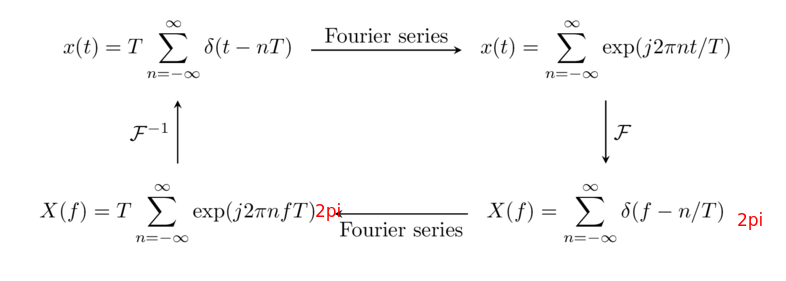
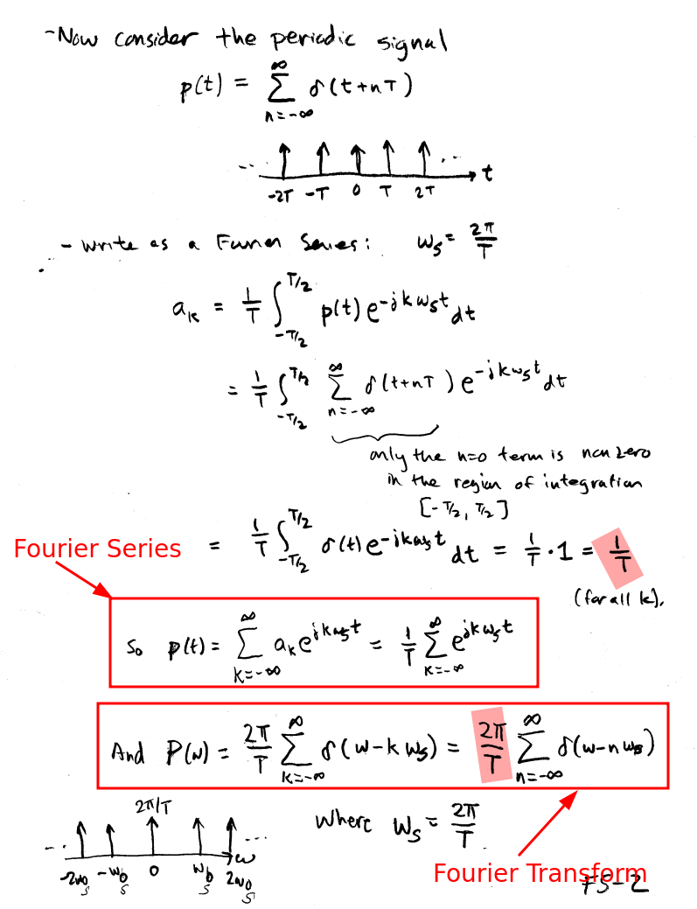
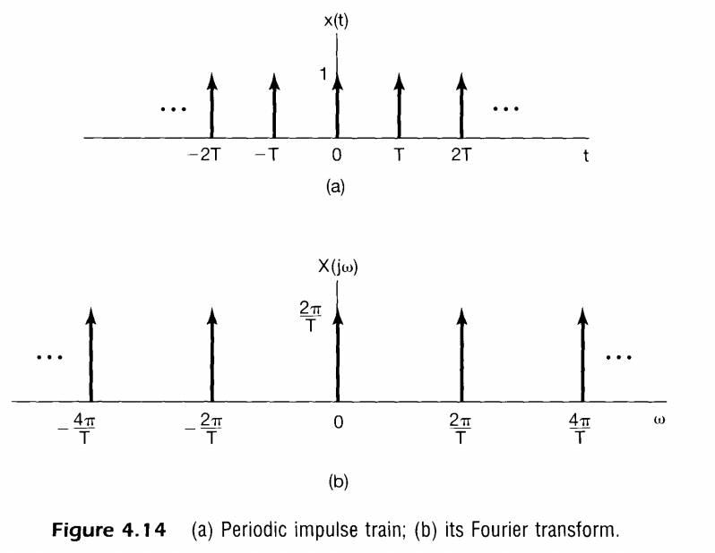
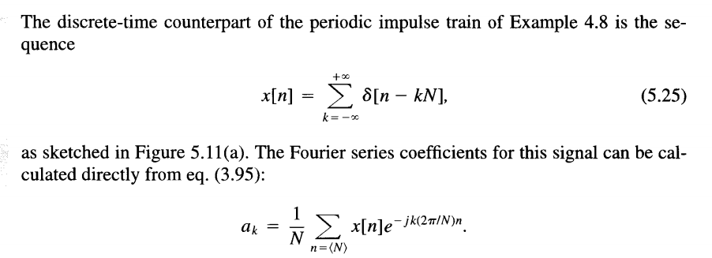
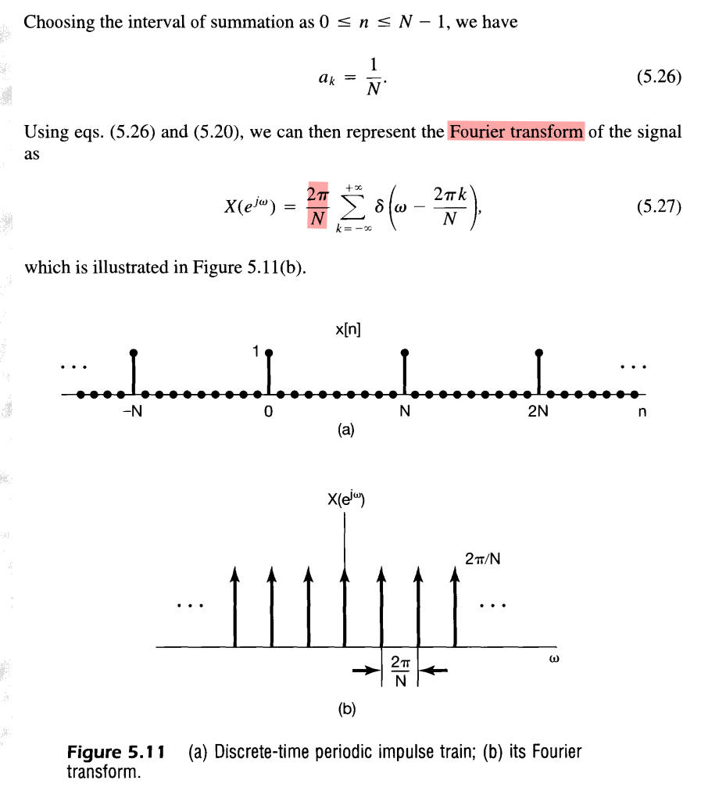
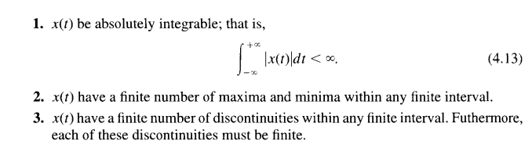
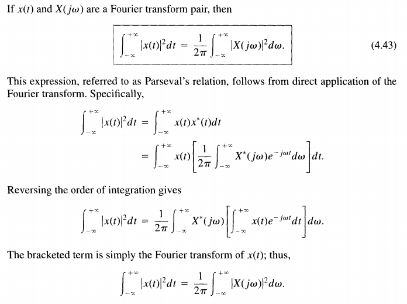
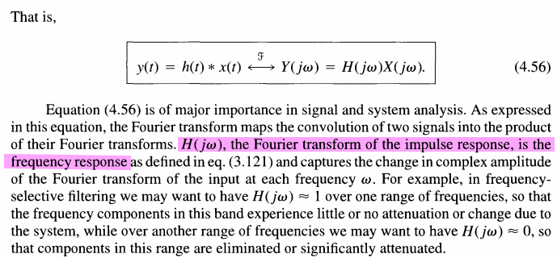
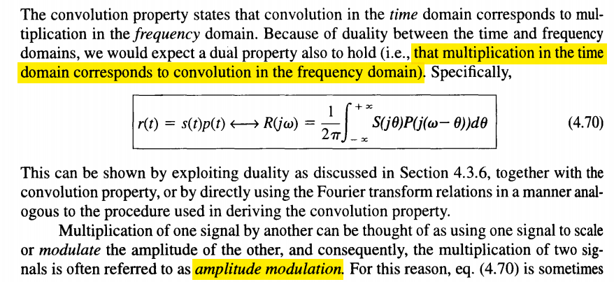
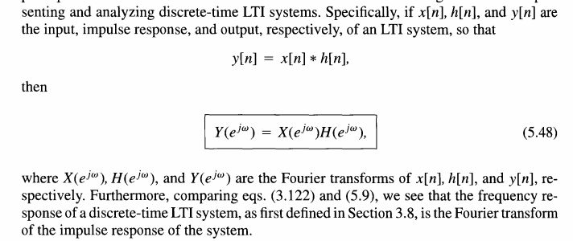

## The Dirac Comb function

### impulse train

> The Fourier transform of a periodic impulse train in the time domain with period $T$ is a periodic impulse train in the frequency domain with period $2\pi/T$

### The discrete-time counterpart 

## Periodic Signal

### DFS for periodic sequences

AKA **discrete-time Fourier series (DTFS)**

> Any *periodic sequence* can be represented as *a sum of complex exponential sequences*. 

&#11088;Analysis equation
$$
\tilde{X}[k] = \sum_{n=0}^{N-1}\tilde{x}[n]W_N^{kn}
$$
where $W_N = e^{-j(2\pi/N)}$

&#11088;Synthesis equation 
$$
\tilde{x}[n] = \frac{1}{N}\sum_{k=0}^{N-1}\tilde{X}[k]W_N^{-kn}
$$

> The multiplicative constant $1/N$ is included in above equation for convenience. It could also be absorbed into the definition of $\tilde{X}[k]$

In general
$$
W_N^{n+lN} = e^{-j(2\pi/N)(n+lN)} =e^{-j(2\pi/N)n}=W_N^n
$$
The Fourier series coefficients $\tilde{X}[k]$ can be interpreted to be 

- a sequence of finite length, for $k=0,...,(N-1)$, and zero otherwise
- a periodic sequence defined for all $k$, with period $N$

Clearly, both of these interpretations are acceptable, since in  *Synthesis equation* we use only the values of 

$\tilde{X}[k]$ for $0 \leq k \leq (N-1)$.

An advantage to interpreting the Fourier series coefficients $\tilde{X}[k]$ as a periodic sequence is that there is then a *duality* between the time and frequency domains for the Fourier series representation of periodic sequences. 

#### Duality

An exact duality exists between the time and frequency domains in the DFS representation that
does not exist in the DTFT and z-transform representation of sequences

This duality property is summarized as follows:

If
$$
\tilde{x}[n] \overset{DFS}\longleftrightarrow \tilde{X}[k]
$$
then
$$
\tilde{X}[n] \overset{DFS}\longleftrightarrow N\tilde{x}[-k]
$$

### The Fourier Transform of Periodic Signals

> use the DFS representation to obtain a DTFT representation of periodic signal:

1. *uniform convergence* of the Fourier transform of a sequence (*DTFT*) requires that the sequence be *absolutely summable*, and *mean-square convergence* requires that the sequence be *square summable*. Periodic sequences **satisfy neither condition** .

   **Absolute summability is a sufficient condition** for the existence of a Fourier transform representation (*DTFT*)

   $$\begin{align}
   |X(e^{j\omega})| &= \left| \sum_{n=-\infty}^{\infty}x[n]e^{-j\omega n} \right| \\
   &\leq \sum_{n=-\infty}^{\infty}|x[n]||e^{-j\omega n}| \\
   &\leq \sum_{n=-\infty}^{\infty}|x[n]| \lt \infty
   \end{align}$$

2. sequences that can be expressed as a sum of complex exponentials can be considered to have a Fourier transform representation as a train of impulses

&#11088;If  $\tilde{x}[n]$ is periodic with period $N$ and the corresponding *DFS coefficients* are $\tilde{X}[k]$, then the Fourier transform of $\tilde{x}[n]$ is defined to be the **impulse train** 
$$
\tilde{X}(e^{j\omega}) = \sum_{k=-\infty}^{\infty}\frac{2\pi}{N}\tilde{X}[k]\delta\left(\omega - \frac{2\pi k}{N}\right)
$$
Note that $\tilde{X}(e^{j\omega})$ has the necessary periodicity with period $2\pi$ since $\tilde{X}[k]$ is periodic with period $N$, and the impulses are spaced at integer multiples of $2\pi/N$, where $N$ is an integer.

The follow inverse Fourier transform shows $\tilde{X}(e^{j\omega})$ is a Fourier transform representation of the periodic sequence $\tilde{x}[n]$

> Although the Fourier transform of a periodic sequence does not converge in the normal sense, the **introduction of impulses** ($\delta\left(\omega - \frac{2\pi k}{N}\right)$) permits us to include *periodic sequences formally within the framework of Fourier transform analysis*

## Convolution

### discrete-time

$$
y[n] = \sum_{k=-\infty}^{+\infty}x[k]h[n-k]
$$

The operation on the right-hand side is known as the **convolution** of the sequences *x[n]* and *h[n]*. The operation of convolution can be represented symbolically as
$$
y[n] = x[n]*h[n]
$$

> The response of an LTI system to an arbitrary input is expressed in terms of the system's response to the *unit impulse*.
>
> From this, we see that an LTI system is completely characterized by its response to a single signal, namely, its response to the *unit impulse*.

### continuous-time

$$
y(t) = \int_{-\infty}^{+\infty}x(\tau)h(t-\tau)d\tau
$$

$$
y(t)=x(t)*h(t)
$$

As in discrete time, we see that a continuous-time LTI system is completely characterized by its impulse response - i.e., by its response to a single elementary signal, the unit impulse $\delta(t)$

## Eigenfunction

*A signal* for which the *system output* is *a (possibly complex) constant* times the *input* is referred to as an **eigenfunction** of the system, and the amplitude factor is referred to as the system's **eigenvalue**.

**Complex exponentials** are eigenfunctions of LTI systems, that is,

continuous time:
$$
e^{st}\to H(s)e^{st}
$$
discrete time:
$$
z^n \to H(z)z^n
$$

### continuous-time

Let's prove them. For an input $x(t)$, we can determine the output through the use of the convolution integral, so that with $x(t)=e^{st}$

$$\begin{align}
y(t) &= \int_{-\infty}^{+\infty}h(\tau)x(t-\tau)d\tau \\
&=\int_{-\infty}^{+\infty}h(\tau)e^{s(t-\tau)}d\tau \\
&= e^{st}\int_{-\infty}^{+\infty}h(\tau)e^{-s\tau}d\tau
\end{align}$$

Assuming that the integral on the right-hand side converges, the response to $e^{st}$ is of the form
$$
y(t)=H(s)e^{st}
$$
where $H(s)$ is a complex constant whose value depends on $s$ and which is related to the system impulse response by
$$
H(s)=\int_{-\infty}^{+\infty}h(\tau)e^{-s\tau}d\tau
$$

### discrete-time 

Suppose that an LTI system with impulse response $h[n]$ has as its input the sequence
$$
x[n] = z^n
$$
Then the output of the system can be determined from the convolution sum as
$$\begin{align}
y[n]&=\sum_{k=-\infty}^{+\infty}h[k]x[n-k] \\
&=\sum_{k=-\infty}^{+\infty}h[k]z^{n-k} \\
&= z^n\sum_{k=-\infty}^{+\infty}h[k]z^{-k}
\end{align}$$

Assuming that the summation on the right-hand side converges, the output is the same compex exponential multiplied by a constant that depends on the value of $z$. That is,
$$
y[n] = H(z)z^n
$$
where
$$
H(z) =\sum_{k=-\infty}^{+\infty}h[k]z^{-k}
$$

### linear combination 

> For both continuous time and discrete time, if the input to an LTI system is represented as *a linear combination of complex exponentials*, then the output can also be represented as *a linear combination of the same complex exponential signals*.

If the input to a continuous-time LTI system is represented as a linear combination of complex exponentials, that is, if
$$
x(t)=\sum_k a_ke^{s_k t}
$$
then the output will be
$$
y(t)=\sum_k a_kH(s_k)e^{s_k t}
$$
In an exactly analogous manner, if the input to a discrete-time LTI system is represented as a linear combination of complex exponentials, that is, if
$$
x[n]=\sum_k a_k z_k^n
$$
then the output  will be
$$
y[n]=\sum_k a_kH(z_k)z_k^n
$$

## Fourier series

### continuous-time

The Fourier series of a periodic continuous-time signal:
$$
x(t)=\sum_{k=-\infty}^{+\infty}a_ke^{jk\omega _0 t}=\sum_{k=-\infty}^{+\infty}a_ke^{jk(2\pi/T) t}
$$

$$
a_k = \frac{1}{T}\int_T x(t)e^{-jk\omega _0 t}dt=\frac{1}{T}\int _T x(t)e^{-jk(2\pi/T)t}dt
$$

Here, we have written equivalent expressions for the Fourier series in terms of the **fundamental frequency** $\omega _0$ and the **fundamental period** $T$

 

####  Conjugate Symmetry

If $x(t)$ **real**-that is, when $x(t) = x^*(t)$, the Fourier series coefficients will be *conjugate symmetric*, i.e
$$
a_{-k} = a_k^*
$$

#### Parseval's Relation

Parseval's relation states is that the **total average power** in a periodic signal equals the **sum of the average powers in all of its harmonic components**
$$
\frac{1}{T}\int _T|x(t)|^2dt = \sum_{k=-\infty}^{+\infty}|a_k|^2
$$

### discrete-time 

#### Parseval's Relation

$$
\frac{1}{N}\sum_{n=<N>}|x[n]|^2=\sum_{k=<N>}|a_k|^2
$$

### system functions

When $s$ or $z$ are general complex numbers, $H(s)$ and $H(z)$ are referred to as the **system functions** of the corresponding systems.

For continuous-time signals and systems, we focus on the specific case in which $\Re \{s\}= 0$, so that $s = j\omega$, and consequently, $e^{st}$ is of the form $e^{j\omega t}$. $H(j\omega)$ viewed as a function of $\omega$ - is referred to as the **frequency response** of the system and is given by
$$
H(j\omega) = \int_{-\infty}^{+\infty}h(t)e^{-j\omega t}dt
$$

Similarly, for discrete-time signals and systems, we focus on values of $z$ for which $|z|=1$, so that $z=e^{j\omega}$ and $z^n$ is of the form $e^{j\omega n}$. Then, the frequency response of the system is given by
$$
H(e^{j\omega}) = \sum_{n=-\infty}^{+\infty}h[n]e^{-j\omega n}
$$

> The response of an LTI system to a *complex exponential* signal of the form $e^{j\omega t}$ (in continuous time) or $e^{j\omega n}$ (in discrete time) is particularly simple to express in terms of the *frequency response of the system*

## Continuous-Time Fourier transform

$$
X(j\omega) =\int_{-\infty}^{+\infty}x(t)e^{-j\omega t}dt
$$

$$
x(t) = \frac{1}{2\pi}\int_{-\infty}^{+\infty}X(j\omega)e^{j\omega t}d\omega
$$

> Note system function is
> $$
> H(j\omega) = \int_{-\infty}^{+\infty}h(t)e^{-j\omega t}dt
> $$

### Dirichlet conditions

###  Fourier transform representations for periodic signals

### Differentiation and Integration

$$
\frac{dx(t)}{dt}\longleftrightarrow j\omega X(j\omega)
$$

$$
\int_{-\infty}^t x(\tau)d\tau \longleftrightarrow \frac{1}{j\omega}X(j\omega)+\pi X(0)\delta(\omega)
$$

### Parseval's Relation

### Convolution Property

### Multiplication Property

## Discrete-Time Fourier Transform

$$
X(e^{j\omega})=\sum_{n=-\infty}^{+\infty}x[n]e^{-j\omega n}
$$

$$
x[n] = \frac{1}{2\pi}\int_{2\pi}X(e^{j\omega})e^{j\omega n}d\omega
$$

> Note system function is
> $$
> H(e^{j\omega}) = \sum_{n=-\infty}^{+\infty}h[n]e^{-j\omega n}
> $$

### Parseval's Relation

### Convolution Property

we see that the *frequency response* $H(e^{j\omega})$ captures the change in complex amplitude of the Fourier transform of the input at each frequency $\omega$

## Laplace transform

The Laplace transform allowed us, for example, to perform transform analysis of unstable systems and to develop additional insights and tools for LTI system analysis

## Discrete Fourier Transform

where $W_N=e^{-j(2\pi/N)}$

## reference

The Dirac Comb and its Fourier Transform [[https://dspillustrations.com/pages/posts/misc/the-dirac-comb-and-its-fourier-transform.html](https://dspillustrations.com/pages/posts/misc/the-dirac-comb-and-its-fourier-transform.html)]

ECE 3793 Signals and Systems Spring 2017, Chapter 7 [[https://coecs.ou.edu/Joseph.P.Havlicek/ece3793/notes/ECE3793NotesCh07.pdf](https://coecs.ou.edu/Joseph.P.Havlicek/ece3793/notes/ECE3793NotesCh07.pdf)]

Oppenheim, A.V., Willsky, A.S., & Nawab, S.H. (1996). Signals & systems (2nd ed.).

Alan V Oppenheim,  Ronald W. Schafer. Discrete-Time Signal Processing, 3rd edition
