## Miller's approximation


### Right-Half-Plane Zero

$$
\left[(v_i - v_o)sC_c - g_m v_i\right]R_o = v_o
$$
Then
$$
\frac{v_o}{v_i} = -g_mR_o\frac{1-s\frac{C_c}{g_m}}{1+sR_oC_c}
$$
 right-half-plane Zero $\omega _z = \frac{g_m}{C_c}$


---

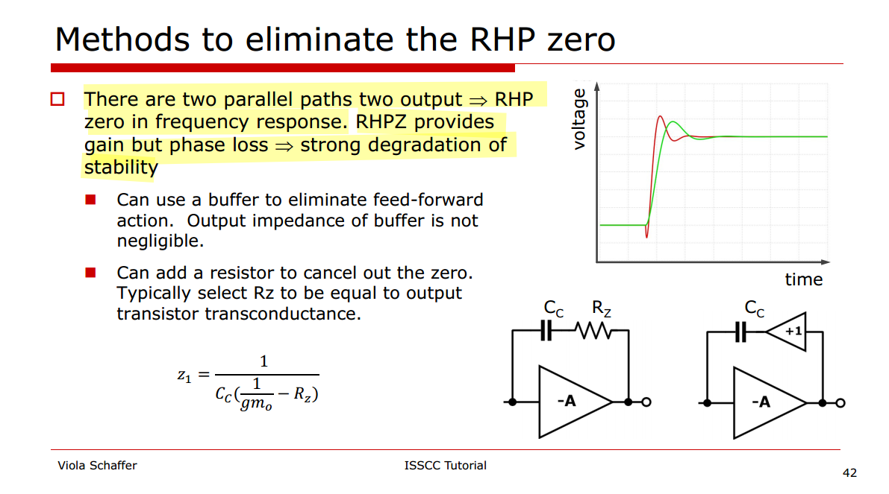


### Equivalent cap

The amplifier gain magnitude $A_v = g_m R_o$
$$
I_\text{c,in} = (v_i - v_o)sC_c
$$
Then
$$\begin{align}
I_\text{c,in}  &= (v_i + A_v v_i)sC_c \\
& = v_i s (1+A_v)C_c
\end{align}$$

we get $C_\text{in,eq}= (1+A_v)C_c\simeq A_vC_c$

Similarly
$$\begin{align}
I_\text{c,out}  &= (v_o - v_i)sC_c \\
& = v_o s (1+\frac{1}{A_v})C_c
\end{align}$$

we get $C_\text{out,eq}= (1+\frac{1}{A_v})C_c\simeq C_c$


## Pole Splitting

### Generic circuit in textbook

In addition to *lowering* the required capacitor value, Miller compensation entails a very important property: it moves the output pole *away from the origin*. This effect is called **pole splitting**

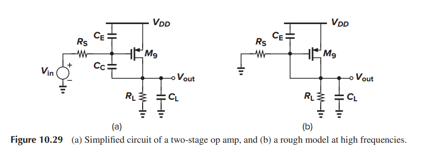

The 1st stage is replaced with Thevenin equivalent circuit , $V_i \cong V_i \cdot g_{m1}R_{o1}$

$$\begin{align}
\frac{V_i-V_{o1}}{R_{o1}} &= V_{o1}\cdot sC_{o1}+(V_{o1}-V_o)\cdot sC_c \\
V_{o1} &= \frac{V_i+sR_{o1}C_cV_o}{1+sR_{o1}(C_{o1}+C_c)}
\end{align}$$
$$
(V_{o1}-V_o)sC_c=g_{m2}V_{o1}+V_o(\frac{1}{R_{o2}+sC_L})
$$
substitute $V_{o1}$, we get

$$\begin{align}
\frac{V_o}{V_i} &= \frac{(sC_c-g_{m2})R_{o2}}{s^2R_{o1}R_{o2}(C_cC_{o1}+C_LC_{o1}+C_LC_c)+s\left\{ R_{o1}C_c\cdot g_{m2}R_{o2}+R_{o2}(C_c+C_L)+R_{o1}(C_{o1}+C_c) \right\} +1} \\
&= \frac{g_{m2}R_{o2}(s\frac{C_c}{g_{m2}}-1)}{s^2R_{o1}R_{o2}(C_cC_{o1}+C_LC_{o1}+C_LC_c)+s\left\{ R_{o1}C_c\cdot g_{m2}R_{o2}+R_{o2}(C_c+C_L)+R_{o1}(C_{o1}+C_c) \right\} +1}
\end{align}$$

left hand plane poles

$$\begin{align}
\omega_1 &= \frac{1}{R_{o1}C_c\cdot g_{m2}R_{o2}+R_{o2}(C_c+C_L)+R_{o1}(C_{o1}+C_c)} \\
\omega_2 &= \frac{R_{o1}C_c\cdot g_{m2}R_{o2}+R_{o2}(C_c+C_L)+R_{o1}(C_{o1}+C_c)}{R_{o1}R_{o2}(C_cC_{o1}+C_LC_{o1}+C_LC_c)}
\end{align}$$

and RHP (*right*-*hand plane*) zero
$$
\omega_z=\frac{g_{m2}}{C_c}
$$

### with series switch


replace $sC_L$ with $1/(R_{sw}+\frac{1}{sC_L})$
$$\begin{align}
\frac{V_{o2}}{V_i} &= \frac{g_{m2}R_{o2}(s\frac{C_c}{g_{m2}}-1)(1+sR_{sw}C_L)}{s^3R_{o1}R_{o2}R_{sw}C_{o1}C_cC_L+s^2\left\{R_{o1}R_{o2}(C_cC_{o1}+C_LC_{o1}+C_LC_c)+ \left[ R_{o1}C_c\cdot g_{m2}R_{o2}+R_{o2}(C_c+0)+R_{o1}(C_{o1}+C_c)\right]R_{sw}C_L \right\}+s\left\{ R_{o1}C_c\cdot g_{m2}R_{o2}+R_{o2}(C_c+C_L)+R_{o1}(C_{o1}+C_c) +R_{sw}C_L\right\} +1}
\end{align}$$
Due to
$$
\frac{V_o}{V_{o2}} = \frac{\frac{1}{sC_L}}{R_{sw}+\frac{1}{sC_L}}=\frac{1}{1+sR_{sw}C_L}
$$
Then
$$\begin{align}
\frac{V_o}{V_i} &= \frac{V_{o2}}{V_i} \cdot \frac{V_o}{V_{o2}} \\
&= \frac{g_{m2}R_{o2}(s\frac{C_c}{g_{m2}}-1)}{s^3R_{o1}R_{o2}R_{sw}C_{o1}C_cC_L+s^2\left\{R_{o1}R_{o2}(C_cC_{o1}+C_LC_{o1}+C_LC_c)+ \left[ R_{o1}C_c\cdot g_{m2}R_{o2}+R_{o2}(C_c+0)+R_{o1}(C_{o1}+C_c)\right]R_{sw}C_L \right\}+s\left\{ R_{o1}C_c\cdot g_{m2}R_{o2}+R_{o2}(C_c+C_L)+R_{o1}(C_{o1}+C_c) +R_{sw}C_L\right\} +1}
\end{align}$$


### $R_{sw}$ & $R_c$

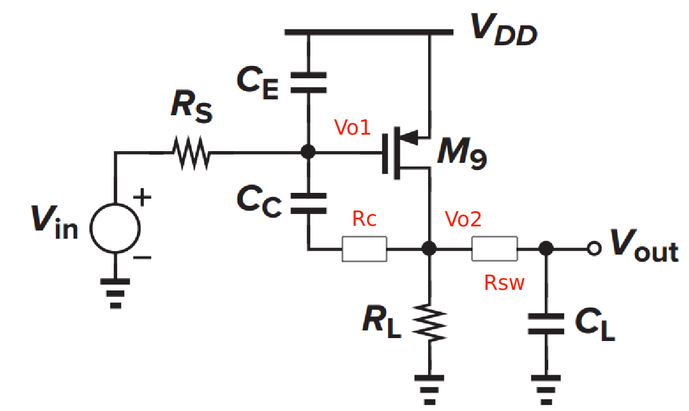

$$\begin{align}
\frac{V_{o2}}{V_i} &=-g_{m2}R_{o2}\frac{sC_c(R_c-1/g_{m2})+1}{(1+sR_{o1}C_{o1})sR_{o2}C_c+sR_{o1}\cdot g_{m2}R_{o2}C_c+\frac{s(R_{o2}+R_{sw})C_L+1}{sR_{sw}C_L+1}\left[(1+sR_{o1}C_{o1})(1+sR_cC_c)+sR_{o1}C_c \right]} \\
&=-g_{m2}R_{o2}\frac{sC_c(R_c-1/g_{m2})+1}{s^2R_{o1}R_{o2}C_{o1}C_c+sR_{o2}C_c+sR_{o1}\cdot g_{m2}R_{o2}C_c+\frac{s(R_{o2}+R_{sw})C_L+1}{sR_{sw}C_L+1}\left[(1+sR_{o1}C_{o1})(1+sR_cC_c)+sR_{o1}C_c \right]} \\
&=-g_{m2}R_{o2}\frac{\left[ sC_c(R_c-1/g_{m2})+1 \right](sR_{sw}C_L+1)}{s^2R_{o1}R_{o2}C_{o1}C_c(sR_{sw}C_L+1)+sR_{o2}C_c(sR_{sw}C_L+1)+sR_{o1}\cdot g_{m2}R_{o2}C_c(sR_{sw}C_L+1)+\left[s(R_{o2}+R_{sw})C_L+1\right]\left[(1+sR_{o1}C_{o1})(1+sR_cC_c)+sR_{o1}C_c \right]}
\end{align}$$


$s^3$ terms in denominator
$$
H_3 = s^3\cdot(R_{o1}R_{o2}R_c+R_{o1}R_{o2}R_{sw} +R_{o1}R_cR_{sw})\cdot C_{o1}C_cC_L
$$
$s^2$ terms in denominator
$$\begin{align}
H_2 &=s^2\cdot(R_{o1}R_{o2}C_{o1}C_c+R_{o1}R_{o2}C_{o1}C_L+R_{o2}R_cC_cC_L+R_{o1}R_{o2}C_cC_L+R_{o1}R_cC_{o1}C_c\\
&+R_{o2}R_{sw}C_cC_L+R_{o1}R_{sw}C_cC_L\cdot g_{m2}R_{o2}+R_{o1}R_{sw}C_{o1}C_L+R_{sw}R_cC_cC_L+R_{o1}R_{sw}C_cC_L)
\end{align}$$

$s^1$ term in denominator
$$
H_1=s(R_{o1}\cdot g_{m2}R_{o2}C_c+R_{o1}C_{o1}+R_cC_c+R_{o1}C_c+R_{o2}C_c+R_{o2}C_L+R_{sw}C_L)
$$
$s^0$ term in denominator
$$
H_0=1
$$
set $R_c=0$ and $R_{sw}=0$, the $H_*$ reduced to
$$\begin{align}
H_3 &= 0 \\
H_2 &=s^2R_{o1}R_{o2}(C_{o1}C_c+C_{o1}C_L+C_cC_L) \\
H_1&=s(R_{o1}\cdot g_{m2}R_{o2}C_c+R_{o1}C_{o1}+R_{o1}C_c+R_{o2}C_c+R_{o2}C_L) \\
H_0&=1
\end{align}$$
That is
$$
H=s^2R_{o1}R_{o2}(C_{o1}C_c+C_{o1}C_L+C_cC_L)+s(R_{o1}\cdot g_{m2}R_{o2}C_c+R_{o1}C_{o1}+R_{o1}C_c+R_{o2}C_c+R_{o2}C_L)+1
$$

which is same with our previous analysis of *Generic circuit in textbook*


And we know
$$
\frac{V_o}{V_{o2}}=\frac{1}{1+sR_{sw}C_L}
$$
Finally, we get $\frac{V_o}{V_i}$
$$\begin{align}
\frac{V_o}{V_i} &= \frac{V_{o2}}{V_i} \cdot \frac{V_o}{V_{o2}} \\
&= -g_{m2}R_{o2}\frac{\left[ sC_c(R_c-1/g_{m2})+1 \right](sR_{sw}C_L+1)}{H_3+H_2+H_1+1} \cdot \frac{1}{1+sR_{sw}C_L} \\
&= -g_{m2}R_{o2}\frac{ sC_c(R_c-1/g_{m2})+1}{H_3+H_2+H_1+1}
\end{align}$$

The loop transfer function is
$$
\frac{V_o}{V_i} =-g_{m1}R_{o1}g_{m2}R_{o2}\frac{ sC_c(R_c-1/g_{m2})+1}{H_3+H_2+H_1+1}
$$

---

***vccs model***


---

***simplify the transfer function***

1. ***omit $C_{o1}$***

We omit $C_{o1}$ in frequency range of interest

$$\begin{align}
H_3 &= 0 \\
H_2 &=s^2(R_{o2}R_c+R_{o1}R_{o2}+R_{o2}R_{sw}+R_{o1}R_{sw}\cdot g_{m2}R_{o2}+R_{sw}R_c+R_{o1}R_{sw})\cdot C_cC_L \\
H_1 &=s(R_{o1}\cdot g_{m2}R_{o2}C_c+R_cC_c+R_{o1}C_c+R_{o2}C_c+R_{o2}C_L+R_{sw}C_L) \\
H_0 &= 1
\end{align}$$

> two poles and 1 zero


2. ***more simplification***

Then, some terms can be omitted

$$\begin{align}
H_2 &=s^2R_{o1}R_{o2}(1+g_{m2}R_{sw})\cdot C_cC_L \\
H_1 &=sR_{o1}\cdot g_{m2}R_{o2}C_c \\
H_0 &= 1
\end{align}$$

The poles can be deduced
$$\begin{align}
\omega_1 &= \frac{1}{R_{o1}\cdot g_{m2}R_{o2}C_c} \\
\omega_2 &= \frac{1}{1+g_{m2}R_{sw}}\cdot \frac{g_{m2}}{C_L} \\
&= \frac{1}{(gm_2^{-1}+R_{sw})C_L}
\end{align}$$

The pole $\omega_2=\frac{1}{gm_2^{-1}C_L}$ is changed to $\omega_2=\frac{1}{(gm_2^{-1}+R_{sw})C_L}$

> In order to cancell $\omega_2$ with $\omega_z$, $R_c$ shall be increased

$$
R_{eq}=g_{m2}^{-1}+R_{sw}
$$


---

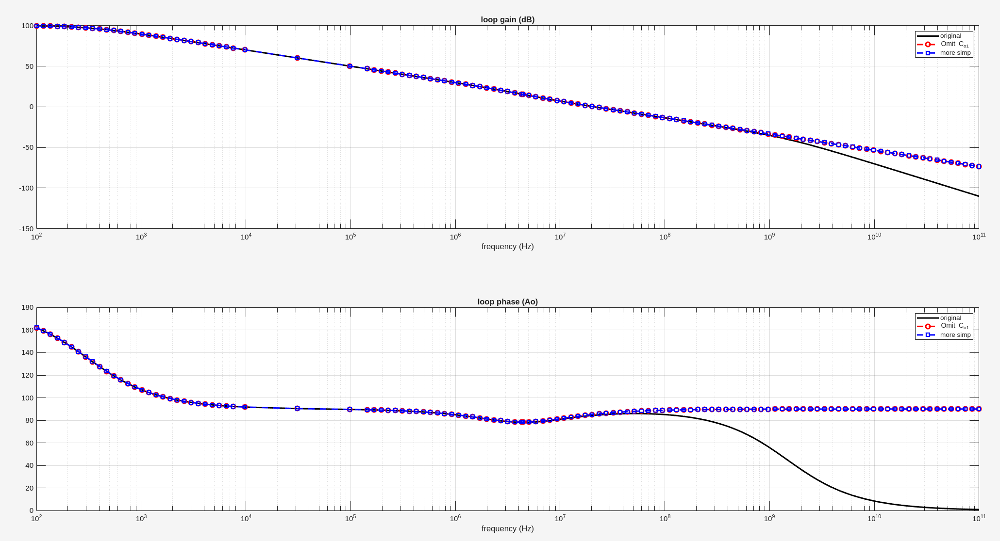

```matlab
gm1 = 400e-6;
gm2 = 3.2e-3;
Ro1 = 800e3;
Ro2 = 100e3;
Co1 = 100e-15;
CL = 7e-12;
Rc = 15e3;
Cc = 2e-12;
Rsw = 6e3;


s = tf('s');

%%%%%%%%%%%%%%%%%%%%%%%%%%
% org equation
H3 = s^3*(Ro1*Ro2*Rc + Ro1*Ro2*Rsw+Ro1*Rc*Rsw)*Co1*Cc*CL;
H2 = s^2*(Ro1*Ro2*Co1*Cc+Ro1*Ro2*Co1*CL+Ro2*Rc*Cc*CL+Ro1*Ro2*Cc*CL+Ro1*Rc*Co1*Cc+ ...
    Ro2*Rsw*Cc*CL+Ro1*Rsw*Cc*CL*gm2*Ro2+Ro1*Rsw*Co1*CL+Rsw*Rc*Cc*CL+Ro1*Rsw*Cc*CL);
H1 = s*(Ro1*gm2*Ro2*Cc+Ro1*Co1+Rc*Cc+Ro1*Cc+Ro2*Cc+Ro2*CL+Rsw*CL);
Nmt = s*Cc*(Rc-1/gm2)+1;
TF = -gm1*Ro1*gm2*Ro2*Nmt/(H3+H2+H1+1);
[mag, phase, wout] = bode(TF, {100*2*pi, 100*1e9*2*pi});


%%%%%%%%%%%%%%%%%%%%%%%%%%
% omit Co1
H3 = 0;
H2 = s^2*(Ro2*Rc+Ro1*Ro2+Ro2*Rsw+Ro1*Rsw*gm2*Ro2+Rsw*Rc+Ro1*Rsw)*Cc*CL;
H1 = s*(Ro1*gm2*Ro2*Cc+Rc*Cc+Ro1*Cc+Ro2*Cc+Ro2*CL+Rsw*CL);
Nmt = s*Cc*(Rc-1/gm2)+1;
TF = -gm1*Ro1*gm2*Ro2*Nmt/(H3+H2+H1+1);
[mag2, phase2, wout2] = bode(TF, {100*2*pi, 100e9*2*pi});


%%%%%%%%%%%%%%%%%%%%%%%%%%
% more simplification
H3 = 0;
H2 = s^2*Ro1*Ro2*(1+gm2*Rsw)*Cc*CL;
H1 = s*Ro1*gm2*Ro2*Cc;
Nmt = s*Cc*(Rc-1/gm2)+1;
TF = -gm1*Ro1*gm2*Ro2*Nmt/(H3+H2+H1+1);
[mag3, phase3, wout3] = bode(TF, {100*2*pi, 100e9*2*pi});

subplot(2,1,1)
semilogx(wout(:)/2/pi, 20*log10(mag(:)), 'k', 'linewidth', 2);
hold on;
semilogx(wout2(:)/2/pi, 20*log10(mag2(:)), 'ro--', 'linewidth', 2)
semilogx(wout3(:)/2/pi, 20*log10(mag3(:)), 'bs--', 'linewidth', 2)
grid on; title("loop gain (dB)"); xlabel("frequency (Hz)"); legend("original", "Omit C_{o1}", "more simp");

subplot(2,1,2)
semilogx(wout(:)/2/pi, phase(:), 'k', 'linewidth', 2);
hold on;
semilogx(wout2(:)/2/pi, phase2(:), 'ro--', 'linewidth', 2);
semilogx(wout3(:)/2/pi, phase3(:), 'bs--', 'linewidth', 2);
grid on; title("loop phase (Ao)"); xlabel("frequency (Hz)"); legend("original", "Omit C_{o1}", "more simp");
```


### non-dominant pole in Sansen's book

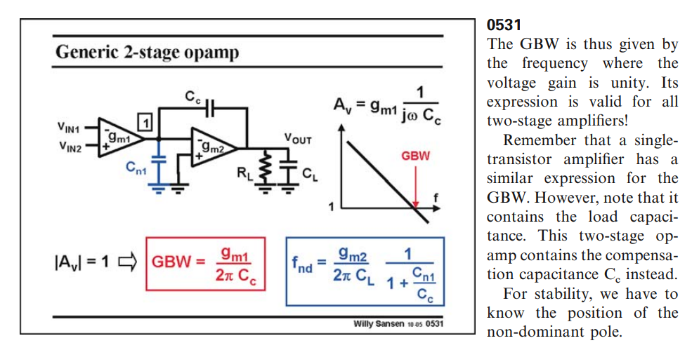

Following demonstrate how derive $f_{nd}$ from Razavi's equation. We copy $\omega_2$ here
$$
\omega_2 = \frac{R_{o1}C_c\cdot g_{m2}R_{o2}+R_{o2}(C_c+C_L)+R_{o1}(C_{o1}+C_c)}{R_{o1}R_{o2}(C_cC_{o1}+C_LC_{o1}+C_LC_c)}
$$
which can be reduced as below

$$\begin{align}
\omega_2 &= \frac{R_{o1}C_c\cdot g_{m2}R_{o2}+R_{o2}(C_c+C_L)+R_{o1}(C_{o1}+C_c)}{R_{o1}R_{o2}(C_cC_{o1}+C_LC_{o1}+C_LC_c)} \\
&= \frac{R_{o1}C_c\cdot g_{m2}R_{o2}}{R_{o1}R_{o2}(C_cC_{o1}+C_LC_{o1}+C_LC_c)} \\
&= \frac{C_c\cdot g_{m2}}{C_cC_{o1}+C_LC_{o1}+C_LC_c} \\
&= \frac{g_{m2}}{C_{o1}+C_L\frac{C_{o1}}{C_c}+C_L} \\
&= \frac{g_{m2}}{C_L\frac{C_{o1}}{C_c}+C_L} \\
&= \frac{g_{m2}}{C_L} \cdot \frac{1}{1+\frac{C_{o1}}{C_c}}
\end{align}$$


### Exercise of 2-stage opamp

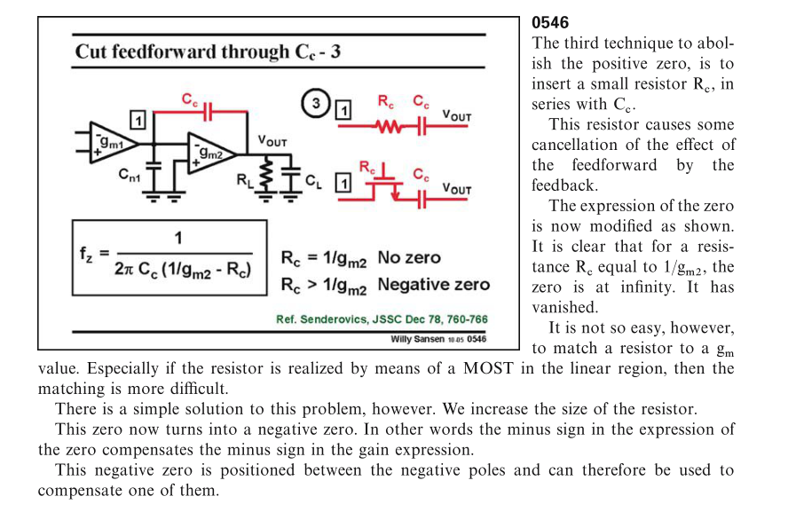

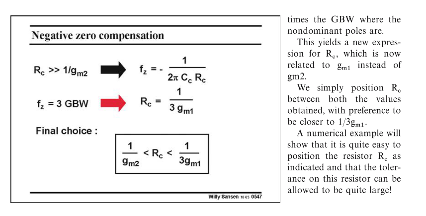

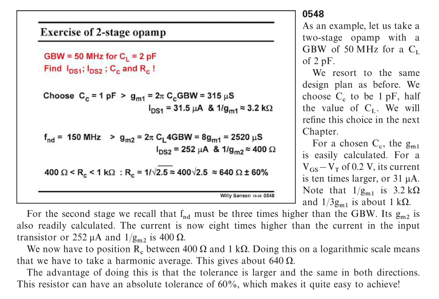

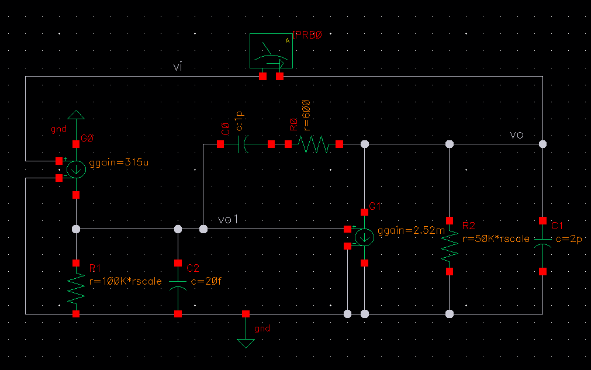

> $R_{o1}$ and $R_{o2}$ don't affect stability, if $f_{nd}>3\text{GBW}$
>
> DC gain: $g_{m1}g_{m2}R_{o1}R_{o2}$
>
> dominant pole: $\omega_d=\frac{1}{R_{o1}\cdot g_{m2}R_{o2}C_c}$

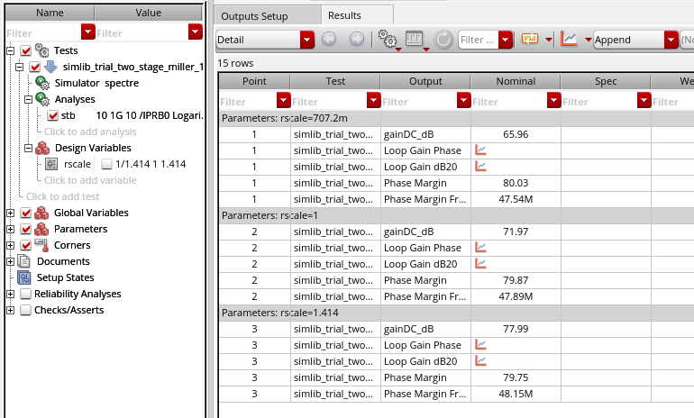


> $20log_{10}(1.414^2)=6\text{dB}$


## Cascode Compensation

This ***cascode compensation*** topology is popularly known as ***ahuja compensation***

The cause of the positive zero is the *feedforward current through $C_m$*.

To abolish this zero, we have to cut the feedforward path and create a unidirectional feedback through $C_m$.

1. Adding a resistor(nulling resistor) is one way to mitigate the effect of the feedforward current.

2. Another approach uses a current buffer cascode to pass the small-signal feedback current but cut the feedforward current

> People name this approach after the author *Ahuja*


The benefits of *Ahuja* compensation over Miller compensation are severa

- better PSRR

- higher unity-gain bandwidth using smaller compensation capacitor

- ability to cope better with heavy capacitive and resistive loads

---


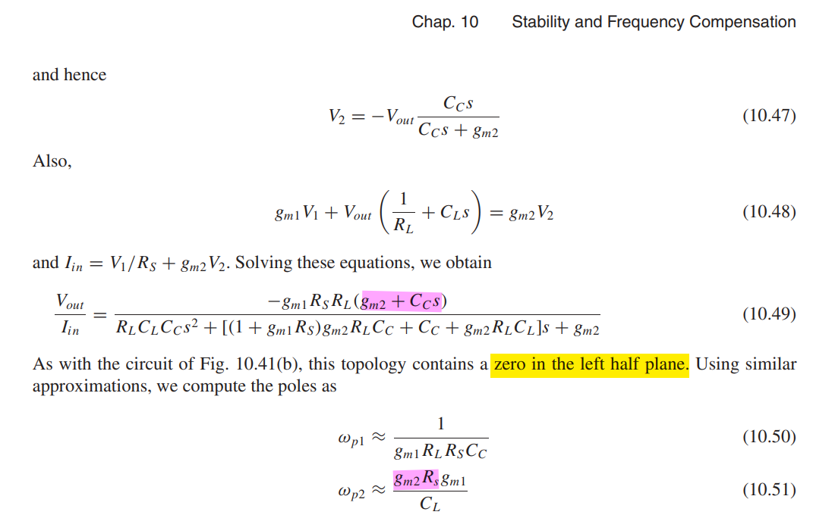

Of course, , if the capacitance at the gate of $M_1$ is taken into account, pole splitting is less pronounced.

---

**including $r_\text{o2}$**

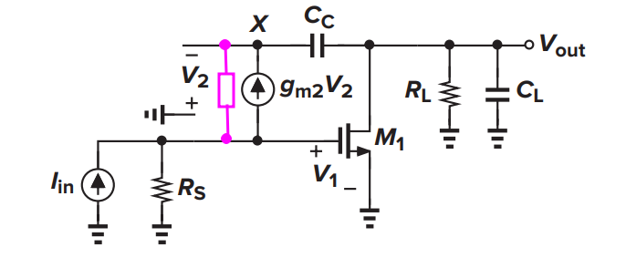
$$
\frac{V_{out}}{I_{in}} \approx \frac{-g_{m1}R_SR_L(g_{m2}+C_Cs)}{\frac{R_S+r_\text{o2}}{r_\text{o2}}R_LC_LC_Cs^2+g_{m1}g_{m2}R_LR_SC_Cs+g_{m2}}
$$
The poles as

$$\begin{align}
\omega_{p1} &\approx  \frac{1}{g_{m1}R_LR_SC_c} \\
\omega_{p2} &\approx \frac{g_{m2}R_Sg_{m1}}{C_L}\frac{r_\text{o2}}{R_S+r_\text{o2}}
\end{align}$$

and zero is not affected, which is $\omega_z =\frac{g_{m2}}{C_C}$


the above model simulation result is shown below


> the zero is located between two poles


take into the capacitance at the gate of $M_1$ and all other second-order effect


### intuitive analysis of zero

miller compensation

- zero in the **right** half plane
  $$
  g_\text{m1}V_P = sC_c V_P
  $$
  

cascode compensation

- zero in the **left** half plane
  $$
  g_\text{m2}V_X = - sC_c V_X
  $$
  


### Mitigate Impact of Zero


**dominant pole** 
$$
\omega_\text{p,d} = \frac {1} {R_\text{eq}g_\text{m9}R_{L}C_{c}}
$$
**first nondominant pole**
$$
\omega_\text{p,nd} = \frac {g_\text{m4}R_\text{eq}g_\text{m9}} {C_L}
$$
**zero** 
$$
\omega_\text{z} = (g_\text{m4}R_\text{eq})(\frac {g_\text{m9}} {C_c})
$$
a much greater magnitude than $g_\text{m9}/C_C$


### ahuja variations


## Pole-Zero Compensation

> ***Pole-Zero Compensation*** is also known as ***Lead Compensation***, ***Parallel Compensation***

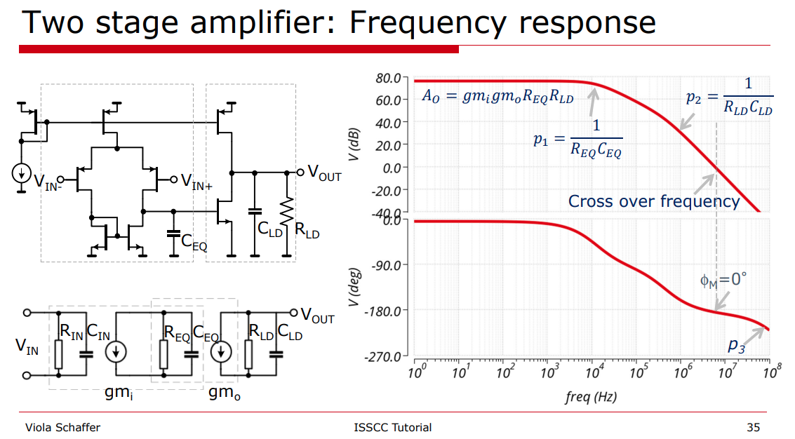

**Note**: The dominant pole is at output of the first stage, i.e. $\frac{1}{R_{EQ}C_{EQ}}$.

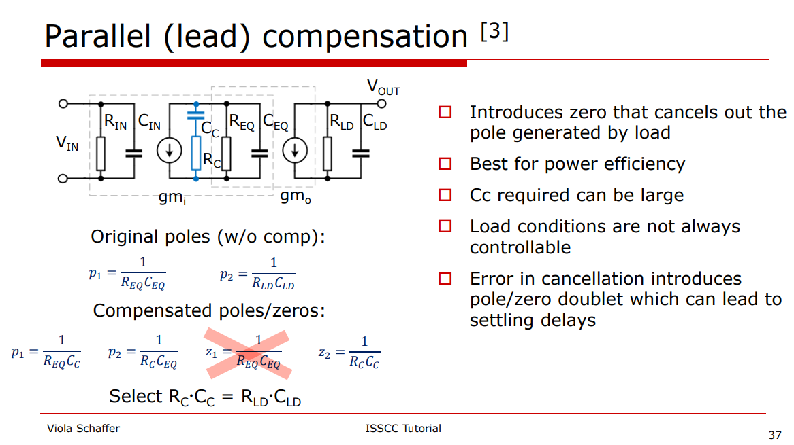

### Pole & Zero in transfer function

> Design with operational amplifiers and analog integrated circuits / Sergio Franco, San Francisco State University. – Fourth edition


$$
Y = \frac{1}{R_1} + sC_1+\frac{1}{R_c+1/SC_c}
$$

$$\begin{align}
Z &= \frac{1}{\frac{1}{R_1} + sC_1+\frac{1}{R_c+1/SC_c}} \\
&= \frac{R_1(1+sR_cC_c)}{s^2R_1C_1R_cC_c+s(R_1C_c+R_1C_1+R_cC_c)+1}
\end{align}$$
If $p_{1c} \ll p_{3c}$, two real roots can be found
$$\begin{align}
p_{1c} &= \frac{1}{R_1C_c+R_1C_1+R_cC_c} \\
p_{3c} &= \frac{R_1C_c+R_1C_1+R_cC_c}{R_1C_1R_cC_c}
\end{align}$$

The additional zero is
$$
z_c = \frac{1}{R_cC_c}
$$
Given $R_c \ll R$ and $C_c \gg C$
$$\begin{align}
p_{1c} &\simeq \frac{1}{R_1(C_c+C_1)} \simeq \frac{1}{R_1C_c}\\
p_{3c} &= \frac{1}{R_cC_1}+\frac{1}{R_cC_c}+\frac{1}{R_1C_1} \simeq \frac{1}{R_cC_1}
\end{align}$$

The output pole is unchanged, which is
$$
p_2 = \frac{1}{R_LC_L}
$$
We usually **cancel** $p_2$ with $z_c$, i.e.
$$
R_cC_c=R_LC_L
$$


### Phase margin

unity-gain frequency $\omega_t$
$$
\omega_t = A_\text{DC}\cdot P_{1c} =\frac{g_{m1}g_{m2}R_L}{C_c}
$$


1. PM=45$^o$
   $$
   p_{3c} = \omega_t
   $$
   Then, $C_c$ and $R_c$ can be obtained

   $$\begin{align}
      R_c &= \sqrt{\frac{R_1}{C_1\cdot A_{DC}\cdot p_2}}=\sqrt{\frac{R_1\cdot R_LC_L}{C_1\cdot A_{DC}}} \\
   C_c &= \sqrt{\frac{A_{DC}\cdot C_1}{R_1\cdot p_2}}=\sqrt{\frac{A_{DC}\cdot C_1 \cdot R_LC_L}{R_1}}
   \end{align}$$

2. PM=60$^o$
   $$
   p_{3c} = 2\cdot\omega_t
   $$
   Then, $C_c$ and $R_c$ can be obtained
   $$\begin{align}
      R_c &= \sqrt{\frac{R_1}{C_1\cdot 2A_{DC}\cdot p_2}} = \sqrt{\frac{R_1\cdot R_LC_L}{C_1\cdot 2A_{DC}}} \\
      &= \sqrt{\frac{C_L}{2g_{m1}g_{m2}C_1}}\\
   C_c &= \sqrt{\frac{2A_{DC}\cdot C_1}{R_1\cdot p_2}} = \sqrt{\frac{2A_{DC}\cdot C_1 \cdot R_LC_L}{R_1}} \\
   &= R_L\sqrt{2g_{m1}g_{m2}C_1C_L}
   \end{align}$$

   for the unity-gain frequency $\omega_t$ we find
   $$
   \omega_t = \sqrt{\frac{1}{2}\cdot \frac{g_{m1}g_{m2}}{C_1C_L}}
   $$
   The parallel compensation shows a remarkably good result. The new 0 dB frequency lies only a factor $\sqrt{2}$ lower than the theoretical maximum

> To increase $\phi_m$,  we need to **raise** $C_c$ a bit while **lowering** $R_c$ in proportion in order to maintain pole-zero cancellation. This causes $p_{1c}$ and $p_{3c}$ to split a bit further apart.

```matlab
clc;
clear;

fd = 84*1e3;	% dominant freq, unit: Hz
fnd = 3.25*1e6;	% unit: Hz
C = 478*1e-15;
R = 1/fd/(2*pi)/C;
Adc = 10^(80/20);

ri = 2; % PM=45: 1;  PM=60: 2
Rc = (R/C/fnd/2/pi/ri/Adc)^0.5; % compensation resistor
Cc = (ri*Adc*C/fnd/2/pi/R)^0.5; % compensation capacitor

wzc = 1/2/pi/Rc/Cc; % zero frequency
```

---

> ECEN 457 (ESS). Op-Amps Stability and Frequency Compensation Techniques

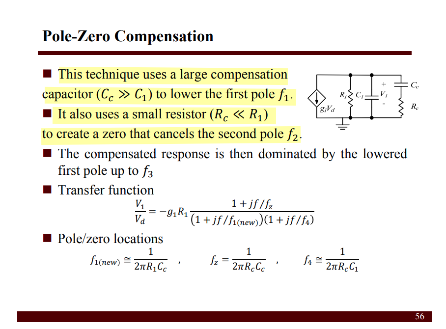

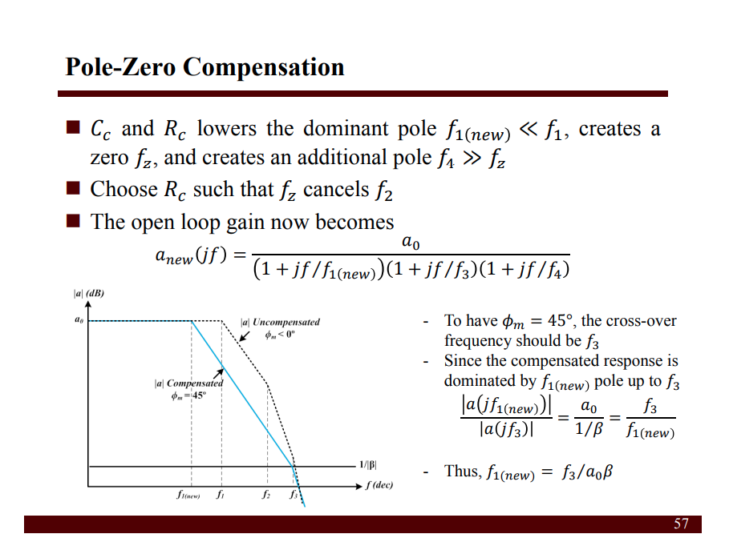


## Pole-Zero Doublet


---


The denominator part of $H_{closed}(s)$ is
$$
D(s) = \frac{s^2}{(A_0+1)\omega_{p1}\omega_{p2}}+\frac{\frac{1}{\omega_{p1}} + \frac{1}{\omega_{p2}}+\frac{A_0}{\omega_{z}}}{A_0+1}s+1
$$


suppose $\omega_{pA} \ll\omega_{pB}$, then
$$
D(s) = \left( 1+ \frac{s}{\omega_{pA}}\right)\left( 1+ \frac{s}{\omega_{pB}}\right)\approx \frac{s^2}{\omega_{pA}\omega_{pB}}+\frac{s}{\omega_{pA}} + 1
$$

Thus, the two poles of the closed-loop transfer function of system are
$$\begin{align}
\omega_{pA} &= \frac{A_0+1}{\frac{1}{\omega_{p1}} + \frac{1}{\omega_{p2}}+\frac{A_0}{\omega_{z}}} =  \frac{(A_0+1)\omega_{p1} \omega_{p2}}{\omega_{p1} + \omega_{p2} + \frac{A_0}{\omega_z}\omega_{p1} \omega_{p2}}\\
\omega_{pB} &= \omega_{p1} + \omega_{p2} + \frac{A_0}{\omega_z}\omega_{p1} \omega_{p2}
\end{align}$$


> ***non-dominant pole $\omega_{p2}$ and zero $\omega_z$  are in UGB***

$$\begin{align}
\omega_{pA} &\approx \omega_{p2}\\
\omega_{pB} &\approx (1+A_0)\omega_{p1}
\end{align}$$
Then, closed-loop transfer function is
$$
H_{closed}(s) \approx \frac{\frac{A_0}{A_0+1}\left(1+\frac{s}{\omega_z}\right)}{\left(1+\frac{s}{(1+A_0)\omega_{p1}}\right)\left( 1+\frac{s}{\omega_{p2}} \right)}
$$

Consider the Laplace transform function of step response, $X(s)=\frac{1}{s}$
$$
Y(s)=\frac{1}{s}\times H_{closed}(s)
$$
Thus, the **small-signal step response** of the closed-loop amplifier is
$$
y(t)=\frac{A_0}{A_0+1}\left[1-e^{-(A_0+1)\omega_{p1}t}-\left(1-\frac{\omega_{p2}}{\omega_z}\right)e^{-\omega_{p2}t} \right]u(t)
$$
Since, $\omega_{p2}\ll (1+A_0)\omega_{p1}$. rewrite the $y(t)$
$$
y(t)\approx \frac{A_0}{A_0+1}\left[1-\left(1-\frac{\omega_{p2}}{\omega_z}\right)e^{-\omega_{p2}t} \right]u(t)
$$


***perfect pole-zero cancellation*** with $\omega_{p2}=\omega_z$
$$
y(t) \approx \frac{A_0}{A_0+1}\left[1-e^{-(A_0+1)\omega_{p1}t}\right]u(t) \approx \frac{A_0}{A_0+1}u(t)
$$


```matlab
clear
clc

A0 = 1e6;
wp1= 2*pi*1;   % 1Hz
wpz = 2*pi*2e4; % 20KHz

s=tf('s');

wp2 =0.5*wpz;
wz =2*wpz;
Ho = A0*(1+s/wz)/(1+s/wp1)/(1+s/wp2);
Hc = Ho/(1+Ho);


wi = logspace(-3, 7, 100000)*2*pi;
ti = linspace(0, 100,100000)*1e-6;

[mag_0p1, phase_0p1, wout_0p1] = bode(Ho, wi);
[vo_0p1, to_0p1] = step(Hc, ti);


wp2 =1*wpz;
wz =1*wpz;
Ho = A0*(1+s/wz)/(1+s/wp1)/(1+s/wp2);
Hc = Ho/(1+Ho);
[mag_1p0, phase_1p0, wout_1p0] = bode(Ho, wi);
[vo_1p0, to_1p0] = step(Hc, ti);


wp2 =2*wpz;
wz =0.5*wpz;
Ho = A0*(1+s/wz)/(1+s/wp1)/(1+s/wp2);
Hc = Ho/(1+Ho);
[mag_10p0, phase_10p0, wout_10p0] = bode(Ho, wi);
[vo_10p0, to_10p0] = step(Hc, ti);

subplot(2,2,1)
semilogx(wout_0p1(:)/2/pi, 20*log10(mag_0p1(:)),'b-',LineWidth=2);
hold on
semilogx(wout_1p0(:)/2/pi, 20*log10(mag_1p0(:)),'r-',LineWidth=2);
semilogx(wout_10p0(:)/2/pi, 20*log10(mag_10p0(:)),'g-',LineWidth=2);
grid on; xlabel('Hz'); ylabel('Mag (dB)');
legend('\omega_{p2}<\omega_{z}', '\omega_{p2}=\omega_{z}', '\omega_{p2}>\omega_{z}')

subplot(2,2,3)
semilogx(wout_0p1(:)/2/pi, phase_0p1(:),'b-',LineWidth=2);
hold on
semilogx(wout_1p0(:)/2/pi, phase_1p0(:),'r-',LineWidth=2);
semilogx(wout_10p0(:)/2/pi, phase_10p0(:),'g-',LineWidth=2);
grid on; xlabel('Hz'); ylabel('Phase')
legend('\omega_{p2}<\omega_{z}', '\omega_{p2}=\omega_{z}', '\omega_{p2}>\omega_{z}')

subplot(2,2,[2 4])
plot(to_0p1(:), vo_0p1(:),'b-',LineWidth=2);
hold on
plot(to_1p0(:), vo_1p0(:),'r-',LineWidth=2);
plot(to_10p0(:), vo_10p0(:),'g-',LineWidth=2);
grid on; xlabel('time'); ylabel('V')
legend('\omega_{p2}<\omega_{z}', '\omega_{p2}=\omega_{z}', '\omega_{p2}>\omega_{z}')
```


---

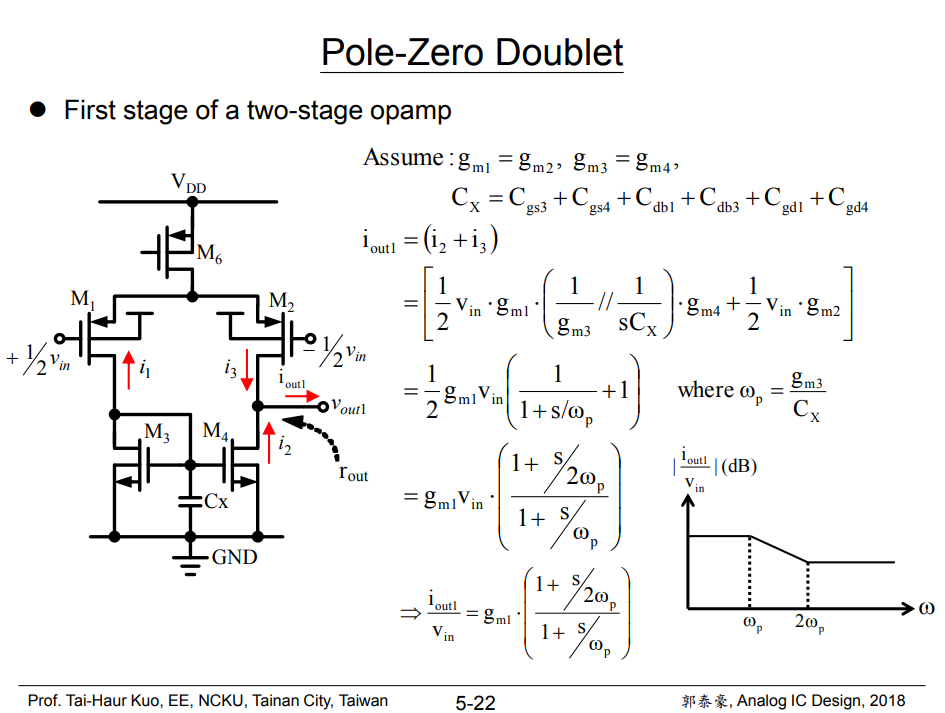


> The zero comes from the mirror node
>
> Thanks to unity gain buffer, zero is alleviated for $C_c$


## reference

Viola Schaffer,  ISSCC 2021 Tutorials Designing Amplifiers for Stability [[pdf](https://www.nishanchettri.com/isscc-slides/2021%20ISSCC/TUTORIALS/ISSCC2021-T9.pdf)]

J. H. Huijsing, "Operational Amplifiers, Theory and Design, 3rd ed. New York: Springer, 2017"

Razavi, Behzad. Design of Analog CMOS Integrated Circuits. India: McGraw-Hill, 2017. [[pdf](https://picture.iczhiku.com/resource/eetop/shkFghTKAoYQtXXX.pdf)]

Sansen, Willy M. Analog Design Essentials. Germany: Springer US, 2006.

---

***Ahuja Compensation***

B. K. Ahuja, "An Improved Frequency Compensation Technique for CMOS Operational Amplifiers," IEEE 1. Solid-State Circuits, vol. 18, no. 6, pp. 629-633, Dec. 1983. [[https://sci-hub.se/10.1109/JSSC.1983.1052012](https://sci-hub.se/10.1109/JSSC.1983.1052012)]

U. Dasgupta, "Issues in "Ahuja" frequency compensation technique", IEEE International Symposium on Radio-Frequency Integration Technology, 2009. [[https://sci-hub.se/10.1109/RFIT.2009.5383679](https://sci-hub.se/10.1109/RFIT.2009.5383679)]

R. J. Reay and G. T. A. Kovacs, "An unconditionally stable two-stage CMOS amplifier," in *IEEE Journal of Solid-State Circuits*, vol. 30, no. 5, pp. 591-594, May 1995 [[https://sci-hub.se/10.1109/4.384174](https://sci-hub.se/10.1109/4.384174)]

A. Garimella and P. M. Furth, "Frequency compensation techniques for op-amps and LDOs: A tutorial overview," 2011 IEEE 54th International Midwest Symposium on Circuits and Systems (MWSCAS), 2011 [[https://sci-hub.se/10.1109/MWSCAS.2011.6026315](https://sci-hub.se/10.1109/MWSCAS.2011.6026315)]

H. Aminzadeh, R. Lotfi and S. Rahimian, "Design Guidelines for Two-Stage Cascode-Compensated Operational Amplifiers," 2006 13th IEEE International Conference on Electronics, Circuits and Systems, 2006 [[https://sci-hub.se/10.1109/ICECS.2006.379776](https://sci-hub.se/10.1109/ICECS.2006.379776)]

H. Aminzadeh and K. Mafinezhad, "On the power efficiency of cascode compensation over Miller compensation in two-stage operational amplifiers," Proceeding of the 13th international symposium on Low power electronics and design (ISLPED '08), Bangalore, India, 2008 [[https://sci-hub.se/10.1145/1393921.1393995](https://sci-hub.se/10.1145/1393921.1393995)]

Stabilizing a 2-Stage Amplifier URL:[https://a2d2ic.wordpress.com/2016/11/10/stabilizing-a-2-stage-amplifier/](https://a2d2ic.wordpress.com/2016/11/10/stabilizing-a-2-stage-amplifier/)

EE 240B: Advanced Analog Circuit Design, Prof. Bernhard E. Boser [[OTA II, Multi-Stage](https://people.eecs.berkeley.edu/~boser/courses/240B/lectures/M07%20OTA%20II.pdf)]

---

***Parallel Compensation***

R.Eschauzier "Wide Bandwidth Low Power Operational Amplifiers", Delft University Press, 1994.

Gene F. Franklin, J. David Powell, and Abbas Emami-Naeini. 2018. Feedback Control of Dynamic Systems (8th Edition) (8th. ed.). Pearson. 6.7 Compensation

Application Note AN-1286 Compensation for the LM3478 Boost Controller

ECEN 607 Advanced Analog Circuit Design Techniques Spring 2017 [[Lect 1D Op-Amps Stability and Frequency Compensation Techniques](https://people.engr.tamu.edu/s-sanchez/Lec_for_607_stability Jan27.pdf)]

Sergio Franco, San Francisco State University, Design with Operational Amplifiers and Analog Integrated Circuits, 4/e [[pdf](https://zakerhaghighi.ir/wp-content/uploads/2017/09/Sergio-Franco-Design-With-Operational-Amplifiers-And-Analog-Integrated-Circuits-McGraw-Hill-Series-in-Electrical-and-Computer-Engineering-c2015.pdf)]

---

***Pole-Zero Doublet***

Elad Alon, Lecture 10: Settling-Limited Amplifier Design Methodology, EE 240B – Spring 2018, Advanced Analog Integrated Circuits [[https://inst.eecs.berkeley.edu/~ee240b/sp18/lectures/Lecture10_Settling_Design_2up.pdf](https://inst.eecs.berkeley.edu/~ee240b/sp18/lectures/Lecture10_Settling_Design_2up.pdf)]

Eric Chang, Prof. Elad Alon EE240B HW3 [[https://inst.eecs.berkeley.edu/~ee240b/sp18/homeworks/hw3.pdf](https://inst.eecs.berkeley.edu/~ee240b/sp18/homeworks/hw3.pdf) and [https://inst.eecs.berkeley.edu/~ee240b/sp18/homeworks/hw3_soln.pdf](https://inst.eecs.berkeley.edu/~ee240b/sp18/homeworks/hw3_soln.pdf)]

Prof. Tai-Haur Kuo, Analog IC Design ( 類比積體電路設計 ), Operational Amplifiers [http://msic.ee.ncku.edu.tw/course/aic/201809/chapter5.pdf](http://msic.ee.ncku.edu.tw/course/aic/201809/chapter5.pdf)

SERGIO FRANCO, Demystifying pole-zero doublets [[https://www.edn.com/demystifying-pole-zero-doublets/](https://www.edn.com/demystifying-pole-zero-doublets/)]

B. Y. T. Kamath, R. G. Meyer and P. R. Gray, "Relationship between frequency response and settling time of operational amplifiers," in IEEE Journal of Solid-State Circuits, vol. 9, no. 6, pp. 347-352, Dec. 1974, [[https://sci-hub.se/10.1109/JSSC.1974.1050527](https://sci-hub.se/10.1109/JSSC.1974.1050527)]

P. R. Gray and R. G. Meyer, "MOS operational amplifier design-a tutorial overview," in IEEE Journal of Solid-State Circuits, vol. 17, no. 6, pp. 969-982, Dec. 1982, [[https://sci-hub.se/10.1109/JSSC.1982.1051851](https://sci-hub.se/10.1109/JSSC.1982.1051851)]
