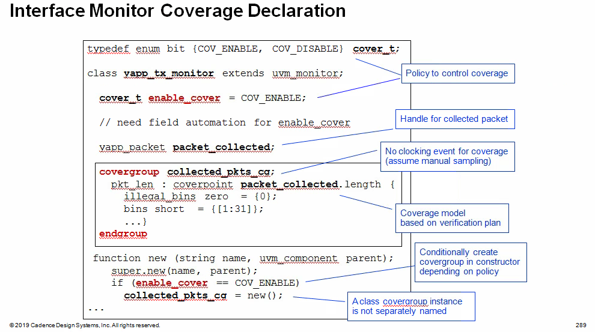
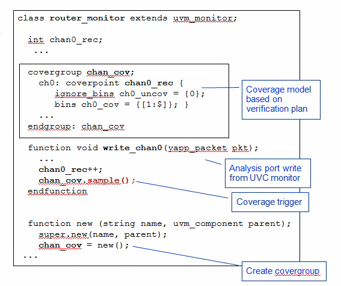

## Coverage Options

- Explicit (user defined)
  - Fully and clearly expressed within sources
    - Sequence and temporal coverage using assertions
    - Data-oriented coverage using `covergroup`
  - Planned and  defined by the verification team
- Implicit
  - Derived or computed from source
    - Code coverage measured by the simulator
  - May be defined outside the verification team
  - May be implied by the verification interface
    - e.g., an industry standard protocol

## Explicit Coverage in Systemverilog

### Assertions for control-oriented coverage

- Defined as procedural statements
- **CANNOT** be defined in a class

```verilog
property req_gnt (cyc);
    @(posedge clk)
    	$rose(req) ##0 (req && !gnt)[cyc] ##1 gnt;
endproperty

cover property (req_gnt(3));
cover property (req_gnt(4));
cover property (req_gnt(5));
```

> Control-oriented coverage uses SystemVerilog Assertion (SVA) syntax and the cover directive. It is used to cover sequences of signal values over time. Assertions cannot be declared or "covered" in a class declaration, so their use in an UVM verification environment is restricted to **interface only**

### Covergroup for data-oriented coverage

- CAN be declared as a class member and created in class constructor
- Used in **interface** and module UVCs

```verilog
covergroup cg @(posedge clk);
    len: coverpoint pkt.lenght {
        illegal_bins zero = {0};
        bins sml = {[1:10]}
        ...
    }
    addrxlen : cross pkt.addr, len;
endgroup

cg cg1 = new();
```

> Data-oriented coverage uses the `covergroup` construct. Covergroups can be declared and created in classes, therefore they are essential for explicit coverage in a UVM verification environment.

#### Interface Monitor Coverage

`covergroup new` constructor is called **directly** off the declaration of the covergroup, it does not have a separate instance name

```verilog
collected_pkts_cq = new();
```

The `covergroup ` instance must be created in the class constructor, not a UVM  `build_phase` or other phase method



```verilog
class yapp_tx_monitor extends uvm_monitor;
    // constructor
    
    covergroup collected_pkts_cg;
        ...
    endgroup
    
    yapp_packet packet_collected;
    
    task run_phase(uvm_phase phase);
        collect_packet();
        ...
    endtask
    
    task collect_packet();
        // read RTL signals via interface
        // reconstruct packet
        collected_pkts_cg.sample();
        ...
    endtask
    
    ...
endclass
```

#### Module UVC Coverage

Typical module UVC coverage:

- Routing - packets flow from input ports to all legal outputs
- latency - all packets received within speicied delay

> The module UVC monitor receives data from the interface monitors via analysis ports, so the implementation of the analysis write function is a convenient place to put coverage code



