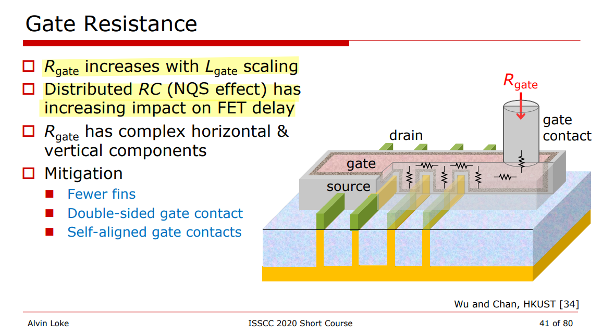

## Transit frequency $f_T$

> aka **cut-off frequency**

## Gate (thermal) noise

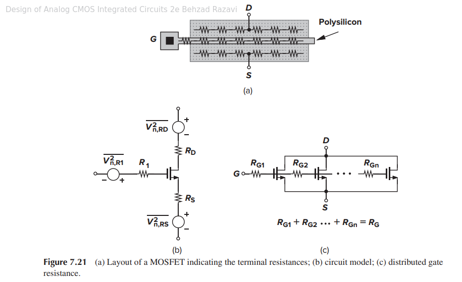

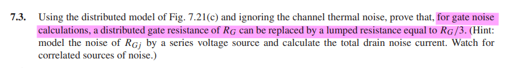

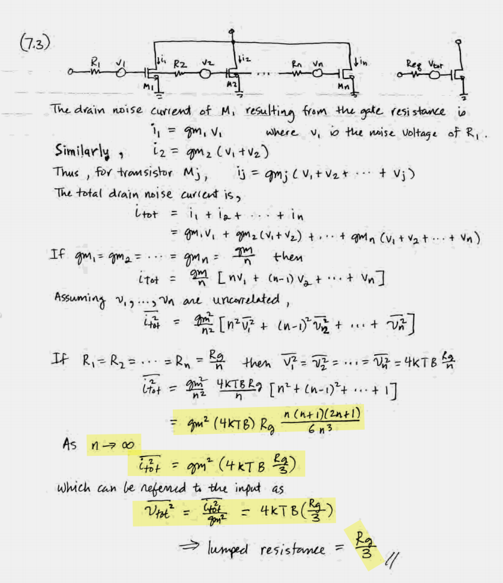

### Two-Side Poly Contact & folding

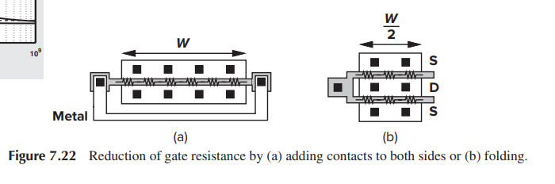

Both scheme yield a total distributed resistance of $R_G/4$ for gate noise calculation

#### folding

finger 0
$$\begin{align}
\overline{i_{tot,0}^2} &= \left(\frac{g_m}{2} \right)^2(4kT\frac{R_G/2}{3}) \\
&= g_m^2\left(4kT\frac{R_G}{3}\right)\frac{1}{2^2\cdot 2}
\end{align}$$

similarly finger 1
$$
\overline{i_{tot,1}^2} = g_m^2\left(4kT\frac{R_G}{3}\right)\frac{1}{2^2\cdot 2}
$$
Assuming uncorrelated
$$
\overline{i_{tot}^2} = \sum_{N=0}^1\overline{i_{tot,N}^2} =g_m^2\left(4kT\frac{R_G}{3}\right)\frac{1}{2^2\cdot 2} \cdot 2 = g_m^2\left(4kT\frac{R_G}{3}\right)\frac{1}{2^2}
$$
Generally
$$
\overline{i_{tot}^2} = g_m^2\left(4kT\frac{R_G}{3}\right)\frac{1}{N^2}
$$
where the gate is decomposed into $N$ parallel fingers

#### two-side poly contact

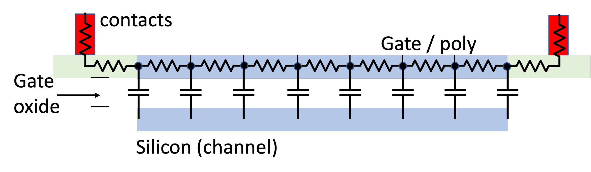

**We fracture Gate poly at the center point,  then we obtain 2 segments, both have same $\frac{g_m}{2}$ and  $R_G/2$.**

The derivation procedure is same with folding structure, i.e. plug $N=2$ into $\overline{i_{tot}^2} = g_m^2\left(4kT\frac{R_G}{3}\right)\frac{1}{N^2}$

That is
$$
\overline{i_{tot}^2} = g_m^2\left(4kT\frac{R_G}{12}\right)
$$
The input referred noise of  gate resistance
$$
\overline{V_{nRG}^2} = 4kT\frac{R_G}{12}
$$

###  four equal gate fingers

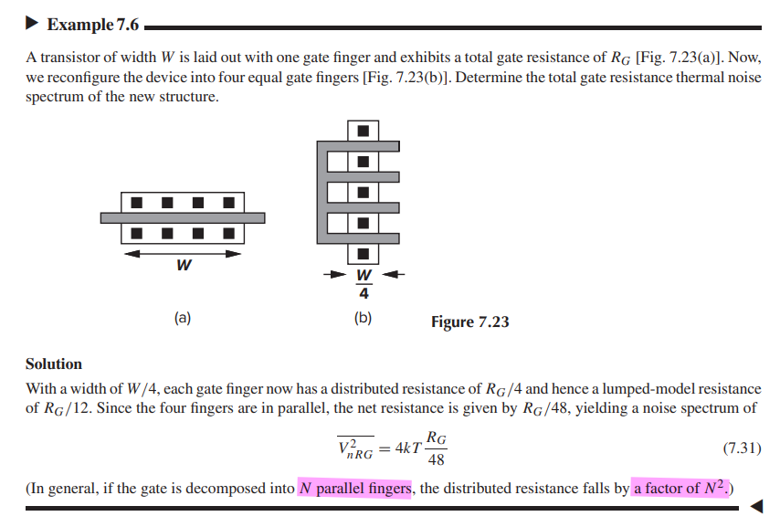

$$
\overline{i_{tot}^2} = g_m^2\left(4kT\frac{R_G}{3}\right)\frac{1}{4^2}
$$
Then
$$
\overline{V_{nRG}^2} = \frac{\overline{i_{tot}^2}}{g_m^2} =4kT\frac{R_G}{48}
$$

## Gate resistance handling by parasitic extraction tools

They fracture the poly line at the intersection with the active (diffusion) layer, breaking it into **"gate poly"(poly over active)** and **"field poly" (poly outside active)**

> gploy, fpoly

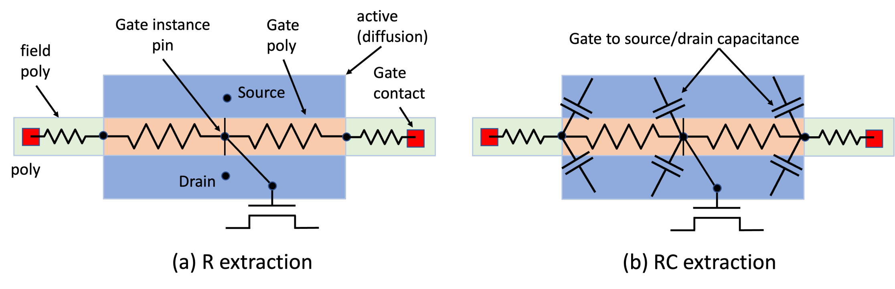

Gate poly is also fractured at the center point. Gate instance pin of the MOSFET (SPICE model) is connected to the center point of the gate poly. **Gate poly is described by two parasitic resistors, connecting the fracture points**.

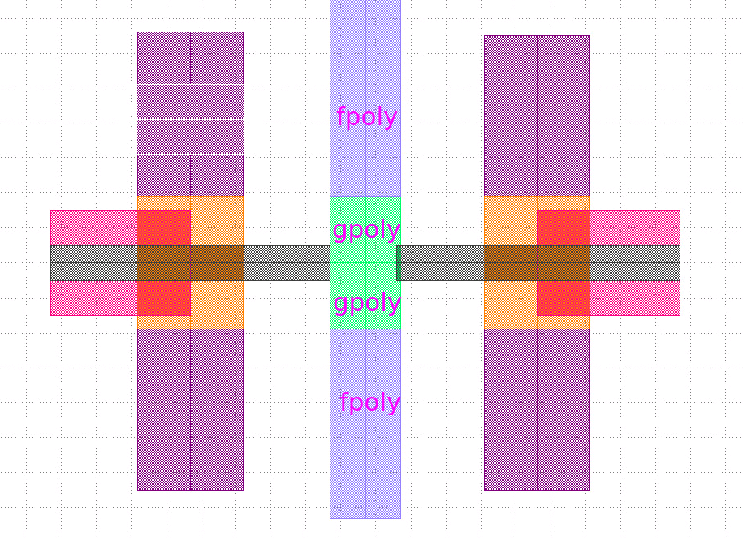

MOSFET extrinsic parasitic capacitance between gate poly and source / drain diffusion and contacts is calculated by parasitic extraction tools, and assigned to the nodes of the resistive networks.

Different extraction tools do this differently - some tools connect these parasitic capacitances to the center point of the gate poly, while some other tools connect them to the end points of the gate poly resistors.

## $\Delta$ gate model

> This distributed network has a different AC and transient response than a simple lumped one-R and one-C circuit.
>
> It was shown [B. Razavi] that such RC network behaves approximately the same as a network with one R and one C element, where *C is the total capacitance*, and R=1/3 * W/L *rsh for single-side connected poly, and R=1/12 * W/L * rsh for double-sided connected poly.
>
> These coefficients - 1/3 and 1/12 - effectively enable an accurate reduced order model for the gate, reducing a large number of R and C elements to two (or three) resistors and one capacitor.

**Gate Delta Model**:  where a gate is described by two positive and one negative resistors

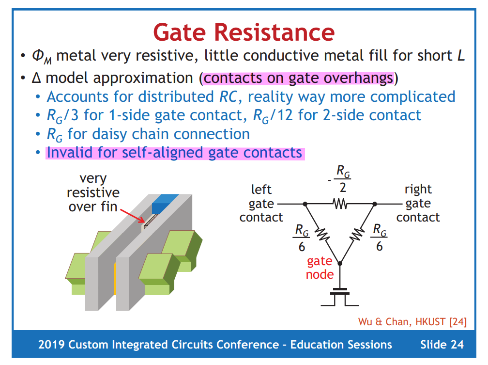

> only applicable to contacts on gate overhangs
>
> invalid for self-aligned gate contacts, where gate contact land directly on top of gate, not gate overhang

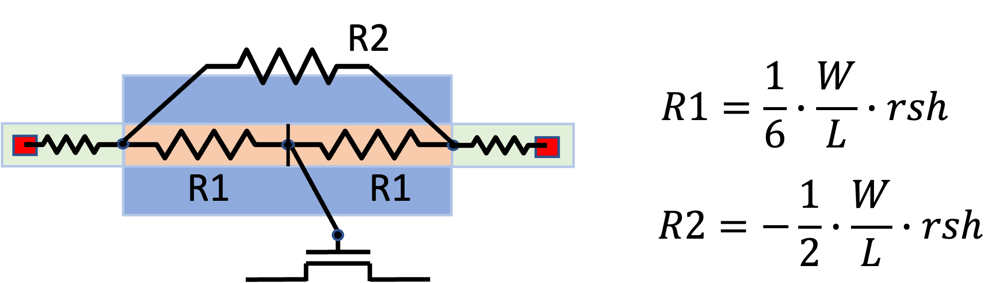

1. 1-side gate contact
   $$
   R_{eq,1side} =R_1 \parallel (R_2+R_1)= \frac{R_G}{6}\parallel (-\frac{R_G}{2}+\frac{R_G}{6})=\frac{R_G}{3}
   $$

2. 2-side contact
   $$
   R_{eq,2side}= R_1 \parallel R_1 = \frac{R_G}{6}\parallel \frac{R_G}{6} = \frac{R_G}{12}
   $$

> Some SPICE simulators have problems handling *negative resistors*, that's possibly why this model did not get a wide adoption. Some foundries and PDKs support delta gate model, while some others don't.

## Vertical component of gate resistance

In "old" technologies (pre-16nm), gate resistance was dominated by lateral resistance. However, in advanced technologies, multiple interfaces between gate material layers lead to a large vertical gate resistance.

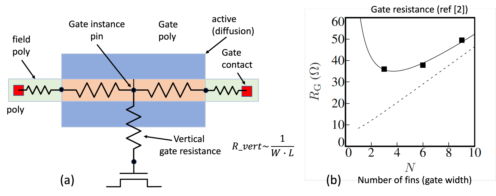

> It's very easy to check this in DSPF file - if gate instance pin is connected directly to the center of the gate poly - vertical resistance is not accounted for. If it is connected by a positive resistor to the center of the gate poly - that resistors represents the vertical gate resistance.

## reference

&#11088; B. Razavi, Y. Ran, and K. F. Lee, “Impact of Distributed Gate Resistance on the Performance of MOS Devices,”
IEEE Trans. Circuits and Systems, Part I, pp. 750–754, Nov. 1994.

&#11088; Maxim Ershov, Diakopto. "Gate Resistance in IC design flow", [[link](https://www.linkedin.com/pulse/gate-resistance-ic-design-flow-maxim-ershov), [pdf](https://diakopto.com/wp-content/uploads/Gate-Resistance-in-IC-design-flow.pdf)]

Saha, Samar K.. “FinFET Devices for VLSI Circuits and Systems.” (2020).

Harpe, Pieter J. A., Andrea Baschirotto and Kofi A. A. Makinwa. “Hybrid ADCs, Smart sensors for the IoT, and Sub-1V and Advanced node analog circuit design: Advances in Analog Circuit Design 2017.” (2018).

Chauhan, Yogesh Singh. FinFET Modeling for IC Simulation and Design: Using the BSIM-CMG Standard. London, UK: Academic Press, 2015.

A.J.Sholten et al., "FinFET compact modelling for analogue and RF applications", IEDM'2010, p.190.

W. Wu and M. Chan, “Gate resistance modeling of multifin MOS devices,” IEEE Electron Device Letters, vol. 27, no. 1, pp. 68-70, Jan. 2006.

A. L. S. Loke, C. K. Lee and B. M. Leary, "Nanoscale CMOS Implications on Analog/Mixed-Signal Design," 2019 IEEE Custom Integrated Circuits Conference (CICC), Austin, TX, USA, 2019, pp. 1-57, doi: 10.1109/CICC.2019.8780267.
