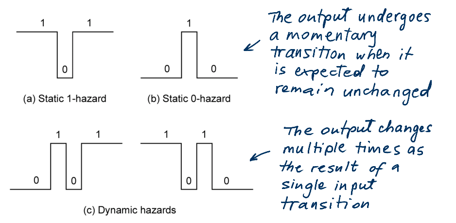

- A **glitch** is an unwanted pulse at the output of a combinational logic network – **a momentary change** in an output that should not have changed
- A circuit with *the potential for a glitch* is said to have a **hazard**
- In other words a hazard is something intrinsic about a circuit; a circuit with hazard may or may not have a glitch depending on input patterns and the electric characteristics of the circuit.

#### When do circuits have hazards ?

Hazards are potential unwanted transients that occur in the output when different paths from input to output have different propagation delays

#### Types of Hazards (on an output)

static 1-hazard, static 0-hazard, dynamic hazard

#### Hazard's Concern

- Hazards do not hurt synchronous circuits
- Hazards Kill Asynchronous Circuits
- Glitches Increase Power Consumption

#### referece

CPE166/EEE 270 Advanced Logic Design-Digital Design: Time Behavior of Combinational Networks: [https://www.csus.edu/indiv/p/pangj/166/f/sram/Handout_Hazard.pdf](https://www.csus.edu/indiv/p/pangj/166/f/sram/Handout_Hazard.pdf)

John Knight, ELEC3500 Glitches and Hazards in Digital Circuits [http://www.doe.carleton.ca/~shams/ELEC3500/hazards.pdf](http://www.doe.carleton.ca/~shams/ELEC3500/hazards.pdf)
