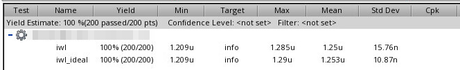

**iwl**: biased by mirror

**iwl_ideal**: biased by *vdc* source, whose value is *typical corner*

---

For **local variation**, constant voltage bias (*vb_const* in schematic) help reduce variation from $\sqrt{2}\Delta V_{th}$ to  $\Delta V_{th}$

For **global variation**, *all device have same variation*, mirror help reduce variation by sharing same $V_{gs}$ 

1. global variation + local variation (All MC)

2. local variation (Mismatch MC)

3. global variation (Process MC)

> We had better bias mos gate with mirror rather than the *vdc* source while simulating sub-block.
>
> This is real situation due to current source are always biased by mirror and *vdc* biasing don't give the right result in global variation Monte Carlo simulation (*542.8n* is too pessimistic, *13.07p* is right result)
