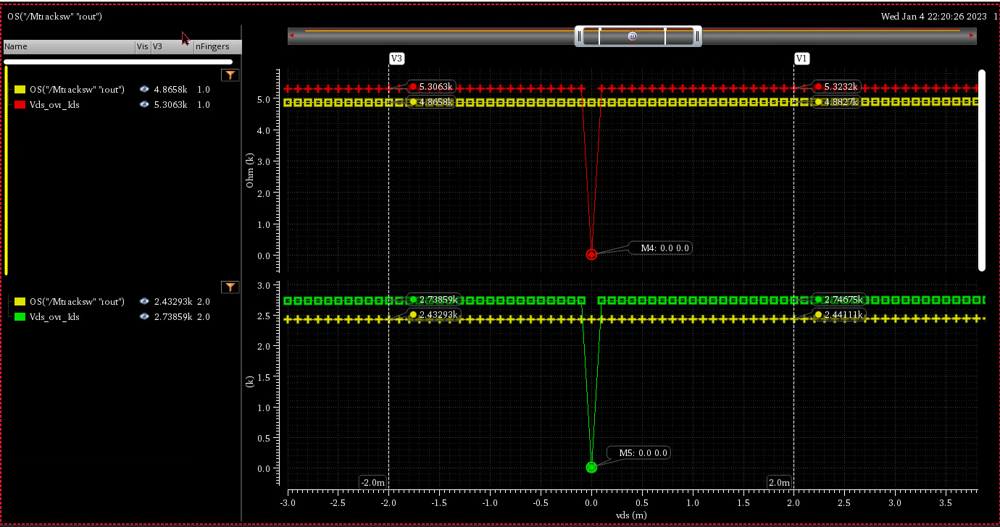

There is discrepancy between model operating point and $V_{ds}/I_{ds}$

I believe that the equation $V_{ds}/I_{ds}$ is more appropriate where mos is used as switch, though $V_{ds}=0$ is an outlier.

