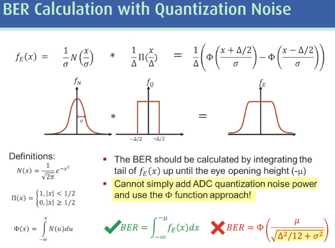
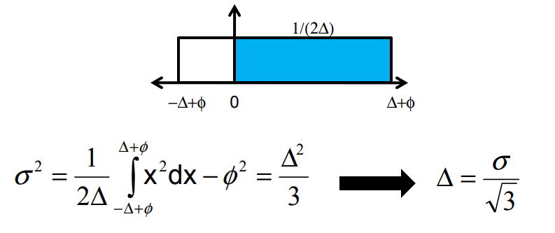

Time-interleaved SAR ADCs are an optimal choice for high-speed ADCs with moderate resolution

## BER with Quantization Noise

> $$
> \text{Var}(X) = E[X^2] - E[X]^2
> $$
>
> 

## reference

Akkaya, A. (2021). High-Speed ADC Design and Optimization for Wireline Links (Publication No. 8453) [PhD thesis, EPFL; Supervised by Y. Leblebici]. [[https://doi.org/10.5075/epfl-thesis-8453](https://doi.org/10.5075/epfl-thesis-8453)]

K. Zheng, “System-driven circuit design for ADC-based wireline data links,” Stanford Univ., Stanford, CA, USA, Tech. Rep., 2018 [[https://stacks.stanford.edu/file/hw458fp0168/thesis-augmented.pdf](https://stacks.stanford.edu/file/hw458fp0168/thesis-augmented.pdf)]

T. Chan Carusone, T. O. Dickson, S. Palermo, S. Shekhar and M. Mansuri, "Modern Wireline Transceivers," in *IEEE Journal of Solid-State Circuits*, vol. 61, no. 2, pp. 395-422, Feb. 2026 [[https://ieeexplore.ieee.org/stamp/stamp.jsp?tp=&arnumber=11311714](https://ieeexplore.ieee.org/stamp/stamp.jsp?tp=&arnumber=11311714)]

Kull, Lukas, Thomas Toifl, Martin L. Schmatz, Pier Andrea Francese, Christian Menolfi, Matthias Braendli, Marcel A. Kossel, Thomas Morf, Toke Meyer Andersen and Yusuf Leblebici. “22.1 A 90GS/s 8b 667mW 64× interleaved SAR ADC in 32nm digital SOI CMOS.” *2014 IEEE International Solid-State Circuits Conference Digest of Technical Papers (ISSCC)* (2014): 378-379. [[https://sci-hub.jp/10.1109/ISSCC.2014.6757477](https://sci-hub.jp/10.1109/ISSCC.2014.6757477)]

—. (2014). High-Speed CMOS ADC Design for 100Gb/s Communication Systems (Publication No. 6037) [PhD thesis, EPFL; Supervised by Y. Leblebici]. https://doi.org/10.5075/epfl-thesis-6037

—., "A 3.1mW 8b 1.2GS/s single-channel asynchronous SAR ADC with alternate comparators for enhanced speed in 32nm digital SOI CMOS," *2013 IEEE International Solid-State Circuits Conference Digest of Technical Papers*, San Francisco, CA, USA, 2013, pp. 468-469 [[https://sci-hub.jp/10.1109/ISSCC.2013.6487818](https://sci-hub.jp/10.1109/ISSCC.2013.6487818)]

—., "A 3.1 mW 8b 1.2 GS/s Single-Channel Asynchronous SAR ADC With Alternate Comparators for Enhanced Speed in 32 nm Digital SOI CMOS," in *IEEE Journal of Solid-State Circuits*, vol. 48, no. 12, pp. 3049-3058, Dec. 2013 [[https://sci-hub.jp/10.1109/JSSC.2013.2279571](https://sci-hub.jp/10.1109/JSSC.2013.2279571)]
