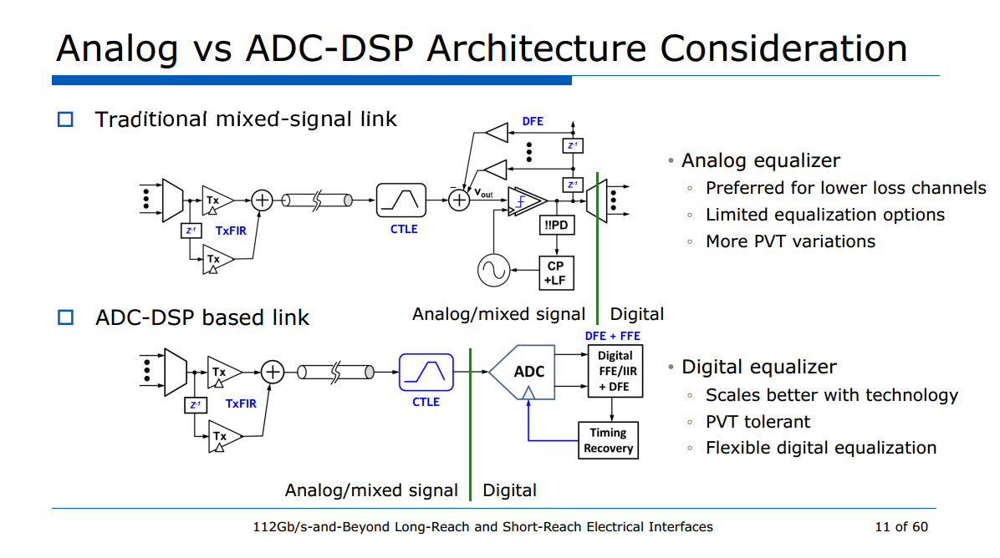

## Timing Skew for Broadband signals

> M. El-Chammas and B. Murmann, "General Analysis on the Impact of Phase-Skew Mismatch in Time-Interleaved ADCs," IEEE Trans. on Circuits and Systems I, vol. 56, No. 5, pp. 902-910, May 2009 [[https://sci-hub.ru/10.1109/TCSI.2009.2015206](https://sci-hub.ru/10.1109/TCSI.2009.2015206)]
>
> —, "Background Calibration of Timing Skew in Time-Interleaved A/D Converters," Ph.D. Thesis, Stanford University, August 2010 [[https://purl.stanford.edu/xc093xt9301](https://purl.stanford.edu/xc093xt9301)]
>
> —, "Time-Interleaved ADCs: Theory and Design," Tutorial in IEEE International Conf. on Elec., Circ., and Sys., Lebanon, December 2011 [[https://el-chammas.com/papers/Manar_ICECS_handouts.pdf](https://el-chammas.com/papers/Manar_ICECS_handouts.pdf)]
>
> —, "The World of Time-Interleaved ADCs: From Theory to Design," Tutorial in IEEE International NEWCAS Conf., Montreal, Canada, June 2012 [[https://el-chammas.com/papers/Manar_NEWCAS_TIADC_tutorial.pdf](https://el-chammas.com/papers/Manar_NEWCAS_TIADC_tutorial.pdf)]

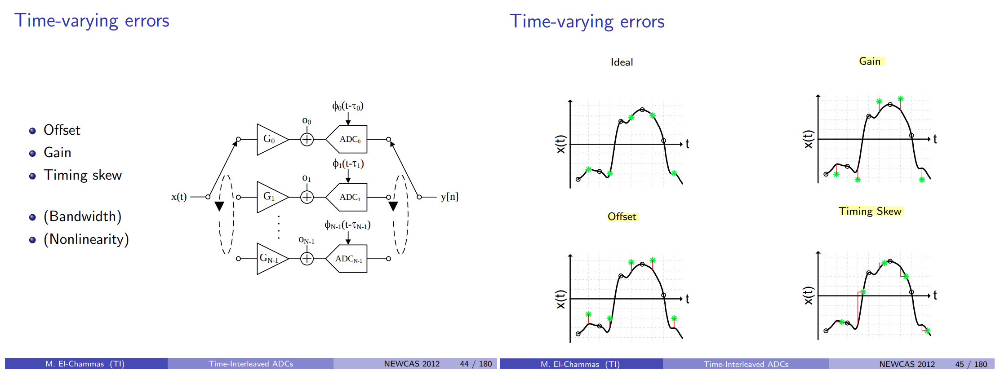

"Best-fit" approach

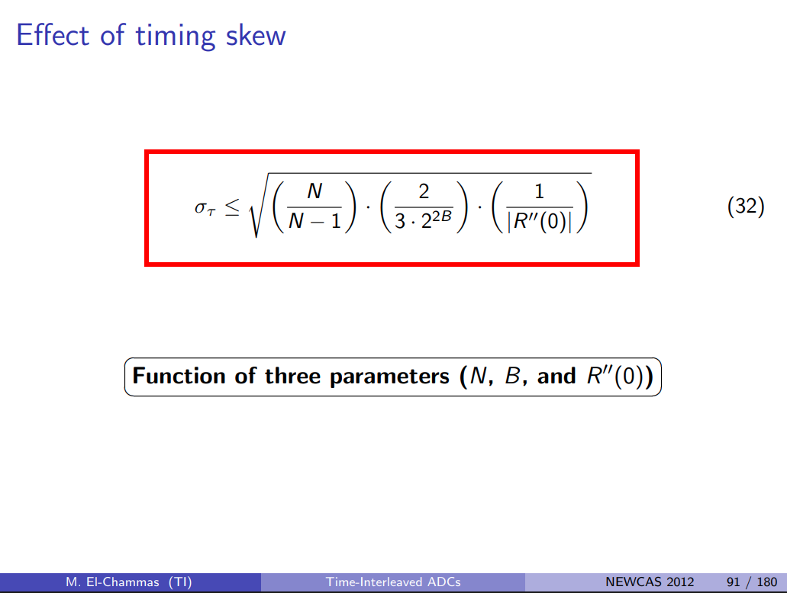

Using a **normalized autocorrelation** (or equivalently assuming **unit signal power**) — $\color{red}R(\tau) = \frac{R_x(\tau)}{R_x(0)}$

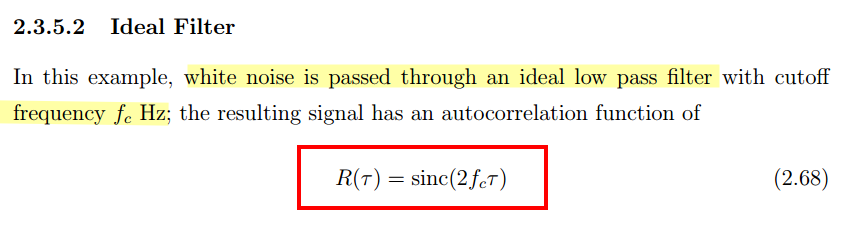

For this ideal low-pass-filtered white-noise input,

$$
\boxed{ \frac{1}{|R''(0)|} = \frac{3}{4\pi^2f_c^2}}
$$

Notice the difference from the sinusoidal case: for a sinusoid,

$$
|R''(0)|=(2\pi f)^2
$$

whereas for ideal LPF white noise,

$$
\boxed{ |R''(0)|=\textcolor{red}{\frac{1}{3}}(2\pi f_c)^2}
$$

That factor of $1/3$ comes from averaging all frequencies uniformly from $-f_c$ to $f_c$, rather than having all the signal power concentrated at a single frequency

The sinusoidal approach

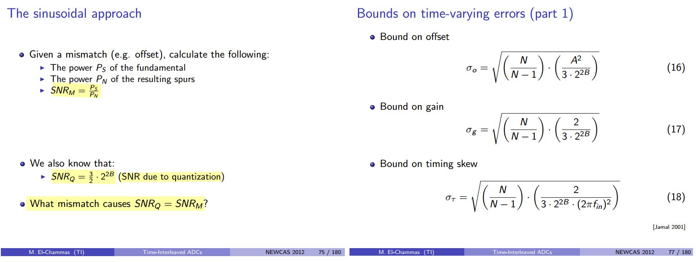

---

> Boris Murmann, August 2013 Lectures on Circuit and Architecture Design for High-Speed ADCs — *Determining ADC specs from system specs* [[https://bbs.eetop.cn/thread-979682-1-1.html](https://bbs.eetop.cn/thread-979682-1-1.html)]

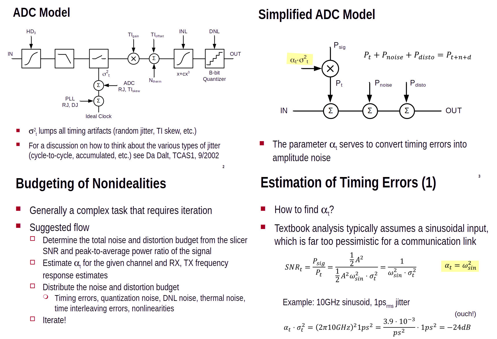

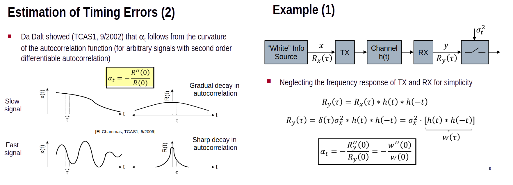

---

> M. El-Chammas and B. Murmann, "A 12-GS/s 81-mW 5-bit Time-Interleaved Flash ADC With Background Timing Skew Calibration," in *IEEE Journal of Solid-State Circuits*, vol. 46, no. 4, pp. 838-847, April 2011 [[https://sci-hub.ru/10.1109/JSSC.2011.2108125](https://sci-hub.ru/10.1109/JSSC.2011.2108125)]

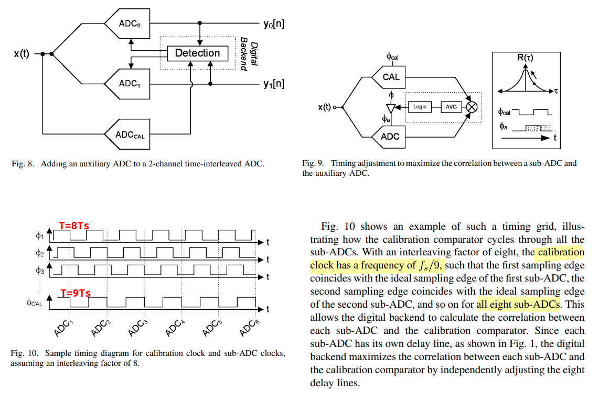

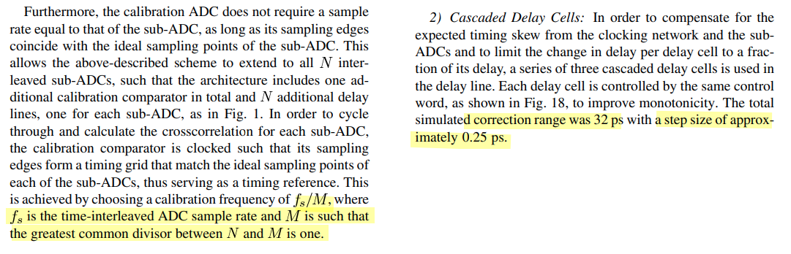

> The total simulated correction range was **32 ps** with a step size of approximately **0.25 ps**
>
> Ts = 1/12G=84 ps. correction range is about half Ts

|                          | 0    | 1    | 2    | 3    | 4    | 5    | 6    | 7    | 8    |
| ------------------------ | ---- | ---- | ---- | ---- | ---- | ---- | ---- | ---- | ---- |
| $\phi_1$                 | 0    | 8    | 16   | 24   | 32   | 40   | 48   | 56   | 64   |
| $\phi_{CAL}$             | 0    | 9    | 18   | 27   | 36   | 45   | 54   | 63   | 72   |
| $(\phi_{CAL}-\phi_1)\%8$ | 0    | 1    | 2    | 3    | 4    | 5    | 6    | 7    | 0    |

Let the calibration clock be

$$
t_{\mathrm{CAL}}[m]=\delta+9mT_s
$$

where $\delta$ is an arbitrary initial phase.

For ADC $i$, its ideal sampling instants are

$$
t_i[k]=iT_s+8kT_s
$$

The time difference is

$$
\Delta t = \delta+9mT_s-iT_s-8kT_s
$$

Because $\gcd(9,8)=1$, the quantity

$$
9m-i-8k
$$

can actually take **any integer value** $q$. Therefore,

$$
\Delta t=\delta+qT_s
$$

We can choose the pair of CAL/ADC edges that makes

$$
|\delta+qT_s|
$$

**minimum**. Thus the physically relevant residual offset can be written as
$$
\boxed{ \Delta t_{\min} = \delta\pmod{T_s} }
$$

with the centered choice satisfying

$$
\boxed{ |\Delta t_{\min}|\le \frac{T_s}{2} }
$$

> **The 32-ps DCDL is not enough to tolerate a completely arbitrary phase offset between $CLK_{\mathrm{RCAL}}$ and the ideal ADC sampling grid.**

The CAL clock must therefore be **coarsely phase-positioned sufficiently close to the ADC sampling grid**, while the 32-ps delay lines handle residual skew/fine alignment. The paper explicitly requires the CAL sampling edges to form a timing grid matching the ideal sub-ADC sampling points.

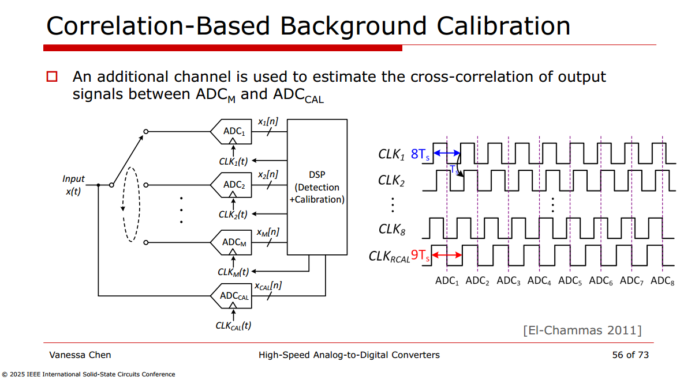

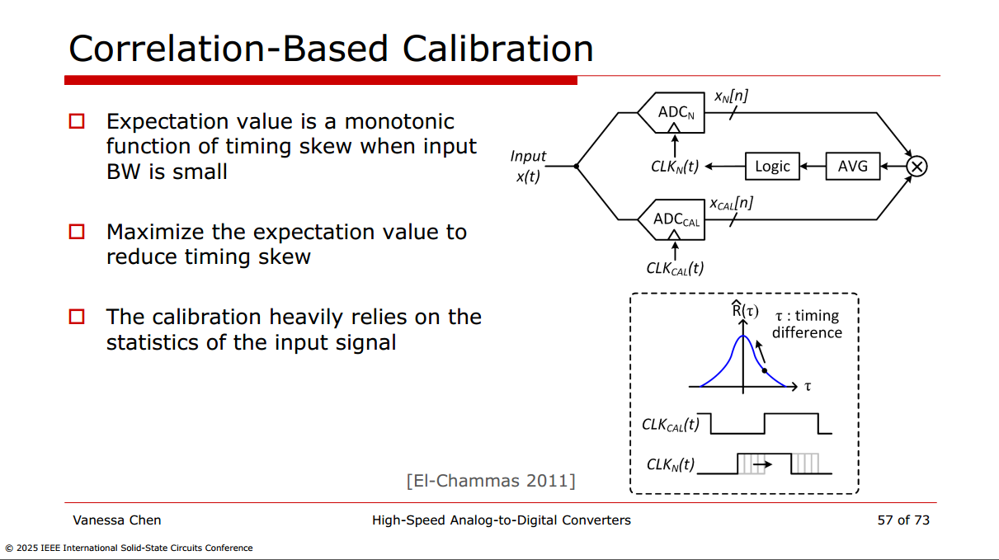

---

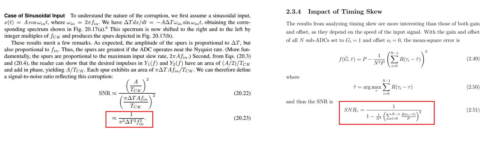

***Reducing (2.51) to (20.23)***

For $x(t)=A\cos\omega_{in}t$, the autocorrelation and power are
$$
R(\tau)=\frac{A^2}{2}\cos\omega_{in}\tau,\qquad P=R(0)=\frac{A^2}{2}\quad\Rightarrow\quad\frac{R(\tau)}{P}=\cos\omega_{in}\tau
$$

In Razavi's model, one channel samples on time and the other samples $\Delta T$ late, so $\tau_0=0$ and $\tau_1=\Delta T$. The sum in (2.50) becomes

$$
\cos\omega_{in}\tau+\cos\omega_{in}(\Delta T-\tau)=2\cos\left(\frac{\omega_{in}\Delta T}{2}\right)\cos\left[\omega_{in}\left(\tau-\frac{\Delta T}{2}\right)\right]
$$

This is largest at $\hat{\tau}=\Delta T/2$, where it equals $2\cos(\pi f_{in}\Delta T)$. Substituting into (2.51), the $1/N^2=1/4$ cancels the $2^2$:

$$
SNR_\tau=\frac{1}{1-\cos^2(\pi f_{in}\Delta T)}=\frac{1}{\sin^2(\pi f_{in}\Delta T)}\approx\frac{1}{\pi^2\Delta T^2 f_{in}^2}
$$

The last step uses $\sin x\approx x$, and the result is exactly (20.23).

## BER with Quantization Noise

> $$
> \text{Var}(X) = E[X^2] - E[X]^2
> $$
>
> 

## reference

Samuel Palermo, ISSCC 2018 T10: ADC-Based Serial Links: Design and Analysis

Yohan Frans, CICC2019 ES3-3- "ADC-based Wireline Transceivers" [[pdf](https://ieeexplore.ieee.org/stamp/stamp.jsp?arnumber=8780306)]

Nhat Nguyen and Masum Hossain, ISSCC 2021 Forum 6.7: 112Gb/s-and-Beyond Long-Reach and Short-Reach Electrical Interfaces

V. Chen, "Tutorial: High-Speed Analog-to-Digital Converters," *2025 IEEE International Solid-State Circuits Conference (ISSCC)*, San Francisco, CA, USA, 2025, pp. 1-1, doi: 10.1109/ISSCC49661.2025.11076112.

T. Chan Carusone, T. O. Dickson, S. Palermo, S. Shekhar and M. Mansuri, "Modern Wireline Transceivers," in *IEEE Journal of Solid-State Circuits*, vol. 61, no. 2, pp. 395-422, Feb. 2026 [[https://ieeexplore.ieee.org/stamp/stamp.jsp?arnumber=11311714](https://ieeexplore.ieee.org/stamp/stamp.jsp?arnumber=11311714)] 

---

Akkaya, A. (2021). High-Speed ADC Design and Optimization for Wireline Links (Publication No. 8453) [PhD thesis, EPFL; Supervised by Y. Leblebici]. [[https://doi.org/10.5075/epfl-thesis-8453](https://doi.org/10.5075/epfl-thesis-8453)]

K. Zheng, “System-driven circuit design for ADC-based wireline data links,” Stanford Univ., Stanford, CA, USA, Tech. Rep., 2018 [[https://stacks.stanford.edu/file/hw458fp0168/thesis-augmented.pdf](https://stacks.stanford.edu/file/hw458fp0168/thesis-augmented.pdf)]

Kull, Lukas, Thomas Toifl, Martin L. Schmatz, Pier Andrea Francese, Christian Menolfi, Matthias Braendli, Marcel A. Kossel, Thomas Morf, Toke Meyer Andersen and Yusuf Leblebici. “22.1 A 90GS/s 8b 667mW 64× interleaved SAR ADC in 32nm digital SOI CMOS.” *2014 IEEE International Solid-State Circuits Conference Digest of Technical Papers (ISSCC)* (2014): 378-379. [[https://sci-hub.jp/10.1109/ISSCC.2014.6757477](https://sci-hub.jp/10.1109/ISSCC.2014.6757477)]

—. (2014). High-Speed CMOS ADC Design for 100Gb/s Communication Systems (Publication No. 6037) [PhD thesis, EPFL; Supervised by Y. Leblebici]. https://doi.org/10.5075/epfl-thesis-6037

—., "A 3.1mW 8b 1.2GS/s single-channel asynchronous SAR ADC with alternate comparators for enhanced speed in 32nm digital SOI CMOS," *2013 IEEE International Solid-State Circuits Conference Digest of Technical Papers*, San Francisco, CA, USA, 2013, pp. 468-469 [[https://sci-hub.jp/10.1109/ISSCC.2013.6487818](https://sci-hub.jp/10.1109/ISSCC.2013.6487818)]

—., "A 3.1 mW 8b 1.2 GS/s Single-Channel Asynchronous SAR ADC With Alternate Comparators for Enhanced Speed in 32 nm Digital SOI CMOS," in *IEEE Journal of Solid-State Circuits*, vol. 48, no. 12, pp. 3049-3058, Dec. 2013 [[https://sci-hub.jp/10.1109/JSSC.2013.2279571](https://sci-hub.jp/10.1109/JSSC.2013.2279571)]

---

C. Liu *et al*., "An 800GbE PAM-4 PHY Transceiver that Supports 42dB Copper and Direct-Drive Optical Applications in 7nm," *2025 IEEE Custom Integrated Circuits Conference (CICC)*, Boston, MA, USA, 2025, pp. 1-3, doi: 10.1109/CICC63670.2025.10983780.

—, "An 800GbE PAM-4 PHY Transceiver for 42 dB Copper and Direct-Drive Optical Applications in 7 nm," in *IEEE Solid-State Circuits Letters*, vol. 8, pp. 281-284, 2025, doi: 10.1109/LSSC.2025.3608134

---

G. Manganaro, "An Introduction to High Sample Rate Nyquist Analog-to-Digital Converters," in IEEE Open Journal of the Solid-State Circuits Society, vol. 2, pp. 82-102, 2022 [[https://ieeexplore.ieee.org/stamp/stamp.jsp?arnumber=9911689](https://ieeexplore.ieee.org/stamp/stamp.jsp?arnumber=9911689)]