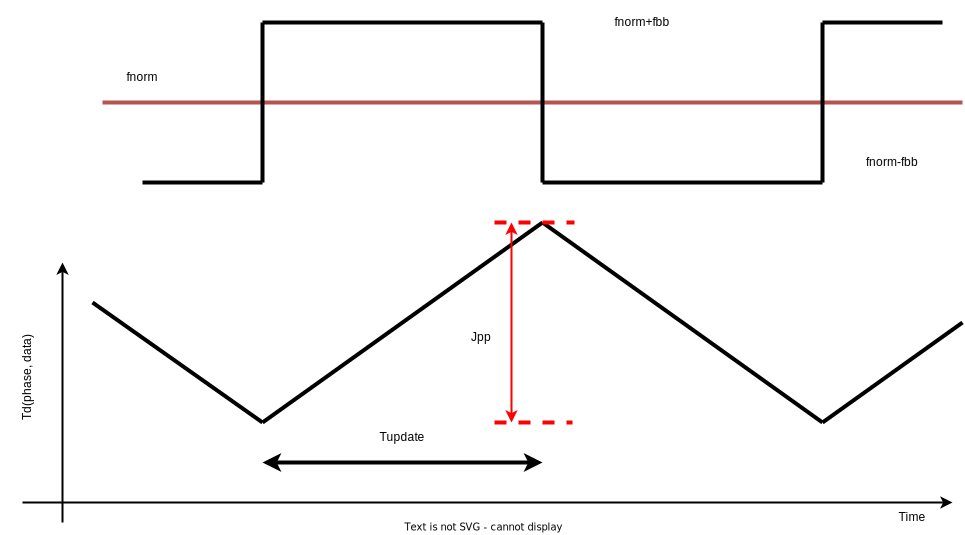
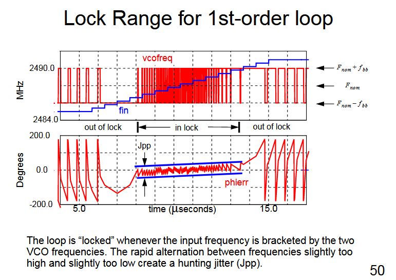

Due to the following two reasons in Bang-Bang CDR

- propation path gain resolution, $f_{vco} = f_{norm} \pm f_{bb}$

- loop update latency $T_{update}$

Hunting jitter peak to peak, $J_{pp}$
$$
J_{pp} = f_{bb} \cdot T_{update} \cdot \frac{1}{f_{norm}}
$$

**reference**:

Walker, Clock and Data Recovery for Serial Digital Communication focusing on bang-bang loop CDR design methodology, ISSCC Short Course, 2002
