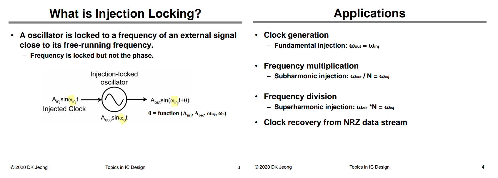
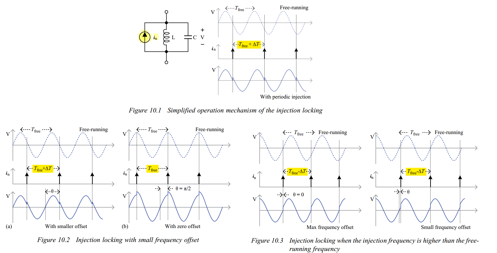
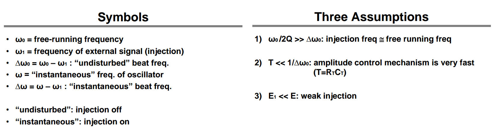
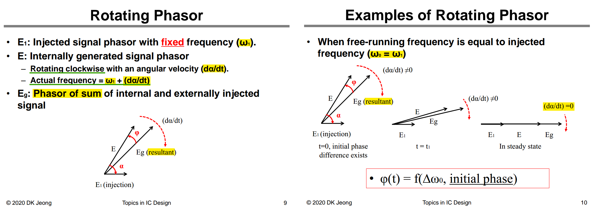
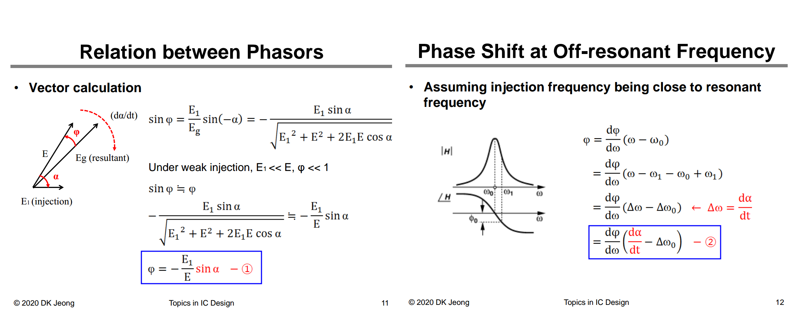
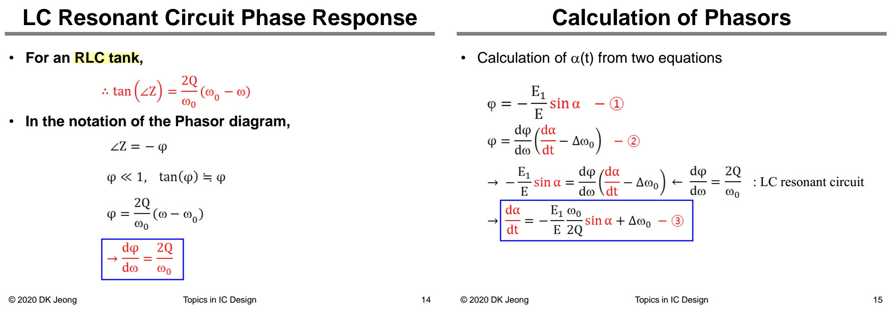
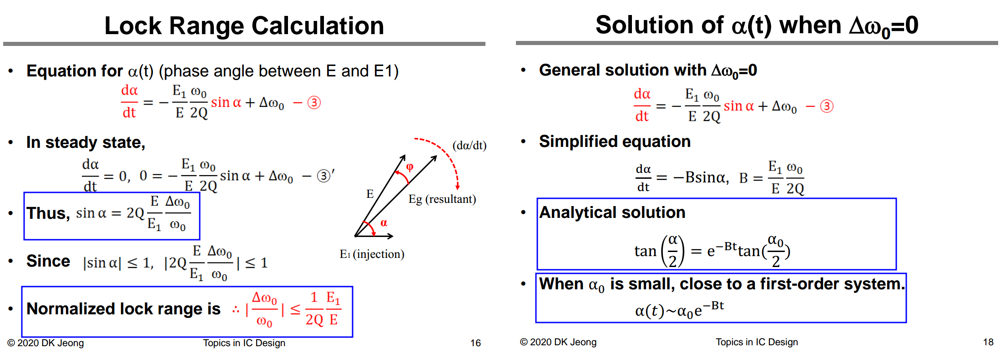
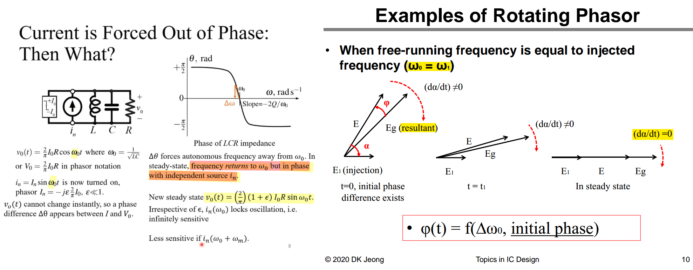
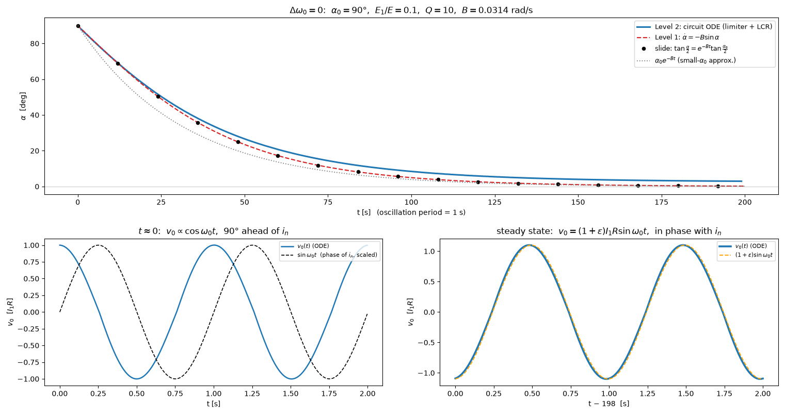

## Rotating Phasor






- $E_1$: externally applied forcing signal.
- $E$: oscillator-generated component **after being influenced by $E_1$**.
- $E_g$: total signal resulting from the oscillator-generated and injected contributions.
- $\alpha(t)$ is the phase difference between the internal oscillator phasor $E$, after being influenced by $E_1$, and the injected phasor $E_1$
- $\phi(t)$ is the angle between that internal oscillator phasor $E$ and the resultant phasor $E_g=E+E_1$

Although $E$ is called the "internally generated signal," it is not the free-running, unaffected signal. The coupling is implicit:
$$
E_1
\rightarrow
E_g=E+E_1
\rightarrow
H(j\omega)
\rightarrow
E.
$$
Therefore,
$$
\boxed{E\text{ depends dynamically on }E_1.}
$$


## Adler's Equation






$$
\boxed{\frac{\mathrm{d}\alpha}{\mathrm{d}t}
=
\Delta\omega_0
-
\frac{E_1}{E}\frac{\omega_0}{2Q}\sin\alpha}
$$
Define the injection-locking strength as
$$
K
=
\frac{E_1}{E}\frac{\omega_0}{2Q}.
$$
Then Eq. (3) becomes the standard Adler form
$$
\boxed{
\frac{\mathrm{d}\alpha}{\mathrm{d}t}
=
\Delta\omega_0-K\sin\alpha
}
$$

In **steady state**
$$
\frac{\mathrm{d}\alpha}{\mathrm{d}t} = 0
$$


---

---


When free-running frequency is equal to injected frequency, in a steady state, the large oscillation aligns **in phase** with the small injected current





KCL plus the inductor law
$$
C\dot v + \frac{v}{R} + i_L = \frac{\pi}{4}I_1\,\mathrm{sgn}(v) + \epsilon I_1\sin(\omega_{inj}t),\qquad L\,\dot i_L = v,
$$
 with $I_1\equiv\tfrac{2}{\pi}I_0$

"inject at $\omega_0$" must mean the *measured* free-running frequency — we measure it from an $\epsilon=0$ run first





`phase` estimates the instantaneous phase of waveform `v` relative to the reference $\sin(\omega_{\rm ref}t)$

It acts like a simple lock-in detector:

```
N = int(round(2*np.pi / wref / dt))
```

Computes the number of samples in one reference period.

```
Ic = moving_average(2*v*sin(wref*t))
Qc = moving_average(2*v*cos(wref*t))
```

The one-period moving average extracts the components of `v` aligned with the reference sine and cosine while suppressing harmonics.

For

$$
v(t)=A\sin(\omega_{\rm ref}t+\phi)
$$

the averages are approximately

$$
I_c=A\cos\phi,\qquad Q_c=A\sin\phi
$$

so:

```
np.arctan2(Qc, Ic)
```

returns $\phi$, in radians between $-\pi$ and $\pi$


[[credits to Claude Fable 5](https://gist.github.com/raytroop/b247bc67b8899f210ac54b894d8e94c0)]

```python
"""
Neat two-level ODE check of the slide (Dw0 = 0), one eps, one figure (3 panels).

Level 1 (phase ODE, eq.3):   da/dt = -B sin(a),   B = (E1/E) * w0/(2Q)
Level 2 (raw circuit ODE):   C dv/dt + v/R + iL = Ip*sgn(v) + eps*I1*sin(w_osc*t)
                             L diL/dt = v
Both start at a0 = 90 deg (v0 ~ cos, injection ~ sin) and are compared with
the slide's closed form  tan(a/2) = exp(-Bt)*tan(a0/2)  and with a0*exp(-Bt).
Two waveform panels show v0(t) right after injection turns on (90 deg ahead
of i_n) and in steady state ((1+eps)*I1*R*sin, in phase with i_n).
"""
import numpy as np
from scipy.integrate import solve_ivp
import matplotlib.pyplot as plt

# ---- parameters ------------------------------------------------------------
w0  = 2*np.pi                 # 1/sqrt(LC)  (period = 1 s)
Q, R = 10.0, 1.0
C, L = Q/(w0*R), R/(w0*Q)
I1  = 1.0                     # limiter fundamental (= (2/pi)*I0)
Ip  = np.pi/4 * I1            # square-wave amplitude -> fundamental I1
eps = 0.10                    # E1/E
B   = eps*w0/(2*Q)            # slide's B
a0  = np.pi/2
dt, T = 2e-3, 200.0

# ---- Level 2: full circuit ODE, no averaging -------------------------------
def circuit(t, y, eps, winj):
    v, iL = y
    dv = (Ip*np.tanh(v/0.01) + eps*I1*np.sin(winj*t) - v/R - iL)/C
    return dv, v/L

def run(eps, winj, T):
    t = np.arange(0, T, dt)
    s = solve_ivp(circuit, (0, T), [I1*R, 0.0], args=(eps, winj),
                  t_eval=t, method="LSODA", rtol=1e-7, atol=1e-9, max_step=5e-3)
    return t, s.y[0]

def phase(t, v, wref):        # phase of v relative to sin(wref*t)
    N = int(round(2*np.pi/wref/dt)); box = np.ones(N)/N
    Ic = np.convolve(2*v*np.sin(wref*t), box, "same")
    Qc = np.convolve(2*v*np.cos(wref*t), box, "same")
    return np.arctan2(Qc, Ic), N

# limiter harmonics shift the autonomous frequency slightly below 1/sqrt(LC)
# (Groszkowski), so measure w_osc once and inject there ("w0" of the slide):
t, v = run(0.0, w0, 150.0)
th, N = phase(t, v, w0)
tt, thh = t[N:-N], np.unwrap(th[N:-N])
w_osc = w0 + np.polyfit(tt[tt > 50], thh[tt > 50], 1)[0]

t, v = run(eps, w_osc, T)                     # injection ON at t = 0
a_ckt, N = phase(t, v, w_osc)

# ---- Level 1: integrate the phase ODE itself -------------------------------
a_ode = solve_ivp(lambda t, a: -B*np.sin(a), (0, T), [a0],
                  t_eval=t, rtol=1e-10, atol=1e-12).y[0]

# ---- slide's closed form and small-angle limit -----------------------------
a_exact = 2*np.arctan(np.exp(-B*t)*np.tan(a0/2))
a_small = a0*np.exp(-B*t)

print(f"B = {B:.4f} rad/s (tau = 1/B = {1/B:.1f} s), "
      f"w_osc - w0 = {w_osc-w0:+.5f} rad/s")
print(f"alpha({T:.0f}s): circuit ODE {np.degrees(a_ckt[-2*N]):+.2f} deg | "
      f"phase ODE {np.degrees(a_ode[-1]):+.2f} deg | closed form "
      f"{np.degrees(a_exact[-1]):+.2f} deg")
```


## reference

R. Adler, "A Study of Locking Phenomena in Oscillators," in *Proceedings of the IRE*, vol. 34, no. 6, pp. 351-357, June 1946 [[https://sci-hub.jp/10.1109/JRPROC.1946.229930](https://sci-hub.jp/10.1109/JRPROC.1946.229930)]

—, "A study of locking phenomena in oscillators," in *Proceedings of the IEEE*, vol. 61, no. 10, pp. 1380-1385, Oct. 1973 [[https://sci-hub.jp/10.1109/PROC.1973.9292](https://sci-hub.jp/10.1109/PROC.1973.9292)]

B. Razavi, "A study of injection locking and pulling in oscillators," in *IEEE Journal of Solid-State Circuits*, vol. 39, no. 9, pp. 1415-1424, Sept. 2004 [[https://www.seas.ucla.edu/brweb/papers/Journals/RSep04.pdf](https://www.seas.ucla.edu/brweb/papers/Journals/RSep04.pdf)]

---

Bae, Woorham, and Deog-Kyoon Jeong. *Analysis and Design of CMOS Clocking Circuits for Low Phase Noise*. Institution of Engineering and Technology, 2020

Deog-Kyoon Jeong. "Topics in IC (Wireline Transceiver Design): Lec 4 - Injection Locked Oscillators" [[https://ocw.snu.ac.kr/sites/default/files/NOTE/Lec%204%20-%20Injection%20Locked%20Oscillators.pdf](https://ocw.snu.ac.kr/sites/default/files/NOTE/Lec%204%20-%20Injection%20Locked%20Oscillators.pdf)]

Min-Seong Choo. Review of Injection-Locked Oscillators [[https://journal.theise.org/jse/wp-content/uploads/sites/2/2020/09/JSE-2020-0001.pdf](https://journal.theise.org/jse/wp-content/uploads/sites/2/2020/09/JSE-2020-0001.pdf)]

Cowan, Glenn. (2024). Mixed-Signal CMOS for Wireline Communication: Transistor-Level and System-Level Design Considerations

Mozhgan Mansuri. ISSCC2021 SC3: Clocking, Clock Distribution, and Clock Management in Wireline/Wireless Subsystems

Aditya Varma Muppala. Oscillator Theory - Injection Locking [[note](https://adityamuppala.github.io/assets/Notes_YouTube/Injection_Locking_YouTube.pdf), [video1](https://youtu.be/uelsciruAXw), [video2](https://youtu.be/kUsH4WhEybI)]

Ali M. Niknejad. EECS 242 Lecture 26 Injection Locking [[https://rfic.eecs.berkeley.edu/courses/ee242/pdf/eecs242_lect26_injectionlocking.pdf](https://rfic.eecs.berkeley.edu/courses/ee242/pdf/eecs242_lect26_injectionlocking.pdf)]

Tony Chan Carusone, 35 Injection Locked Oscillators [[https://youtu.be/IgB2NRdUMVo](https://youtu.be/IgB2NRdUMVo)]

