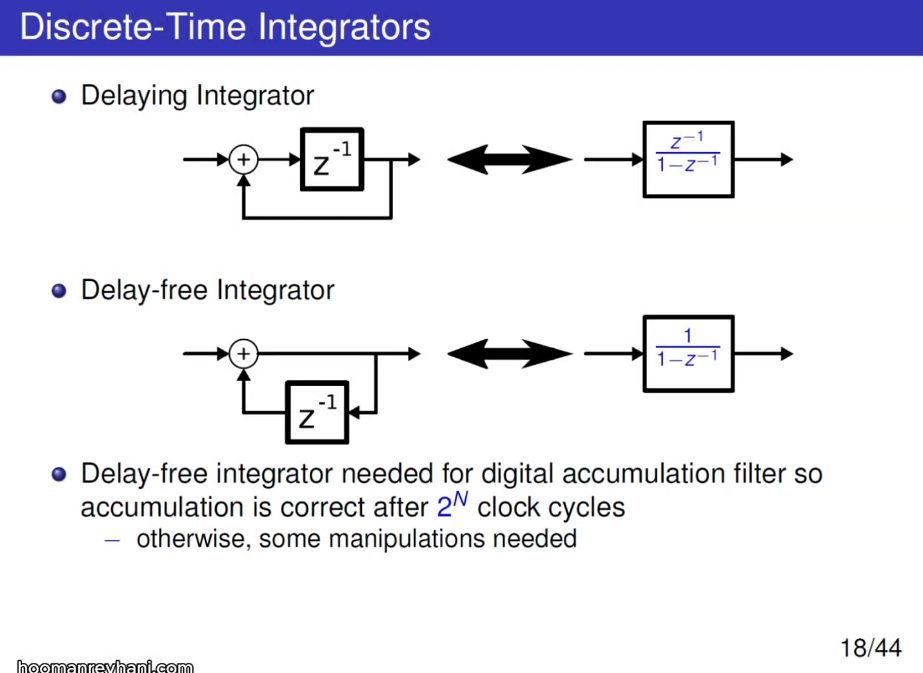

---

## Dual Slope ADC

*TODO* &#128197;

## Incremental ADC

*TODO* &#128197;

## Discrete-Time Integrators

Delaying Integrator

Delay-free Integrator

## reference

David Johns (University of Toronto) "Oversampled Data Converters" Course (2019) [[https://youtu.be/qIJ2LORYmyA?si=_pGb18rhsMUZ-lAf](https://youtu.be/qIJ2LORYmyA?si=_pGb18rhsMUZ-lAf)]
