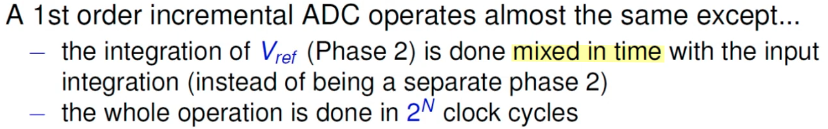

---

## Dual Slope ADC

$$
V_{IN} = \frac{V_{REF}}{T}t_\text{x} = \frac{V_{REF}}{2^N}\cdot 2^{N_\text{x}}
$$

### Normal Mode Rejection

>  a high <u>**n**ormal **m**ode **r**ejection **r**atio</u> (**NMRR**) for input noise at ***line frequency***

- Conversion accuracy is independent of both the capacitance and the clock frequency, because they affect both the up-slope and the down-slope by the same ratio

- The fixed input signal integration period results in rejection of noise frequencies on the analog input that have periods that are equal to or a sub-multiple of the integration time $T$

  Interference signals with frequencies at integral multiples of the integration period are, theoretically, completely removed, ***since** the average value of a sine wave of frequency ($1/T$) **averaged** over a period ($T$) is **zero***

> Linear Circuit Design Handbook, 2008 [[https://www.analog.com/media/en/training-seminars/design-handbooks/Basic-Linear-Design/Chapter6.pdf](https://www.analog.com/media/en/training-seminars/design-handbooks/Basic-Linear-Design/Chapter6.pdf)]
>
> Precision Analog Front Ends with Dual Slope ADC [[https://ww1.microchip.com/downloads/aemDocuments/documents/APID/ProductDocuments/DataSheets/21428e.pdf](https://ww1.microchip.com/downloads/aemDocuments/documents/APID/ProductDocuments/DataSheets/21428e.pdf)]

## Incremental ADC

> 

$$\begin{align}
V &= 2^N V_\text{in} - D_\text{out}V_\text{ref} \\
D_\text{out} \frac{V_\text{ref}}{2^N} &= V_\text{in} - \frac{V}{2^N}
\end{align}$$

> 

### feedforward structure

??? *TODO* &#128197;

---

> 

## reference

David Johns (University of Toronto) "Oversampled Data Converters" Course (2019) [[https://youtu.be/qIJ2LORYmyA](https://youtu.be/qIJ2LORYmyA)]

Maurits Ortmanns , Paul Kaesser , Johannes Wagner (Dec 2025). *Incremental Delta-Sigma ADCs Theory, Architectures and Design - Theory, Architectures and Design*

