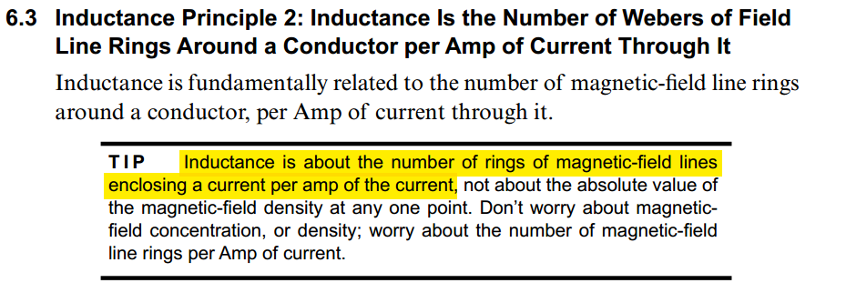
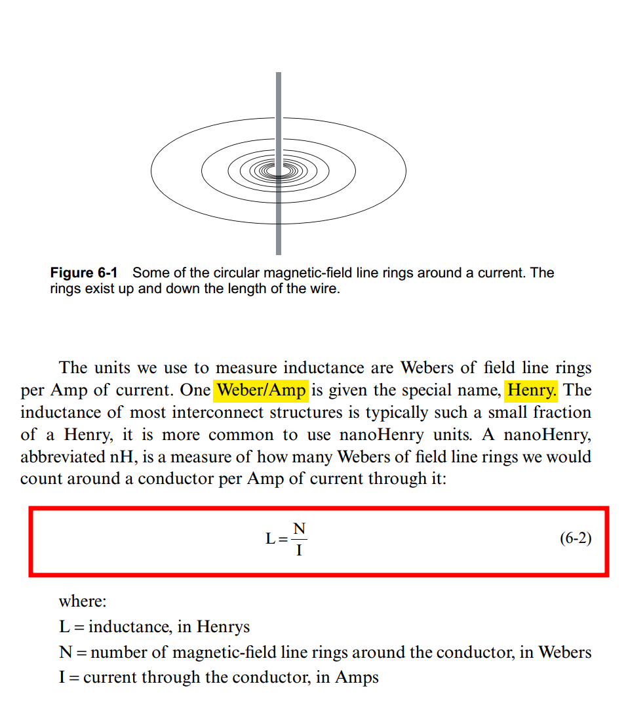
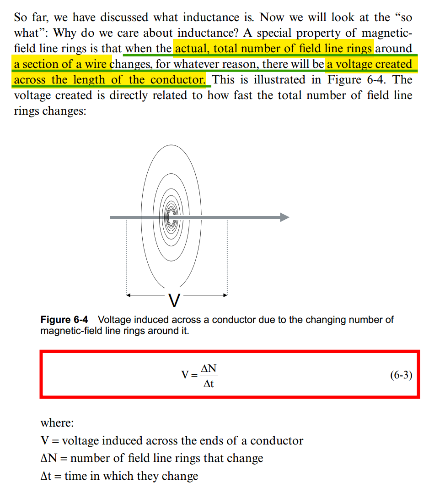
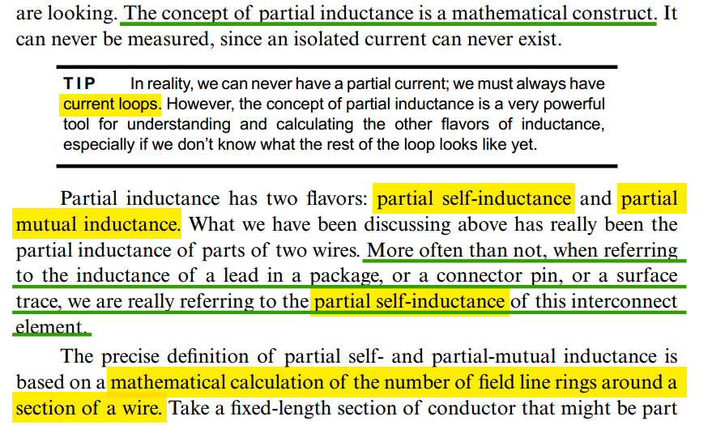
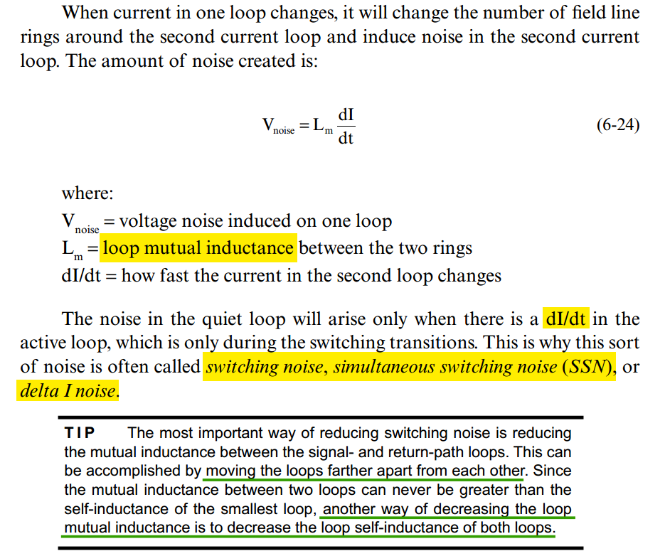
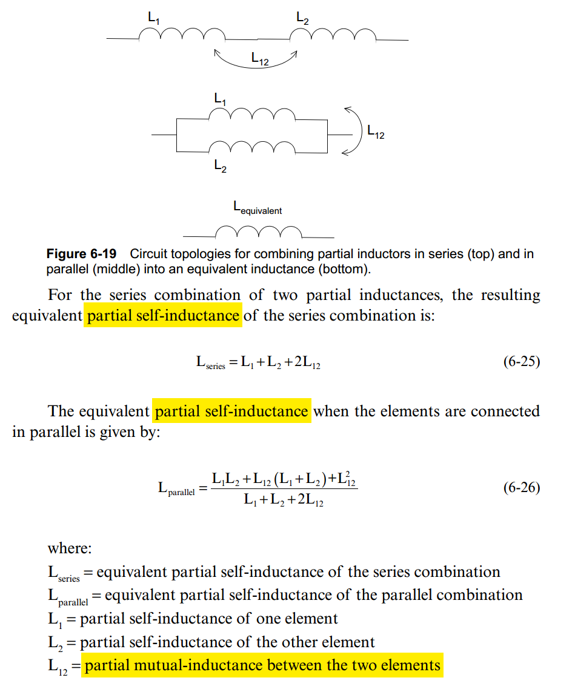
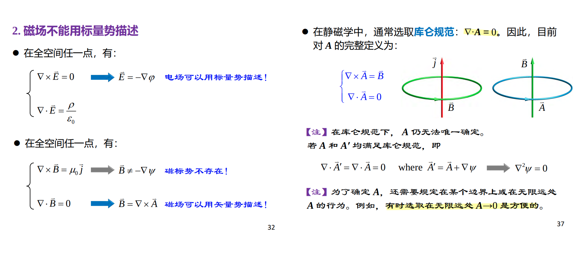

## Basis of Inductance

> Eric Bogatin. What Really Is Inductance? [[https://speedingedge.com/wp-content/uploads/BTS006_What_Is_Inductance-2.pdf](https://speedingedge.com/wp-content/uploads/BTS006_What_Is_Inductance-2.pdf)]

### Self-Inductance & Mutual Inductance

$$\begin{align}
N_a &= L_a I_a + \color{red}M_{ab}I_b \\
N_b &= L_b I_b + \color{red}M_{ab}I_a
\end{align}$$

### Induced voltage

### Partial Inductance

### Loop Self & Mutual Inductance

###  Loop Mutual Inductance

### Equivalent Inductance of Multiple Inductors

$$
L_\text{series} = L_1 + L_{12} + L_2 +L_{12} = L_1 + L_2 + 2L_{12}
$$

$$
L_\text{parallel} = (L_1 + L_{12})\parallel (L_2 + L_{12}) = \frac{L_1L_2 +L_{12}(L_1+L_2)+L_{12}^2}{L_1+L_2+2L_{12}}
$$

## Partial Inductance

**Loop Inductance** is the sum of **partial self-inductance** and **partial-mutual inductance**

### Magnetic Vector Potential (磁矢势)

> Youjin Deng. 5-3 静磁场的基本规律 [[http://staff.ustc.edu.cn/~yjdeng/EM2022/pdf/5-2(2022).pdf](http://staff.ustc.edu.cn/~yjdeng/EM2022/pdf/5-2(2022).pdf)]

磁场不能用标量势描述

> 
>

---

### self partial inductance

### mutual partial inductance

### Ex. two-wire

---

> [[https://www.oldfriend.url.tw/Q3D/ansys_ch_Partial_Loop_Inductance.html](https://www.oldfriend.url.tw/Q3D/ansys_ch_Partial_Loop_Inductance.html)]

## reference

Bogatin, E. (2018). *Signal and power integrity, simplified*. Prentice Hall. [[pdf](https://www.oldfriend.url.tw/article/SI_PI_book/Signal%20and%20Power%20Integrity%20-%20Simplified_2nd_Eric%20Bogatin_Prentice%20Hall%20PTR_2010.pdf)]

Paul, Clayton R. *Inductance: Loop and Partial*. Hoboken, N.J. : [Piscataway, N.J.]: Wiley ; IEEE, 2010. [[pdf](https://picture.iczhiku.com/resource/eetop/sHkGlwJeEepldVnx.pdf)]

Spartaco Caniggia. Signal Integrity and Radiated Emission of High‐Speed Digital Systems. Wiley 2008

---

ISSCC2002. Special Topic Evening Discussion Sessions SE1: Inductance: Implications and Solutions for High-Speed Digital Circuits
[[vSE1_Blaauw](https://engineering.purdue.edu/oxidemems/conferences/isscc2002/DATA/vSE1_Blaauw.pdf)], [[vSE1_Gauthier](https://engineering.purdue.edu/oxidemems/conferences/isscc2002/DATA/vSE1_Gauthier.pdf)], [[vSE1_Morton](https://engineering.purdue.edu/oxidemems/conferences/isscc2002/DATA/vSE1_Morton.pdf), [[vSE1_Restle](https://engineering.purdue.edu/oxidemems/conferences/isscc2002/DATA/vSE1_Restle/01.html)]]

Y. Massoud and Y. Ismail, "Gasping the impact of on-chip inductance," in IEEE Circuits and Devices Magazine, vol. 17, no. 4, pp. 14-21, July 2001 [[https://sci-hub.se/10.1109/101.950046](https://sci-hub.se/10.1109/101.950046)]

Clayton R. Paul, Partial Inductance [[https://ewh.ieee.org/soc/emcs/acstrial/newsletters/summer10/PP_PartialInductance.pdf](https://ewh.ieee.org/soc/emcs/acstrial/newsletters/summer10/PP_PartialInductance.pdf)]

Cheung-Wei Lam. Common Misconceptions about Inductance & Current Return Path [[https://ewh.ieee.org/r6/scv/emc/archive/022010Lam.pdf](https://ewh.ieee.org/r6/scv/emc/archive/022010Lam.pdf)]

Randy Wolff. Signal Loop Inductance in [Pin] and [Package Model] [[https://ibis.org/summits/feb10/wolff.pdf](https://ibis.org/summits/feb10/wolff.pdf)]

ANSYS Q3D Getting Started LE05. Module 5: Q3D Inductance Matrix Reduction [[https://innovationspace.ansys.com/courses/wp-content/uploads/sites/5/2021/07/Q3D_GS_2020R1_EN_LE05_Ind_Matrix.pdf](https://innovationspace.ansys.com/courses/wp-content/uploads/sites/5/2021/07/Q3D_GS_2020R1_EN_LE05_Ind_Matrix.pdf)]

