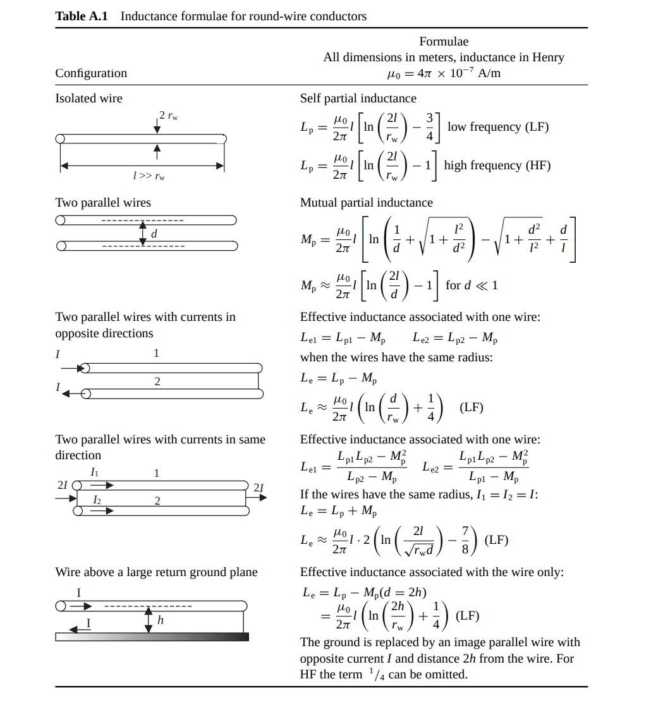
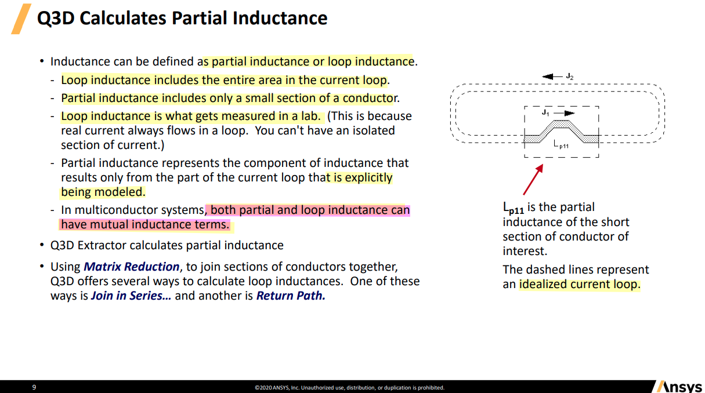
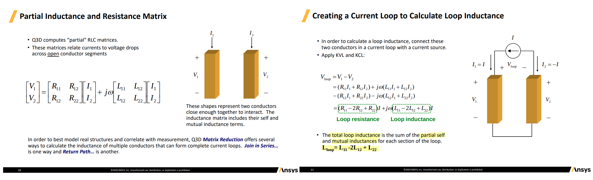
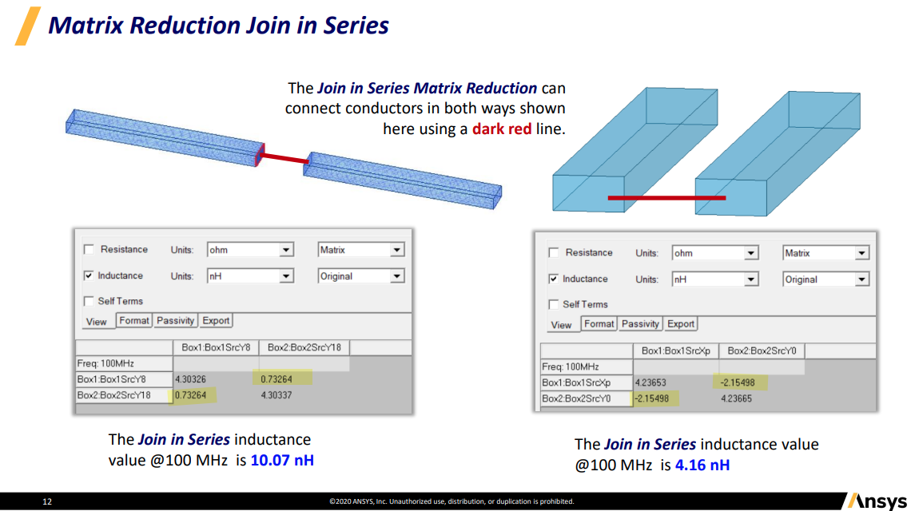
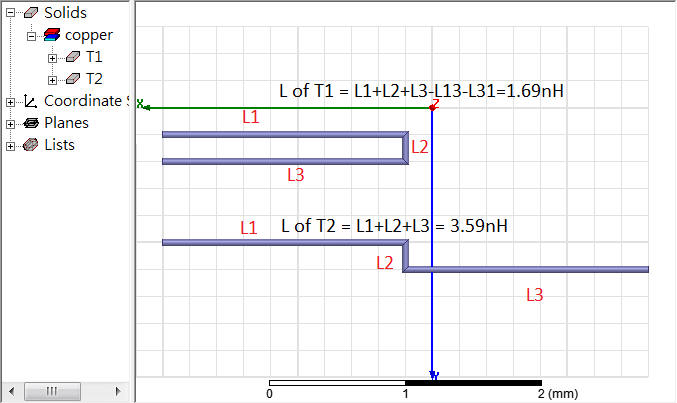
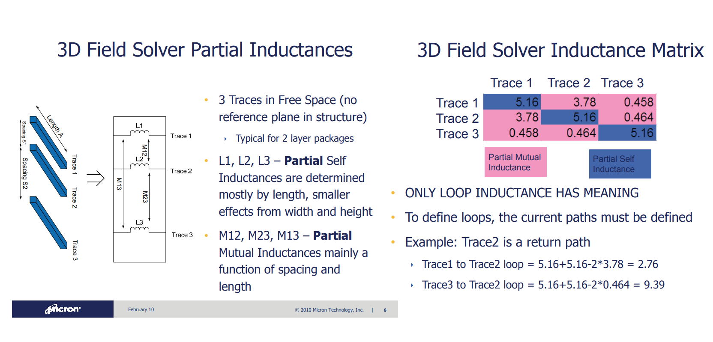
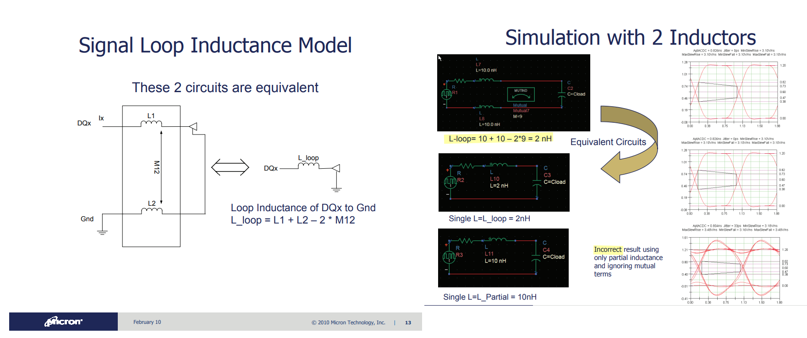

|                               | currents in OPPOSITE direction | currents in SAME direction |
| ----------------------------- | ------------------------------ | -------------------------- |
| **self partial inductance**   | **+**                          |                            |
| **mutual partial inductance** | **-**                          | **+**                      |

---

## loop inductance

> 由法拉第定律所導出的total loop inductance是迴路整體的效應，沒辦法區分出電源與地路徑上各別的電感，即難以分析 電感對power bounce或ground bounce分別的影響，所以有了partial inductance的定義

## partial inductance

> The first problem with using *loop inductance* to model the conductors of a loop is that at different frequencies, the return path

## Proximity effect 

*TODO* &#128197;

## reference

Paul, Clayton R. *Inductance: Loop and Partial*. Hoboken, N.J. : [Piscataway, N.J.]: Wiley ; IEEE, 2010.

Spartaco Caniggia. Signal Integrity and Radiated Emission of High‐Speed Digital Systems. Wiley 2008

Clayton R. Paul, Partial Inductance [[https://ewh.ieee.org/soc/emcs/acstrial/newsletters/summer10/PP_PartialInductance.pdf](https://ewh.ieee.org/soc/emcs/acstrial/newsletters/summer10/PP_PartialInductance.pdf)]

Yuriy Shlepnev. How Interconnects Work: Characteristic Impedance and Reflections [[https://www.linkedin.com/pulse/how-interconnects-work-characteristic-impedance-yuriy-shlepnev/](https://www.linkedin.com/pulse/how-interconnects-work-characteristic-impedance-yuriy-shlepnev/)]

-. How Interconnects Work: Bandwidth for Modeling and Measurements [[https://www.linkedin.com/pulse/how-interconnects-work-bandwidth-modeling-yuriy-shlepnev/?trackingId=874kpm3XuNyV9D0eP6IioA%3D%3D](https://www.linkedin.com/pulse/how-interconnects-work-bandwidth-modeling-yuriy-shlepnev/?trackingId=874kpm3XuNyV9D0eP6IioA%3D%3D)]

Eric Bogatin. Pop Quiz: When is an Interconnect Not a Transmission Line?  [[https://www.signalintegrityjournal.com/blogs/4-eric-bogatin-signal-integrity-journal-technical-editor/post/265-pop-quiz-when-is-an-interconnect-not-a-transmission-line](https://www.signalintegrityjournal.com/blogs/4-eric-bogatin-signal-integrity-journal-technical-editor/post/265-pop-quiz-when-is-an-interconnect-not-a-transmission-line)]

TeledyneLeCroy/SignalIntegrity Python tools for signal integrity applications [[SignalIntegrityApp](https://github.com/TeledyneLeCroy/SignalIntegrity)]

A Look at Transmission-Line Losses [[http://blog.teledynelecroy.com/2018/06/a-look-at-transmission-line-losses.html](http://blog.teledynelecroy.com/2018/06/a-look-at-transmission-line-losses.html)]

How Much Transmission-Line Loss is Too Much? [[http://blog.teledynelecroy.com/2018/06/how-much-transmission-line-loss-is-too.html](http://blog.teledynelecroy.com/2018/06/how-much-transmission-line-loss-is-too.html)]

Y. Massoud and Y. Ismail, "Gasping the impact of on-chip inductance," in IEEE Circuits and Devices Magazine, vol. 17, no. 4, pp. 14-21, July 2001

Randy Wolff. Signal Loop Inductance in [Pin] and [Package Model] [[https://ibis.org/summits/feb10/wolff.pdf](https://ibis.org/summits/feb10/wolff.pdf)]

Raymond Y. Chen, Raymond Y. Chen. Fundamentals of S Fundamentals of S-Parameter Parameter Modeling for Power Distribution Modeling for Power Distribution System (PDS) and SSO Analysis System (PDS) and SSO Analysis [[https://ibis.org/summits/jun05/chen.pdf](https://ibis.org/summits/jun05/chen.pdf)]

ANSYS Q3D Getting Started LE05. Module 5: Q3D Inductance Matrix Reduction [[https://innovationspace.ansys.com/courses/wp-content/uploads/sites/5/2021/07/Q3D_GS_2020R1_EN_LE05_Ind_Matrix.pdf](https://innovationspace.ansys.com/courses/wp-content/uploads/sites/5/2021/07/Q3D_GS_2020R1_EN_LE05_Ind_Matrix.pdf)]

---

ISSCC2002. Special Topic Evening Discussion Sessions SE1: Inductance: Implications and Solutions for High-Speed Digital Circuits
[[vSE1_Blaauw](https://engineering.purdue.edu/oxidemems/conferences/isscc2002/DATA/vSE1_Blaauw.pdf)], [[vSE1_Gauthier](https://engineering.purdue.edu/oxidemems/conferences/isscc2002/DATA/vSE1_Gauthier.pdf)], [[vSE1_Morton](https://engineering.purdue.edu/oxidemems/conferences/isscc2002/DATA/vSE1_Morton.pdf)]
