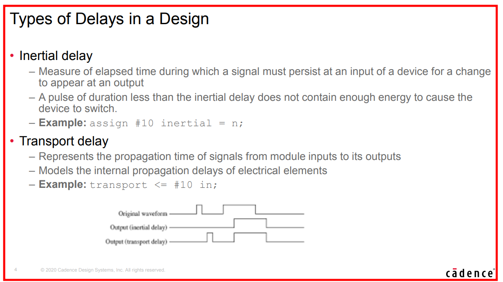
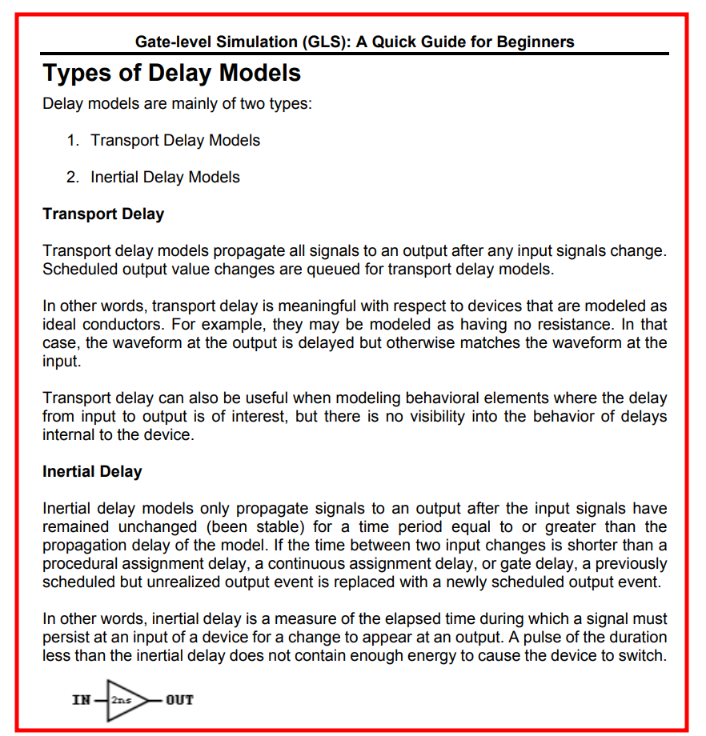
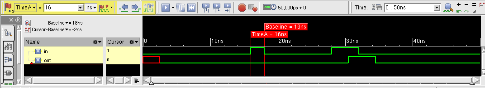
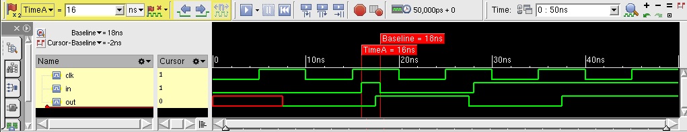
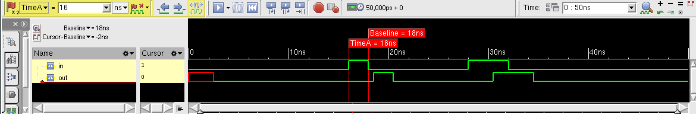
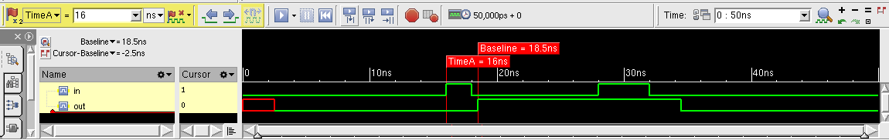

## Inertial delay

Inertial delay models are simulation delay models that filter pulses that are shorted than the propagation delay of **Verilog gate primitives** or **continuous assignments** (`assign #5 y = ~a;`)

​													**COMBINATIONAL LOGIC ONLY !!!**

> - Inertial delays swallow glitches
> - **sequential logic** implemented with **procedure assignments** DON'T follow the rule

### continuous assignments

```verilog
`timescale 1ns/100ps
module tb;

	reg in;
/////////////////////////////////////////////////////
	wire out;
	assign #2.5 out = in;
/////////////////////////////////////////////////////
	initial begin
		in = 0;
		#16;
		in = 1;
		#2;
		in = 0;
		#10;
		in = 1;
		#4;
		in = 0;
	end

	initial begin
		#50;
		$finish();
	end

endmodule
```




### procedure assignment - combinational logic

```verilog
`timescale 1ns/100ps
module tb;

	reg in;
	reg out;

//////////// combination logic ////////////////////////
	always @(*)
		#2.5 out = in;
///////////////////////////////////////////////////////
/* the above code is same with following code
    	always @(*) begin
			#2.5;
			out = in;
		end
*/
	initial begin
		in = 0;
		#16;
		in = 1;
		#2;
		in = 0;
		#10;
		in = 1;
		#4;
		in = 0;
	end

	initial begin
		#50;
		$finish();
	end

endmodule
```


### procedure assignment - sequential logic

```verilog
`timescale 1ns/100ps
module tb;
	reg clk;

	reg in;
	reg out;

	always begin
		clk = 0;
		#5;
		forever begin
			clk = ~clk;
			#5;
		end
	end
//////////// sequential logic //////////////////
	always @(posedge clk)
		#2.5 out <= in;
///////////////////////////////////////////////
	initial begin
		in = 0;
		#16;
		in = 1;
		#2;
		in = 0;
		#10;
		in = 1;
	end

	initial begin
		#50;
		$finish();
	end

endmodule
```



> As shown above, sequential logic DON'T follow inertial delay


## Transport delay

Transport delay models are simulation delay models that pass all pulses, including pulses that are shorter than the propagation delay of corresponding **Verilog procedural assignments**

> - Transport delays pass glitches, delayed in time
> - Verilog can model RTL transport delays by adding **explicit delays to the right-hand-side (RHS) of a nonblocking assignment**

```verilog
always @(*)
    y <= #5 ~a;
```

### nonblocking assignment

```verilog
`timescale 1ns/100ps
module tb;

	reg in;
	reg out;
/////////////// nonblocking assignment ///
	always @(*) begin
		out <= #2.5 in;
	end
/////////////////////////////////////////
	initial begin
		in = 0;
		#16;
		in = 1;
		#2;
		in = 0;
		#10;
		in = 1;
		#4;
		in = 0;
	end

	initial begin
		#50;
		$finish();
	end

endmodule
```




### blocking assignment

```verilog
`timescale 1ns/100ps
module tb;

	reg in;
	reg out;
/////////////// blocking assignment ///
	always @(*) begin
		out = #2.5 in;
	end
/////////////////////////////////////////
	initial begin
		in = 0;
		#16;
		in = 1;
		#2;
		in = 0;
		#10;
		in = 1;
		#4;
		in = 0;
	end

	initial begin
		#50;
		$finish();
	end

endmodule
```



> It seems that new event is **discarded** before previous event is realized.


## reference

[Verilog Nonblocking Assignments With Delays, Myths & Mysteries](http://www.sunburst-design.com/papers/CummingsSNUG2002Boston_NBAwithDelays.pdf)

[Correct Methods For Adding Delays To Verilog Behavioral Models](http://www.sunburst-design.com/papers/CummingsHDLCON1999_BehavioralDelays_Rev1_1.pdf)

Article (20488135) Title: Selecting Different Delay Modes in GLS (RAK)
URL: [https://support.cadence.com/apex/ArticleAttachmentPortal?id=a1O3w000009bdLyEAI](https://support.cadence.com/apex/ArticleAttachmentPortal?id=a1O3w000009bdLyEAI)

Article (20447759) Title: Gate Level Simulation (GLS): A Quick Guide for Beginners
URL: [https://support.cadence.com/apex/ArticleAttachmentPortal?id=a1Od0000005xEorEAE](https://support.cadence.com/apex/ArticleAttachmentPortal?id=a1Od0000005xEorEAE)
