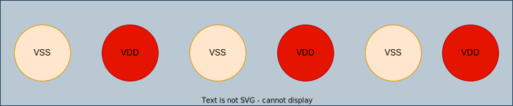

#### power/ground bump
```tcl
create_bump –cell PAD90UBMBOP –loc_type cell_center –loc $x0 $y  
create_bump –cell PAD90UBMBOP –loc_type cell_center –loc $x1 $y 
...
create_bump –cell PAD90UBMBOP –loc_type cell_center –loc $xn $y 
deselectAll 
select_bump –bum_cell PAD90UBMBOP 
assignPGBumps –nets {vss vdd_dig} -selected –checkboard
```




#### signal or power/ground bump

```tcl
set bump_name [create_bump –cell PAD150PITCH –loc $bump_x $bump_y –loc_type cell_center –return_bumps_name] 
# assign power/ground bump
assignPGBumps –bumps $bump_name –nets $pin_name 
# or assign to signal bump
assignSigToBump –bumps $bump_name –net $pin_name 
```

