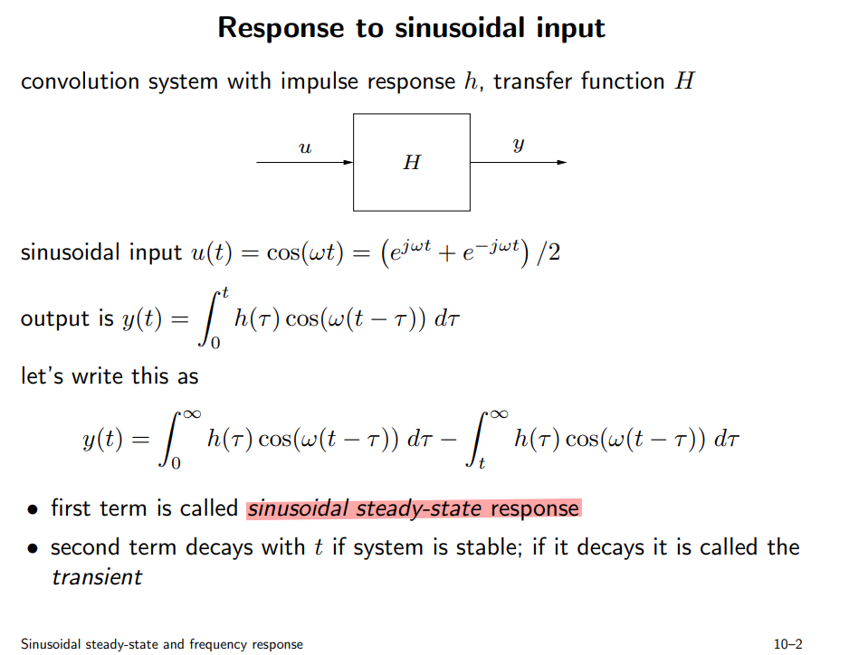
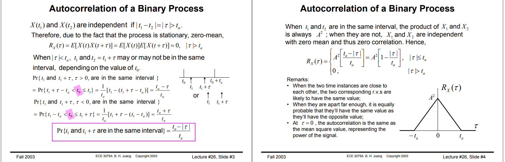

## Inverter capacitance

## Voltage dependence of MOS gate capacitance

- capacitance of MOS gate varies **nonmonotonically** with $V_{GS}$

- "accumulation-mode" varactor varies **monotonically** with $V_{GS}$

## RC charge and discharge

- charge:
  $$
  V_o(t) = V_{X}(1-e^{-\frac{t}{\tau}}) + V_{o,0}\cdot e^{-\frac{-t}{\tau}}
  $$

- discharge:
  $$
  V_o(t) = V_{o,0}\cdot e^{-\frac{t}{\tau}} + V_{o,\infty}\cdot(1-e^{-\frac{t}{\tau}})
  $$

> 1. $e^{-\frac{t}{\tau}}$ item determine the **initial state **
> 2. $(1-e^{-\frac{t}{\tau}})$ item determine the **final state**

### AC coupling

---

$$
\tau = 200 \text{nF} \times (50+50)\text{ohm} = 20 \mu s
$$

high level envelope:

## switched-capacitor resistor

> Switching the capacitor moves a charge proportional to the voltage difference. The resistor achieves the same function only in a continuous manner. 
>
> Using a water analogy, we can imagine a couple of scenarios: 
>
> 1) a steady water flow, 
> 2) or 2) the same water delivered rapidly in buckets. Both create the same flow of water - **on average!**

## Current mirror with source degeneration 

> Razavi 2nd, problem 14.15

## Sinusoidal steady-state and frequency response

Due to KCL and $u(t)=e^{j\omega t}$ and $y(t)=H(j\omega)e^{j\omega t}$, we have ODE:

$$\begin{align}
\frac{u(t) - y(t)}{R} = C \frac{dy(t)}{dt} \\
e^{j\omega t} - H(j\omega) e^{j\omega t} = H(j\omega)\cdot j\omega e^{j\omega t} \\
\end{align}$$

$H(j\omega)$ is obtained as below
$$
H(j\omega) = \frac{1}{1+j\omega}
$$

## Monitored Analog Critical Parameters

Parameter Definition:

$$\begin{align}
I_{\text{D,lin}} &= I_D \mid _{V_G=V_{DD},V_D=0.05V} \\
I_{\text{D,sat}} &= I_D \mid _{V_G=V_D=V_{DD}} \\
V_{\text{t,lin}} &= V_G \mid _{I_D=I_{\text{thx}}\cdot \frac{W}{L}@\{V_D=0.05V\}}
\end{align}$$

> $I_{\text{thx}}$ could be different for technologies. (For N16, $I_{\text{thx}}=10$nA)

## Demystifying stb and pstb in Spectre

All credits to my colleague, Zhang Wenpian.

### Spectre's stb analysis

Spectre **stb**'s "loopgain" is negative of "T" in paper[1]
$$
T = \frac{2(AD-BC) - A + D}{2(AD-BC)-A+D-1}
$$

AC simulation testbench, shown as below,

1. $I_{inj}$ = 0, $V_{inj}$ = 1

   B = if, D = ve

2. $I_{inj}$ = 1, $V_{inj}$ = 0

   A = if, C = ve

### Spectre's pstb analysis

Spectre **pstb** is similar to stb, just set **pac** as **1** instead of  **ac** in current source and voltage source.

This analysis just use **harmonic 0** transfer function in pac analysis, which has limitation.

## Thevenin and Norton Equivalent Circuits

### 戴维南定理

### 等效电阻的计算方法

> 使用**外加电源法**时， 全部独立电源需要置零

### 诺顿定理

#### Lemma of Razavi

$$
A_V = -G_m R_{out}
$$

> *Design of Analog CMOS Integrated Circuits, Second Edition - Behzad Razavi*

## Miller's Approximation: right-half-plane zero

 A quick inspection of this circuit reveals that a **zero** lies at a frequency where the current through $C_{12}$ becomes equal to $g_2V_1$. 

When this occurs, the current through the parallel combination of $C_2$ and $R_2$ becomes zero, creating a zero in the transfer function. 

In other words, we can write

$$\begin{align}
g_2V_1 &= V_1sC_{12} \\
s &= \frac{g_2}{C_{12}}
\end{align}$$

## How to Mitigate Impact of Zero

### Lectures
EE 240B: Advanced Analog Circuit Design, Prof. Bernhard E. Boser [[OTA II, Multi-Stage](https://people.eecs.berkeley.edu/~boser/courses/240B/lectures/M07%20OTA%20II.pdf)]

### Papers

B. K. Ahuja, "An improved frequency compensation technique for CMOS operational amplifiers," in IEEE Journal of Solid-State Circuits, vol. 18, no. 6, pp. 629-633, Dec. 1983, doi: 10.1109/JSSC.1983.1052012.

D. B. Ribner and M. A. Copeland, "Design techniques for cascoded CMOS op amps with improved PSRR and common-mode input range," in IEEE Journal of Solid-State Circuits, vol. 19, no. 6, pp. 919-925, Dec. 1984, doi: 10.1109/JSSC.1984.1052246.

Abo, Andrew & Gray, Paul. (1999). A 1.5V, 10-bit, 14MS/s CMOS Pipeline Analog-to-Digital Converter.

### Book's chapters
Design of analog CMOS integrated circuits, Behzad Razavi

- 10.5 Compensation of Two-Stage Op Amps
- 10.7 Other Compensation Techniques

Analog Design Essentials, Willy M.C. Sansen

- chapter #5 Stability of operational amplifiers - Compensation of positive zero

Analysis and Design of Analog Integrated Circuits 5th Edition,  Paul R. Gray, Paul J. Hurst, Stephen H. Lewis, Robert G. Meyer

- 9.4.3 Two-Stage MOS Amplifier Compensation

CMOS Analog Circuit Design 3rd Edition,  Phillip E. Allen, Douglas R. Holberg

- 6.2.2 Miller Compensation of the Two-Stage Op Amp

### Example - cascode compensation

$$\begin{align}
\omega_{p1} &= \frac {1} {R_{eq}g_{m9}R_{L}C_{c}} \\
\omega_{p2} &= \frac {g_{m4}R_{eq}g_{m9}} {C_L} \\
\omega_z &= (g_{m4}R_{eq})(\frac {g_{m9}} {C_c})
\end{align}$$

> Figure 10.46 in Razavi's book

## Non Overlapping Clock



## Single ended Amplifier Offset Voltage

### unity gain buffer

$$\begin{align}
V_o &= V_{o,dc}+A(V_p-V_m) \\
V_o' &= V_{o,dc}+A(V_p+V_{os}-V_m')
\end{align}$$

Then, we get
$$
V_{os}=\frac{V_o'-V_o}{A}+(V_m'-V_m)
$$
Due to $V_o=V_m$ and $V_o'=V_m'$
$$
V_{os}=(1/A+1)\Delta{V_m}
$$
or
$$
V_{os}=(1/A+1)\Delta{V_o}
$$
if $A \gg 1$
$$
V_{os}=\Delta{V_o}
$$

### non-inverting amplifier

$$\begin{align}
V_o &= V_{o,dc}+A(V_p-V_m) \\
V_o' &= V_{o,dc}+A(V_p+V_{os}-V_m') \\
V_m &= \beta V_o \\
V_m' &= \beta V_o'
\end{align}$$

we get
$$
V_{os}=\frac{V_o'-V_o}{A}+(V_m'-V_m)
$$
or
$$
V_{os}=\frac{\Delta V_o}{A}+\beta \Delta V_o
$$
if $A \gg 1$
$$
V_{os}=\beta \Delta V_o
$$
or
$$
V_{os}=\Delta V_m
$$

---

**Lecture 22 Variability and Mismatch of Dr. Hesham A. Omran's Analog IC Design**

> URL: [https://www.master-micro.com/professional-courses/analog-ic-design/course-resources](https://www.master-micro.com/professional-courses/analog-ic-design/course-resources)

## Gotcha MOS ron

There is discrepancy between model operating point and $V_{ds}/I_{ds}$

I believe that the equation $V_{ds}/I_{ds}$ is more appropriate where mos is used as switch, though $V_{ds}=0$ is an outlier.

## Channel-length modulation

> short-channel effects

$$\begin{align}
I_D &=\frac{1}{2}\mu_nC_{ox}\frac{W}{L}(V_{GS}-V_{TH})^2(1+\frac{\Delta L}{L}) \\
I_D &=\frac{1}{2}\mu_nC_{ox}\frac{W}{L}(V_{GS}-V_{TH})^2(1+\lambda V_{DS}) \\
I_D &=\frac{1}{2}\mu_nC_{ox}\frac{W}{L}(V_{GS}-V_{TH})^2(1+\frac{V_{DS}}{V_A})
\end{align}$$

where $\frac{\Delta L}{L}=\lambda V_{DS}$ and $V_A=\frac{1}{\lambda}$ 

$\lambda$ is channel length modulation parameter

$V_A$, i.e. Early voltage is equal to inverse of channel length modulation parameter

The output resistance $r_o$

$$\begin{align}
r_o &= \frac{\partial V_{DS}}{\partial I_D} \\
&= \frac{1}{\partial I_D/\partial V_{DS}} \\
&= \frac{1}{\lambda I_D} \\
&= \frac{V_A}{I_D}
\end{align}$$

Due to  $\lambda \propto 1/L$, i.e. $V_A \propto L$
$$
r_o \propto \frac{L}{I_D}
$$

The output resistance is almost doubled using Stacked FET  in *saturation region*

> $V_t$ and mobility $\mu_{n,p}$ are sensitive to temperature
>
> - $V_t$ decreases by 2-mV for every 1$^oC$ rise in temperature
> - mobility $\mu_{n,p}$ decreases with temperature
>
>  Overall, increase in temperature results in lower drain currents

## Biasing current source and global variation Monte Carlo simulation

**iwl**: biased by mirror

**iwl_ideal**: biased by *vdc* source, whose value is *typical corner*

---

For **local variation**, constant voltage bias (*vb_const* in schematic) help reduce variation from $\sqrt{2}\Delta V_{th}$ to  $\Delta V_{th}$

For **global variation**, *all device have same variation*, mirror help reduce variation by sharing same $V_{gs}$ 

1. global variation + local variation (All MC)

2. local variation (Mismatch MC)

3. global variation (Process MC)

> We had better bias mos gate with mirror rather than the *vdc* source while simulating sub-block.
>
> This is real situation due to current source are always biased by mirror and *vdc* biasing don't give the right result in global variation Monte Carlo simulation (*542.8n* is too pessimistic, *13.07p* is right result)

## Schmitt Inverter

## gm/ID: ADT

> small gm/ID for High ro

## Spectral content of NRZ

> Lecture 26 Autocorrelation Functions of Random Binary Processes [[https://bpb-us-w2.wpmucdn.com/sites.gatech.edu/dist/a/578/files/2003/12/ECE3075A-26.pdf](https://bpb-us-w2.wpmucdn.com/sites.gatech.edu/dist/a/578/files/2003/12/ECE3075A-26.pdf)]
> 
> Lecture 32 Correlation Functions & Power Density Spectrum, Cross-spectral Density [[https://bpb-us-w2.wpmucdn.com/sites.gatech.edu/dist/a/578/files/2003/12/ECE3075A-32.pdf](https://bpb-us-w2.wpmucdn.com/sites.gatech.edu/dist/a/578/files/2003/12/ECE3075A-32.pdf)]

## $g_m$ vs $V_{\text{DS}}$

## reference

M. Tian, V. Visvanathan, J. Hantgan and K. Kundert, "Striving for small-signal stability," in IEEE Circuits and Devices Magazine, vol. 17, no. 1, pp. 31-41, Jan. 2001, doi: 10.1109/101.900125.

Open loop gain analysis and "STB" method  [[https://www.linkedin.com/pulse/open-loop-gain-analysis-stb-method-jean-francois-debroux](https://www.linkedin.com/pulse/open-loop-gain-analysis-stb-method-jean-francois-debroux )]

The Analog Designer's Toolbox (ADT) | Invited Talk by IEEE Santa Clara Valley Section CAS Society, [https://youtu.be/FT6kKC5OdE0](https://youtu.be/FT6kKC5OdE0)

ESSCIRC2023 Circuit Insights Ali Sheikholeslami [[https://youtu.be/2xFIZM5_FPw?si=XWwSzDgKWZGB0rX1](https://youtu.be/2xFIZM5_FPw?si=XWwSzDgKWZGB0rX1)]

Ali Sheikholeslami, Circuit Intuitions: Thevenin and Norton Equivalent Circuits, Part 3 IEEE Solid-State Circuits Magazine, Vol. 10, Issue 4, pp. 7-8, Fall 2018. 

Ali Sheikholeslami, Circuit Intuitions: Thevenin and Norton Equivalent Circuits, Part 2 IEEE Solid-State Circuits Magazine, Vol. 10, Issue 3, pp. 7-8, Summer 2018. 

Ali Sheikholeslami, Circuit Intuitions: Thevenin and Norton Equivalent Circuits, Part 1 IEEE Solid-State Circuits Magazine, Vol. 10, Issue 2, pp. 7-8, Spring 2018.

Ali Sheikholeslami, Circuit Intuitions: Miller's Approximation IEEE Solid-State Circuits Magazine, Vol. 7, Issue 4, pp. 7-8, Fall 2015. 

Ali Sheikholeslami, Circuit Intuitions: Miller's Theorem IEEE Solid-State Circuits Magazine, Vol. 7, Issue 3, pp. 8-10, Summer 2015.

Stephen P. Boyd. EE102 Lecture 10 Sinusoidal steady-state and frequency response [[https://web.stanford.edu/~boyd/ee102/freq.pdf](https://web.stanford.edu/~boyd/ee102/freq.pdf)]

Shanthi Pavan, "Demystifying Linear Time Varying Circuits"

ecircuitcenter. Switched-Capacitor Resistor [[http://www.ecircuitcenter.com/Circuits/SWCap/SWCap.htm](http://www.ecircuitcenter.com/Circuits/SWCap/SWCap.htm)]

Jørgen Andreas Michaelsen. INF4420 Switched-Capacitor Circuits. [[https://www.uio.no/studier/emner/matnat/ifi/INF4420/v13/undervisningsmateriale/inf4420_v13_07_switchedcapacitor_print.pdf](https://www.uio.no/studier/emner/matnat/ifi/INF4420/v13/undervisningsmateriale/inf4420_v13_07_switchedcapacitor_print.pdf)]

chembiyan T. OC Lecture 10: A very basic introduction to switched capacitor circuits [[https://youtu.be/SaYtemYp4rQ?si=q2qovTKJrLy65pnu](https://youtu.be/SaYtemYp4rQ?si=q2qovTKJrLy65pnu)]
