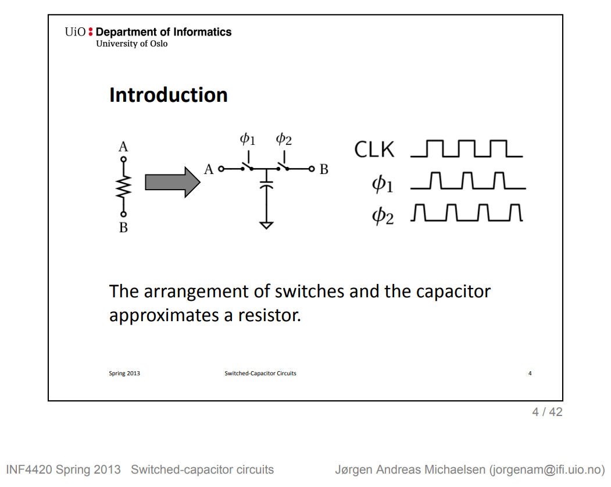
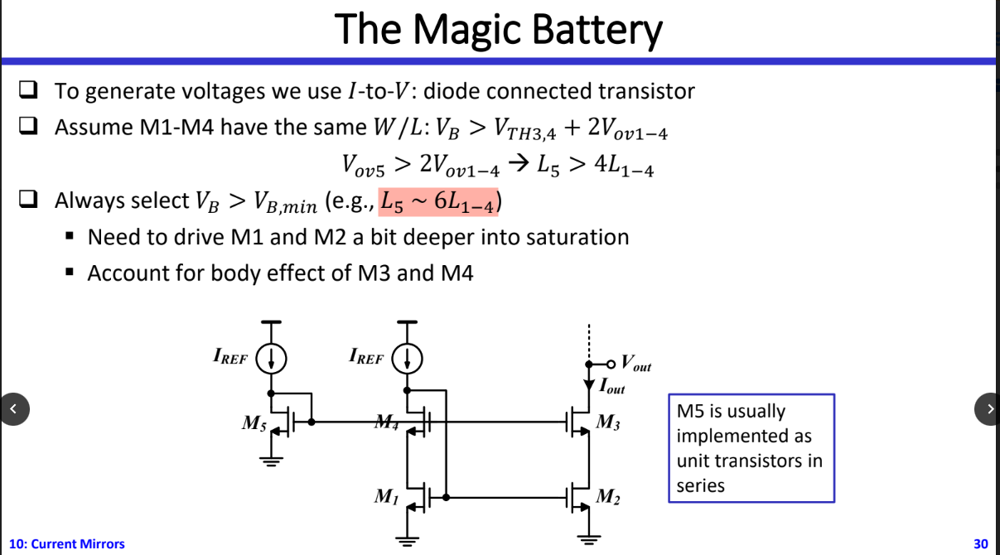
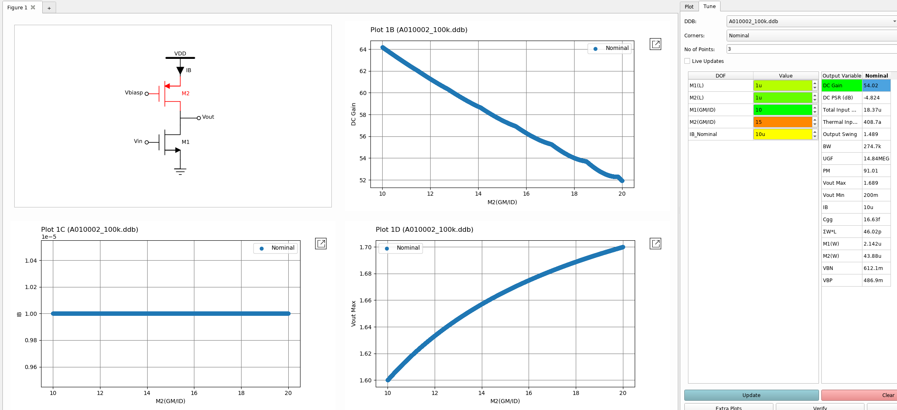
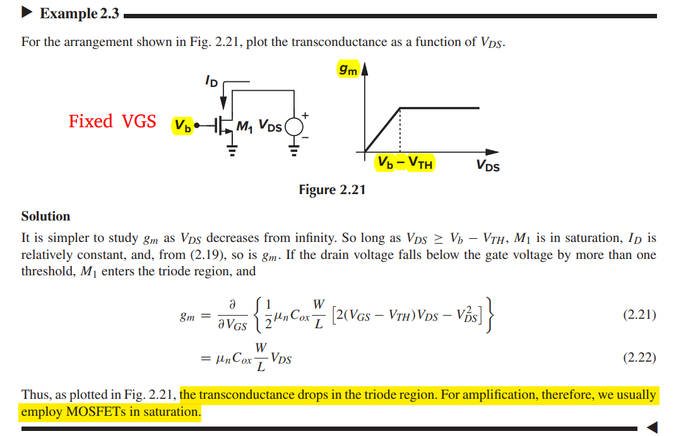
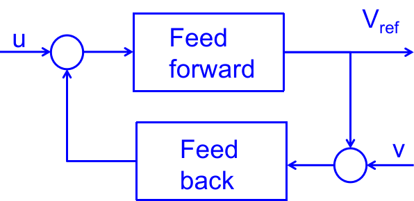
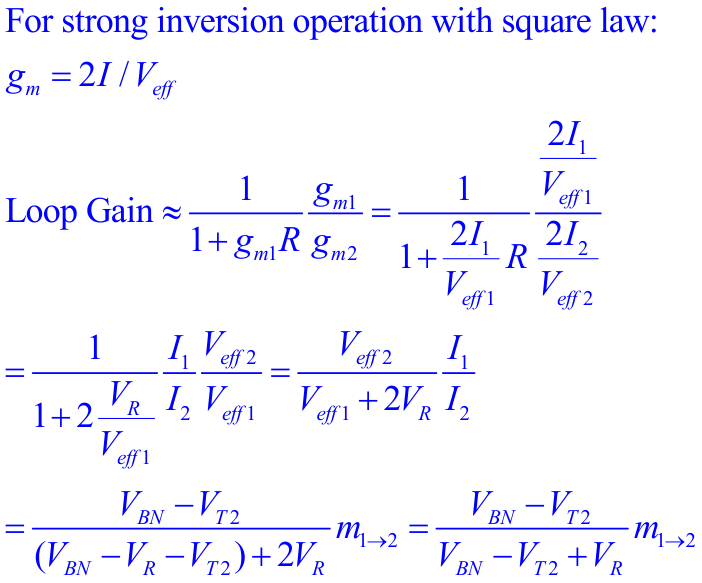

## Zero in differential pair with active current mirror

Noting the circuit consists of a "slow path" (M1, M3, M4) in parallel with a "fast path" (M2)

- "slow path"
  $$
  H_\text{slow}(s) = \frac{A_0}{(1+s/\omega _{pE})(1+s/\omega _{pO})}
  $$

- "fast path"
  $$
  H_\text{fast}(s) = \frac{A_0}{1+s/\omega _{pO}}
  $$

Then
$$\begin{align}
\frac{V_\text{out}}{V_\text{in}} &= H_\text{slow}(s) + H_\text{fast}(s) \\
&= \frac{A_0}{1+s/\omega _{pO}}\left(\frac{1}{1+s/\omega _{pE}} + 1 \right) \\
&= \frac{A_0(1+s/2\omega _{pE})}{(1+s/\omega _{pO})(1+s/\omega _{pE})}
\end{align}$$

That is, the system exhibits a zero at $2\omega_{pE}$

---

signals traveling through *two paths* within an amplifier may cancel each other at one frequency, creating a *zero* in the transfer function

## Subthreshold Conduction

By square-law, the Eq $g_m = \sqrt{2\mu C_{ox}\frac{W}{L}I_D}$, it is possible to obtain a *higer* transconductance by increasing $W$ while maintaining $I_D$ constant. However, if $W$ increases while $I_D$ remains constant, then $V_{GS} \to V_{TH}$ and device enters the subthreshold region.
$$
I_D = I_0\exp \frac{V_{GS}}{\xi V_T}
$$

where $I_0$ is proportional to $W/L$, $\xi \gt 1$ is a nonideality factor, and $V_T = kT/q$

As a result, the transconductance in subthreshold region is
$$
g_m = \frac{I_D}{\xi V_T}
$$

which is $g_m \propto I_D$

## Random offset

The dependence of offset voltage and current mismatches upon the overdrive voltage is similar to our
observations for corresponding *noise quantities*

### differential pair

In reality, since mismatches are independent statistical variables

> Above shows that the input transistors must be designed for *high gain* ($g_mr_o = \frac{2}{V_{OV}\lambda}$), which means they must be designed for *small* $V_{GS}-V_{TH}$.
>
> It is desirable to minimize $V_{GS}-V_{TH}$ by *lowering the tail current* or *increasing the transistor widths*

---

For $\frac{\Delta K}{K}$

$$\begin{align}
v_{os} g_m &= \Delta K \frac{W}{L}(V_{GS}-V_{TH})^2 \\
v_{os} 2K\frac{W}{L}(V_{GS}-V_{TH}) &= \Delta K \frac{W}{L}(V_{GS}-V_{TH})^2 \\
v_{os} &= \frac{V_{GS}-V_{TH}}{2} \frac{\Delta K}{K}
\end{align}$$

> The derivation for $\frac{\Delta W/L}{W/L}$ is same with $\frac{\Delta K}{K}$

### current mirror

> To minimize current mismatch, the overdrive voltage must be maximized, a trend opposite to that in differential pair.
>
> This is because as $V_{GS}-V_{TH}$ increases, threshold mismatch has a lesser effect on the device currents
>
> $\Delta I_D= g_m \Delta V_{TH} = \frac{2I_D}{V_{OV}}\Delta V_{TH}$

## Effect of Feedback on Noise

> Feedback does **not improve** the noise performance of circuits.

>The input-referred noise voltage and current remain the same if the feedback network introduces no noise.

## Burn-in & High-temperature operating life (HTOL) 

*TODO* &#128197;

## RC charge and discharge

- charge:
  $$
  V_o(t) = V_{X}(1-e^{-\frac{t}{\tau}}) + V_{o,0}\cdot e^{-\frac{-t}{\tau}}
  $$

- discharge:
  $$
  V_o(t) = V_{o,0}\cdot e^{-\frac{t}{\tau}} + V_{o,\infty}\cdot(1-e^{-\frac{t}{\tau}})
  $$

> 1. $e^{-\frac{t}{\tau}}$ item determine the **initial state **
> 2. $(1-e^{-\frac{t}{\tau}})$ item determine the **final state**

### AC coupling

---

$$
\tau = 200 \text{nF} \times (50+50)\text{ohm} = 20 \mu s
$$

high level envelope:

## switched-capacitor resistor

> Switching the capacitor moves a charge proportional to the voltage difference. The resistor achieves the same function only in a continuous manner. 
>
> Using a water analogy, we can imagine a couple of scenarios: 
>
> 1) a steady water flow, 
> 2) or 2) the same water delivered rapidly in buckets. Both create the same flow of water - **on average!**

## Current mirror with source degeneration 

> Razavi 2nd, problem 14.15

## Monitored Analog Critical Parameters

Parameter Definition:

$$\begin{align}
I_{\text{D,lin}} &= I_D \mid _{V_G=V_{DD},V_D=0.05V} \\
I_{\text{D,sat}} &= I_D \mid _{V_G=V_D=V_{DD}} \\
V_{\text{t,lin}} &= V_G \mid _{I_D=I_{\text{thx}}\cdot \frac{W}{L}@\{V_D=0.05V\}}
\end{align}$$

> $I_{\text{thx}}$ could be different for technologies. (For N16, $I_{\text{thx}}=10$nA)

## Demystifying stb and pstb in Spectre

All credits to my colleague, Zhang Wenpian.

### Spectre's stb analysis

Spectre **stb**'s "loopgain" is negative of "T" in paper[1]
$$
T = \frac{2(AD-BC) - A + D}{2(AD-BC)-A+D-1}
$$

AC simulation testbench, shown as below,

1. $I_{inj}$ = 0, $V_{inj}$ = 1

   B = if, D = ve

2. $I_{inj}$ = 1, $V_{inj}$ = 0

   A = if, C = ve

### Spectre's pstb analysis

Spectre **pstb** is similar to stb, just set **pac** as **1** instead of  **ac** in current source and voltage source.

This analysis just use **harmonic 0** transfer function in pac analysis, which has limitation.

## Thevenin and Norton Equivalent Circuits

### 戴维南定理

### 等效电阻的计算方法

> 使用**外加电源法**时， 全部独立电源需要置零

### 诺顿定理

#### Lemma of Razavi

$$
A_V = -G_m R_{out}
$$

> *Design of Analog CMOS Integrated Circuits, Second Edition - Behzad Razavi*

## Miller's Approximation: right-half-plane zero

 A quick inspection of this circuit reveals that a **zero** lies at a frequency where the current through $C_{12}$ becomes equal to $g_2V_1$. 

When this occurs, the current through the parallel combination of $C_2$ and $R_2$ becomes zero, creating a zero in the transfer function. 

In other words, we can write

$$\begin{align}
g_2V_1 &= V_1sC_{12} \\
s &= \frac{g_2}{C_{12}}
\end{align}$$

## How to Mitigate Impact of Zero

### Lectures
EE 240B: Advanced Analog Circuit Design, Prof. Bernhard E. Boser [[OTA II, Multi-Stage](https://people.eecs.berkeley.edu/~boser/courses/240B/lectures/M07%20OTA%20II.pdf)]

### Papers

B. K. Ahuja, "An improved frequency compensation technique for CMOS operational amplifiers," in IEEE Journal of Solid-State Circuits, vol. 18, no. 6, pp. 629-633, Dec. 1983, doi: 10.1109/JSSC.1983.1052012.

D. B. Ribner and M. A. Copeland, "Design techniques for cascoded CMOS op amps with improved PSRR and common-mode input range," in IEEE Journal of Solid-State Circuits, vol. 19, no. 6, pp. 919-925, Dec. 1984, doi: 10.1109/JSSC.1984.1052246.

Abo, Andrew & Gray, Paul. (1999). A 1.5V, 10-bit, 14MS/s CMOS Pipeline Analog-to-Digital Converter.

### Book's chapters
Design of analog CMOS integrated circuits, Behzad Razavi

- 10.5 Compensation of Two-Stage Op Amps
- 10.7 Other Compensation Techniques

Analog Design Essentials, Willy M.C. Sansen

- chapter #5 Stability of operational amplifiers - Compensation of positive zero

Analysis and Design of Analog Integrated Circuits 5th Edition,  Paul R. Gray, Paul J. Hurst, Stephen H. Lewis, Robert G. Meyer

- 9.4.3 Two-Stage MOS Amplifier Compensation

CMOS Analog Circuit Design 3rd Edition,  Phillip E. Allen, Douglas R. Holberg

- 6.2.2 Miller Compensation of the Two-Stage Op Amp

### Example - cascode compensation

$$\begin{align}
\omega_{p1} &= \frac {1} {R_{eq}g_{m9}R_{L}C_{c}} \\
\omega_{p2} &= \frac {g_{m4}R_{eq}g_{m9}} {C_L} \\
\omega_z &= (g_{m4}R_{eq})(\frac {g_{m9}} {C_c})
\end{align}$$

> Figure 10.46 in Razavi's book

## Non Overlapping Clock



## Single ended Amplifier Offset Voltage

### unity gain buffer

$$\begin{align}
V_o &= V_{o,dc}+A(V_p-V_m) \\
V_o' &= V_{o,dc}+A(V_p+V_{os}-V_m')
\end{align}$$

Then, we get
$$
V_{os}=\frac{V_o'-V_o}{A}+(V_m'-V_m)
$$
Due to $V_o=V_m$ and $V_o'=V_m'$
$$
V_{os}=(1/A+1)\Delta{V_m}
$$
or
$$
V_{os}=(1/A+1)\Delta{V_o}
$$
if $A \gg 1$
$$
V_{os}=\Delta{V_o}
$$

### non-inverting amplifier

$$\begin{align}
V_o &= V_{o,dc}+A(V_p-V_m) \\
V_o' &= V_{o,dc}+A(V_p+V_{os}-V_m') \\
V_m &= \beta V_o \\
V_m' &= \beta V_o'
\end{align}$$

we get
$$
V_{os}=\frac{V_o'-V_o}{A}+(V_m'-V_m)
$$
or
$$
V_{os}=\frac{\Delta V_o}{A}+\beta \Delta V_o
$$
if $A \gg 1$
$$
V_{os}=\beta \Delta V_o
$$
or
$$
V_{os}=\Delta V_m
$$

---

**Lecture 22 Variability and Mismatch of Dr. Hesham A. Omran's Analog IC Design**

> URL: [https://www.master-micro.com/professional-courses/analog-ic-design/course-resources](https://www.master-micro.com/professional-courses/analog-ic-design/course-resources)

## Gotcha MOS ron

There is discrepancy between model operating point and $V_{ds}/I_{ds}$

I believe that the equation $V_{ds}/I_{ds}$ is more appropriate where mos is used as switch, though $V_{ds}=0$ is an outlier.

## Channel-length modulation

> short-channel effects

$$\begin{align}
I_D &=\frac{1}{2}\mu_nC_{ox}\frac{W}{L}(V_{GS}-V_{TH})^2(1+\frac{\Delta L}{L}) \\
I_D &=\frac{1}{2}\mu_nC_{ox}\frac{W}{L}(V_{GS}-V_{TH})^2(1+\lambda V_{DS}) \\
I_D &=\frac{1}{2}\mu_nC_{ox}\frac{W}{L}(V_{GS}-V_{TH})^2(1+\frac{V_{DS}}{V_A})
\end{align}$$

where $\frac{\Delta L}{L}=\lambda V_{DS}$ and $V_A=\frac{1}{\lambda}$ 

$\lambda$ is channel length modulation parameter

$V_A$, i.e. Early voltage is equal to inverse of channel length modulation parameter

The output resistance $r_o$

$$\begin{align}
r_o &= \frac{\partial V_{DS}}{\partial I_D} \\
&= \frac{1}{\partial I_D/\partial V_{DS}} \\
&= \frac{1}{\lambda I_D} \\
&= \frac{V_A}{I_D}
\end{align}$$

Due to  $\lambda \propto 1/L$, i.e. $V_A \propto L$
$$
r_o \propto \frac{L}{I_D}
$$

The output resistance is almost doubled using Stacked FET  in *saturation region*

> $V_t$ and mobility $\mu_{n,p}$ are sensitive to temperature
>
> - $V_t$ decreases by 2-mV for every 1$^oC$ rise in temperature
> - mobility $\mu_{n,p}$ decreases with temperature
>
>  Overall, increase in temperature results in lower drain currents

## Biasing current source and global variation Monte Carlo simulation

**iwl**: biased by mirror

**iwl_ideal**: biased by *vdc* source, whose value is *typical corner*

---

For **local variation**, constant voltage bias (*vb_const* in schematic) help reduce variation from $\sqrt{2}\Delta V_{th}$ to  $\Delta V_{th}$

For **global variation**, *all device have same variation*, mirror help reduce variation by sharing same $V_{gs}$ 

1. global variation + local variation (All MC)

2. local variation (Mismatch MC)

3. global variation (Process MC)

> We had better bias mos gate with mirror rather than the *vdc* source while simulating sub-block.
>
> This is real situation due to current source are always biased by mirror and *vdc* biasing don't give the right result in global variation Monte Carlo simulation (*542.8n* is too pessimistic, *13.07p* is right result)

## Schmitt Inverter

## gm/ID: ADT

> small gm/ID for High ro,  or high Early voltage $V_A$

## Transit Frequency $f_T$

Defined as the frequency at which the **small-signal current gain** of a device is **unity**

---

## $g_m$ vs $V_{\text{DS}}$

## Operating points & Small gain theorem

> Dr. Degang Chen, **EE 501:** **CMOS Analog Integrated Circuit Design** [[https://class.ece.iastate.edu/djchen/ee501/2020/References.ppt](https://class.ece.iastate.edu/djchen/ee501/2020/References.ppt)]

For any given constant values of *u* and *v*, the constant values of variables that solve the the feed back relationship are called the **operating points**, or **equilibrium points**.

> *Operating points* can be either *stable* or *unstable*.
>
> An operating point is unstable if any or some small perturbation near it causes divergence away from that operating point.

If the loop gain evaluated at an operating point is **less than one**, that operating point is **stable**.

> This is a sufficient condition

With $m_{1\to 2} = 1$
$$
\text{Loop Gain} \simeq \frac{V_{BN}-V_{T2}}{V_{BN}-V_{T2} + V_R} \tag{LG\_0}
$$
Assuming all MOS in strong inv operation, $I$, $V_{BN}$ and $V_R$ is obtain
$$\begin{align}
I &= \frac{2\beta _1 + 2\beta _2 - 4\sqrt{\beta _1 \beta _2}}{R^2\beta _1 \beta _2} \\
V_{BN} &= V_{T2} + \frac{2}{R\beta _2}(1- \sqrt{\frac{\beta _2}{\beta _1}}) \\
IR &= \frac{2}{R}\left( \frac{1}{\sqrt{\beta_2}} -  \frac{1}{\sqrt{\beta_1}} \right)
\end{align}$$

Substitute $V_{BN}$ and $V_R$ of $(LG\_0)$
$$\begin{align}
\text{Loop Gain} & \simeq \frac{1-\sqrt{\frac{\beta_2}{\beta_1}}}{\frac{\beta_2}{\beta_1} - 3\sqrt{\frac{\beta_2}{\beta_1}}+2} \\
&= \frac{1}{2-\sqrt{\frac{\beta_2}{\beta_1}}} \tag{LG\_1}
\end{align}$$

### Alternative approach for Loop Gain

> using derivation of large signal

---

> &#10071;&#10071;&#10071; R should **not** be on the other side

##  Bias Circuit

### cascode with switch

### cascode with single current  input

### Supply Independent Biasing

#### constant-gm

> aka. **Beta-multiplier reference**

## MOSFET ZTC Condition Analysis

>  zero temperature coefficient (ZTC)

## MOM cap of wo_mx

Monte Carlo model:

- $C_{pa}=C_{pa1}$, $C_{pb}=C_{pb1}$ for each iteration during *Process Variation*
- different variation is applied to $C_{ab}$ and $C_{a1b1}$ each iteration during *Mismatch Variation*, though $C_{pa}$, $C_{pb}$, $C_{pa1}$ and $C_{pb1}$ remain constant

## Active Inductor

$$\begin{align}
A &= \frac{g_mR_L}{1+(g_\text{m\_dio}+ g_\text{ds\_tot})R_L}\cdot \frac{1+R_pC_Ps}{1+\frac{(1+g_\text{ds\_tot}R_L)R_PC_P+C_PR_L+R_LC_L}{1+(g_\text{m\_dio}+g_\text{ds\_tot})R_L}s + \frac{R_LC_LR_PC_P}{1+(g_\text{m\_dio}+g_\text{ds\_tot})R_L}s^2} \\
&= \frac{g_mR_L}{1+(g_\text{m\_dio}+ g_\text{ds\_tot})R_L}\cdot \frac{R_PC_P}{ \frac{R_LC_LR_PC_P}{1+(g_\text{m\_dio}+g_\text{ds\_tot})R_L}}\cdot \frac{1/(R_PC_P)+s}{s^2 + \frac{(1+g_\text{ds\_tot}R_L)R_PC_P+C_PR_L+R_LC_L}{R_PC_P}s + \frac{1+(g_\text{m\_dio}+g_\text{ds\_tot})R_L}{R_LC_LR_PC_P}} \\
&= A_0 \cdot A(s)
\end{align}$$

That is

$$\begin{align}
\omega_z &= \frac{1}{R_PC_P} \tag{1} \\ 
\omega_n &= \sqrt{\frac{1+(g_\text{m\_dio}+g_\text{ds\_tot})R_L}{R_LC_LR_PC_P}} = \sqrt{\omega_{p0}\omega_z} \\
\zeta & = \frac{(1+g_\text{ds\_tot}R_L)R_PC_P+C_PR_L+R_LC_L}{R_PC_P} \frac{1}{2 \omega_n}
\end{align}$$

Where
$$\begin{align}
\omega_{p0} &= \frac{1}{(R_L||\frac{1}{g_\text{m\_dio}}||\frac{1}{g_\text{ds\_tot}})C_L}  \tag{2}
\end{align}$$

Here, relate $\omega_{p0}$ and $\omega_z$ by coefficient $\alpha$
$$
\omega_{p0} = \alpha \cdot  \omega_z \tag{3}
$$
This way
$$
\omega_n= \sqrt{\alpha}\cdot \omega_z
$$

$$
\zeta = \frac{1}{2}(K\sqrt{\alpha}+\frac{1+C_P/C_L}{\sqrt{\alpha}}) \tag{4}
$$
where
$$
K = \frac{R_L||\frac{1}{g_\text{m\_dio}}||\frac{1}{g_\text{ds\_tot}}}{R_L||g_\text{ds\_tot}} 
$$

And $A(s)$ can be expressed as
$$
A(s) = \frac{\frac{s}{\omega_z}+1}{\frac{s^2}{\omega_n^2}+2\frac{\zeta}{\omega_n}s+1}
$$
It magnitude in dB
$$
A_\text{dB} = 10\log\frac{1+(\omega/\omega_z)^2}{1+(\omega/\omega_n)^4+2\omega^2(2\zeta^2-1)/\omega_n^2}
$$
Substitute $\omega_n$ with Eq (2), followed is obtained
$$
A_\text{dB} = 10\log{\frac{\alpha^2(\omega_z^4 + \omega_z^2\omega^2)}{\alpha^2\omega_z^4+\omega^4+2\alpha\omega_z^2(2\zeta^2-1)\omega^2}}
$$
peaking frequency
$$
\omega_\text{peak} = \omega_z\cdot \sqrt{\sqrt{(\alpha+1)^2 - 4\alpha \zeta^2}-1}
$$
If $\zeta=1$
$$\begin{align}
\omega_{A_\text{dB = 0dB} }&= \sqrt{1-2/\alpha}\cdot \omega_{p0} \\
\omega_\text{peak} &= \omega_z\sqrt{\alpha-2} \\
A_\text{dB,peak} &= 10\log\frac{\alpha^2}{4(\alpha-1)}
\end{align}$$

## Miller multiplication of Capacitor

### Positive Cap 

### Negative Cap

 

## D/S small signal model

> The `Drain` and `Source` of MOS are determined in *DC operating point*, i.e. large signal. 

That is, top of $M_2$ is `drain` and bottom is `source`,
$$\begin{align}
R_\text{eq2} &= \frac{r_\text{o2}+R_L}{1+g_\text{m2}r_\text{o2}} \\
& \simeq  \frac{1}{g_\text{m2}}
\end{align}$$

## PMOS small signal model polarity

> The small-signal models of NMOS and PMOS transistors are **identical**

A negative $\Delta V_\text{GS}$ leads to a negative $\Delta I_D$. 

> Recall that $I_D$, in the direction shown here, is negative because the actual current of holes flows from the source to the drain.
>
> 
>
> 

Conversely, a positive $\Delta V_\text{GS}$ produces a positive $\Delta I_D$, as is the case for an NMOS device.

## current mirror mismatch

The current mismatch consists of two components.

- The first depends on threshold voltage mismatch and increases as the overdrive $(V_{GS} − V_t)$ is reduced.
- The second is geometry dependent and contributes a fractional current mismatch that is independent of bias point.

$$
\Delta I_D = g_m\cdot \Delta V_{TH}+I_D\cdot \frac{\Delta(W/L)}{W/L}
$$

where mismatches in $\mu_nC_{ox}$ are neglected

$$\begin{align}
\Delta V_{TH} &= \frac{A_{VTH}}{\sqrt{WL}} \\
\frac{\Delta(W/L)}{W/L} &= \frac{A_{WL}}{\sqrt{WL}}
\end{align}$$

### summary

| Size                                                         | $g_m$        | $\Delta V_{TH}$ | $\frac{\Delta(W/L)}{W/L}$ | mismatch (%)                                     | simu (%) |
| ------------------------------------------------------------ | ------------ | --------------- | ------------------------- | ------------------------------------------------ | -------- |
| W, L                                                         | 1            | 1               | 1                         | $I_{\Delta_{V_{TH}}}+I_{\Delta_{WL}}$            | 3.44     |
| W, 2L                                                        | $1/\sqrt{2}$ | $1/\sqrt{2}$    | $1/\sqrt{2}$              | $I_{\Delta_{V_{TH}}}/2+I_{\Delta_{WL}}/\sqrt{2}$ | 1.98     |
| 2W, L                                                        | $\sqrt{2}$   | $1/\sqrt{2}$    | $1/\sqrt{2}$              | $I_{\Delta_{V_{TH}}}+I_{\Delta_{WL}}/\sqrt{2}$   | 2.93     |
| We get $I_{\Delta_{V_{TH}}}\simeq 1.71\%$ and $I_{\Delta_{WL}} \simeq 1.73\%$ |              |                 |                           |                                                  |          |

## Leakage in MOS

### reference

W. M. Elgharbawy and M. A. Bayoumi, "Leakage sources and possible solutions in nanometer CMOS technologies," in IEEE Circuits and Systems Magazine, vol. 5, no. 4, pp. 6-17, Fourth Quarter 2005, doi: 10.1109/MCAS.2005.1550165.

X. Qi et al., "Efficient subthreshold leakage current optimization - Leakage current optimization and layout migration for 90- and 65- nm ASIC libraries," in IEEE Circuits and Devices Magazine, vol. 22, no. 5, pp. 39-47, Sept.-Oct. 2006, doi: 10.1109/MCD.2006.272999.

P. Monsurró, S. Pennisi, G. Scotti and A. Trifiletti, "Exploiting the Body of MOS Devices for High Performance Analog Design," in IEEE Circuits and Systems Magazine, vol. 11, no. 4, pp. 8-23, Fourthquarter 2011, doi: 10.1109/MCAS.2011.942751.

## signal detection circuit

**phase I**

$$\begin{align}
Q_a &= (V_{a0} - 0.5*(V_{ip} + V_{im}))*C + (V_{a0} - V_{th})*C \\
Q_b &= (V_{b0} - 0.5*(V_{ip} + V_{im}))*C + V_{b0}*C
\end{align}$$

**Phase II**

$$\begin{align}
Q_a &= (V_{a} - V_{ip})*C + (V_{a} - V_{b})*0.5C \\
Q_b &= (V_{b} - V_{im})*C + (V_{b} - V_{a})*0.5C
\end{align}$$

**With the law of charge conservation, we get**

$$\begin{equation}
V_a - V_b = (V_{a0} - V_{b0}) + 0.5*(V_{ip} - V_{im} - V_{th})
\end{equation}$$

> REF: D. A. Yokoyama-Martin et al., "A Multi-Standard Low Power 1.5-3.125 Gb/s Serial Transceiver in 90nm CMOS," IEEE Custom Integrated Circuits Conference 2006, 2006, pp. 401-404, doi: 10.1109/CICC.2006.320970.

## reference

M. Tian, V. Visvanathan, J. Hantgan and K. Kundert, "Striving for small-signal stability," in IEEE Circuits and Devices Magazine, vol. 17, no. 1, pp. 31-41, Jan. 2001, doi: 10.1109/101.900125.

Open loop gain analysis and "STB" method  [[https://www.linkedin.com/pulse/open-loop-gain-analysis-stb-method-jean-francois-debroux](https://www.linkedin.com/pulse/open-loop-gain-analysis-stb-method-jean-francois-debroux )]

The Analog Designer's Toolbox (ADT) | Invited Talk by IEEE Santa Clara Valley Section CAS Society, [https://youtu.be/FT6kKC5OdE0](https://youtu.be/FT6kKC5OdE0)

ESSCIRC2023 Circuit Insights Ali Sheikholeslami [[https://youtu.be/2xFIZM5_FPw?si=XWwSzDgKWZGB0rX1](https://youtu.be/2xFIZM5_FPw?si=XWwSzDgKWZGB0rX1)]

Ali Sheikholeslami, Circuit Intuitions: Thevenin and Norton Equivalent Circuits, Part 3 IEEE Solid-State Circuits Magazine, Vol. 10, Issue 4, pp. 7-8, Fall 2018. 

Ali Sheikholeslami, Circuit Intuitions: Thevenin and Norton Equivalent Circuits, Part 2 IEEE Solid-State Circuits Magazine, Vol. 10, Issue 3, pp. 7-8, Summer 2018. 

Ali Sheikholeslami, Circuit Intuitions: Thevenin and Norton Equivalent Circuits, Part 1 IEEE Solid-State Circuits Magazine, Vol. 10, Issue 2, pp. 7-8, Spring 2018.

Ali Sheikholeslami, Circuit Intuitions: Miller's Approximation IEEE Solid-State Circuits Magazine, Vol. 7, Issue 4, pp. 7-8, Fall 2015. 

Ali Sheikholeslami, Circuit Intuitions: Miller's Theorem IEEE Solid-State Circuits Magazine, Vol. 7, Issue 3, pp. 8-10, Summer 2015.

Shanthi Pavan, "Demystifying Linear Time Varying Circuits"

ecircuitcenter. Switched-Capacitor Resistor [[http://www.ecircuitcenter.com/Circuits/SWCap/SWCap.htm](http://www.ecircuitcenter.com/Circuits/SWCap/SWCap.htm)]

Jørgen Andreas Michaelsen. INF4420 Switched-Capacitor Circuits. [[https://www.uio.no/studier/emner/matnat/ifi/INF4420/v13/undervisningsmateriale/inf4420_v13_07_switchedcapacitor_print.pdf](https://www.uio.no/studier/emner/matnat/ifi/INF4420/v13/undervisningsmateriale/inf4420_v13_07_switchedcapacitor_print.pdf)]

chembiyan T. OC Lecture 10: A very basic introduction to switched capacitor circuits [[https://youtu.be/SaYtemYp4rQ?si=q2qovTKJrLy65pnu](https://youtu.be/SaYtemYp4rQ?si=q2qovTKJrLy65pnu)

Robert Bogdan Staszewski, Poras T. Balsara. "All‐Digital Frequency Synthesizer in Deep‐Submicron CMOS"

Mayank Parasrampuria, Sandeep Jain, Burn-in 101 [[link](https://www.edn.com/burn-in-101/)]
