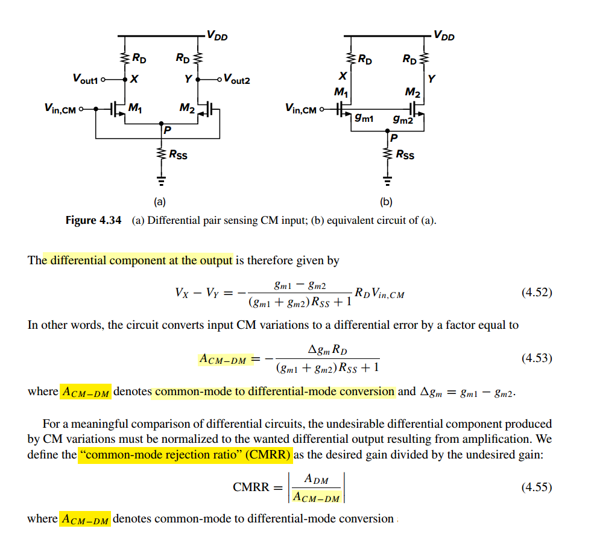
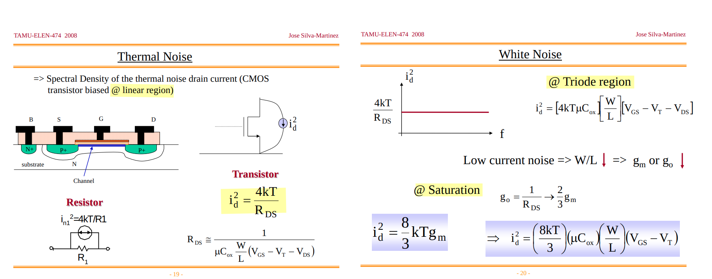
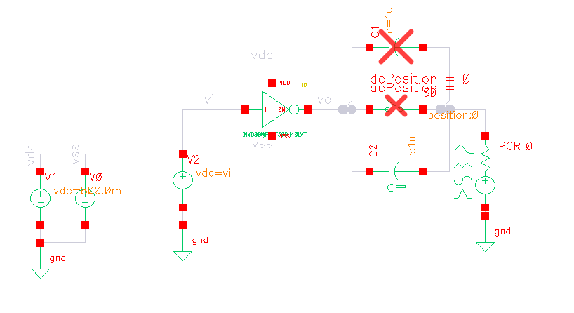

## Gain-boosted cascode

*TODO* &#128197;


## Zero-Value Time Constant Analysis

*TODO* &#128197;


## Transmission Gate

**Equivalent Resistance** is defined by **large signal**


> [[https://www.ece.ucdavis.edu/~ramirtha/EEC116/F11/TGlecture.pdf](https://www.ece.ucdavis.edu/~ramirtha/EEC116/F11/TGlecture.pdf)]


## latch borrowed time

> Kunal Saraswat [[link](https://www.linkedin.com/posts/kunalsaraswat_working-on-pd-timing-every-day-one-thing-activity-7417260020163166208-vnVd?utm_source=share&utm_medium=member_desktop&rcm=ACoAAD-cuiIBDJ62eh9q3qTSSdslYXr-XMd8TGw)]


## CMRR (Common-Mode Properties)



---


## MOS Thermal Noise

> Michael H. Perrott. Analysis and Design of Analog Integrated Circuits Lecture 14 Noise Spectral Analysis for Circuit Elements [[https://www.cppsim.com/CircuitLectures/Lecture14.pdf](https://www.cppsim.com/CircuitLectures/Lecture14.pdf)]


### Legacy Long-Channel Model


$$
\color{red} \overline{i^2_d} \propto \gamma \propto  \eta \propto \frac{1}{V_{DS}}
$$

> 

---

> [[https://www.eecg.toronto.edu/~johns/ece512/lecture_notes/04_noise_2_per_page.pdf](https://www.eecg.toronto.edu/~johns/ece512/lecture_notes/04_noise_2_per_page.pdf)]


---

> [[https://people.engr.tamu.edu/spalermo/ecen474/lecture12_ee474_noise.pdf](https://people.engr.tamu.edu/spalermo/ecen474/lecture12_ee474_noise.pdf)]




### Short-Channel Effects

> Gildenblat, G. S. (2010). Compact modeling : principles, techniques and applications. Springer.
>

***VDS Effect On Channel Noise***


$$
\color{red} \overline{i^2_d} \propto V_{DS}
$$


---

> K. Ohmori and S. Amakawa, "Direct White Noise Characterization of Short-Channel MOSFETs," in *IEEE Transactions on Electron Devices*, vol. 68, no. 4, pp. 1478-1482, April 2021 [[pdf](https://ieeexplore.ieee.org/stamp/stamp.jsp?tp=&arnumber=9366960), [slides](https://www.mos-ak.org/asia_pacific_2021/presentations/Ohmori_MOS-AK_ASP_2021.pdf)]


---

> X. Ding, G. Niu, A. Zhang, W. Cai and K. Imura, "Experimental Extraction of Thermal Noise γ Factors in a 14-nm RF FinFET technology," *2021 IEEE 20th Topical Meeting on Silicon Monolithic Integrated Circuits in RF Systems (SiRF)*, San Diego, CA, USA, 2021[[https://sci-hub.se/10.1109/SiRF51851.2021.9383331](https://sci-hub.se/10.1109/SiRF51851.2021.9383331)]


### NF50

*TODO* &#128197;


### $\gamma$ vs VDS, VGS in simulation

> *N28*


***fix VDS, sweep VGS***


***fix VGS, sweep VDS***


## MOS Flicker Noise

> T. Noulis, "CMOS process transient noise simulation analysis and benchmarking," 2016 26th International Workshop on Power and Timing Modeling, Optimization and Simulation (PATMOS), Bremen, Germany, 2016 [[https://sci-hub.ru/10.1109/PATMOS.2016.7833428](https://sci-hub.ru/10.1109/PATMOS.2016.7833428)]


> Dr. Thomas Gneiting, AdMOS GmbH. Flicker Noise Extraction for Scalable MOS Simulation Models [[https://www.mos-ak.org/premstaetten/papers/MOS-AK_T.Gneiting.pdf](https://www.mos-ak.org/premstaetten/papers/MOS-AK_T.Gneiting.pdf)]
>
> 


| Noise analysis ON,IN cfg                                     | input noise, noise gain, output noise                        |                  |
| ------------------------------------------------------------ | ------------------------------------------------------------ | ---------------- |
|  |  | i: Id<br />o: Vg |
|  |  | i: V5<br />o: Id |
|  |  | i: V1<br />o: Id |

Above simulation demonstrate that flicker noise  is ***represented by a drain-source current*** in BSIM model, however *modeled as a voltage source in series with the gate is just for calculating convenience*

> David Lee, Berkeley DA. *Device Noise Analysis of Switched-Cap Circuits* [[https://semiwiki.com/eda/2900-device-noise-analysis-of-switched-cap-circuits/](https://semiwiki.com/eda/2900-device-noise-analysis-of-switched-cap-circuits/)]
>
> 
>
> 
>
> ---
>
> Sam Palermo. Lecture 12: Noise. ECEN474: (Analog) VLSI Circuit Design Fall 2012 [[https://people.engr.tamu.edu/spalermo/ecen474/lecture12_ee474_noise.pdf](https://people.engr.tamu.edu/spalermo/ecen474/lecture12_ee474_noise.pdf)]
>
> 


---


> Notice, input referred noise unit follow output noise's unit


---

> 陈铖颖，杨丽琼，王统. CMOS模拟集成电路设计与仿真实例：基于CadenceADE. 电子工业出版社，2013


## MOS Shot Noise


## Gate-Referred Noise Lemma


## inverter capacitance simulation

### inverter input

R-C, ***series*** equivalent circuit


### inverter output

R-C, ***parallel*** equivalent circuit


---

***AC simulation***


@vi = 0


sweep vi from 0 to 800mV (vdd)


---

***SP simulation***




> EEStream. Cadence - How to find device capacitance - DC simulation, SP simulation and Large-signal SP simulation [[https://www.youtube.com/watch?v=M3zP6eJnONk](https://www.youtube.com/watch?v=M3zP6eJnONk)]
>
> 


## 50-ohm?

> Why is 50-ohm characteristic impedance standardized in RF and Microwave systems? [[link](https://community.cadence.com/cadence_technology_forums/f/awr-design-environment/62213/why-is-50-ohm-characteristic-impedance-standardized-in-rf-and-microwave-systems#:~:text=A%20loss%20vs.,all%20RF%20and%20Microwave%20systems)]
>
> [[https://www.microwaves101.com/encyclopedias/why-fifty-ohms](https://www.microwaves101.com/encyclopedias/why-fifty-ohms)]


 It was a compromise made and a tradeoff between ***power handling*** (red curve) and ***losses*** (blue curve)


## Gm Rout Lemma
$$
A_V = -G_m R_{out}
$$


## Relative Sensitivity

> Olivier de Weck, Karen Willcox. MIT, Gradient Calculation and Sensitivity Analysis [[pdf](https://ocw.mit.edu/courses/ids-338j-multidisciplinary-system-design-optimization-spring-2010/ce1a087c39ebe629ff93ed57686ada0a_MITESD_77S10_lec09.pdf)]
>
> Karti Mayaram, ECE 521 Fall 2016 Analog Circuit Simulation, Sensitivity and noise analyses [[https://web.engr.oregonstate.edu/~karti/ece521/lec16_11_09.pdf](https://web.engr.oregonstate.edu/~karti/ece521/lec16_11_09.pdf)]

Assuming Target  $T$ ( for example, the total resistance) is  function of $x_1,x_2,...,x_N$, then total variation can be expressed as

$$\begin{align}
dT  &= \sum_{n=1}^N\frac{\partial T}{\partial x_n}dx_n \\
&= \sum_{n=1}^N\frac{\partial T}{\partial x_n}x_n\cdot \frac{dx_n}{x_n}
\end{align}$$

Then, we obtain relative variation
$$\begin{align}
\frac{dT}{T} &= \sum_{n=1}^N\frac{\partial T}{\partial x_n}\frac{x_n}{T}\cdot \frac{dx_n}{x_n}  \\
&= \sum_{n=1}^N S_{x_n}^T \cdot \frac{dx_n}{x_n}
\end{align}$$

&#11088; where $S_{x_n}^T=\frac{\partial T}{\partial x_n}\frac{x_n}{T}$ is **relative sensitivity**

> **relative sensitivity** connect $\frac{dx_n}{x_n}$ with total relative variation $\frac{dT}{T}$


And $dT$ can be expressed as
$$
dT =\sum_{n=1}^N S_{x_n}^T T\cdot \frac{dx_n}{x_n} = \sum_{n=1}^N x_n'\cdot \frac{dx_n}{x_n}
$$
&#11088; where $x_n'= S_{x_n}^T T$ is the contribution of $x_n$ in $T$

&#11088; For parallel or series resistors, it can prove $\sum_{n=1}^N S_{x_n}^T = 1$ and $\sum_{n=1}^N x_n'=T$

---


Here $T= R_1 \parallel R_2 = \frac{R_1R_2}{R_1+R_2}$, and $T|_{R_1=8000, R_2=2000} = 1600$

We obtain *relative sensitivity:*
$$\begin{align}
S_{R_1}^T & = \frac{R_2}{R_1+R_2} \\
S_{R_2}^T & = \frac{R_1}{R_1+R_2}
\end{align}$$

The contribution of $R_1$ and $R_2$ to $T$
$$\begin{align}
R_1'  &= S_{R_1}^T  T | _{R_1=8000, R_2=2000} = 320 \\
R_2'  &= S_{R_2}^T  T | _{R_1=8000, R_2=2000} = 1280
\end{align}$$


---

**Normalized sensitivity** captures **relative sensitivity**

>  change in objective per change in design variable


## Device Current Components


## common gate amplifiers


> [[https://www.linkedin.com/posts/chembiyan-t-0b34b910_analog-analogdesign-rfdesign-activity-7126946716938878976-GeW6?utm_source=share&utm_medium=member_desktop](https://www.linkedin.com/posts/chembiyan-t-0b34b910_analog-analogdesign-rfdesign-activity-7126946716938878976-GeW6?utm_source=share&utm_medium=member_desktop)]


## Level Shifter


## TIA


$$\begin{align}
I_{in} &= \frac{V_i}{R_S} + \frac{V_i - V_o}{R_F} \\
\frac{V_i - V_o}{R_F} &= g_m V_i
\end{align}$$

Then

$$\begin{align}
V_o &= \frac{I_{in}R_F}{\frac{R_S+R_F}{R_S}\frac{1}{1-g_mR_F}- 1} \\
V_i &= \frac{I_{in}R_F}{\frac{R_F}{R_S}+g_mR_F}
\end{align}$$
If $R_S \gg R_F$
$$\begin{align}
V_o &= \frac{I_{in}}{g_m}(1-g_mR_F) \\
V_i &= \frac{I_{in}}{g_m} 
\end{align}$$

***linearity***
> TIA stage allows for improved gain with **better linearity**, as mostly signal current passes through $R_F$
*TODO* &#128197;
??? Quantitative analysis


## Switched-Capacitor Resistor

$$
R_{eq} = \frac{1}{f_sC}
$$


> [[https://youtu.be/SL3-9ZMwdJQ&t=1339](https://youtu.be/SL3-9ZMwdJQ&t=1339)]

## Channel-Length Modulation & Pinched off

- $\lambda \propto \frac{1}{L_g}$
- $\lambda \propto \frac{1}{V_{DS}}$


- If $V_{DS}$ is *slightly* greater than $V_{GS} - V_{TH}$, then the *inversion layer* stops at $x \leq L$, and we say the channel is "**pinched off**"
- Upon passing the pinchoff point, the electrons simply shoot through the depletion region near the drain junction and arrive at the drain terminal

> $L^{'}$ is the function of $V_{DS}$

with $\frac{1}{L^{'}} = \frac{1}{L-\Delta L}=\frac{L+\Delta L}{L^2-\Delta L^2}\approx \frac{1}{L}\left(1+\frac{\Delta L}{L}\right)$, we have
$$
I_D \approx \frac{1}{2}\mu_n C_{ox}\frac{W}{L}\left(1+\frac{\Delta L}{L}\right)(V_{GS}-V_{TH})^2 = \frac{1}{2}\mu_n C_{ox}\frac{W}{L}(V_{GS}-V_{TH})^2 (1+\lambda V_{DS})
$$
assuming  $\frac{\Delta L}{L} = \lambda V_{DS}$

> $\lambda$ represents the *relative* variation in length for a given increment in $V_{DS}$. Thus, for longer channels, $\lambda$ is smaller


---

In reality, however, $r_O$ varies with $V_{DS}$. As $V_{DS}$ *increases* and the pinch-off point moves toward the source, the *rate* at which the depletion region around the source becomes wider *decreases*, resulting in a *higher* incremental output impedance.


## Early Voltage indicator

$$
g_m r_o = \frac{g_m}{I_D}I_D \cdot \frac{V_A}{I_D} =  \frac{g_m}{I_D} \cdot V_A
$$

$g_m r_o $ is the indicator of $V_A$, if $\frac{g_m}{I_D}$ is same


## Cgd of Common-Source Stage

Miller effect of Cgd during *layout*


## Nonlinearity of Differential Circuits


> $$
> \cos^3\omega t = \frac{3\cos \omega t + \cos(3\omega t)}{4}
> $$

> 


## Zero in differential pair with active current mirror


Noting the circuit consists of a "slow path" (M1, M3, M4) in parallel with a "fast path" (M2)

- "slow path"
  $$
  H_\text{slow}(s) = \frac{A_0}{(1+s/\omega _{pE})(1+s/\omega _{pO})}
  $$

- "fast path"
  $$
  H_\text{fast}(s) = \frac{A_0}{1+s/\omega _{pO}}
  $$

Then
$$\begin{align}
\frac{V_\text{out}}{V_\text{in}} &= H_\text{slow}(s) + H_\text{fast}(s) \\
&= \frac{A_0}{1+s/\omega _{pO}}\left(\frac{1}{1+s/\omega _{pE}} + 1 \right) \\
&= \frac{A_0(1+s/2\omega _{pE})}{(1+s/\omega _{pO})(1+s/\omega _{pE})}
\end{align}$$

That is, the system exhibits a zero at $2\omega_{pE}$

---

signals traveling through *two paths* within an amplifier may cancel each other at one frequency, creating a *zero* in the transfer function


$$
\omega_z = \frac{(A_1+A_2)\omega_{p1}\omega_{p2}}{A_1\omega_{p1}+A_2\omega_{p2}}
$$
noting $\omega_{p1}\lt \omega_z \lt \omega_{p2}$


## "Zero" by Inspection

> a method to predict the existence of "zero" by inspection, based on the concept of *"Analog Phase Interpolation"*


*TODO* &#128197;


> Debashis Dhar, How to Recognize "Zero" by Inspection (Utilizing Analog Phase Interpolation) [[https://www.linkedin.com/posts/debashis-dhar-12487024_how-to-recognize-zero-by-inspection-activity-7163364364329160704-9qOq?utm_source=share&utm_medium=member_desktop](https://www.linkedin.com/posts/debashis-dhar-12487024_how-to-recognize-zero-by-inspection-activity-7163364364329160704-9qOq?utm_source=share&utm_medium=member_desktop)]


## Random offset

The dependence of offset voltage and current mismatches upon the overdrive voltage is similar to our
observations for corresponding *noise quantities*

### differential pair


In reality, since mismatches are independent statistical variables


> Above shows that the input transistors must be designed for *high gain* ($g_mr_o = \frac{2}{V_{OV}\lambda}$), which means they must be designed for *small* $V_{GS}-V_{TH}$.
>
> It is desirable to minimize $V_{GS}-V_{TH}$ by *lowering the tail current* or *increasing the transistor widths*

---

For $\frac{\Delta K}{K}$

$$\begin{align}
v_{os} g_m &= \Delta K \frac{W}{L}(V_{GS}-V_{TH})^2 \\
v_{os} 2K\frac{W}{L}(V_{GS}-V_{TH}) &= \Delta K \frac{W}{L}(V_{GS}-V_{TH})^2 \\
v_{os} &= \frac{V_{GS}-V_{TH}}{2} \frac{\Delta K}{K}
\end{align}$$

> The derivation for $\frac{\Delta W/L}{W/L}$ is same with $\frac{\Delta K}{K}$


---

**alternative derivation**

$$\begin{align}
\Delta V_\beta \cdot g_m &= \frac{\partial I_D}{\partial \beta} \Delta \beta \\
&= I_D \frac{\Delta \beta}{\beta}
\end{align}$$

That is $\Delta V_\beta = \frac{I_D}{g_m}\frac{\Delta \beta}{\beta}$

$$
\Delta V_R \cdot g_m R = I_D \cdot \Delta R 
$$

That is $\Delta V_R = \frac{I_D}{ g_m} \cdot \frac{\Delta R}{R}$

> [[https://electronicengineering.phd.upc.edu/en/courses-and-seminars/courses-materials/2008-2009/slides-makinwa-1](https://electronicengineering.phd.upc.edu/en/courses-and-seminars/courses-materials/2008-2009/slides-makinwa-1)]

---


### current mirror


> To minimize current mismatch, the overdrive voltage must be maximized, a trend opposite to that in differential pair.
>
> This is because as $V_{GS}-V_{TH}$ increases, threshold mismatch has a lesser effect on the device currents
>
> $\Delta I_D= g_m \Delta V_{TH} = \frac{2I_D}{V_{OV}}\Delta V_{TH}$


## Effect of Feedback on Noise

> Feedback does **not improve** the noise performance of circuits.


>The input-referred noise voltage and current remain the same if the feedback network introduces no noise.


## RC charge & discharge

- charge:
  $$
  V_o(t) = V_{X}(1-e^{-\frac{t}{\tau}}) + V_{o,0}\cdot e^{\frac{-t}{\tau}}
  $$

- discharge:
  $$
  V_o(t) = V_{o,0}\cdot e^{-\frac{t}{\tau}} + V_{o,\infty}\cdot(1-e^{-\frac{t}{\tau}})
  $$

> 1. $e^{-\frac{t}{\tau}}$ item determine the **initial state **
> 2. $(1-e^{-\frac{t}{\tau}})$ item determine the **final state**


## AC coupling

$V_m=\frac{1}{4},\space \frac{3}{4}$ and its common voltage $\frac{1}{2}$

$V_o=-\frac{1}{4},\space \frac{1}{4}$ and its common voltage $0$


---

$$
\tau = 200 \text{nF} \times (50+50)\text{ohm} = 20 \mu s
$$

high level envelope:


## Current mirror with source degeneration 


> Razavi 2nd, problem 14.15

## STB and PSTB in Spectre/RF

> F. Wiedmann, "Loop gain simulation, [[https://sites.google.com/site/frankwiedmann/loopgain](https://sites.google.com/site/frankwiedmann/loopgain)]
>
> M. Tian, V. Visvanathan, J. Hantgan and K. Kundert, "Striving for small-signal stability," in IEEE Circuits and Devices Magazine, vol. 17, no. 1, pp. 31-41, Jan. 2001 [[https://kenkundert.com/docs/cd2001-01.pdf](https://kenkundert.com/docs/cd2001-01.pdf)]
>
> Open loop gain analysis and "STB" method  [[https://www.linkedin.com/pulse/open-loop-gain-analysis-stb-method-jean-francois-debroux](https://www.linkedin.com/pulse/open-loop-gain-analysis-stb-method-jean-francois-debroux )]
>
> 刘堃. Middlebrook环路测量方法讨论，STB原理 [[https://bbs.eetop.cn/thread-985438-1-1.html](https://bbs.eetop.cn/thread-985438-1-1.html)]


### STB analysis

Spectre **stb**'s "loopgain" is negative of "T" in paper
$$
T = \frac{2(AD-BC) - A + D}{2(AD-BC)-A+D-1}
$$

AC simulation testbench, shown as below,


1. $I_{inj}$ = 0, $V_{inj}$ = 1

   B = if, D = ve

2. $I_{inj}$ = 1, $V_{inj}$ = 0

   A = if, C = ve

### PSTB analysis

Spectre **pstb** is similar to stb, just set **pac** as **1** instead of  **ac** in current source and voltage source.

This analysis just use **harmonic 0** transfer function in pac analysis, which has limitation.


## Thevenin and Norton Equivalent Circuits

### 戴维南定理


### 等效电阻的计算方法


> 使用**外加电源法**时， 全部独立电源需要置零

### 诺顿定理


## Miller's Approximation: right-half-plane zero


 A quick inspection of this circuit reveals that a **zero** lies at a frequency where the current through $C_{12}$ becomes equal to $g_2V_1$. 

When this occurs, the current through the parallel combination of $C_2$ and $R_2$ becomes zero, creating a zero in the transfer function. 

In other words, we can write

$$\begin{align}
g_2V_1 &= V_1sC_{12} \\
s &= \frac{g_2}{C_{12}}
\end{align}$$


## Nonoverlapping clock

**Classical**


**DWC**

> **C2PHIa** is important to ensure nonoverlapping and DelayA2B is due to level shifter


## Single ended Amplifier Offset Voltage

### unity gain buffer


$$\begin{align}
V_o &= V_{o,dc}+A(V_p-V_m) \\
V_o' &= V_{o,dc}+A(V_p+V_{os}-V_m')
\end{align}$$

Then, we get
$$
V_{os}=\frac{V_o'-V_o}{A}+(V_m'-V_m)
$$
Due to $V_o=V_m$ and $V_o'=V_m'$
$$
V_{os}=(1/A+1)\Delta{V_m}
$$
or
$$
V_{os}=(1/A+1)\Delta{V_o}
$$
if $A \gg 1$
$$
V_{os}=\Delta{V_o}
$$


### non-inverting amplifier


$$\begin{align}
V_o &= V_{o,dc}+A(V_p-V_m) \\
V_o' &= V_{o,dc}+A(V_p+V_{os}-V_m') \\
V_m &= \beta V_o \\
V_m' &= \beta V_o'
\end{align}$$

we get
$$
V_{os}=\frac{V_o'-V_o}{A}+(V_m'-V_m)
$$
or
$$
V_{os}=\frac{\Delta V_o}{A}+\beta \Delta V_o
$$
if $A \gg 1$
$$
V_{os}=\beta \Delta V_o
$$
or
$$
V_{os}=\Delta V_m
$$

---


**Lecture 22 Variability and Mismatch of Dr. Hesham A. Omran's Analog IC Design**


> URL: [https://www.master-micro.com/professional-courses/analog-ic-design/course-resources](https://www.master-micro.com/professional-courses/analog-ic-design/course-resources)


## Gotcha MOS ron

There is discrepancy between model operating point and $V_{ds}/I_{ds}$

I believe that the equation $V_{ds}/I_{ds}$ is more appropriate where mos is used as switch, though $V_{ds}=0$ is an outlier.


## Schmitt Inverter


## gm/ID Intuition


> small gm/ID for High ro,  or high Early voltage $V_A$


## Transit Frequency $f_T$

Defined as the frequency at which the **small-signal current gain** of a device is **unity**


---


---


*mag(Ids@ft) = Ig(1mA)*


> Aditya Varma Muppala. MMIC 08: High Frequency Device Characterization in Cadence - Fmax, Ft, NFmin vs Jd [[https://youtu.be/kgEypIA8eus](https://youtu.be/kgEypIA8eus)]

---


##  ZTC Bias Points

>  M. Coelho *et al*., "Is There a ZTC Biasing Point in the Leading-Edge FET Intrinsic Gain gmrDS?," *2025 9th International Young Engineers Forum on Electrical and Computer Engineering (YEF-ECE)*, Caparica / Lisbon, Portugal, 2025
>
>  M. Coelho *et al*., "Analysis of the ZTC Bias Points in the FinFET Gate Capacitance and Transition Frequency," *2025 37th International Conference on Microelectronics (ICM)*, Cairo, Egypt, 2025, pp. 1-6, doi: 10.1109/ICM66518.2025.11322461

there's a specific bias point where the MOSFET transition frequency (fT) becomes almost temperature‑independent


## MOM cap of wo_mx

Monte Carlo model:

- $C_{pa}=C_{pa1}$, $C_{pb}=C_{pb1}$ for each iteration during *Process Variation*
- different variation is applied to $C_{ab}$ and $C_{a1b1}$ each iteration during *Mismatch Variation*, though $C_{pa}$, $C_{pb}$, $C_{pa1}$ and $C_{pb1}$ remain constant


## Miller multiplication of Capacitor

### Positive Cap 


### Negative Cap

 


---

gain has **limited** bandwidth


$V_o = V_i |A|e^{j\theta}$, and $A_r = |A|\cos\theta$, $A_i = |A|\sin\theta$

Then $I_i = (V_i - V_o)sC_f= V_i(1-|A|e^{j\theta})sC_f$, impedance is shown as below

$$\begin{align}
Z &= \frac{V_i}{I_i} \\
&= \frac{1}{(1-|A|e^{j\theta})j\omega C_f} \\
&= -\frac{j}{\omega C_f\frac{1+|A|^2-2|A|\cos\theta}{1-|A|\cos\theta}} + \frac{|A|\sin\theta}{\omega C_f (1+|A|^2-2|A|\cos\theta)} \\
\end{align}$$

$C_\text{eq}$ and $R_\text{eq}$ are obtained
$$\begin{align}
C_\text{eq} &= \frac{1+|A|^2-2A_r}{1-A_r}\cdot C_f \\
R_\text{eq} &= \frac{A_i}{1+|A|^2-2A_r}\cdot \frac{1}{\omega C_f}
\end{align}$$


## D/S small signal model


> The `Drain` and `Source` of MOS are determined in *DC operating point*, i.e. large signal. 

That is, top of $M_2$ is `drain` and bottom is `source`,
$$\begin{align}
R_\text{eq2} &= \frac{r_\text{o2}+R_L}{1+g_\text{m2}r_\text{o2}} \\
& \simeq  \frac{1}{g_\text{m2}}
\end{align}$$


## PMOS small signal model polarity

> The small-signal models of NMOS and PMOS transistors are **identical**

A negative $\Delta V_\text{GS}$ leads to a negative $\Delta I_D$. 

> Recall that $I_D$, in the direction shown here, is negative because the actual current of holes flows from the source to the drain.
>
> 
>
> 

Conversely, a positive $\Delta V_\text{GS}$ produces a positive $\Delta I_D$, as is the case for an NMOS device.


## Leakage in MOS

> Alvin L.S. Loke. 2004. Introduction to Deep Submicron CMOS Device Technology & Its Impact on Circuit Design [[https://ewh.ieee.org/r5/denver/sscs/Presentations/2004_12_Loke.pdf](https://ewh.ieee.org/r5/denver/sscs/Presentations/2004_12_Loke.pdf)]


- Subthreshold leakage
  - Drain-Induced Barrier Lowering (**DIBL**)
- Reverse-bias Source/Drain junction leakages
- Gate leakage
- two other leakage mechanisms
  - Gate Induced Drain Leakage (**GIDL**)
  - Punchthrough


> W. M. Elgharbawy and M. A. Bayoumi, "Leakage sources and possible solutions in nanometer CMOS technologies," in IEEE Circuits and Systems Magazine, vol. 5, no. 4, pp. 6-17, Fourth Quarter 2005, doi: 10.1109/MCAS.2005.1550165.
>
> X. Qi et al., "Efficient subthreshold leakage current optimization - Leakage current optimization and layout migration for 90- and 65- nm ASIC libraries," in IEEE Circuits and Devices Magazine, vol. 22, no. 5, pp. 39-47, Sept.-Oct. 2006, doi: 10.1109/MCD.2006.272999.
>
> P. Monsurró, S. Pennisi, G. Scotti and A. Trifiletti, "Exploiting the Body of MOS Devices for High Performance Analog Design," in IEEE Circuits and Systems Magazine, vol. 11, no. 4, pp. 8-23, Fourthquarter 2011, doi: 10.1109/MCAS.2011.942751.
>
> Andrea Baschirotto, ISSCC2015 "ADC Design in Scaled Technologies"
>
> Joachim Assenmacher Infineon Technologies, "BSIM4 Modeling and Parameter Extraction" [[https://ewh.ieee.org/r5/denver/sscs/References/2003_03_Assenmacher.pdf](https://ewh.ieee.org/r5/denver/sscs/References/2003_03_Assenmacher.pdf)]
>
> Stefan Rusu, Intel ISSCC 2008 Tutorial: "Leakage Reduction Techniques" [[https://www.nishanchettri.com/isscc-slides/2008%20ISSCC/Tutorials/T06_Pres.pdf](https://www.nishanchettri.com/isscc-slides/2008%20ISSCC/Tutorials/T06_Pres.pdf)]


### Drain-Induced Barrier Lowering (DIBL)


As a result of DIBL, **threshold voltage is reduced** with shorter channel lengths and, consequently, the subthreshold leakage current is increased


***impact on output impedance***

The principal impact of DIBL on circuit design is the degraded output impedance.

> In short-channel devices, as $V_{DS}$ increases further, drain-induced barrier lowering becomes significant, *reducing the threshold voltage* and increasing the drain current


> Impact Ionization and GIDL are *different*, however both *increase* drain current, which flowing from the drain into the substrate


### Gate induced drain leakage (GIDL)


 The large current flows from the *drain to bulk* and  this drain leakage current is named **gate-induced drain leakage (GIDL)** since it is due to *a gate-induced high electric field present in the gate-to-drain overlap region*

> gate-induced drain leakage (GIDL) increases exponentially due to the reduced gate oxide thickness


> Chauhan, Yogesh Singh, et al. *FinFET modeling for IC simulation and design: using the BSIM-CMG standard*. Academic Press, 2015.

---


$$
\frac{g_m}{I_D} = \frac{2}{V_{GS}-V_{TH}}
$$
Decrease of gm/Id results from decrease in VT.  

GIDL (**Gate induced drain leakage**) as at weak inversion may results in a weak lateral electric field causing leakage current between drain and bulk, which degrade the efficiency of the transistor (gm/ID).


> [[https://www.linkedin.com/posts/master-micro_mastermicro-mastermicro-adt-activity-7214549962833989632-ZoV_?utm_source=share&utm_medium=member_desktop](https://www.linkedin.com/posts/master-micro_mastermicro-mastermicro-adt-activity-7214549962833989632-ZoV_?utm_source=share&utm_medium=member_desktop)]


### Voltage Dependence


### Temperature Dependence


---

In advanced node, gate leakage is also a strong function of temperature


## Power/Ground and I/O Pins

### Power / Ground Pin Information

In both digital and analog I/O, power and ground pins appear at the sub-circuit definiton, allowing user to use the I/O in voltage islands. They follow certain naming conventions.

1. digital I/O sub-circuit

- VDD: pre-driver core voltage (supplied by PVDD1CDGM)
- VSS: pre-driver ground and also global ground (supplied by PVDD1CDGM)
- VDDPST: I/O post-driver voltage, i.e. 1.8V (supplied by PVDD2CDGM or PVDD2POCM)
- VSSPOST: I/O post-driver ground (supplied by PVDD2CDGM or PVDD2POCM)
- POCCTRL: POCCTRL signal (supplied by PVDD2POCM)

2. analog I/O placed in a core voltage domain, the convention is

- TACVDD: analog core voltage (supplied by PVDD3ACM)
- TACVSS: analog core ground (supplied by PVDD3ACM)
- VSS: global core ground

3. analog I/O placed in an I/O voltage domain, the convention is:

- TAVDD: analog I/O voltage, i.e. 1.8V (supplied by PVDD3AM)
- TAVSS: analog I/O ground (supplied by PVDD3AM)
- VSS: global core ground

Power/Ground **Combo Cells**

| power/ground combo pad cell | pins to be connected to bump | to core side pin name |
| --------------------------- | ---------------------------- | --------------------- |
| PVDD1CDGM                   | VDD VSS                      | VDD VSS               |
| PVDD2CDGM PVDD2POCM         | VDDPST VSSPST                | N/A                   |
| PVDD3AM                     | TAVDD TAVSS                  | AVDD AVSS             |
| PVDD3ACM                    | TACVDD TACVSS                | AVDD AVSS             |

### Note for the retention mode

1. At initial state, IRTE must be **0** when VDD is off.
2. IRTE must be kept >= 10us after VDD turns on again (from the retention mode to the normal operation mode).
3. IRTE can be switched only when both VDD and VDDPST are on.


When the rention function is needed, IRTE signal must come from an "always-on" core power domain. If you don't need the rention function, it is required to tie IRTE to ground. In other words, **no matter the rention feature is needed or not, it is required to have PCBRTE in each domain**.


**Note**: PCBRTE **does not** need PAD connection.

### Internal Pins

There are 3 internal global pins, i.e. **ESD**, **POCCTRL**, **RTE**, in all digital domain cells. 

In real application, 

- **ESD pin** is an internal signal and **active** in ESD event happening
- **POCCTRL** is an internal signal and active in Power-on-control event.

However, these special events (i.e. ESD event and Power-on-control event) are not modeled in NLDM kit (.lib), only normal function is covered, so **ESD** and **POCCTRL** pins are simply defined as ground in NLDM kit (.lib).

> These 3 global pins will be connected automatically after **cell-to-cell abutting** in physical layout.

### Power-Up sequence in Digital Domain

Power up the I/O power (VDDPST) first, then the core power (VDD)


1. PVDDD2POCM cell would generate Power-On-Control signal (POCCTRL) to have the post-driver NMOS and PMOS off, so that the crowbar current would not occur in the post-driver fingers when the I/O voltage is on while the core voltage remains off. As such, I/O cell would be in the Hi-Z state. when POCCTRL is on, the pll-up/down resistor is disabled and C is 0.
2. The POCCTRL signal is transmitted to I/O cells through **cell abutment**. There is no need to have routing for POCCTTRL nor give a control signal to the POCCTRL pin any of I/O cells. Note that the POCCTRL signal would be cut if inserting a power-cut (PRCUT)  cell.


### Power-Down sequence in Digital Domain

It's the reverse of power-up sequence.

### Use model in Innovus

```tcl
set init_gnd_net "vss_core vss DUMMY_ESD DUMMY_POCCTRL"

addInst -moduleBased u_io -ori R270 -physical -status fixed -loc 135 994 -inst u_io/VDDIO_1 -cell PVDD2CDGM_H

addNet u_io_RTE
attachTerm FILLER_6 RTE u_io_RTE
attachTerm VDDIO_1 RTE u_right_RTE
setAttribute -skip_routing true -net u_io_RTE

clearGlobalNets
globalNetConnect DUMMY_POCCTRL -type pgpin -pin POCCTRL -singleInstance u_io/VDDDIO_1 -override
globalNetConnect DUMMY_ESD -type pgpin -pin ESD -singleInstance u_io/VDDDIO_1 -override
```

```tcl
set pins [get_object_name [get_ports *]]
foreach pin $pins {
	set netPtr [dbGetNetByName $pin]
	if { $netPtr == "0x0" } {
		puts "INFO: can't find the port: $pin"
	} else {
		setAttribute -net $pin -skip_routing true
	}
}

foreach net [get_object_name [get_nets -of_objects [get_pins */RTE -hierarchical]]] {
	setAttribute -net $net -skip_routing true
	dbSet [dbGetNetByName $net].dontTouch true
}
```


## reference

The Analog Designer's Toolbox (ADT) | Invited Talk by IEEE Santa Clara Valley Section CAS Society, [https://youtu.be/FT6kKC5OdE0](https://youtu.be/FT6kKC5OdE0)

ESSCIRC2023 Circuit Insights Ali Sheikholeslami [[https://youtu.be/2xFIZM5_FPw](https://youtu.be/2xFIZM5_FPw)]

Ali Sheikholeslami, Circuit Intuitions: Thevenin and Norton Equivalent Circuits, Part 3 IEEE Solid-State Circuits Magazine, Vol. 10, Issue 4, pp. 7-8, Fall 2018. 

—, Circuit Intuitions: Thevenin and Norton Equivalent Circuits, Part 2 IEEE Solid-State Circuits Magazine, Vol. 10, Issue 3, pp. 7-8, Summer 2018. 

—, Circuit Intuitions: Thevenin and Norton Equivalent Circuits, Part 1 IEEE Solid-State Circuits Magazine, Vol. 10, Issue 2, pp. 7-8, Spring 2018.

—, Circuit Intuitions: Miller's Approximation IEEE Solid-State Circuits Magazine, Vol. 7, Issue 4, pp. 7-8, Fall 2015. 

—, Circuit Intuitions: Miller's Theorem IEEE Solid-State Circuits Magazine, Vol. 7, Issue 3, pp. 8-10, Summer 2015.

Shanthi Pavan, "Demystifying Linear Time Varying Circuits"

ecircuitcenter. Switched-Capacitor Resistor [[http://www.ecircuitcenter.com/Circuits/SWCap/SWCap.htm](http://www.ecircuitcenter.com/Circuits/SWCap/SWCap.htm)]

Jørgen Andreas Michaelsen. INF4420 Switched-Capacitor Circuits. [[https://www.uio.no/studier/emner/matnat/ifi/INF4420/v13/undervisningsmateriale/inf4420_v13_07_switchedcapacitor_print.pdf](https://www.uio.no/studier/emner/matnat/ifi/INF4420/v13/undervisningsmateriale/inf4420_v13_07_switchedcapacitor_print.pdf)]

chembiyan T. OC Lecture 10: A very basic introduction to switched capacitor circuits [[https://youtu.be/SaYtemYp4rQ](https://youtu.be/SaYtemYp4rQ)

Robert Bogdan Staszewski, Poras T. Balsara. "All‐Digital Frequency Synthesizer in Deep‐Submicron CMOS"

Mayank Parasrampuria, Sandeep Jain, Burn-in 101 [[link](https://www.edn.com/burn-in-101/)]

---

Kevin Zheng. Circuit Artists [[https://circuit-artists.com/posts/](https://circuit-artists.com/posts/)]
