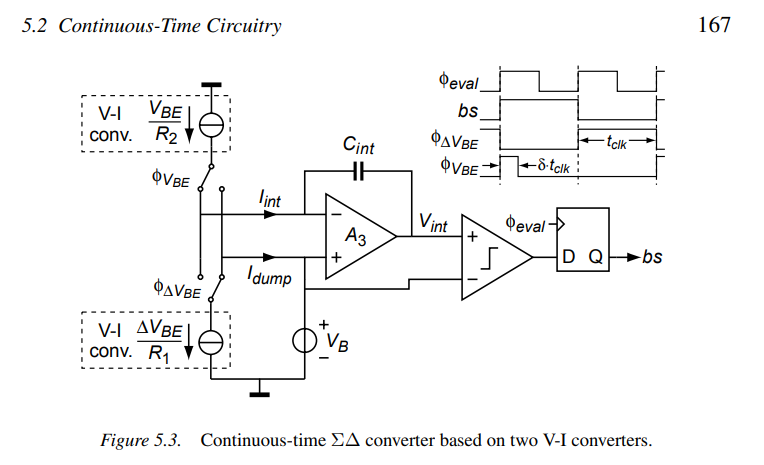

### application in sensor

#### Offset Errors
The offset of opamp $A_3$ is **much less critical**:

1.  It affects the integrated currents via the finite output impedances $R_{out1,2}$ of the V-I converters, and is therefore attenuated by a factor $R_{out1}/R_1$ when referred back to the input of the sinking V-I converter, 

2. or by a factor $R_{out2}/R_2$ when referred back to the input of the sourcing V-I converter. 

Therefore, no special offset cancellation is needed for opamp $A_3$.

The current change due to offset of $A_3$:
$$\begin{align}
\frac{V_{BE,os}}{R_1} &= \frac{V_{ota,os}}{R_{out1}} \\
\frac{\Delta V_{BE,os}}{R_2} &= \frac{V_{ota,os}}{R_{out2}} 
\end{align}$$
Then, the input referenced offset is:
$$\begin{align}
V_{BE,os} &=\frac{ V_{ota,os}}{R_{out1}/R_1} \\
\Delta V_{BE,os} &= \frac{ V_{ota,os}}{R_{out2}/R_2}
\end{align}$$

#### Errors due to Finite Gain

Finite gain of opamp $A_3$ results in a non-zero overdrive voltage at its input, which modulates the current Iint due to the finite output impedances of the V-I converters. 

Assuming the opamp is implemented as a **transconductance amplifier**, there are two main causes of this non-zero overdrive voltage

1. The finite transconductance $g_{m3}$ of the opamp, , which implies that an overdrive voltage is required to provide the **feedback current**

​	The change in the integrated current

​	$$\begin{align}
​	\Delta I_{int} &= \frac{V_{i,ota}}{R_{out}}\\
​	&= \frac{I_{int}}{g_{m3}}\cdot \frac{1}{R_{out}}
​	\end{align}$$

2. The finite DC gain $A_{0,3}$, which implies that an overdrive voltage is required to produce the **output voltage** $V_{int}$

### reference

Micheal, A., P., Pertijs., Johan, H., Huijsing., Pertijs., Johan, H., Huijsing. (2006). Precision Temperature Sensors in CMOS Technology.
