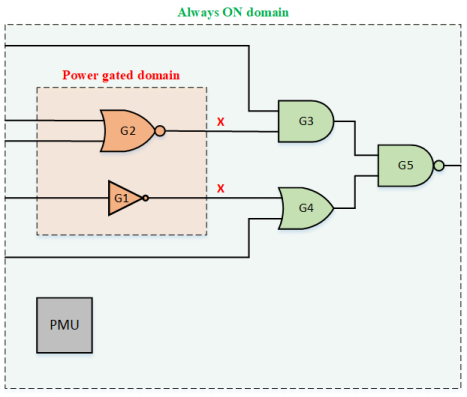
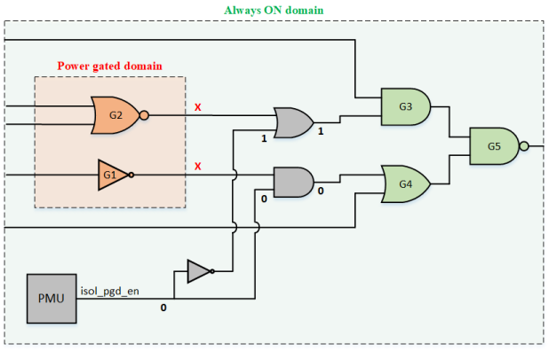
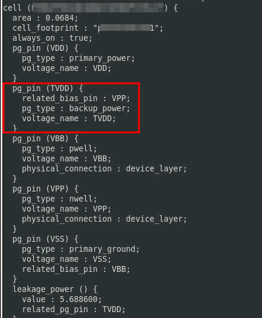
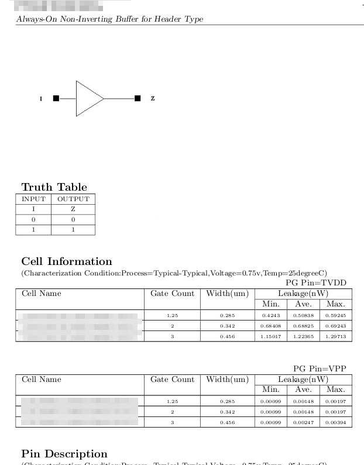
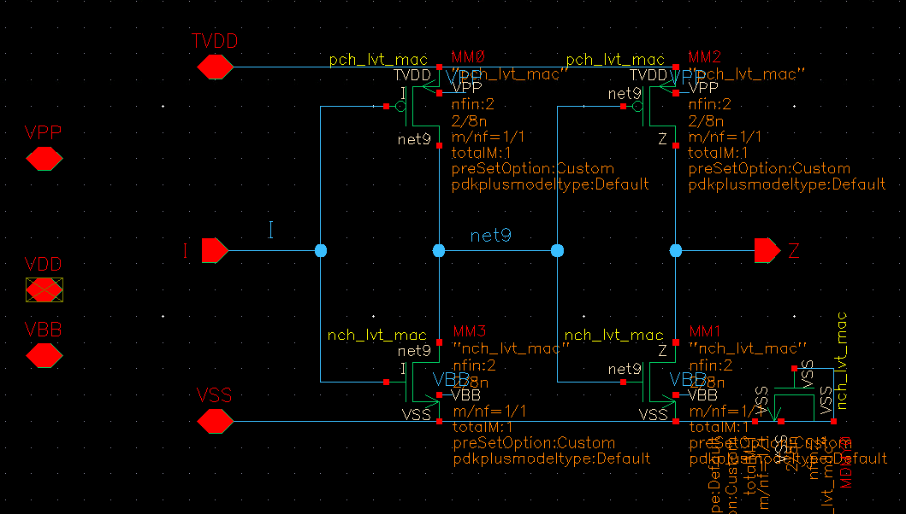

Isolation cells are additional cells inserted by the synthesis tools for isolating the buses/wires crossing from **power-gated domain** of a circuit to its always-on domain (**AON**). 

> To prevent corruption of always-on domain, we clamp the nets crossing the power domains to a value depending upon the design.

*A simple circuit having a switchable (or gated) power domain*

*The circuit shown in Figure 1, after isolation cells are inserted*

### Always-On Buffer

### reference

Isolation cells and Level Shifter cells URL: [https://vlsitutorials.com/isolation-cells-level-shifter-cells-low-power-vlsi/](https://vlsitutorials.com/isolation-cells-level-shifter-cells-low-power-vlsi/)
