**Jitter amplification** arises from the *transfer characteristic of the clock path*, without considering other jitter sources, such as supply noise or thermal noise of the buffer


## transient noise and rms_jitter function

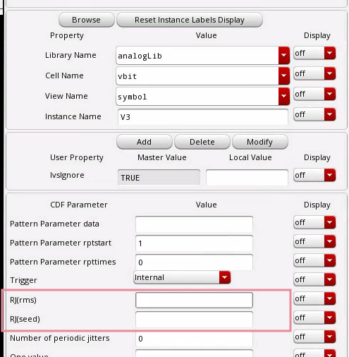

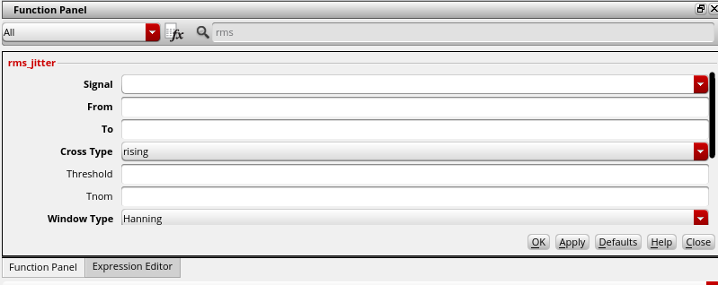

> `RJ(rms)`: single Edge or Both Edge?
>
> `RJ(seed)`: what is it?


## phase noise method

Directly compare the input phase noise and output phase noise, the input waveform maybe is the PLL output or other clock distribution end point


## Jitter Impulse Response & Jitter Transfer Function

> assuming *linear, time-invariant phase response*
>
> 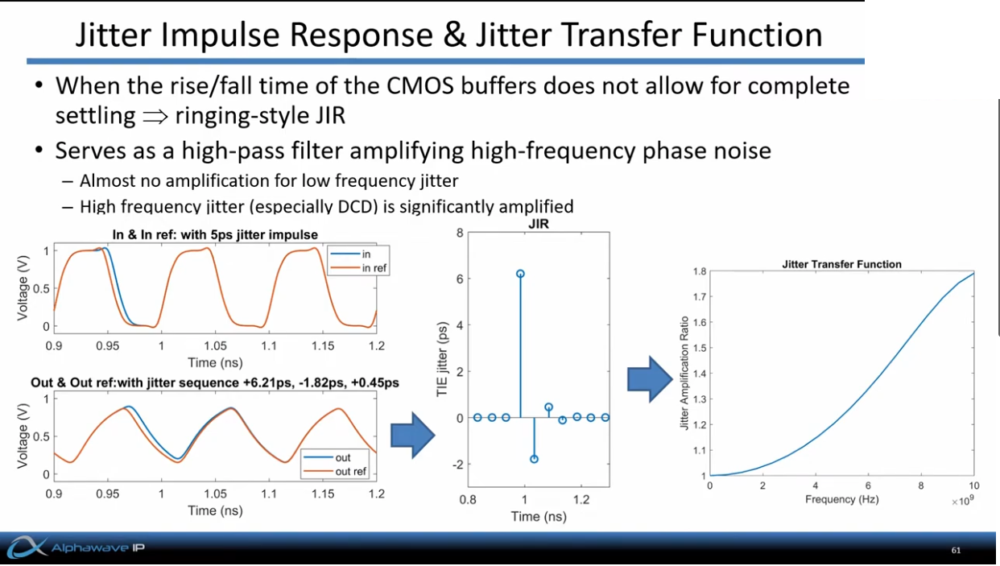
>
> n =5 buffers, fclk = 10GHz
>
> [[Alphawave’s CTO, Tony Chan Carusone, High Speed Communications Part 8 – On Die CMOS Clock Distribution ](https://youtu.be/nx5CiHcwrF0?si=QhOJmsW5IozRnF4F)]


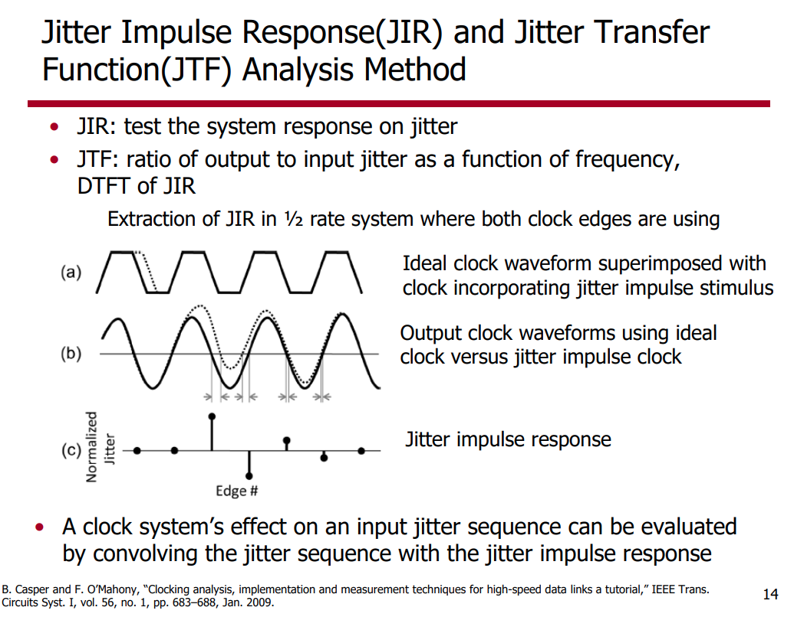

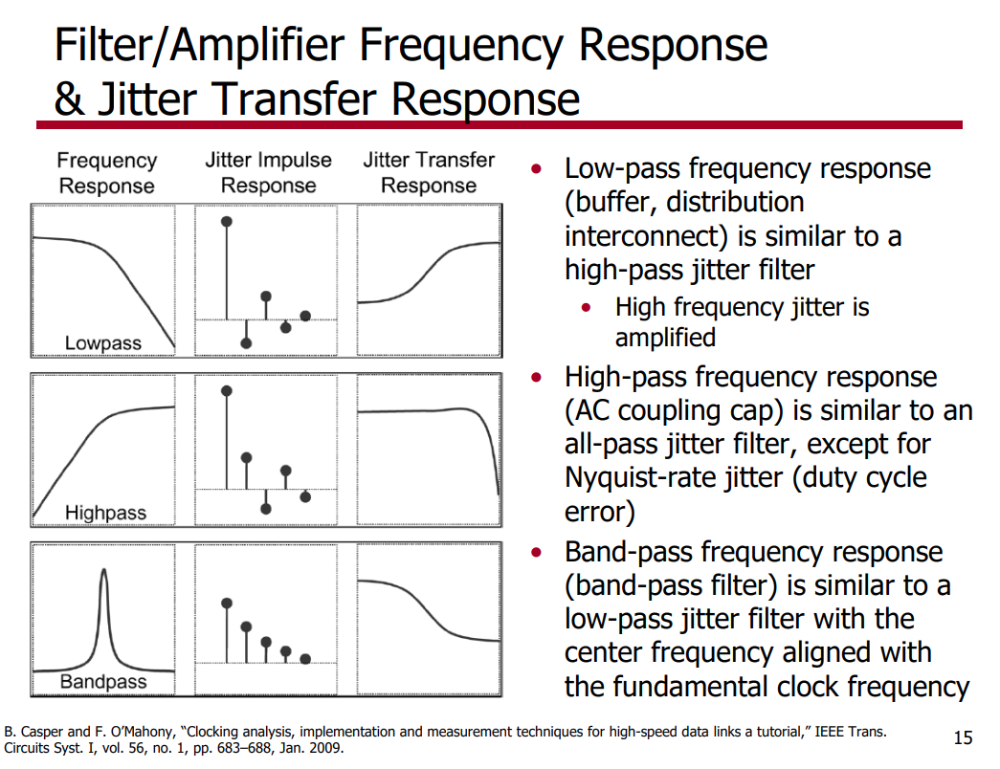


### Example
#### Low Pass Filter

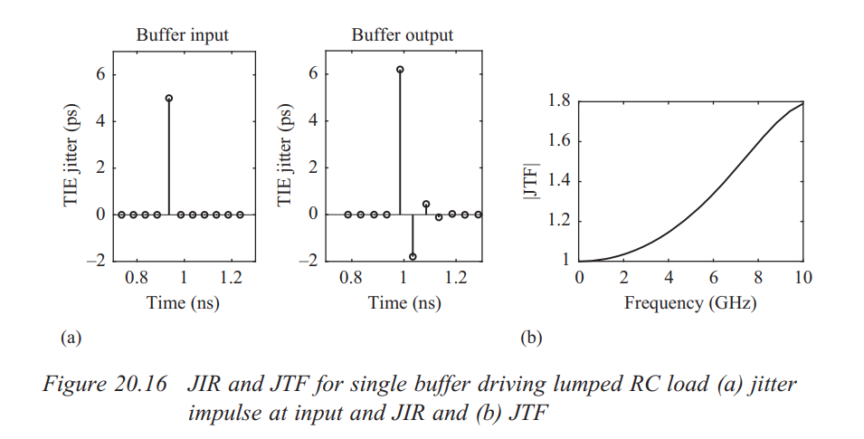

```matlab
N = 32;
x = zeros(N,1);
x(1) = 6;
x(2) = -2;
x(3) = 0.5;
x = x/5;
figure(1)
stem(x)
Y = fft(x, N);
figure(2)
plot(abs(Y(1:N/2)));
```

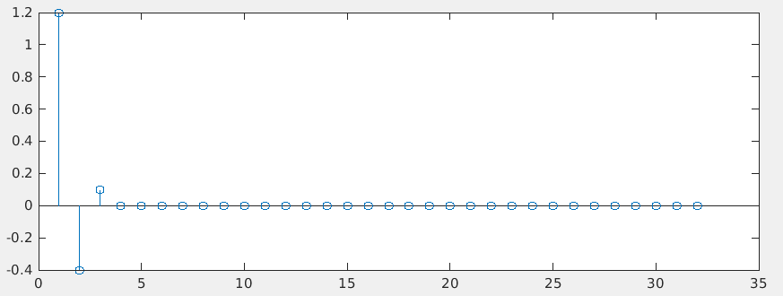

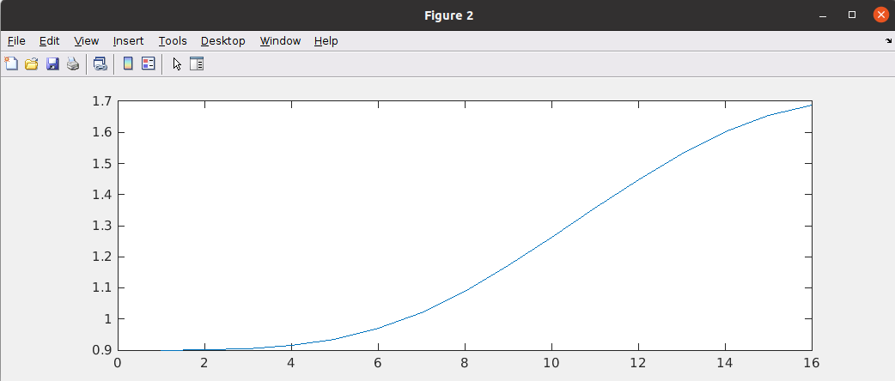

> discrete time jitter impulse response
> 
> both input and output are discrete time signal, i.e. no sampling in the input, that's why ratio $1/T_s$ is not in the jtf

#### High Pass Filter

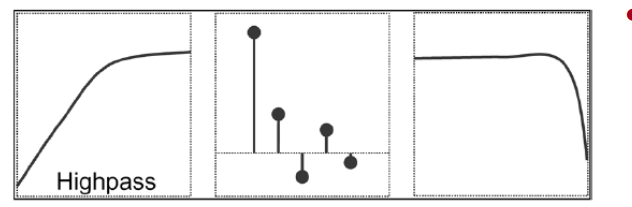

```matlab
N = 128;
j_hp = zeros(N, 1);
j_hp(1)= 1;
j_hp(2) = 0.5;
j_hp(3) = -0.3;
j_hp(4) = 0.3;
j_hp(5) = -0.1;
jtf_hp = abs(fft(j_hp));
semilogx(jtf_hp(1:N/2+1));
xlabel('Freq');
ylabel('Jitter Amplification Factor');
grid on;
```

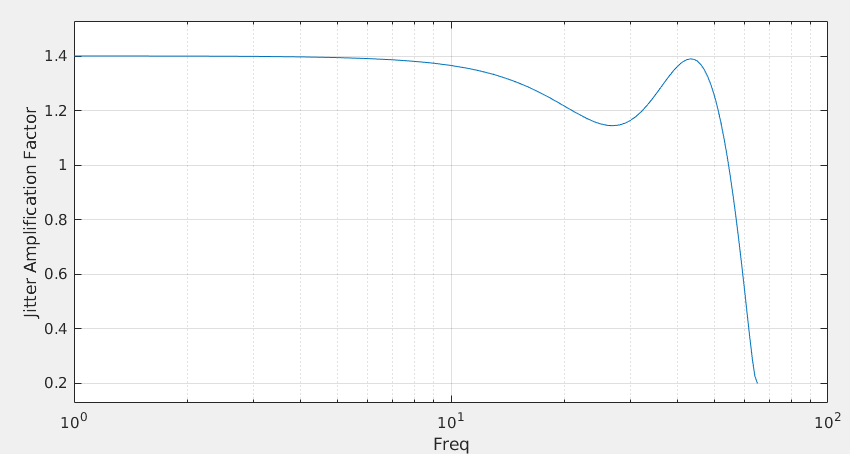

### inverter chain

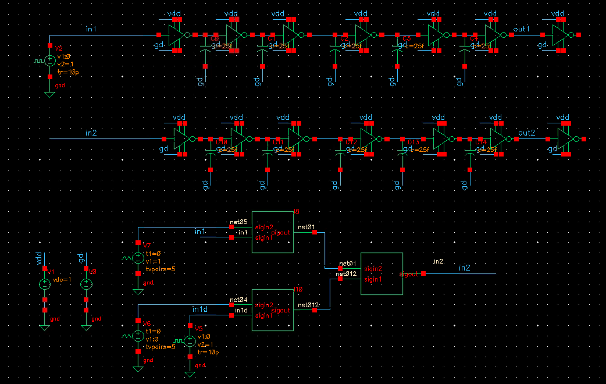

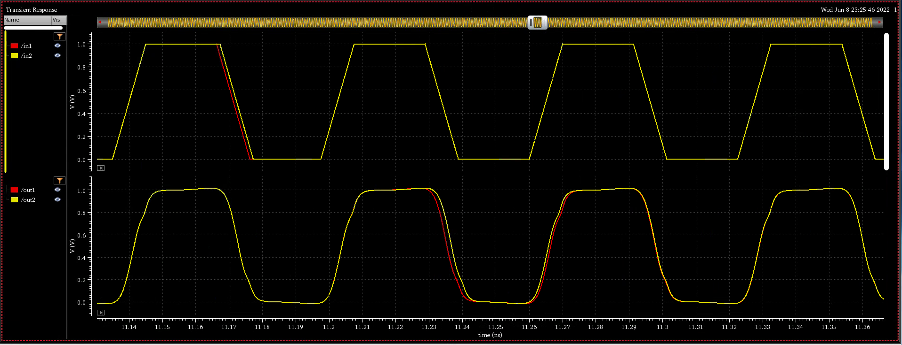

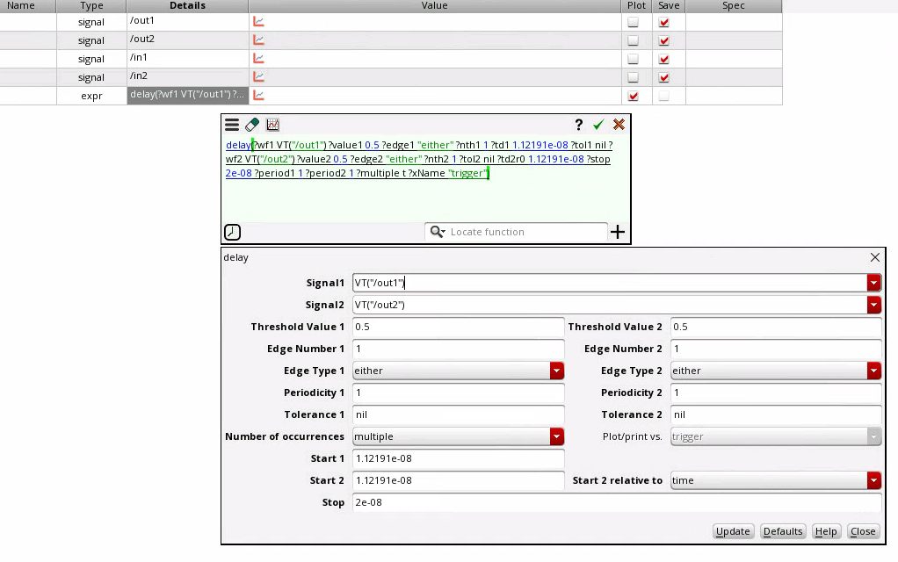

```matlab
ji = 1e-12; % 1ps
data = importdata('/path/to/jir.csv');
jo = data.data(:, 2);
Ts = 31.25e-12;
Fs = 1/Ts;
jir = jo/ji;
N = 2^(nextpow2(length(jir)-1));
Y = fft(jir, N);
jtf = abs(Y(1:N/2+1));
freqs= Fs/N*(0:N/2);
plot(feqs/1e9, jtf, 'linewidth', 2);
grid on;
xlabel('Freq (GHz)');
ylabel('JTF');
title('JTF of inverter chain');
```

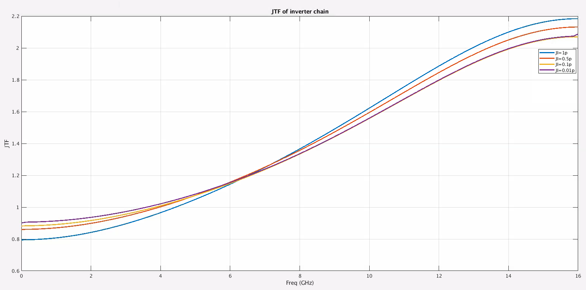


## Phase Noise Integration Limits

> 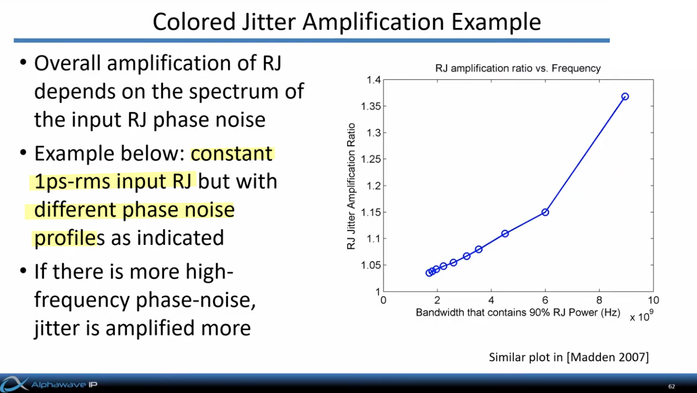
>
> [[Alphawave’s CTO, Tony Chan Carusone, High Speed Communications Part 8 – On Die CMOS Clock Distribution ](https://youtu.be/nx5CiHcwrF0?si=QhOJmsW5IozRnF4F)]

> 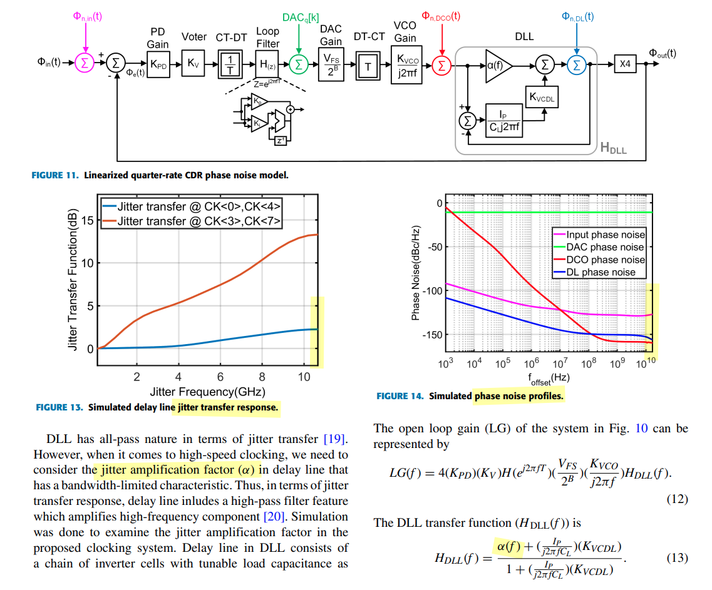
>
> Four major noise sources are included in the modeling: Input noise, DAC quantization noise (DAC QN), DCO random noise (DCO RN), and delay line random noise (DL RN).
>
> H. Kang *et al*., "A 42.7Gb/s Optical Receiver with Digital CDR in 28nm CMOS," *2023 IEEE Radio Frequency Integrated Circuits Symposium (RFIC)*, San Diego, CA, USA, 2023 [[https://ieeexplore.ieee.org/stamp/stamp.jsp?arnumber=10630516](https://ieeexplore.ieee.org/stamp/stamp.jsp?arnumber=10630516)]


## Reference

[Sam Palermo, ECEN 720, Lecture 13 - Forwarded Clock Deskew Circuits](https://people.engr.tamu.edu/spalermo/ecen689/lecture13_ee720_fwd_clk_deskew.pdf)

B. Casper and F. O'Mahony, "Clocking Analysis, Implementation and Measurement Techniques for High-Speed Data Links-A Tutorial," in IEEE Transactions on Circuits and Systems I. [[https://people.engr.tamu.edu/spalermo/ecen689/clocking_analysis_hs_links_casper_tcas1_2009.pdf](https://people.engr.tamu.edu/spalermo/ecen689/clocking_analysis_hs_links_casper_tcas1_2009.pdf)]

Phase-Locked Frequency Generation and Clocking : Architectures and Circuits for Modern Wireless and Wireline Systems by Woogeun Rhee (2020, Hardcover) 

Mathuranathan Viswanathan, Digital Modulations using Matlab : Build Simulation Models from Scratch

Tony Chan Carusone, University of Toronto, Canada, 2022 CICC Educational Sessions "Architectural Considerations in 100+ Gbps Wireline Transceivers"

X. Mo, J. Wu, N. Wary and T. Chan Carusone, "Design Methodologies for Low-Jitter CMOS Clock Distribution," in IEEE Open Journal of the Solid-State Circuits Society, 2021 [[https://ieeexplore.ieee.org/stamp/stamp.jsp?arnumber=9559395](https://ieeexplore.ieee.org/stamp/stamp.jsp?arnumber=9559395)]

Modeling Oscillators with Arbitrary Phase Noise Profiles [[https://community.cadence.com/cadence_blogs_8/b/rf/posts/modeling-oscillators-with-arbitrary-phase-noise-profiles](https://community.cadence.com/cadence_blogs_8/b/rf/posts/modeling-oscillators-with-arbitrary-phase-noise-profiles)]

Y. Zhao and B. Razavi, "Phase Noise Integration Limits for Jitter Calculation," *2022 IEEE International Symposium on Circuits and Systems (ISCAS)*, Austin, TX, USA, 2022 [[https://www.seas.ucla.edu/brweb/papers/Conferences/YZ_ISCAS_22.pdf](https://www.seas.ucla.edu/brweb/papers/Conferences/YZ_ISCAS_22.pdf)]