Jitter separation lets you learn if the components of jitter are random or deterministic. That is, if they are caused by crosstalk, channel loss, or some other phenomenon. The identification of jitter and noise sources is critical when debugging failure sources in the transmission of high-speed serial signals

- Tail Fit Method
- Spectral method

| RJ Extraction Methods | Rationale                                                    |
| --------------------- | ------------------------------------------------------------ |
| Spectral              | Speed/Consistency to Past Measurements;<br />Accuracy in low Crosstalk or Aperiodic  Bounded Uncorrelated Jitter (ABUJ) conditions |
| Tail Fit              | General Purpose;<br />Accuracy in high Crosstalk or ABUJ conditions |

## Jitter Components

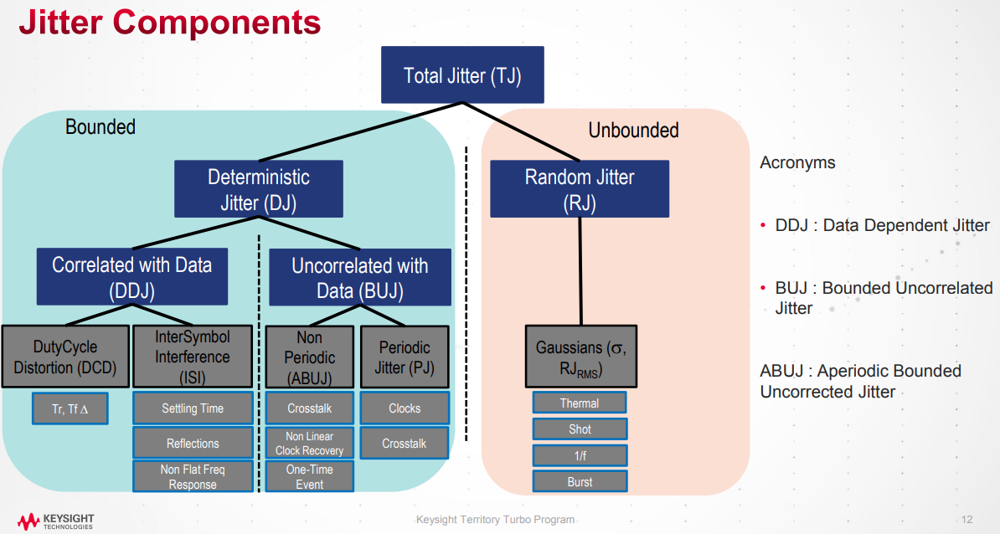


## dual-Dirac model

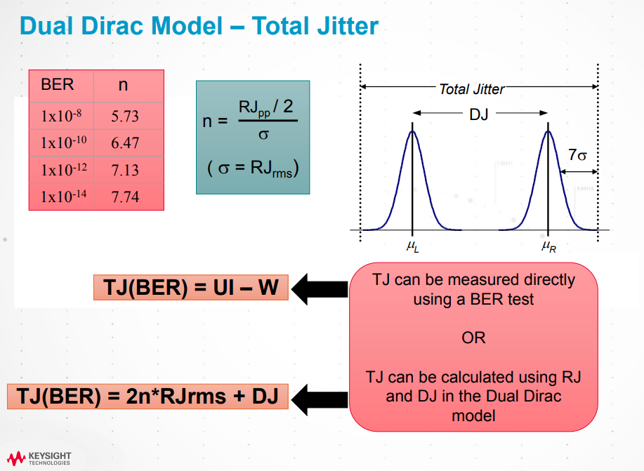

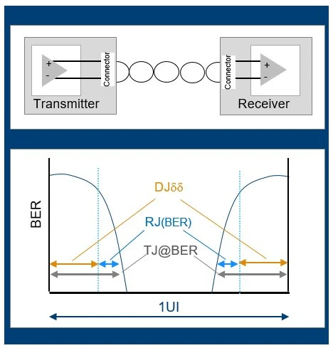

## Spectral method

>  power spectral density (PSD) represents jitter spectrum and peaks in the spectrum can be interpreted as PJ or DDJ, while the average noise floor is the power of RJ

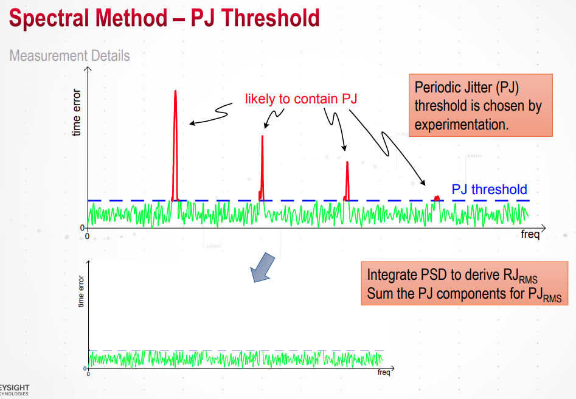

```matlab
S1 = sum(win);
S2 = sum(win.^2);
N = length(win);
spec_nospur2 = (spec_nospur*S1).^2/N/S2;    % To obtain linear spectrum for rj
rj_utj = sqrt(sum(spec_nospur2))*1e12;

spec = 1*ones(length(spec_nospur), 1)*1e-21;
spec(index) = specx(index);
% insert fft nyquist frequency component between positive frequency and
% negative frequency component
% DC;posFreq;nyqFreq;negFreq
spec_ifft = [spec;specnyq;conj(spec(end:-1:2))]';
sfactor = sum(win)/sqrt(2);
spec_ifft = spec_ifft*sfactor;
sig_rec = real(ifft(spec_ifft));
sig_rec = sig_rec(:);
sig_rec_utj = sig_rec./win(1:end);
```


## Tail Fit Method

> Tail fitting algorithm based on the **Gaussian tail model** by using probability distribution of collected jitter value

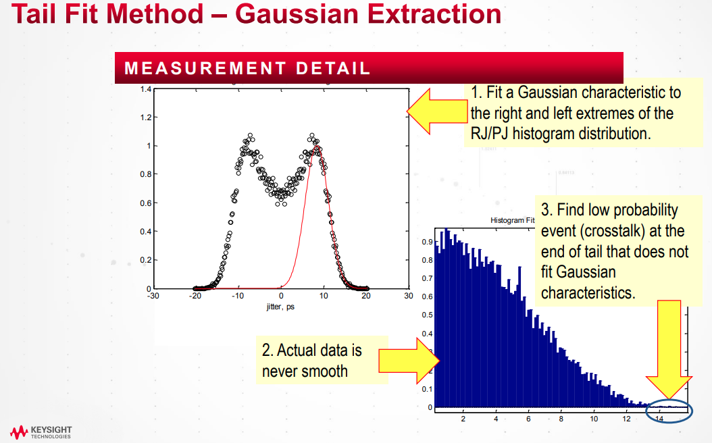


```matlab
bin_sig = bin_sig*1e12;

x = qfuncinv(cdf_sig);

% coef(1)*bin_sig + coef(2) = x
% which x is norm(0, 1)
% bin_sig = (x - coef(2))/coef(1)
% Then bin is norm(-coef(2)/coef(1), 1/coef(1))
coef = polyfit(bin_sig, x, 1);
sigma = 1/coef(1);
mu = -coef(2)*sigma;

fprintf('sigma=%.3fps, mu=%.3fps\n', sigma, mu);
```

## Least Squares (LS) method
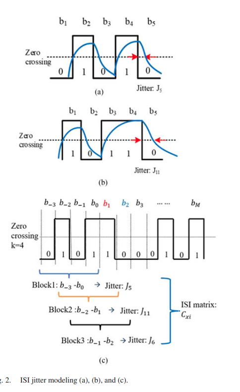

 It is known that TIE jitter is a linear equation, shown in below formula
$$
x[n] = d_n \times \left[ \Delta t_{pj}[n]+\Delta t_{DCD}[n] +\Delta t_{ISI}[n]+\Delta t_{RJ}[n]\right]
$$
LS can be used to estimate the PJ, DCD, RJ , and ISI parameters $[a,b,J_{DCD},J_0, J_1...J_{(2^k-1)}]$

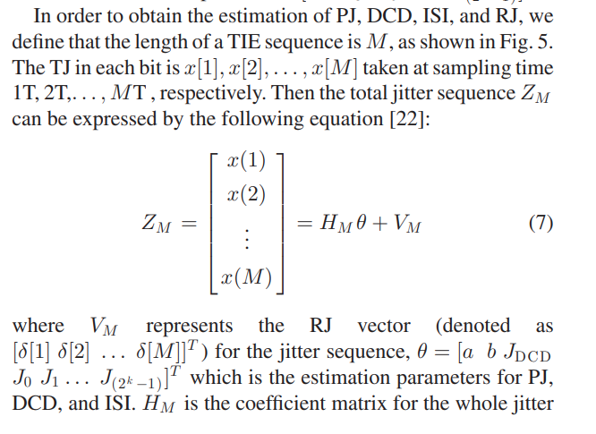

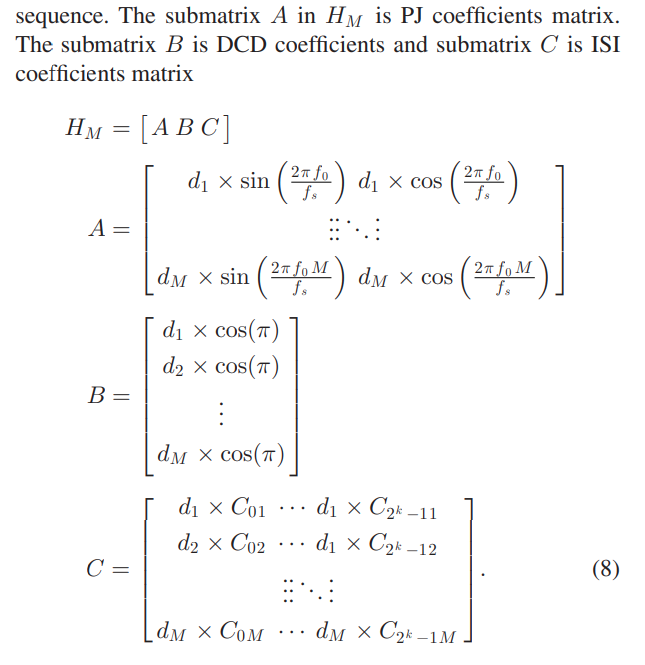

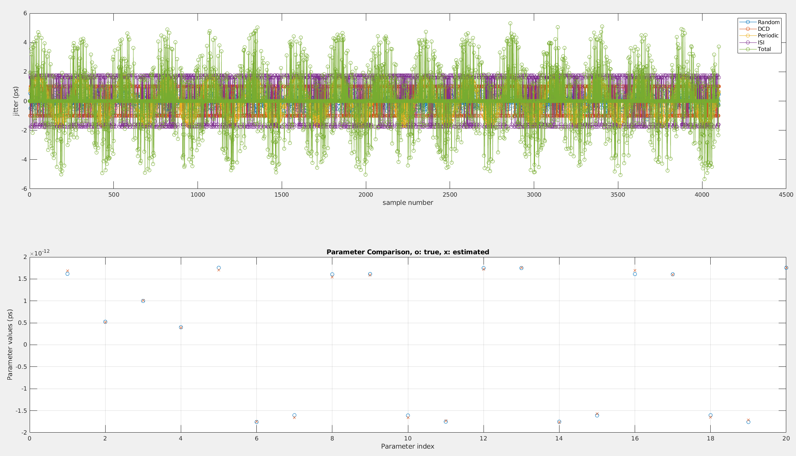

## Jitter modeling

### Periodic Jitter (PJ)

PJ is a repeating jitter
$$
\Delta t_{PJ}[n]=A\sin(2\pi f_0\cdot nT_s + \theta)=a \sin(2\pi f_0 \cdot nT_s)+b\cos(2\pi f_0 \cdot nT_s)
$$
where $f_0$ represents the fundamental frequency of PJ; $A$ is the amplitude of PJ; $T_s$ is the data stream period, and $\theta$ is the initial phase of PJ

> In the spectrum, the frequency of maximum amount of the jitter is PJ frequency $f_0$.

### Duty Cycle Distortion (DCD)

DCD is viewed as a series of **adjacent positive and negative impulses**
$$
\Delta t_{DCD}[n] = J_{DCD}\times (-1)^n = [-J_{DCD},J_{DCD},-J_{DCD},J_{DCD},...]
$$
Where $J_{DCD}$ is the DCD amplitude.

###  Random Jitter (RJ)

RJ is created by unbounded jitter sources, such as Gaussian white noise. The statistical PDF for RJ is enerally treated as a Gaussian distribution
$$
f_{RJ}(\Delta t) = \frac{1}{\sqrt{2\pi\sigma}}\exp(-\frac{(\Delta t)^2}{2\sigma^2})
$$


## Remarks

### Periodic Jitter Generator and Insertion

*Analysis and Estimation of Jitter Sub-Components: Classification and Segregation of Jitter Components*

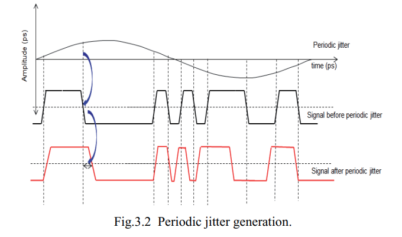

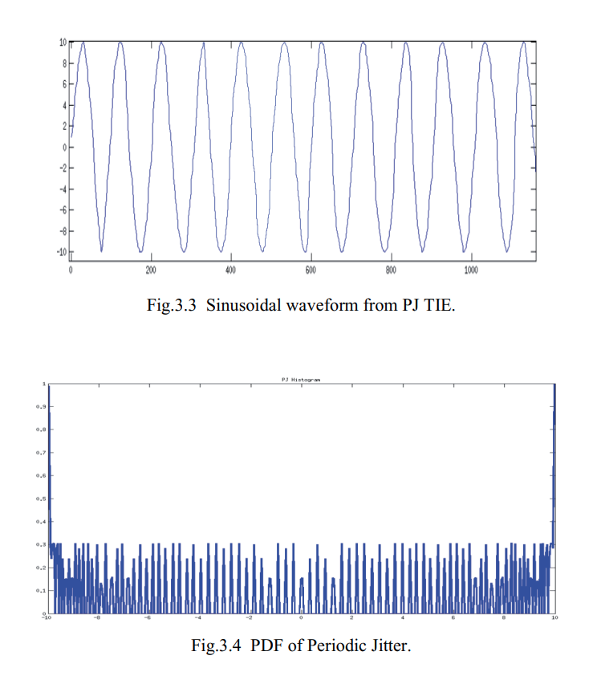

## Reference

Mike Li. 2007. Jitter, noise, and signal integrity at high-speed (First. ed.). Prentice Hall Press, USA.

[余宥浚 Jacky Yu, Keysight Taiwan AEO, Advanced Jitter and Eye-Diagram Analysis](https://keysightevent.com/191023/handout/d)

Y. Duan and D. Chen, "Accurate jitter decomposition in high-speed links," 2017 IEEE 35th VLSI Test Symposium (VTS), 2017, pp. 1-6, doi: 10.1109/VTS.2017.7928918.

Y. Duan's phd thesis URL: [https://dr.lib.iastate.edu/handle/20.500.12876/30459](https://dr.lib.iastate.edu/handle/20.500.12876/30459)

Y. Duan and D. Chen, "Fast and Accurate Decomposition of Deterministic Jitter Components in High-Speed Links," in IEEE Transactions on Electromagnetic Compatibility, vol. 61, no. 1, pp. 217-225, Feb. 2019, doi: 10.1109/TEMC.2018.2797122.

"Jitter Analysis: The Dual-Dirac Model, RJ/DJ, and Q-Scale", Whitepaper: Keysight Technologies, U.S.A., Dec. 2017

Sharma, Vijender Kumar and Sujay Deb. "Analysis and Estimation of Jitter Sub-Components." (2014).

Qingqi Dou and J. A. Abraham, "Jitter decomposition in ring oscillators," Asia and South Pacific Conference on Design Automation, 2006., 2006, pp. 6 pp.-, doi: 10.1109/ASPDAC.2006.1594696.

E. Balestrieri, L. De Vito, F. Lamonaca, F. Picariello, S. Rapuano and I. Tudosa, "The jitter measurement ways: The jitter decomposition," in IEEE Instrumentation & Measurement Magazine, vol. 23, no. 7, pp. 3-12, Oct. 2020, doi: 10.1109/MIM.2020.9234759.

McClure, Mark Scott. "Digital jitter measurement and separation." PhD diss., 2005.

Ren, Nan, Zaiming Fu, Shengcu Lei, Hanglin Liu, and Shulin Tian. "Jitter generation model based on timing modulation and cross point calibration for jitter decomposition." Metrology and Measurement Systems 28, no. 1 (2021).

M. P. Li, J. Wilstrup, R. Jessen and D. Petrich, "A new method for jitter decomposition through its distribution tail fitting," International Test Conference 1999. Proceedings (IEEE Cat. No.99CH37034), 1999, pp. 788-794, doi: 10.1109/TEST.1999.805809.
