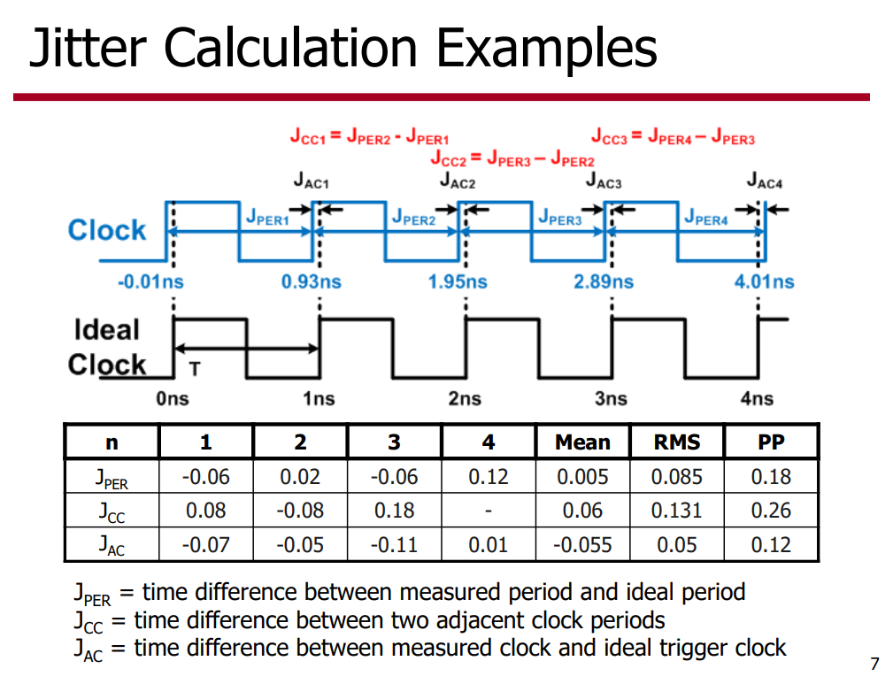

Jitter measurements can be classified into three categories: *cycle-to-cycle jitter*, *period jitter*, and *long-term jitter*

Jitter is a key performance parameter. Need to know what matters in each case: 

- *PJ* for digital timing
- *LTJ* for data converters and serial data
- *Phase noise* for communications (not all bandwidths matter)

> The above Cycle-Cycle Jitter equation is **wrong**,  $\tau_1$ and $\tau_2$ are not independent

##  Short Term Jitter

> **Period jitter**, *Jper* is the short term variation in clock period compared to the average (mean) clock period.
>
>  **Cycle-to-Cycle**, *Jcc* is the time difference of two adjacent clock periods

## Long Term Jitter (LTJ)

### measuring LTJ

## Jitter Calculation Examples

## Jcc vs Jper

> Estimating the RMS cycle-to-cycle jitter if all you have available is the RMS period jitter.

- **Cycle-to-cycle jitter** - The *short-term* variation in clock period between *adjacent* clock cycles. This jitter measure, abbreviated here as $J_{CC}$, may be specified as either an RMS or peak-to-peak quantity.
- **Period jitter** - The *short-term* variation in clock period over *all* measured clock cycles, compared to the average clock period. This jitter measure, abbreviated here as $J_{PER}$, may be specified as either an RMS or peak-to-peak quantity.

Let the variable below represent the variance of a single edge’s timing jitter, i.e. the difference in time of a jittery edge versus an ideal edge, $\sigma^2_j$

If each edge’s jitter is *independent* then the variance of the period jitter can be written as
$$\begin{align}
\sigma^2_\text{jper} &= (\sigma_\text{j(n+1)}-\sigma_\text{j(n)})^2 \\
&= \sigma_\text{j(n+1)}^2-2\sigma_\text{j(n+1)}\sigma_\text{j(n)})+\sigma_\text{j(n)})^2\\
&= \sigma_\text{j(n+1)}^2+\sigma_\text{j(n)})^2 \\
&=2\sigma^2_j
\end{align}$$

In every cycle-to-cycle measurement we use one "**interior**" clock edge *twice* and therefore we must account for this

$$\begin{align}
\sigma^2_\text{jcc} &= (\sigma_\text{jper(n+1)}-\sigma_\text{jper(n)})^2 \\
&=(\sigma_\text{j(n+2)}-2\sigma_\text{j(n+1)}+\sigma_\text{j(n)})^2
\end{align}$$

Since each edge's jitter is assumed to be *independent* and have the same statistical properties we can drop the cross correlation terms and write:

$$\begin{align}
\sigma^2_\text{jcc} &=(\sigma_\text{j(n+2)}-2\sigma_\text{j(n+1)}+\sigma_\text{j(n)})^2 \\
&=\sigma_\text{j(n+2)}^2+4\sigma_\text{j(n+1)}^2+\sigma_\text{j(n)}^2 \\
&=6\sigma_\text{j}^2
\end{align}$$

The ratio of the variances is therefore
$$
\frac{\sigma^2_\text{jcc}}{\sigma^2_\text{jper}} = \frac{6\sigma_\text{j}^2} {2\sigma_\text{j}^2}=3
$$
Then
$$
\sigma_\text{jcc} = \sqrt{3}\sigma_\text{per}
$$

> [[Timing 101 #8: The Case of the Cycle-to-Cycle Jitter Rule of Thumb, Silicon Labs](https://community.silabs.com/s/share/a5U1M000000knzoUAA/timing-101-8-the-case-of-the-cycletocycle-jitter-rule-of-thumb?language=en_US)]

## Cadence Sampled Phase Noise

> How to derive edge phase noise from Output Noise in sampled Pnoise simulation, [[https://community.cadence.com/cadence_technology_forums/f/custom-ic-design/56929/how-to-derive-edge-phase-noise-from-output-noise-in-sampled-pnoise-simulation](https://community.cadence.com/cadence_technology_forums/f/custom-ic-design/56929/how-to-derive-edge-phase-noise-from-output-noise-in-sampled-pnoise-simulation)]
>
> [[Shawn Logan, Summary of Study of Cadence Sampled Phase Noise and Jitter Definitions with a Comparison to Conventional Time Interval Error (TIE) for a Driven Circuit](www.dropbox.com/s/3m531dl4fl7bwbr/jee_computation_example_sml_032823v1p0.pdf)]

##  General relationships between variance of jitter and phase noise

> *Understanding jitter and phase noise : a circuits and systems perspective*

## references

AN10007 Clock Jitter Definitions and Measurement Methods, SiTime [[pdf](https://www.sitime.com/sites/default/files/hiddenresources/AN10007-Jitter-and-measurement-methods_SIT.pdf)]

SERDES Design and Simulation Using the Analog FastSPICE Platform, Silicon Creations [[pdf](https://www.siliconcr.com/sc-cms/uploads/u2u_presentation_sc_april25.pdf)]

Flexible clocking solutions in advanced processes from 180nm to 5nm, Silicon Creations [[pdf](https://www.siliconcr.com/sc-cms/uploads/siliconcreations_iccad_2019_v2_191020.pdf)]

One-size-fits-all PLLs for Advanced Samsung Foundry Processes, Silicon Creations [[pdf](https://www.siliconcr.com/sc-cms/uploads/siliconcreations_dac_2022_v2_22-07-12.pdf)]

Circuit Design and Verification of 7nm LowPower, Low-Jitter PLLs, Silicon Creations, [[pdf](https://www.siliconcr.com/sc-cms/uploads/u2u-2018-sicr-plls-v3-180509.pdf)]

Lecture 10: Jitter, ECEN720: High-Speed Links Circuits and Systems Spring 2023 [[pdf](https://people.engr.tamu.edu/spalermo/ecen689/lecture10_ee720_jitter.pdf)]
