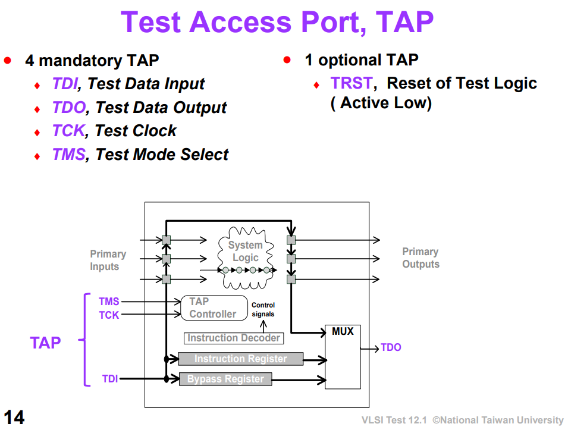
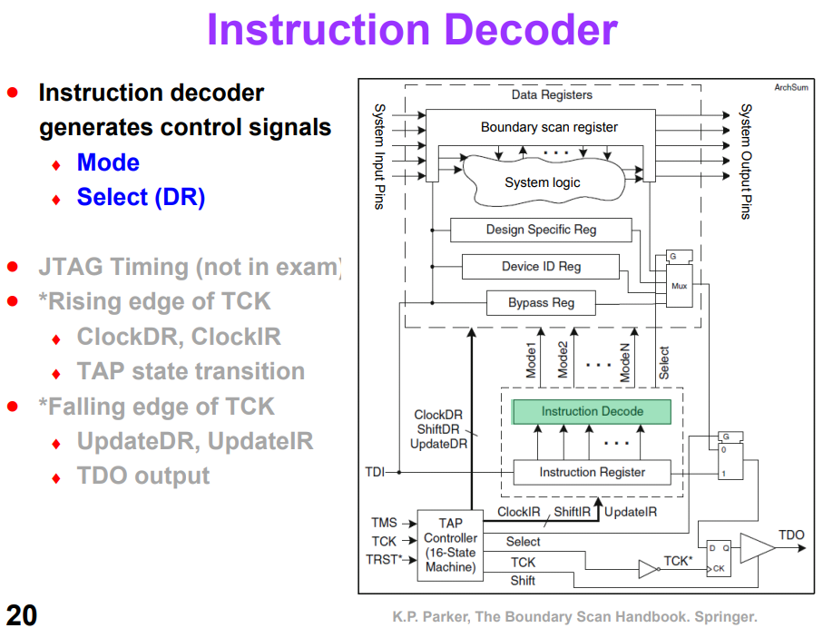
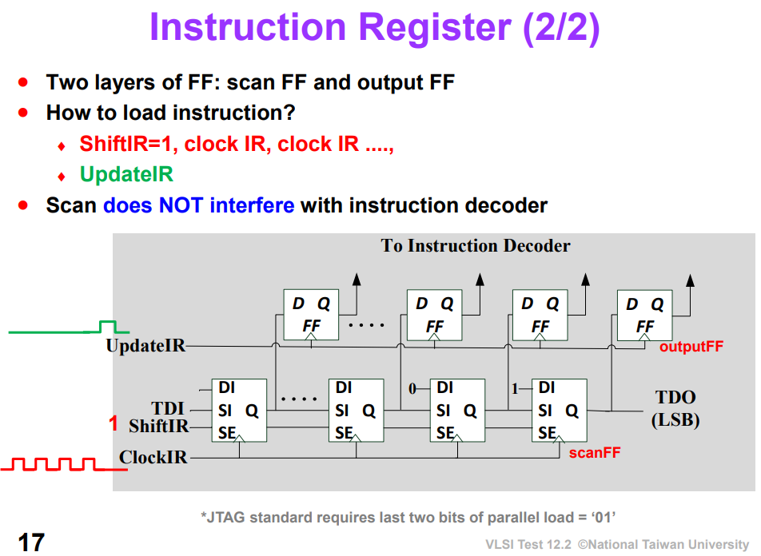
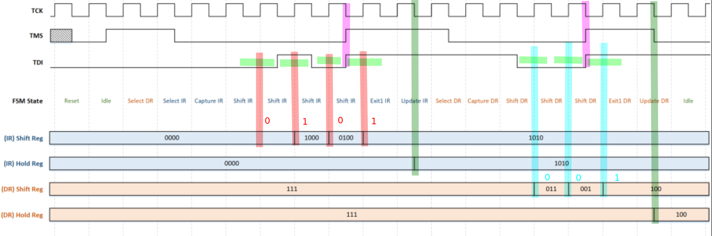
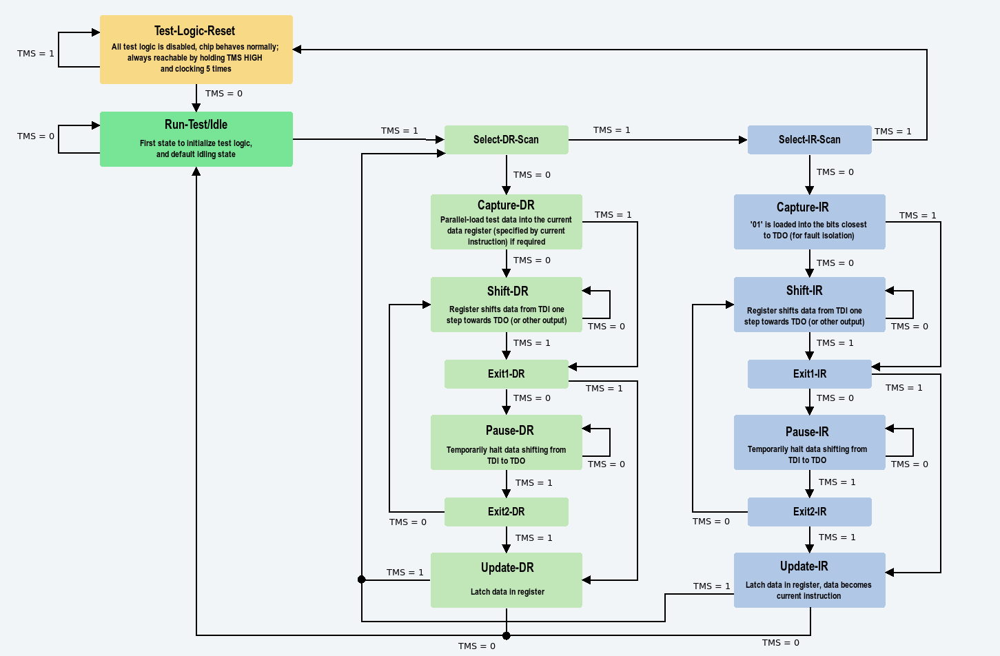
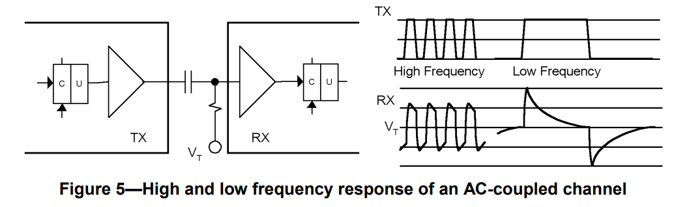
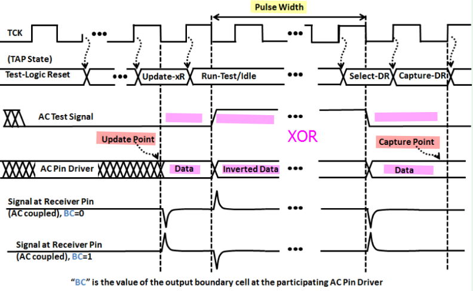
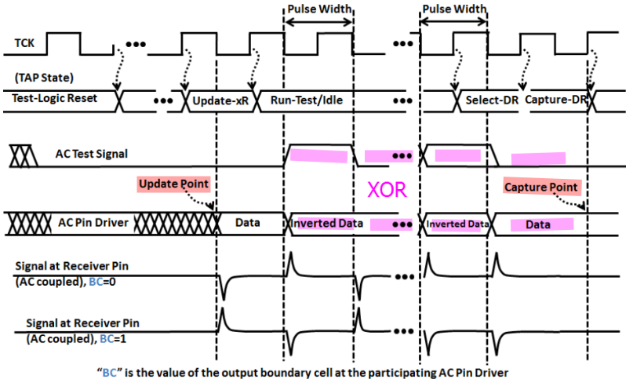

Data Register, DR:

- Bypass Register, BR
- Boundary Scan Register, BSR

Instruction Register, IR

##  TAP Controller

> - FSM and Shift Register of DR and IR works at the **posedge** of the clock
> - TMS, TDI, TDO and Hold Register of DR and IR changes value at the **negedge** of the clock

> capture IR `01`, the fixed is for easier fault detection

> After power-up, they may not be in sync, but there is a trick. Look at the state machine and notice that no matter what state you are, if *TMS stays at "1" for five clocks*, a TAP controller goes back to the state "Test-Logic Reset". That's used to synchronize the TAP controllers.

> It is important to note that in a typical Boundary-Scan test, the time between launching a signal from driver (at the falling edge of test clock (TCK) in the `Update-DR` or `Update-IR` TAP Controller state) and capturing that signal (at the rising edge of TCK in the `Caputre-DR` TAP Controller state) is **no less tha 2.5 TCK cycles**

Further, the time between successive launches on a driver is governed 
- not only by the TCk rate
- but by the amount of serial data shifting needed to load the next pattern data in the concatenated Boundary-Scan Registers of the Boundary-Scan chain

> Thus the effective test data rate of a driver could be thousands of the times lower than the TCK rate
>
> 1. For DC-coupled interconnect, this time is of no concern
> 2. For AC-coupled interconnect, the signal may easily decay partially or completely before it can be captured
> 3. If only partial decay occurs before capture, that decay will very likely be completed before the driver produces the next edge

## AC-coupling

In general, AC-coupling can distort a signal transmitted across a channel depending on its frequency.

`Figure 5`

- The high frequency signal is relatively unaffected by the coupling
- The low frequency signal is severely impacted
  1. it decays to $V_T$ after a few time constants
  2. its amplitude is double the input amplitude
     > transient response, before AC-coupling capacitor: $-A_p \to A_p$; after AC-coupling capacitor $V_T \to V_T+2A_p$
> A key item to note is that the transitions in the original signal are preserved, although their start and end points are offset
>
> compared to where they were in the high frequency

## Test signal implementation

The test data is either the content of the Boundary-Scan Register Update latch (U) when executing the (DC) EXTEST instruction, or an **"AC Signal"** 
when an *AC testing instruction* is loaded into the device.

> The AC signal is a test waveform suited for transmission through AC-coupling

## Test signal reception

- When *an AC testing instruction* is loaded, a specialized test receiver detects transitoins of the AC signal seen at the input and determines if this represents a logic '0' or '1'
- When *EXTEST* is loaded, the input signal level is detected and sent to the output of the test receiver to the Boundary-Scan Register cell

When testing for a shorted capacitor, the *test software* must ensure that enough time has passed for the signal to decay before entering *Capture-DR*, either by stopping TCk or by spending additional TCK cycles in the *Run-Test/Idle* TAP Controller state

## EXTEST_PULSE & EXTEST_TRAIN

> The two new AC-test instructions provided by this standard differ primarily in the number and timing of transitions to provide flexibility in dealing with the specific dynamic behavior of the channels being tested

**AC Test Signal** essentially modulates test data so that it will propagate through AC-coupled channels, for devices that contatin AC pins

> Tools should use the **EXTEST_PULSE** instruction unless there is a specific requirement for the **EXTEST_TRAIN** instruction

### EXTEST_PULSE

> Generate **two** additional driver transitions and allows a tester to vary the **time** between them dependent on how many TCK cycles the TAP is left in the *Run-Test/Idle* TAP Controller state.
> 
> This is intended to allow any undesired transient condition to decay to a **DC steady-state value** when that will make the final transition more reliably detectable
> 
>The duration in the *Run-Test/Idle* TAP Controller state should be **at least three times** the high-pass coupling time constant. This allows the *first additional transition* to decay away to the **DC steady-state value** for the channel, and ensures that the full amplitude of the *final transition* is added to or subtracted from that steady-state value
> 
>This establishes a *known initial condition* for the *final transition* and permits reliable specification of the detection threshold of the test receiver

### EXTEST_TRAIN

> Generate **multiple** additional transitions, the **number** dependent on how long the TAP is left in the *Run-Test/Idle* TAP Controller state
>  
> This is intended to allow any undesired transient condition to decay to an **AC steady-state value** when that will make the final transition more reliably detectable

## IEEE Std 1149.6-2003

This standard is built on top of IEEE Std 1149.1 using the same Test Access Port structure and Boundary-Scan architecture.

- It adds the concept of a "test receiver" to input pins that are expected to handle **differential and/or AC-coupling**
- It adds two new instructions that cause drivers to emit AC waveforms that are processed by test receivers.

## JTAG Instruction

## Implementation

- AC mode
  hysteresis, detect transistion
- DC mode
  threshold is determined by jtag initial value

## reference

IEEE Std 1149.1-2001, IEEE Standard Test Access Port and Boundary-Scan Architecture, IEEE, 2001

IEEE Std 1149.6-2003, IEEE Standard for BoundaryScan Testing of Advanced Digital Networks, IEEE, 2003

IEEE 1149.6 Tutorial | Testing AC-coupled and Differential High-speed Nets [[https://www.asset-intertech.com/resources/eresources/ieee-11496-tutorial-testing-ac-coupled-and-differential-high-speed-nets/](https://www.asset-intertech.com/resources/eresources/ieee-11496-tutorial-testing-ac-coupled-and-differential-high-speed-nets/)]

Prof. James Chien-Mo Li, Lab of Dependable Systems, National Taiwan University. VLSI Testing [[http://cc.ee.ntu.edu.tw/~cmli/VLSItesting/](http://cc.ee.ntu.edu.tw/~cmli/VLSItesting/)]

K.P. Parker, The Boundary Scan Handbook, 3rd ed., Kluwer Academic, 2003.

B. Eklow, K. P. Parker and C. F. Barnhart, "IEEE 1149.6: a boundary-scan standard for advanced digital networks," in IEEE Design & Test of Computers, vol. 20, no. 5, pp. 76-83, Sept.-Oct. 2003, doi: 10.1109/MDT.2003.1232259.

