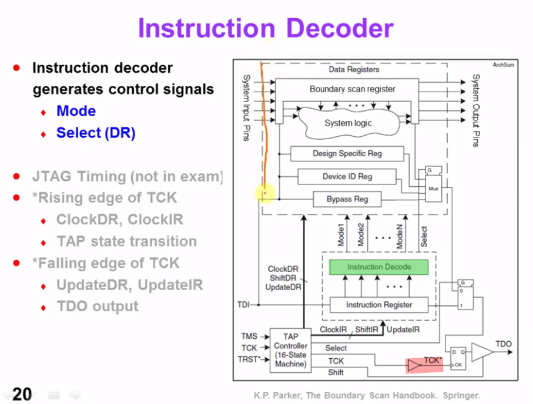

Data Register, DR:

- Bypass Register, BR
- Boundary Scan Register, BSR

Instruction Register, IR

##  TAP Controller

> - FSM and Shift Register of DR and IR works at the **posedge** of the clock
> - TMS, TDI, TDO and Hold Register of DR and IR changes value at the **negedge** of the clock

> capture IR `01`, the fixed is for easier fault detection

> After power-up, they may not be in sync, but there is a trick. Look at the state machine and notice that no matter what state you are, if *TMS stays at "1" for five clocks*, a TAP controller goes back to the state "Test-Logic Reset". That's used to synchronize the TAP controllers.

> It is important to note that in a typical Boundary-Scan test, the time between launching a signal from driver (at the falling edge of test clock (TCK) in the `Update-DR` or `Update-IR` TAP Controller state) and capturing that signal (at the rising edge of TCK in the `Caputre-DR` TAP Controller state) is **no less tha 2.5 TCK cycles**

## IEEE Std 1149.6-2003

This standard is built on top of IEEE Std 1149.1 using the same Test Access Port structure and Boundary-Scan architecture.

- It adds the concept of a "test receiver" to input pins that are expected to handle **differential and/or AC-coupling**
- It adds two new instructions that cause drivers to emit AC waveforms that are processed by test receivers.

## JTAG Instruction

## reference

IEEE Std 1149.1-2001, IEEE Standard Test Access Port and Boundary-Scan Architecture, IEEE, 2001

IEEE Std 1149.6-2003, IEEE Standard for BoundaryScan Testing of Advanced Digital Networks, IEEE, 2003

K.P. Parker, The Boundary Scan Handbook, 3rd ed., Kluwer Academic, 2003.

B. Eklow, K. P. Parker and C. F. Barnhart, "IEEE 1149.6: a boundary-scan standard for advanced digital networks," in IEEE Design & Test of Computers, vol. 20, no. 5, pp. 76-83, Sept.-Oct. 2003, doi: 10.1109/MDT.2003.1232259.

IEEE 1149.6 Tutorial | Testing AC-coupled and Differential High-speed Nets

Prof. James Chien-Mo Li, Lab of Dependable Systems, National Taiwan University. VLSI Testing
