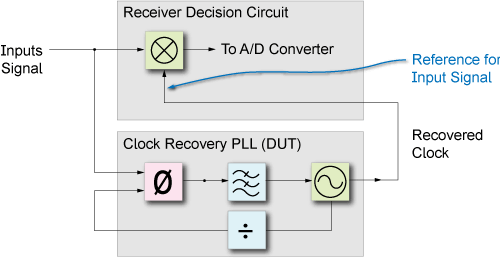

## Concepts of JTF and OJTF

Simplified Block Diagram of a Clock-Recovery PLL

**Jitter Transfer Function (JTF)**

- Input Signal Versus Recovered Clock
- JTF, by jitter frequency, compares how much input signal jitter is transferred to the **output of a clock-recovery's PLL (recovered clock)**
  - Input signal jitter that is within the clock recovery PLL's loop bandwidth results in jitter that is faithfully transferred (closed-loop gain) to the clock recovery PLL's output signal. JTF in this situation is approximately 1.
  - Input signal jitter that is outside the clock recovery PLL's loop bandwidth results in decreasing jitter (open-loop gain) on the clock recovery PLL's output, because the jitter is filtered out and no longer reaches the PLL's VCO

**Observed Jitter Transfer Function**

- Input Signal Versus Sampled Signal
- OJTF compares how much input signal jitter is transferred to the **output of a receiver's decision making circuit** as effected by a clock recovery's PLL. As the recovered clock is the reference for detecting the input signal
  - Input signal jitter that is **within** the clock recovery PLL's loop bandwidth results in jitter on the recovered clock which reduces the amount of jitter that can be detected. The input signal and clock signal are closer in phase
  - Input signal jitter that is **outside** the clock recovery PLL's loop bandwidth results in **reduced jitter on the recovered cloc**k which increases the amount of jitter that can be detected. The input signal and clock signal are more out of phase. Jitter that is on both the input and clock signals can not detected or is reduced

JTF and OJTF for 1st Order PLLs

> The observed jitter is a complement to the PLL jitter transfer response OJTF=1-JTF **(Phase matters!)**
>
> OTJF gives the amount of jitter which is tracked and therefore not observed at the output of the CDR as a function of the jitter rate applied to the input. 

## Jitter Measurement

$$
J_{\text{measured}} = JTF_{\text{DUT}} \cdot OJTF_{\text{instrument}}
$$
The combination of the OJTF of a jitter measurement device and the JTF of the clock generator under test gives the measured jitter as a function of frequency.

For example, a clock generator with a type 1, 1st order PLL measured with a jitter measurement device employing a golden PLL is
$$
J_{\text{measured}} = \frac{\omega_1}{s+\omega_1}\frac{s}{s+\omega_2}
$$

Accurate measurement of the clock JTF requires that the OJTF cutoff of the jitter measurement be significantly below that of the clock JTF and that the measurement is compensated for the instrument's OJTF.

The overall response is a band pass filter because the clock JTF is low pass and the jitter measurement device OJTF is high pass.

The compensation for the instrument OJTF is performed by measuring the jitter of the reference clock at each jitter rate being tested and comparing the **reference jitter** with the **jitter measured at the output of the DUT**. 

The lower the cutoff frequency of the jitter measurement device the better the accuracy of the measurement will be.

The cutoff frequency is limited by several factors including the phase noise of the DUT and measurement time.

## Digital Sampling Oscilloscope

How to analyze jitter:

- TIE (Time Interval Error) track
- histogram
- FFT

**TIE track** provides a direct view of how the phase of the clock evolves over time.

**histogram** provides valuable information about the long term variations in the timing.

**FFT** allows jitter at specific rates to be measured down to the femto-second range.

> Maintaining the record length at a minimum of $1/10$ of the inverse of the PLL loop bandwidth minimizes the response error

## reference

neuhelium, 抖动、眼图和高速数字链路分析基础 URL: [http://www.neuhelium.com/ueditor/net/upload/file/20200826/DSOS254A/03.pdf](http://www.neuhelium.com/ueditor/net/upload/file/20200826/DSOS254A/03.pdf)

Keysight JTF & OJTF Concepts, [https://rfmw.em.keysight.com/DigitalPhotonics/flexdca/FlexPLL-UG/Content/Topics/Quick-Start/jtf-pll-theory.htm?TocPath=Quick%20Start%7C_____4](https://rfmw.em.keysight.com/DigitalPhotonics/flexdca/FlexPLL-UG/Content/Topics/Quick-Start/jtf-pll-theory.htm?TocPath=Quick%20Start%7C_____4)

Complementary Transmitter and Receiver Jitter Test Methodlogy, URL: [https://www.ieee802.org/3/bm/public/mar14/ghiasi_01_0314_optx.pdf](https://www.ieee802.org/3/bm/public/mar14/ghiasi_01_0314_optx.pdf)

SerDesDesign.com CDR_BangBang_Model URL: [https://www.serdesdesign.com/home/web_documents/models/CDR_BangBang_Model.pdf](https://www.serdesdesign.com/home/web_documents/models/CDR_BangBang_Model.pdf)

M. Schnecker, Jitter Transfer Measurement in Clock Circuits, LeCroy Corporation, DesignCon 2009. URL: [http://cdn.teledynelecroy.com/files/whitepapers/designcon2009_lecroy_jitter_transfer_measurement_in_clock_circuits.pdf](http://cdn.teledynelecroy.com/files/whitepapers/designcon2009_lecroy_jitter_transfer_measurement_in_clock_circuits.pdf)