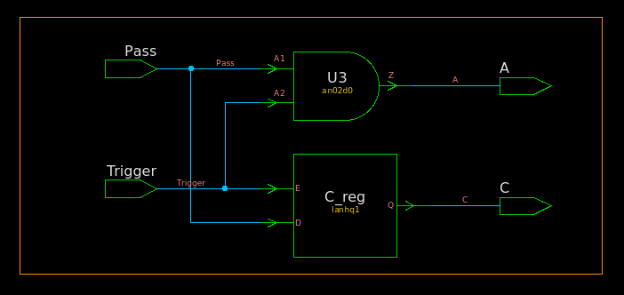
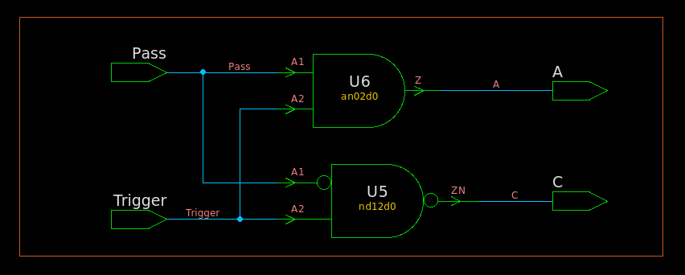

## `always@( * )`

`always@( * )` blocks are used to describe Combinational Logic, or Logic Gates. Only `=` (blocking)
assignments should be used in an `always@( * )` block.

## Latch Inference

If you **DON'T** assign every element that can be assigned inside an `always@( * )` block every time that `always@( * )` block is executed, a latch will be inferred for that element

The approaches to avoid latch generation:

- set default values
- proper use of the `else` statement, and other flow constructs


### without default values

> latch is generated

#### RTL

```verilog
module TOP (
	input wire Trigger,
	input wire Pass,
	output reg A,
	output reg C
);
	always @(*) begin
		A = 1'b0;
		if (Trigger) begin
			A = Pass;
			C = Pass;
		end
	end
endmodule
```

#### synthesized  netlist



```verilog
/////////////////////////////////////////////////////////////
// Created by: Synopsys DC Ultra(TM) in wire load mode
// Version   : S-2021.06-SP5
// Date      : Mon May  9 17:09:18 2022
/////////////////////////////////////////////////////////////


module TOP ( Trigger, Pass, A, C );
  input Trigger, Pass;
  output A, C;


  lanhq1 C_reg ( .E(Trigger), .D(Pass), .Q(C) );
  an02d0 U3 ( .A1(Pass), .A2(Trigger), .Z(A) );
endmodule
```

### add default value

> Default values are an easy way to avoid latch generation

#### RTL

```verilog
module TOP (
	input wire Trigger,
	input wire Pass,
	output reg A,
	output reg C
);
	always @(*) begin
		A = 1'b0;
        	C = 1'b1;
		if (Trigger) begin
			A = Pass;
			C = Pass;
		end
	end
```


#### synthesized  netlist



```verilog
/////////////////////////////////////////////////////////////
// Created by: Synopsys DC Ultra(TM) in wire load mode
// Version   : S-2021.06-SP5
// Date      : Mon May  9 17:12:47 2022
/////////////////////////////////////////////////////////////


module TOP ( Trigger, Pass, A, C );
  input Trigger, Pass;
  output A, C;


  nd12d0 U5 ( .A1(Pass), .A2(Trigger), .ZN(C) );
  an02d0 U6 ( .A1(Pass), .A2(Trigger), .Z(A) );
endmodule

```


## `if` evaluation

`signed` number cast to `unsigned` automatically before evaluating

```verilog
// tb.v
module tb; 
  reg signed [1:0] datasg;
  reg [1:0] dataug;

  initial begin
    datasg = 2'b11;
    dataug = 2'b11;

    $display("datasg(%%d): %d", datasg);
    $display("dataug(%%d): %d", dataug);

    if (datasg)
      $display("datasg is OK");
    if (dataug)
      $display("dataug is OK");

    $finish();
  end 
endmodule
```

```
$ vlog tb.v
$ vsim -c -do "run;exit" work.tb
# Loading work.tb(fast)
# run
# datasg(%d): -1
# dataug(%d): 3
# datasg is OK
# dataug is OK
# ** Note: $finish    : tb.v(16)
```


## reference

UC Berkeley CS150 Lec #20: Finite State Machines [Slides](https://inst.eecs.berkeley.edu/~cs150/sp11/agenda/lec/lec20-fsm.pdf)

Lee WF. Learning from VLSI Design Experience [electronic Resource] / by Weng Fook Lee. 1st ed. 2019. Springer International Publishing; 2019. doi:10.1007/978-3-030-03238-8
