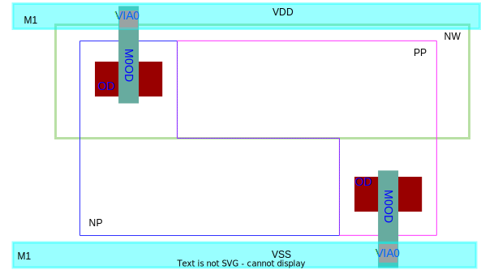

All credits to my colleague, Zhang Wenpian.

### Planar process vs. FinFet process

### Standard Cell  Tapcell

### Guard Ring in Custom block

Place well tie and substrate tie where they are needed. Redundant guard ring consume area and increase the routing of critical signal net.

### Continuous OD

#### Performance & Matching 

#### current mirror

split diffusion with dummy transistors

#### cascode structure

off transistor split diffusion

#### sharing source & drain

### Stacked MOSFETs

### reference

A. L. S. Loke et al., "Analog/mixed-signal design challenges in 7-nm CMOS and beyond," 2018 IEEE Custom Integrated Circuits Conference (CICC), 2018, pp. 1-8, doi: 10.1109/CICC.2018.8357060.

Stacked MOSFETs in analog layout [https://pulsic.com/stacked-mosfets-in-analog-layout/](https://pulsic.com/stacked-mosfets-in-analog-layout/ )
