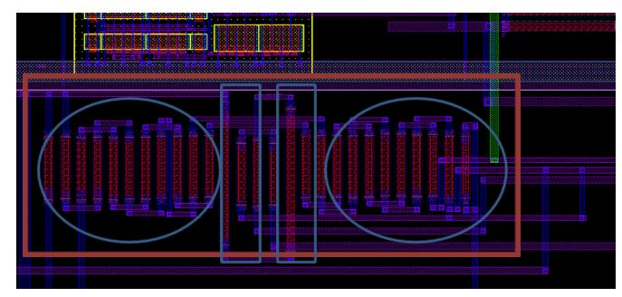

1. Common Centroid

   The common centroid technique describes that if there are n blocks which are to be matched then the blocks are arranged symmetrically around the common centre at equal distances from the centre. This technique offers best matching for devices as it helps in avoiding cross-chip gradients 

   

2. Inter-digitation

   Interdigitation reduces the device mismatch as it suffers equally from process variations in X dimension. This technique was used to layout current mirrors and resistors in PTAT and BGR circuits. In the Figure-15 below each brown stick represents a PFET of uniform length. This representation is termed as an inter-digitated layout.

   

   

### reference

Mikael Sahrling, Layout Techniques for Integrated Circuit Designers 1st Edition , Artech House 2022

LAYOUT, [EE6350 VLSI Design Lab](http://www.ee.columbia.edu/~kinget/EE6350_S16/)  SMART TEMPERATURE SENSOR  URL: [https://www.ee.columbia.edu/~kinget/EE6350_S16/06_TEMPSENS_Sukanya_Vani/layout.html](https://www.ee.columbia.edu/~kinget/EE6350_S16/06_TEMPSENS_Sukanya_Vani/layout.html)
