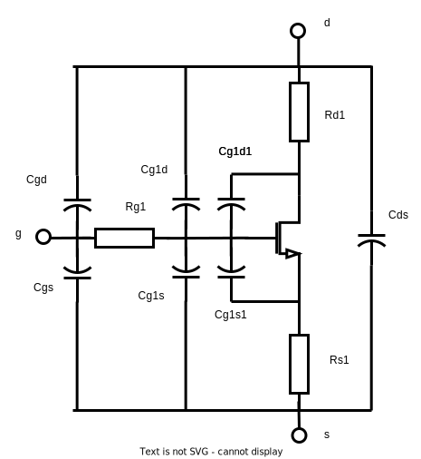

## Shallow Trench Isolation (STI)

## drain and source sharing

### Planar process vs. FinFet process

### Standard Cell  Tapcell

### Guard Ring in Custom block

Place well tie and substrate tie where they are needed. Redundant guard ring consume area and increase the routing of critical signal net.

### Continuous OD

#### Performance & Matching

#### current mirror

split diffusion with dummy transistors

#### cascode structure

off transistor split diffusion

#### sharing source & drain

### Stacked MOSFETs

## Matching

1. Common Centroid

   The common centroid technique describes that if there are n blocks which are to be matched then the blocks are arranged symmetrically around the common centre at equal distances from the centre. This technique offers best matching for devices as it helps in avoiding cross-chip gradients

   

2. Inter-digitation

   Interdigitation reduces the device mismatch as it suffers equally from process variations in X dimension. This technique was used to layout current mirrors and resistors in PTAT and BGR circuits. In the Figure-15 below each brown stick represents a PFET of uniform length. This representation is termed as an inter-digitated layout.

   

## Design with FinFETs

### Modeling Consideration

$$\begin{align}
R_{d1} &\propto \frac{1}{N_{fins}} \\
R_{s1} &\propto \frac{1}{N_{fins}} \\
R_{g1} &\propto N_{fins} \\
C_{gd} &\propto N_{fins} \cdot N_{fingers} \cdot N_{multipler} \\
C_{gs} &= Cgd \\
C_{g1d} &\propto N_{fins} \\
C_{g1s} &= C_{g1d} \\
C_{g1d1} &\propto N_{fins} \\
C_{g1s1} &= C_{g1d1}  \\
C_{g1d1} &\simeq 2\times C_{g1d}
\end{align}$$

### Layout Consideration

#### PODE & CPODE

> The PODE devices is extracted as parasitic devices in post-layout netlist

**DDB** is the **PODE** (Poly on OD/Diffusion Edge) in TSMC 16FFC process.

**SDB** is the **CPODE** (Connected PODE) in TSMC 16FFC process.

> PO on OD edge (PODE) is a must and to define GATE that abuts OD vertical edge
>
> CPODE is used to connect two PODE cells together. It will isolate OD to save 1 poly pitch, via STI; Additional mask (12N) is required for manufacture

#### SAC & SAGC

##### self-aligned diffusion contacts (SACs)

As shown in Fig. 35 in older planar technology nodes, gate pitch is so relaxed such that S/D contacts and gate contacts can easily be placed next to each other without causing any shorting risk (see Fig. 35(a)).

**As the gate pitch scales, there’s no room to put gate contacts next to S/D contacts, and gatecontacts have been pushed away from the active region and are only placed on the STI region.**

In addition, at tight gate pitch, even forming *S/D contact* without shorting to *gate metal* becomes very challenging.

The idea of **self-aligned contacts (SAC)** has been introduced to mitigate the issue of S/D contact to gate shorts.

As shown in Fig. 35(b), *the gate metal is fully encapsulated by a dielectric spacer and gate cap*, which protects the gate from shorting to the S/D contact.

>  A dielectric cap is added on top of the gate so that if the contact overlaps the gate, no short occurs.
>
>  **MD** layer represent SACs in PDK

##### self-aligned gate contacts (SAGCs)

**Self-aligned gate contacts (SAGCs)** have also been implemented and Denser standard cells can be achieved by eliminating the need to land contacts on the gate outside the active area.

SAGCs require the source/drain contacts to be capped with an insulator that is different from both contact and gate cap dielectrics to protect the source/drain contacts against a misaligned gate contact etch.

> According to the DRC of T foundary, poly extension > 0 um and space between MP and OD > 0 um., which demonstrate self-aligned gate contact is **not** introduced.

##### Contacted-Poly-Pitch (CPP)

> Wider Contacted-Poly-Pitch allows wider MD and VD size, which help reduce MEOL IRdrop

*Naoto Horiguchi. Entering the Nanosheet Transistor Era  [[link](https://www.imec-int.com/en/articles/entering-nanosheet-transistor-era-0)]*

#### Gate Resistance

## reference

Mikael Sahrling, Layout Techniques for Integrated Circuit Designers 1st Edition , Artech House 2022

LAYOUT, [EE6350 VLSI Design Lab](http://www.ee.columbia.edu/~kinget/EE6350_S16/)  SMART TEMPERATURE SENSOR  URL: [https://www.ee.columbia.edu/~kinget/EE6350_S16/06_TEMPSENS_Sukanya_Vani/layout.html](https://www.ee.columbia.edu/~kinget/EE6350_S16/06_TEMPSENS_Sukanya_Vani/layout.html)

Stacked MOSFETs in analog layout [https://pulsic.com/stacked-mosfets-in-analog-layout/](https://pulsic.com/stacked-mosfets-in-analog-layout/)

JED Hurwitz, ISSCC2011 "T4: Layout: The other half of Nanometer CMOS Analog Design" [[slides](https://www.nishanchettri.com/isscc-slides/2011%20ISSCC/TUTORIALS/ISSCC2011Visuals-T4.pdf), [transcript](https://www.nishanchettri.com/isscc-slides/2011%20ISSCC/TUTORIALS/Transcription_T4.pdf)]

Tom Quan, TSMC, Bob Lefferts, Fred Sendig, Synopsys, Custom Design with FinFETs - Best practices designing mixed-signal IP

Jacob, Ajey & Xie, Ruilong & Sung, Min & Liebmann, Lars & Lee, Rinus & Taylor, Bill. (2017). Scaling Challenges for Advanced CMOS Devices. International Journal of High Speed Electronics and Systems. 26. 1740001. 10.1142/S0129156417400018.

Joddy Wang, Synopsys ["FinFET SPICE Modeling"](https://www.mos-ak.org/washington_dc_2015/presentations/T03_Joddy_Wang_MOS-AK_Washington_DC_2015.pdf)  Modeling of Systems and Parameter Extraction Working Group 8th International MOS-AK Workshop (co-located with the IEDM Conference and CMC Meeting) Washington DC, December 9 2015

A. L. S. Loke et al., "Analog/mixed-signal design challenges in 7-nm CMOS and beyond," 2018 IEEE Custom Integrated Circuits Conference (CICC), San Diego, CA, USA, 2018, pp. 1-8, doi: 10.1109/CICC.2018.8357060.[[slides](https://ewh.ieee.org/r6/san_diego/sscs/events/slides/2018_05_23_AMSDesignChallengesIn7nmCMOS_AlvinLoke.pdf)]

Prof. Adam Teman, Advanced Process Technologies, [[pdf](https://www.eng.biu.ac.il/temanad/files/2022/03/Lecture-2-Advanced-Process-Technologies.pdf)]

Luke Collins. FinFET variability issues challenge advantages of new process [[link](https://www.techdesignforums.com/blog/2014/04/16/finfet-variability-challenges-advantages/)]

Loke, Alvin. (2020). FinFET technology considerations for circuit design (invited short course). BCICTS 2020 Monterey, CA

Alvin Leng Sun Loke, TSMC. Device and Physical Design Considerations for Circuits in FinFET Technology", ISSCC 2020

A. L. S. Loke, C. K. Lee and B. M. Leary, "Nanoscale CMOS Implications on Analog/Mixed-Signal Design," 2019 IEEE Custom Integrated Circuits Conference (CICC), Austin, TX, USA, 2019, pp. 1-57, doi: 10.1109/CICC.2019.8780267.

A. L. S. Loke, Migrating Analog/Mixed-Signal Designs to FinFET Alvin Loke / Qualcomm. 2016 Symposia on VLSI Technology and Circuits

Lattice Semiconductor, 16FFC Process Technology Introduction December 9th, 2021[[pdf](https://cdn.latticesemi-insights.com/wp-content/uploads/2024/01/29174339/HR1000000009.pdf)]
