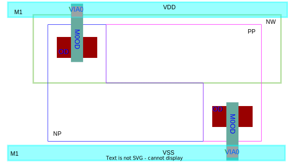
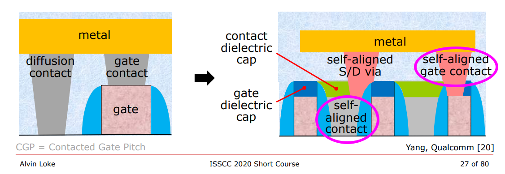
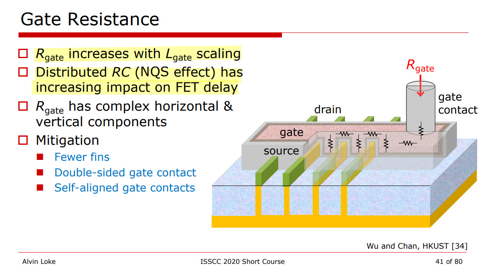

## Why Your Symmetric Layouts Are Showing Mismatches in SPICE Simulations

> [[https://www.ansys.com/blog/symmetric-layouts-showing-mismatches-spice-simulations](https://www.ansys.com/blog/symmetric-layouts-showing-mismatches-spice-simulations)]

The root cause of the delay mismatch is related to *how parasitic extraction tools distribute coupling capacitances over the nodes of the resistive networks*

> The most likely reason for such asymmetry is the anisotropy of computational geometry algorithms used by extraction tools.

## STRAP

A "strap" refers to a low-impedance connection

NWDMY = NWDMY1, NWDMY2

STRAP = NWSTRAP or PWSTRAP

NWSTRAP = {NP & OD} & {NW not {NW INTERACT NWDMY}}

PWSTRAP = {PP & OD} not NW

| cell \ pin  | PLUS    | MINUS   |
| ----------- | ------- | ------- |
| **N diode** | PWSTRAP | \       |
| **P diode** | \       | NWSTRAP |

### Calibre Rule::NOT

### Calibre Rule::INTERACT

## Antenna Effect

The **antenna effect** is a common name for the effects of *charge accumulation* in *isolated nodes* of an integrated circuit *during its processing*.

> This effect is also sometimes called "Plasma Induced Damage", "Process Induced Damage" (PID) or "charging effect".

### antenna ratio

The antenna rule specifies the maximum tolerance for the ratio of a metal line area to the area of connected gates.

### metal jumping

Long metal can be taken to *higher metal* routing layer. This is known as **metal jumping**. 

> This metal jumping will break the long interconnect and hence the charge collected on the long interconnect will not discharge through gate oxide because the higher metal layer is not yet fabricated. 

> so, if the gate immediately connects to the highest level by jump-up metals, large amount of charges can not be collected, while the poly finally connected to the diffusion part by highest level, thus no antenna violation will normally occure.

### Diode Insertion

Diode helps dissipate charges accumulated on metal. Diode should be placed as near as possible to the gate of device on low level of metal.

> Diode should always be connected in *reverse bias*, with cathode connected to gate electrode and anode connected to ground potential.
>
> During processing, even if the diodes are reversely biased, because of the elevated wafer temperature ($200 ^oC$ plus) it will provide a much conductive path
>
> In the reverse bias region, the reverse saturation current of Si and Ge diodes doubles for every $10 ^oC$ rise in temperature

> Tuvia Liran, Antenna effect (PID): Do the design rules really protect us? [[link](https://www.eetimes.com/antenna-effect-do-the-design-rules-really-protect-us/)]
>
> Upma Pawan Kumar, Sunandan Chaubey, Antenna Effect in 16nm Technology Node [[link](https://www.design-reuse.com/articles/48227/antenna-effect-in-16nm-technology-node.html)]
>
> pulsic.com, Analog layout – Stop the antenna effect from destroying your circuit [[link](https://pulsic.com/analog-layout-stop-the-antenna-effect-from-destroying-your-circuit/)]
>
> BuBuChen, 積體電路的天線效應 (Antenna Effect in IC) [[link](https://www.bubuchen.com/2020/04/Antenna-Effect.html)]
>
> EDN, Antenna violations resolved using new method [[link](https://www.edn.com/antenna-violations-resolved-using-new-method/)]
>
> edaboard.com, why jump up metal can solve the antenna effect? [[link](https://www.edaboard.com/threads/why-jump-up-metal-can-solve-the-antenna-effect.177890/post-745696)]
>
> siliconvlsi.com, Antenna effect [[link](https://siliconvlsi.com/antenna-effect/)]
>
> Prof. Adam Teman, Digital VLSI Design. Lecture-10-The-Manufacturing-Process [[pdf](https://www.eng.biu.ac.il/temanad/files/2017/02/Lecture-10-The-Manufacturing-Process.pdf)]
>
>
> Zongjian Chen, Processing and Reliability Issues That Impact Design Practice. [[https://web.stanford.edu/class/archive/ee/ee371/ee371.1066/lectures/Old/lect_15_2up.pdf](https://web.stanford.edu/class/archive/ee/ee371/ee371.1066/lectures/Old/lect_15_2up.pdf)]

## Shallow Trench Isolation (STI)

## drain and source sharing

### Planar process vs. FinFet process

### Standard Cell  Tapcell

### Guard Ring in Custom block

Place well tie and substrate tie where they are needed. Redundant guard ring consume area and increase the routing of critical signal net.

### Continuous OD

#### Performance & Matching

#### current mirror

split diffusion with dummy transistors

#### cascode structure

off transistor split diffusion

#### sharing source & drain

### Stacked MOSFETs

## Matching

1. Common Centroid

   The common centroid technique describes that if there are n blocks which are to be matched then the blocks are arranged symmetrically around the common centre at equal distances from the centre. This technique offers best matching for devices as it helps in avoiding cross-chip gradients

   

2. Inter-digitation

   Interdigitation reduces the device mismatch as it suffers equally from process variations in X dimension. This technique was used to layout current mirrors and resistors in PTAT and BGR circuits. In the Figure-15 below each brown stick represents a PFET of uniform length. This representation is termed as an inter-digitated layout.

   

## Design with FinFETs

### Modeling Consideration

$$\begin{align}
R_{d1} &\propto \frac{1}{N_{fins}} \\
R_{s1} &\propto \frac{1}{N_{fins}} \\
R_{g1} &\propto N_{fins} \\
C_{gd} &\propto N_{fins} \cdot N_{fingers} \cdot N_{multipler} \\
C_{gs} &= Cgd \\
C_{g1d} &\propto N_{fins} \\
C_{g1s} &= C_{g1d} \\
C_{g1d1} &\propto N_{fins} \\
C_{g1s1} &= C_{g1d1}  \\
C_{g1d1} &\simeq 2\times C_{g1d}
\end{align}$$

### Layout Consideration

#### PODE & CPODE

> The PODE devices is extracted as parasitic devices in post-layout netlist

**DDB** is the **PODE** (Poly on OD/Diffusion Edge) in TSMC 16FFC process.

**SDB** is the **CPODE** (Connected PODE) in TSMC 16FFC process.

> PO on OD edge (PODE) is a must and to define GATE that abuts OD vertical edge
>
> CPODE is used to connect two PODE cells together. It will isolate OD to save 1 poly pitch, via STI; Additional mask (12N) is required for manufacture

#### SAC & SAGC

##### self-aligned diffusion contacts (SACs)

As shown in Fig. 35 in older planar technology nodes, gate pitch is so relaxed such that S/D contacts and gate contacts can easily be placed next to each other without causing any shorting risk (see Fig. 35(a)).

**As the gate pitch scales, there’s no room to put gate contacts next to S/D contacts, and gatecontacts have been pushed away from the active region and are only placed on the STI region.**

In addition, at tight gate pitch, even forming *S/D contact* without shorting to *gate metal* becomes very challenging.

The idea of **self-aligned contacts (SAC)** has been introduced to mitigate the issue of S/D contact to gate shorts.

As shown in Fig. 35(b), *the gate metal is fully encapsulated by a dielectric spacer and gate cap*, which protects the gate from shorting to the S/D contact.

>  A dielectric cap is added on top of the gate so that if the contact overlaps the gate, no short occurs.
>
>  **MD** layer represent SACs in PDK

##### self-aligned gate contacts (SAGCs)

**Self-aligned gate contacts (SAGCs)** have also been implemented and Denser standard cells can be achieved by eliminating the need to land contacts on the gate outside the active area.

SAGCs require the source/drain contacts to be capped with an insulator that is different from both contact and gate cap dielectrics to protect the source/drain contacts against a misaligned gate contact etch.

> According to the DRC of T foundary, poly extension > 0 um and space between MP and OD > 0 um., which demonstrate self-aligned gate contact is **not** introduced.

##### Contacted-Poly-Pitch (CPP)

> Wider Contacted-Poly-Pitch allows wider MD and VD size, which help reduce MEOL IRdrop

*Naoto Horiguchi. Entering the Nanosheet Transistor Era  [[link](https://www.imec-int.com/en/articles/entering-nanosheet-transistor-era-0)]*

#### Gate Resistance

## Native NMOS Blocked Implant (NT_N)

> Principles of VLSI Design CMOS Processing CMPE 413 [[https://redirect.cs.umbc.edu/~cpatel2/links/315/lectures/chap3_lect09_processing2.pdf](https://redirect.cs.umbc.edu/~cpatel2/links/315/lectures/chap3_lect09_processing2.pdf)]
>
> CMOS processing [[http://users.ece.utexas.edu/~athomsen/cmos_processing.pdf](http://users.ece.utexas.edu/~athomsen/cmos_processing.pdf)]
>
> The Fabrication Process of CMOS Transistor [[https://www.elprocus.com/the-fabrication-process-of-cmos-transistor/#:~:text=latch%2Dup%20susceptibility.-,N%2D%20well%2F%20P%2D%20well%20Technology,well%20it%20is%20vice%2D%20verse.](https://www.elprocus.com/the-fabrication-process-of-cmos-transistor/#:~:text=latch%2Dup%20susceptibility.-,N%2D%20well%2F%20P%2D%20well%20Technology,well%20it%20is%20vice%2D%20verse.)]
>
> CMOS Processing Technology [[link1](http://ece-research.unm.edu/jimp/vlsi/slides/chap3_1.html), [link2](http://ece-research.unm.edu/jimp/vlsi/slides/chap3_2.html)]

A **native layer (NT_N)** is usually added under inductors or transformers in the nanoscale CMOS to define the non-doped high-resistance region of substrate, which decreases eddy currents in the substrate thus maintaining high Q of the coils.

> For T* PDK offered inductor, a native substrate region is created under the inductor coil to minimize *eddy currents* 

> OD inside NT_N only can be used for NT_N potential pickup purpose, such as the guarding-ring of MOM and inductor

### Derived Geometries

| Term   | Definition           |
| ------ | -------------------- |
| PW     | {NOT NW}             |
| N+OD   | {NP AND OD}          |
| P+OD   | {PP AND OD}          |
| GATE   | {PO AND OD}          |
| TrGATE | {GATE NOT PODE_GATE} |

NP: N+ Source/Drain Ion Implantation

PP: P+ Source/Drain Ion Implantation

OD: Gate Oxide and Diffustion

NW: N-WELL

PW: P-WELL

### CMOS Processing Technology

*Four main CMOS technologies:*

- *n-well process*
- *p-well process*
- *twin-tub process*
- *silicon on insulator*

Triple well, Deep N-Well (optional):

- NWell:  NMOS svt, lvt, ulvt ...
- PWell: PMOS svt, lvt, ulvt ...
- DNW:  For isolating P-Well from the substrate

> The NT_N drawn layer adds **no** process cost and **no** extra mask
>
> The N-well / P-well technology, where n-type diffusion is done over a p-type substrate or p-type diffusion is done over n-type substrate respectively.
>
> The **Twin well technology**, where **NMOS and PMOS transistor** are developed over the wafer by simultaneous diffusion over an epitaxial growth base, rather than a substrate.

## Deep N-well

> Chew, K.W., Zhang, J., Shao, K., Loh, W., & Chu, S.F. (2002). Impact of Deep N-well Implantation on Substrate Noise Coupling and RF Transistor Performance for Systems-on-a-Chip Integration. 32nd European Solid-State Device Research Conference, 251-254. URL:[[slides](http://www.essderc2002.deis.unibo.it/ESSDERC_web/Session_D11/D11_1.pdf), [paper](http://www.essderc2002.deis.unibo.it/data/pdf/Chew.pdf)]
>
> Mark Waller, [Analog layout: Why wells, taps, and guard rings are crucial](https://www.planetanalog.com/analog-layout-why-wells-taps-and-guard-rings-are-crucial/)
>
> KEITH SABINE [Using Deep N Wells in Analog Design](https://www.planetanalog.com/using-deep-n-wells-in-analog-design/)
>
> Faricelli, J. (2010). Layout-dependent proximity effects in deep nanoscale CMOS. IEEE Custom Integrated Circuits Conference 2010, 1-8.
>
> cmos_processing, URL:[http://users.ece.utexas.edu/~athomsen/cmos_processing.pdf](http://users.ece.utexas.edu/~athomsen/cmos_processing.pdf)
>
> Kuo-Tsai LiPaul ChangAndy Chang, TSMC, US20120053923A1, "Methods of designing integrated circuits and systems thereof"

### Substrate noise

A variety of techniques can be used to minimize this noise, for example by keeping analog devices surrounded by guard rings, or using a separate supply for the substrate/well taps. 

However *guard rings alone cannot prevent noise coupling deep in the substrate, only surface currents*.

> PMOS are less noisy than NMOS since PMOS has its nwell which isolates the substrate noise, but such is not valid for NMOS .

### DNW

The N-channel devices built directly into the P-type substrate are not as effectively isolated as P-channel devices in their N-wells. This is because despite creating a P+ guard ring around the devices, there remains an electrical path below the guard ring for charge to flow. 

To overcome this issue, a *deep N-well* can be used to more effectively isolate these N-channel devices.

> pwdnw: PW/DNW diode
>
> dnwpsub: DNW/PSUB diode
>
> [Together At Last – Combining Netlist and Layout Data for Power-Aware Verification](https://blogs.sw.siemens.com/calibre/2015/11/03/together-at-last-combining-netlist-and-layout-data-for-power-aware-verification/)

- the P-well is separated, allowing the voltage to be controlled
- because the circuit within the deep N-well is separated from the p-substrate in this structure,
  there is the benefit that this circuitry is less susceptible to noise that propagates through the p-substrate.

## reference

Mikael Sahrling, Layout Techniques for Integrated Circuit Designers 1st Edition , Artech House 2022

LAYOUT, [EE6350 VLSI Design Lab](http://www.ee.columbia.edu/~kinget/EE6350_S16/)  SMART TEMPERATURE SENSOR  URL: [https://www.ee.columbia.edu/~kinget/EE6350_S16/06_TEMPSENS_Sukanya_Vani/layout.html](https://www.ee.columbia.edu/~kinget/EE6350_S16/06_TEMPSENS_Sukanya_Vani/layout.html)

Stacked MOSFETs in analog layout [https://pulsic.com/stacked-mosfets-in-analog-layout/](https://pulsic.com/stacked-mosfets-in-analog-layout/)

JED Hurwitz, ISSCC2011 "T4: Layout: The other half of Nanometer CMOS Analog Design" [[slides](https://www.nishanchettri.com/isscc-slides/2011%20ISSCC/TUTORIALS/ISSCC2011Visuals-T4.pdf), [transcript](https://www.nishanchettri.com/isscc-slides/2011%20ISSCC/TUTORIALS/Transcription_T4.pdf)]

Tom Quan, TSMC, Bob Lefferts, Fred Sendig, Synopsys, Custom Design with FinFETs - Best practices designing mixed-signal IP

Jacob, Ajey & Xie, Ruilong & Sung, Min & Liebmann, Lars & Lee, Rinus & Taylor, Bill. (2017). Scaling Challenges for Advanced CMOS Devices. International Journal of High Speed Electronics and Systems. 26. 1740001. 10.1142/S0129156417400018.

Joddy Wang, Synopsys ["FinFET SPICE Modeling"](https://www.mos-ak.org/washington_dc_2015/presentations/T03_Joddy_Wang_MOS-AK_Washington_DC_2015.pdf)  Modeling of Systems and Parameter Extraction Working Group 8th International MOS-AK Workshop (co-located with the IEDM Conference and CMC Meeting) Washington DC, December 9 2015

A. L. S. Loke et al., "Analog/mixed-signal design challenges in 7-nm CMOS and beyond," 2018 IEEE Custom Integrated Circuits Conference (CICC), San Diego, CA, USA, 2018, pp. 1-8, doi: 10.1109/CICC.2018.8357060.[[slides](https://ewh.ieee.org/r6/san_diego/sscs/events/slides/2018_05_23_AMSDesignChallengesIn7nmCMOS_AlvinLoke.pdf)]

Prof. Adam Teman, Advanced Process Technologies, [[pdf](https://www.eng.biu.ac.il/temanad/files/2022/03/Lecture-2-Advanced-Process-Technologies.pdf)]

Luke Collins. FinFET variability issues challenge advantages of new process [[link](https://www.techdesignforums.com/blog/2014/04/16/finfet-variability-challenges-advantages/)]

Loke, Alvin. (2020). FinFET technology considerations for circuit design (invited short course). BCICTS 2020 Monterey, CA

Alvin Leng Sun Loke, TSMC. Device and Physical Design Considerations for Circuits in FinFET Technology", ISSCC 2020

A. L. S. Loke, C. K. Lee and B. M. Leary, "Nanoscale CMOS Implications on Analog/Mixed-Signal Design," 2019 IEEE Custom Integrated Circuits Conference (CICC), Austin, TX, USA, 2019, pp. 1-57, doi: 10.1109/CICC.2019.8780267.

A. L. S. Loke, Migrating Analog/Mixed-Signal Designs to FinFET Alvin Loke / Qualcomm. 2016 Symposia on VLSI Technology and Circuits

Lattice Semiconductor, 16FFC Process Technology Introduction December 9th, 2021[[pdf](https://cdn.latticesemi-insights.com/wp-content/uploads/2024/01/29174339/HR1000000009.pdf)]
