## Figure of Merit (FoM)

> M. Garampazzi *et al*., "An Intuitive Analysis of Phase Noise Fundamental Limits Suitable for Benchmarking LC Oscillators," in *IEEE Journal of Solid-State Circuits*, vol. 49, no. 3, pp. 635-645, March 2014 [[https://sci-hub.jp/10.1109/JSSC.2014.2301760](https://sci-hub.jp/10.1109/JSSC.2014.2301760)]

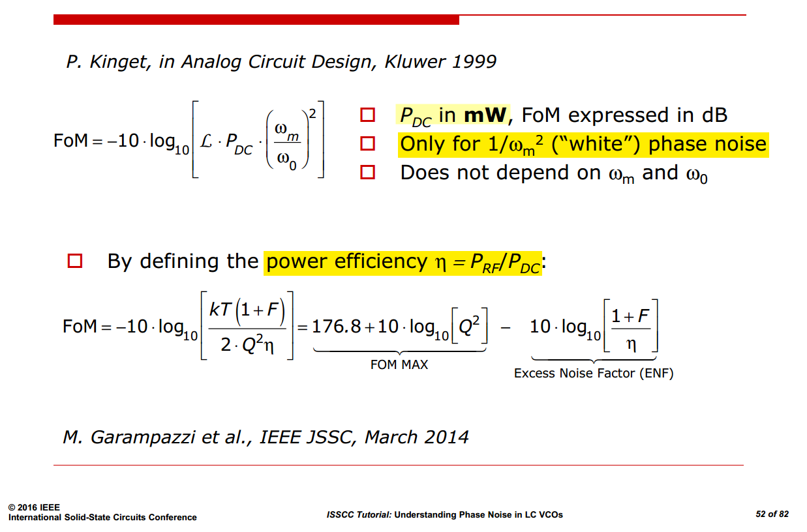

In general, FOM varies with carrier offset, but when reported as a **single number** it is assumed that FOM was calculated using measurements from the **thermal noise region** where the FOM plateaus

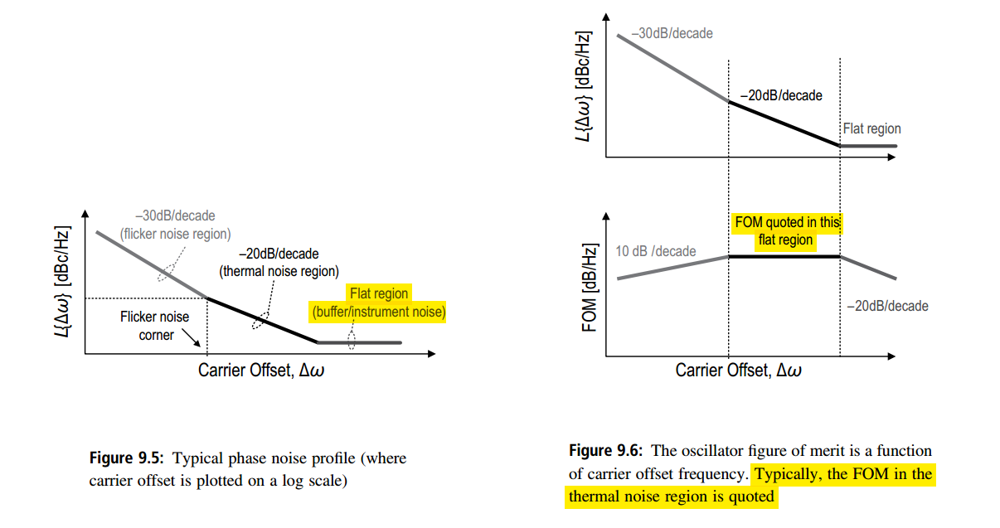


---

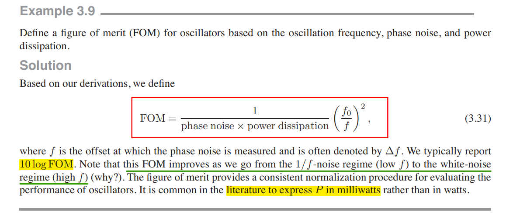

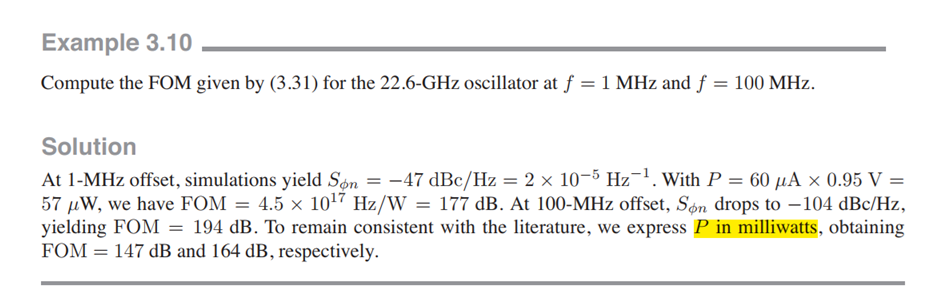

```matlab
Sphi_1M = -47; % dBc/Hz
Sphi_100M = -104; % dBc/Hz
Pdc = 57e-6; % W
f0 = 22.6e9; % Hz

FoM_1M = 10*log10(1/(10^(Sphi_1M/10)*Pdc*1e3)*(f0/1e6)^2);  % 146.5234
FoM_100M = 10*log10(1/(10^(Sphi_100M/10)*Pdc*1e3)*(f0/100e6)^2);  % 163.5234
```


---


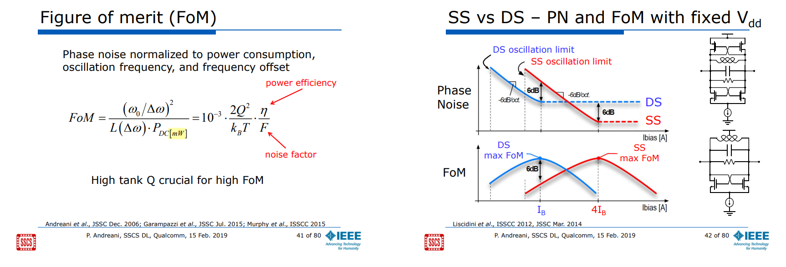


---


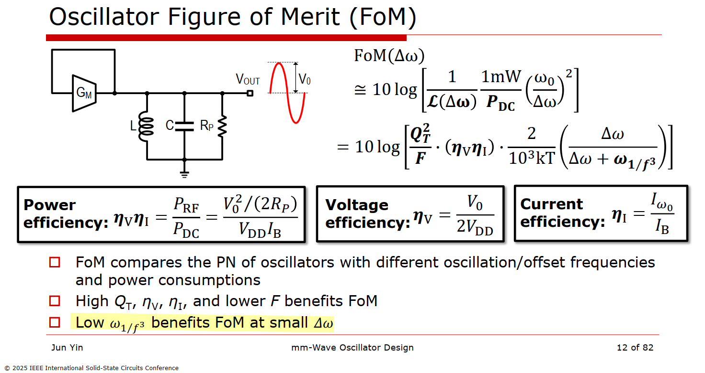
$$
\boxed{\eta = \frac{V_0^2/(2R_P)}{V_{DD} I_B} = \frac{V_0}{2V_{DD}} \frac{V_0}{R_P I_B}=\frac{V_0}{2V_{DD}} \frac{I_{\omega_0}}{I_B}=\eta_V \eta_I}
$$


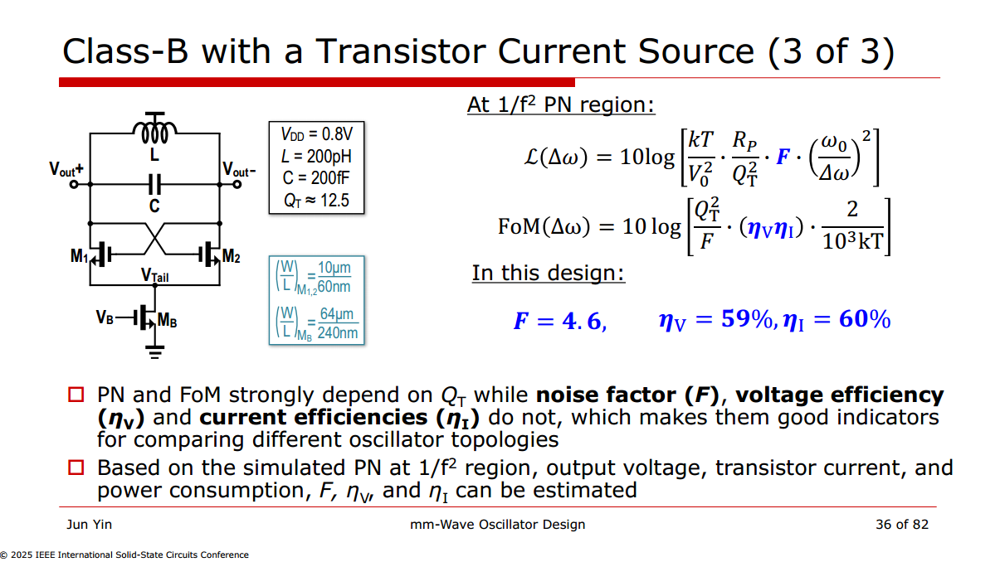

```matlab
kB= 1.380649e-23; T=300;
Vdd = 0.8; L = 200e-12; C = 200e-15;
Qt = 12.5; V0 = 0.94; Idc =4e-3;
PN_1M = -104.62;   % instead of -104
FoM   = 187.58;    % instead of 187.4

f0 = 1/2/pi/sqrt(L*C);
Rp = 2*pi*f0*L*Qt; Iw0 = V0/Rp;
eta_V = V0/2/Vdd; % 0.5875
eta_I = Iw0/Idc; % 0.5945

% noise factor by PN
F = 10^(PN_1M/10)/(kB*T)/Rp/(f0/1e6)^2*V0^2*Qt^2; % 4.5960
% noise factor by FoM
FF = Qt^2*eta_I*eta_V*2/1e3/(kB*T)/10^(FoM/10); % 4.6006
```


## LC Oscillator Structures

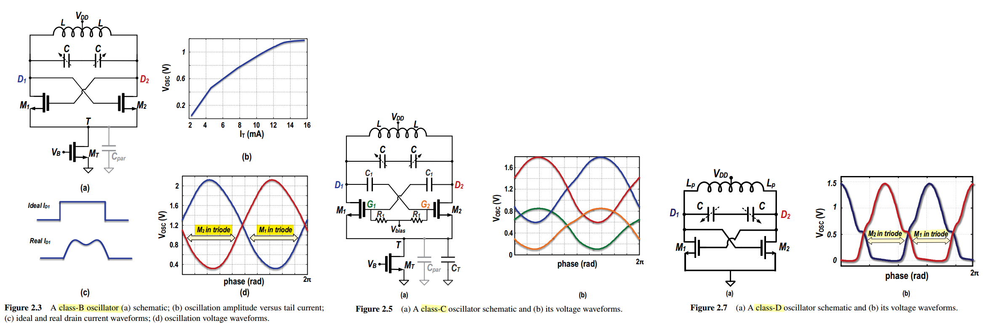

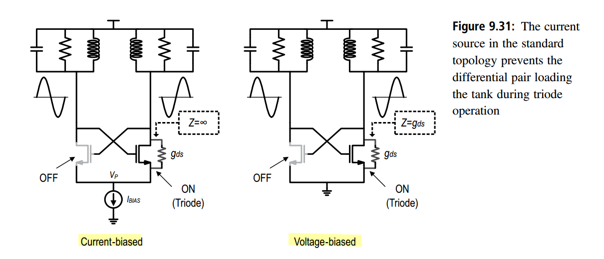

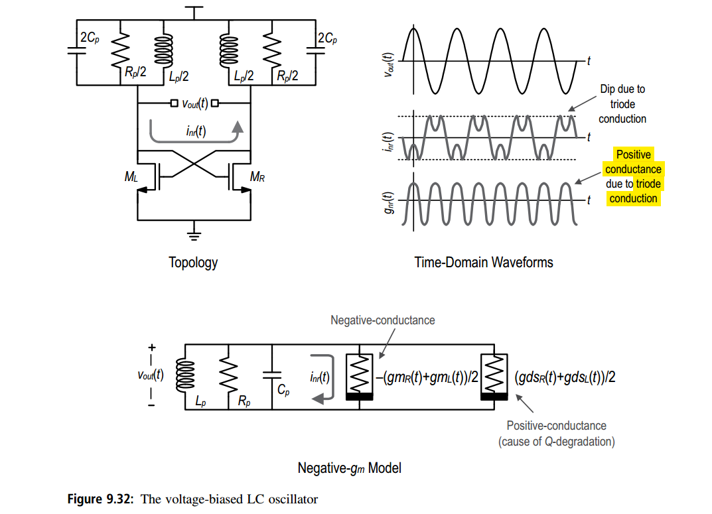

### Class-C / Tail current-shaping CMOS Oscillator

> B. Soltanian and P. Kinget, "A tail current-shaping technique to reduce phase noise in LC VCOs," Proceedings of the IEEE 2005 Custom Integrated Circuits Conference, 2005., San Jose, CA, USA, 2005 [[https://sci-hub.ru/10.1109/CICC.2005.1568734](https://sci-hub.ru/10.1109/CICC.2005.1568734)]
>
> —, "Tail Current-Shaping to Improve Phase Noise in LC Voltage-Controlled Oscillators," in IEEE Journal of Solid-State Circuits, vol. 41, no. 8, pp. 1792-1802, Aug. 2006 [[https://sci-hub.ru/10.1109/JSSC.2006.877273](https://sci-hub.ru/10.1109/JSSC.2006.877273)]
>
> A. Mazzanti and P. Andreani, "Class-C Harmonic CMOS VCOs, With a General Result on Phase Noise," in IEEE Journal of Solid-State Circuits, vol. 43, no. 12, pp. 2716-2729, Dec. 2008 [[https://sci-hub.ru/10.1109/JSSC.2008.2004867](https://sci-hub.ru/10.1109/JSSC.2008.2004867)]

*TODO* &#128197;

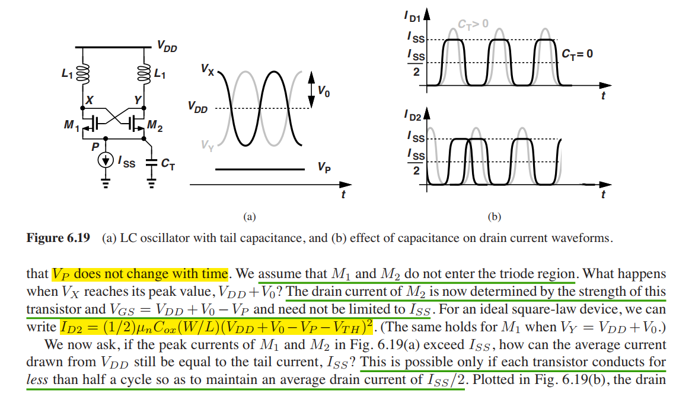

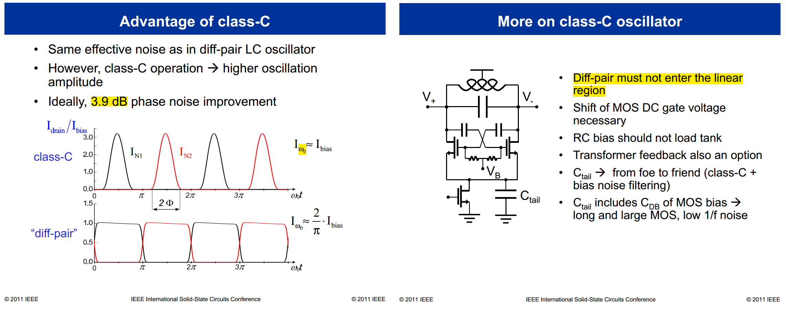


### Class-D CMOS Oscillator

> L. Fanori and P. Andreani, "A 2.5-to-3.3GHz CMOS Class-D VCO," 2013 IEEE International Solid-State Circuits Conference Digest of Technical Papers, San Francisco, CA, USA, 2013 [[https://sci-hub.red/10.1109/ISSCC.2013.6487763](https://sci-hub.red/10.1109/ISSCC.2013.6487763)]
>
> —, "Class-D CMOS Oscillators," in IEEE Journal of Solid-State Circuits, vol. 48, no. 12, pp. 3105-3119, Dec. 2013 [[https://sci-hub.red/10.1109/JSSC.2013.2271531](https://sci-hub.red/10.1109/JSSC.2013.2271531)]
>
> —, "A Class-D CMOS DCO with an on-chip LDO," ESSCIRC 2014 - 40th European Solid State Circuits Conference (ESSCIRC), Venice Lido, Italy, 2014 [[https://sci-hub.red/10.1109/ESSCIRC.2014.6942090](https://sci-hub.red/10.1109/ESSCIRC.2014.6942090)]

*TODO* &#128197;

|                           | Class-B                         | Class-D                         |
| ------------------------- | ------------------------------- | ------------------------------- |
| **oscillation amplitude** | I<sub>dd</sub> & LC-tank losses | V<sub>DD</sub>                  |
| **current consumption**   |                                 | V<sub>DD</sub> & LC-tank losses |


### Class-F CMOS Oscillator

> Huijung Kim, Seonghan Ryu, Yujin Chung, Jinsung Choi and Bumman Kim, "A low phase-noise CMOS VCO with harmonic tuned LC tank," in IEEE Transactions on Microwave Theory and Techniques, vol. 54, no. 7, pp. 2917-2924, July 2006 [[https://sci-hub.ru/10.1109/tmtt.2006.877439](https://sci-hub.ru/10.1109/tmtt.2006.877439)]
>
> M. Babaie and R. B. Staszewski, "Third-harmonic injection technique applied to a 5.87-to-7.56GHz 65nm CMOS Class-F oscillator with 192dBc/Hz FOM," 2013 IEEE International Solid-State Circuits Conference Digest of Technical Papers, San Francisco, CA, USA, 2013 [[https://sci-hub.ru/10.1109/ISSCC.2013.6487764](https://sci-hub.ru/10.1109/ISSCC.2013.6487764)]
>
> —, "A Class-F CMOS Oscillator," in IEEE Journal of Solid-State Circuits, vol. 48, no. 12, pp. 3120-3133, Dec. 2013 [[https://ieeexplore.ieee.org/stamp/stamp.jsp?tp=&arnumber=6576263](https://ieeexplore.ieee.org/stamp/stamp.jsp?tp=&arnumber=6576263)]

*TODO* &#128197;


### Class-F<sub>2</sub> CMOS Oscillator

*TODO* &#128197;


### Class-F<sub>3</sub> CMOS Oscillator

*TODO* &#128197;


### Class-F<sub>23</sub> CMOS Oscillator

*TODO* &#128197;


### Class-F<sup>-1</sup> CMOS Oscillator

> C. -C. Lim, J. Yin, P. -I. Mak, H. Ramiah and R. P. Martins, "An inverse-class-F CMOS VCO with intrinsic-high-Q 1st- and 2nd-harmonic resonances for 1/f2-to-1/f3 phase-noise suppression achieving 196.2dBc/Hz FOM," *2018 IEEE International Solid-State Circuits Conference - (ISSCC)*, San Francisco, CA, USA, 2018 [[paper](https://ime.um.edu.mo/wp-content/uploads/presentations/25bad4fd3e900415db6f2fc2ebf49cc7.pdf)]
>
> —, "An Inverse-Class-F CMOS Oscillator With Intrinsic-High-Q First Harmonic and Second Harmonic Resonances," in *IEEE Journal of Solid-State Circuits*, vol. 53, no. 12, pp. 3528-3539, Dec. 2018 [[https://sci-hub.jp/10.1109/JSSC.2018.2875099](https://sci-hub.jp/10.1109/JSSC.2018.2875099)]
>
> X. Meng, H. Li, P. Chen, J. Yin, P. -I. Mak and R. P. Martins, "Analysis and Design of a 15.2-to-18.2-GHz Inverse-Class-F VCO With a Balanced Dual-Core Topology Suppressing the Flicker Noise Upconversion," in *IEEE Transactions on Circuits and Systems I: Regular Papers*, vol. 70, no. 12, pp. 5110-5123, Dec. 2023

*TODO* &#128197;

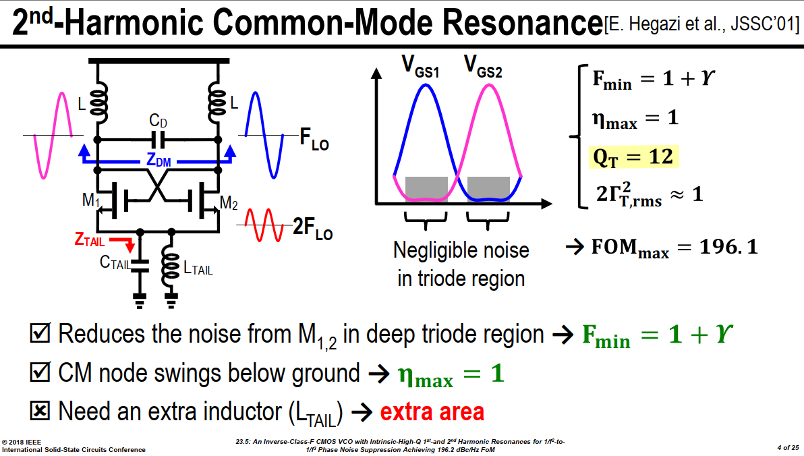

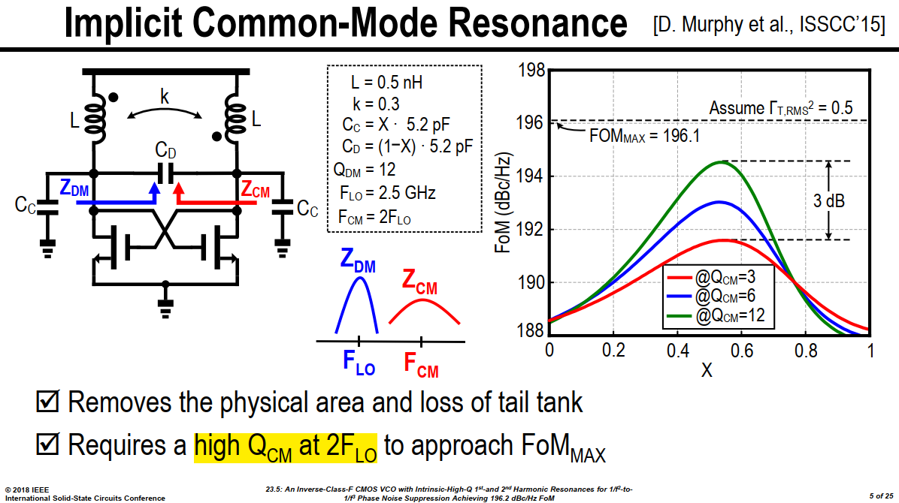

Higher $Q_\text{CM}$ is preferred for better FoM

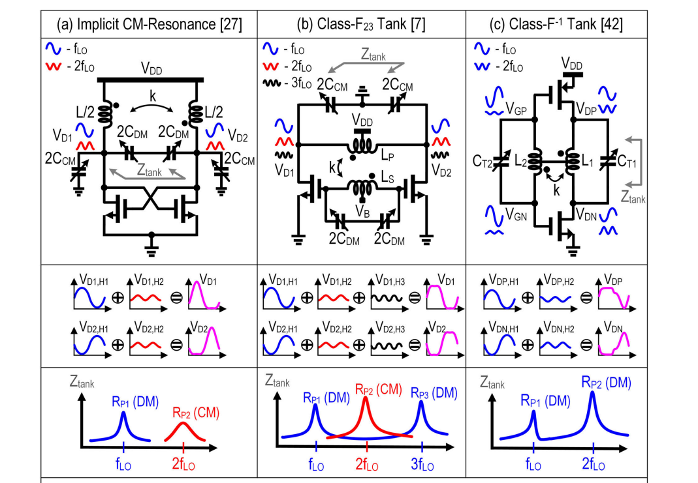

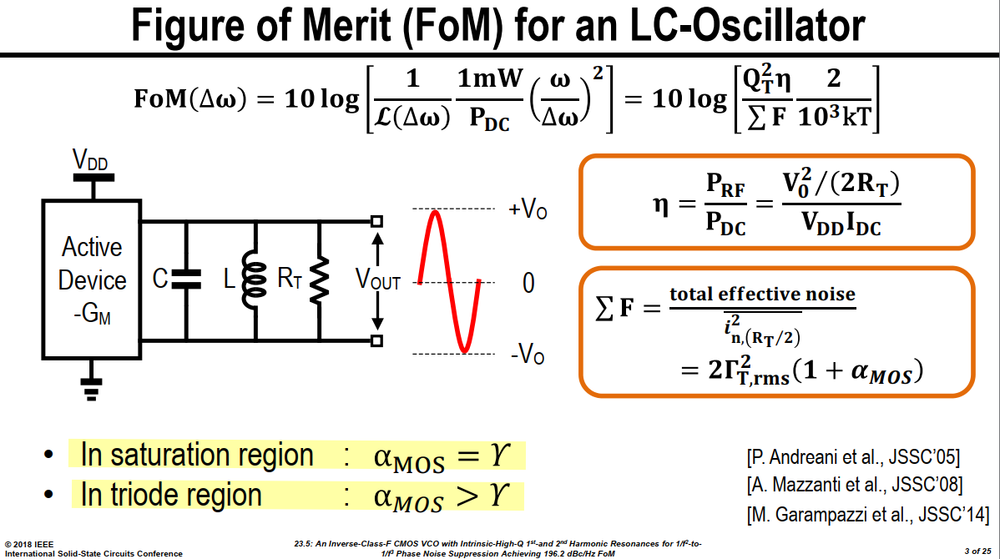


### Colpitts oscillator

> John Rogers, Calvin Plett, and Foster Dai. 2006. Integrated Circuit Design for High-Speed Frequency Synthesis (Artech House Microwave Library). Artech House, Inc., USA.
>
> Jri Lee, "Communication Integrated Circuits.", [[https://cc.ee.ntu.edu.tw/~jrilee/publications/Comm_IC.pdf](https://cc.ee.ntu.edu.tw/~jrilee/publications/Comm_IC.pdf)]

Start-up conditions
$$
\boxed{g_mR_p \geq 4}
$$


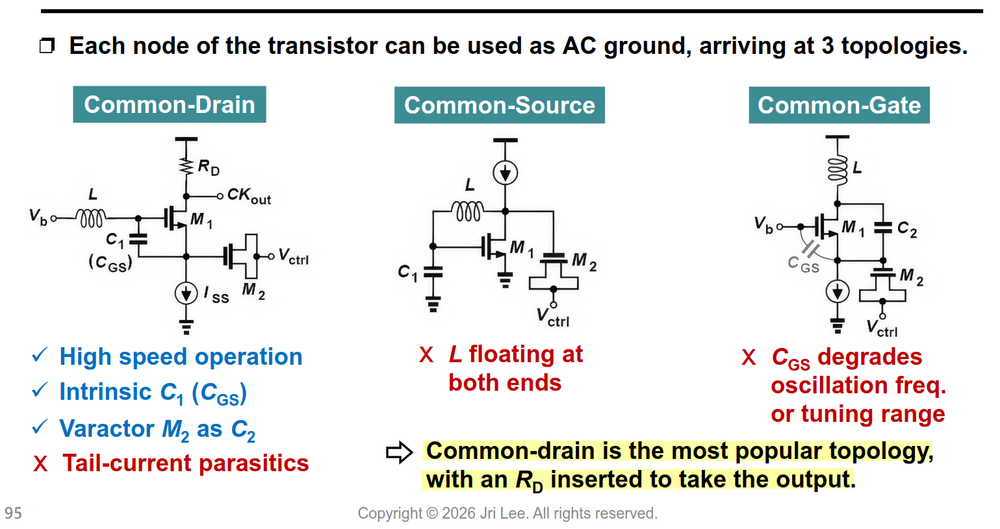

This type of oscillator could be operated with only **one transistor**. In modern times, the abundance of transistors and the desire for differential circuits favors a symmetric Colpitts oscillators

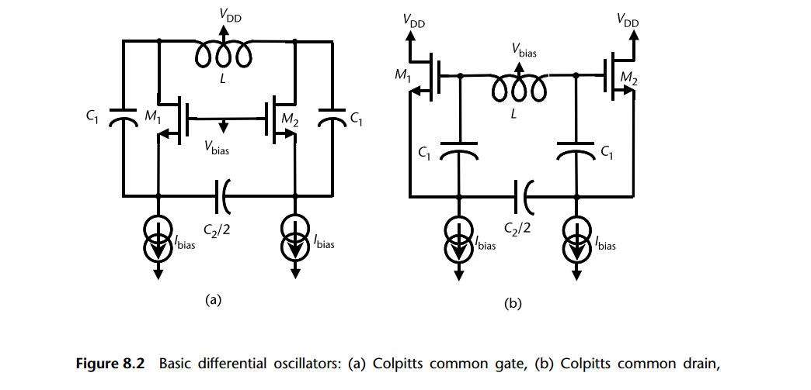

---

***common-source Colpitts***

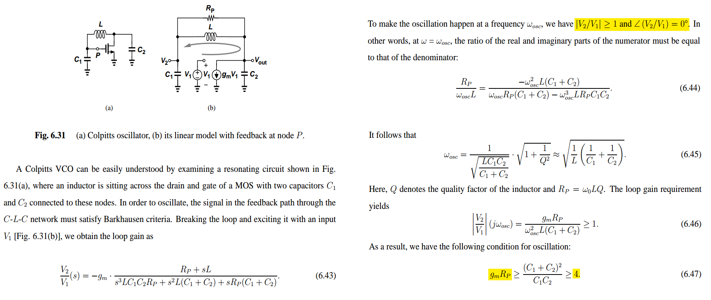

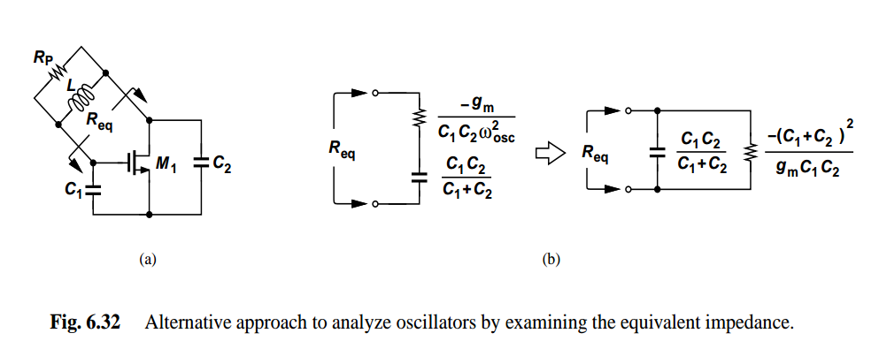

---

***common-gate Colpitts***

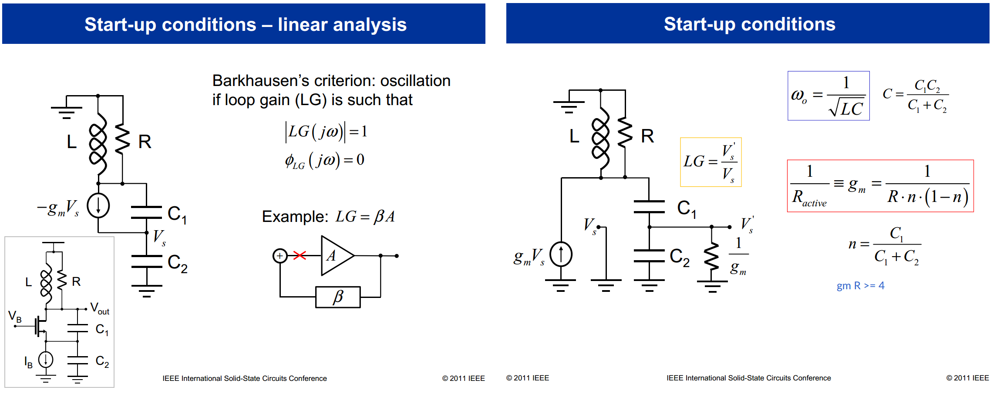

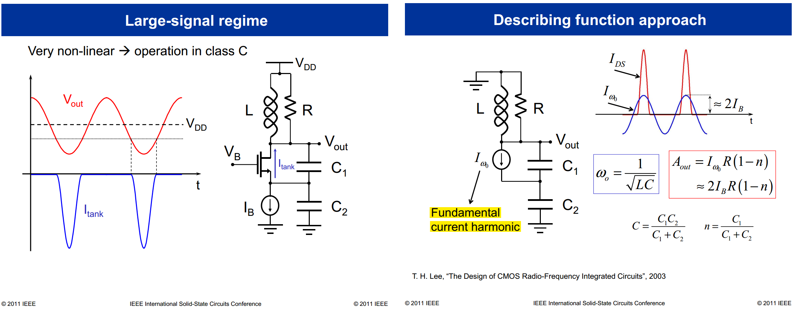

*TODO* &#128197;


## Class-B Oscillators

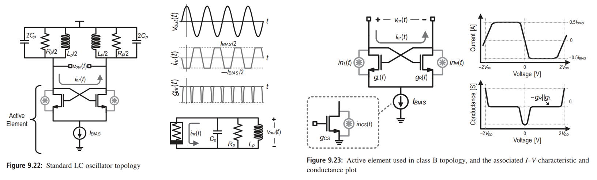

active element provides a negative conductance only when the input voltage is small

For larger voltages, one of the transistors in the differential pair will be off, while the other will be on, and the conductance drops to zero

### Output Amplitude

> Edgar Sanchez-Sinencio. ECEN 665, OSCILLATORS [[https://people.engr.tamu.edu/s-sanchez/665%20Oscillators.pdf](https://people.engr.tamu.edu/s-sanchez/665%20Oscillators.pdf)]


***NMOS Realization — single pair***

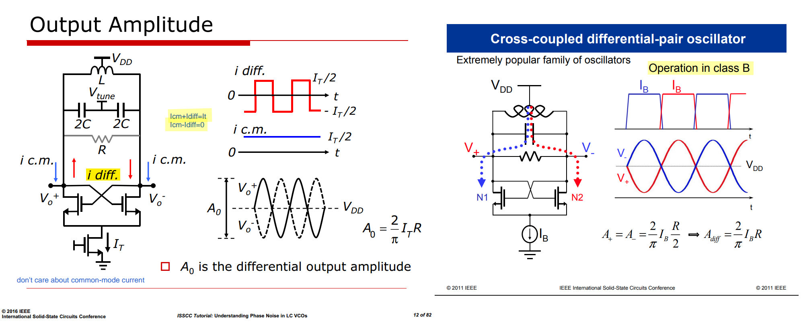

*common mode current don't contribute to output amplitude*

---


> 

---


```matlab
L0 = 1e-9 * 2;
RL0 = 0.25133 * 2;
C0 = 6.333e-12 / 2;
RC0 = 0.50264 * 2;

w0 = 1/sqrt(L0*C0);   % 12.566 Grad/s

QL = w0*L0/RL0;       % 50
QC = 1/(w0*C0)/RC0;   % 25

RLp0 = QL^2 * RL0;
RCp0 = QC^2 * RC0;
Rp = RLp0 * RCp0 / (RLp0 + RCp0);  % 418.8576 Ohm
Qtot_by_L = Rp/(w0*L0);    % 16.6664
Qtot_by_C = Rp*(w0*C0);    % 16.6664

I0 = 0.5e-3;
vp_p = 2/pi * I0 * Rp/2;     % 66.6633 mV

%%%% compute Qtot from simulation waveform
vp_p2p_sim = 132.8e-3;
Qtot_calc_L0 = vp_p2p_sim*pi/2/I0/(w0*L0);   % 16.6006
Qtot_calc_C0 = vp_p2p_sim*pi/2/I0*(w0*C0);   % 16.6006
```

---

---

***CMOS Realization — double pair***

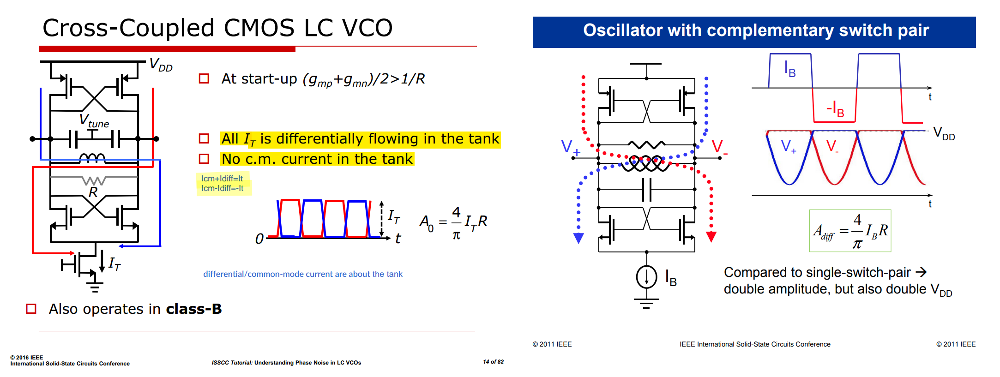

Owing to switch-off PMOS eliminating common mode current, all $I_T$ is differentially flowing in the tank

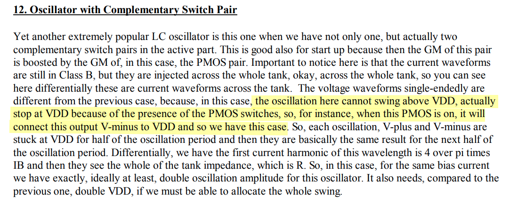


---


> 


---

---

***current limited vs voltage limited***

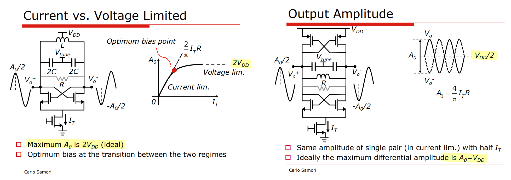


### Class-B Power/Current Efficiency

> Z. Wang, S. Diao, L. He, X. Jiang and F. Lin, "Analysis of Current Efficiency for CMOS Class-B LC Oscillators," in *IEEE Transactions on Circuits and Systems I: Regular Papers*, vol. 62, no. 5, pp. 1345-1352, May 2015 [[https://sci-hub.jp/10.1109/TCSI.2015.2411792](https://sci-hub.jp/10.1109/TCSI.2015.2411792)]
>
> L. Bertulessi, S. Levantino and C. Samori, "Analysis of power efficiency in high-performance class-B oscillators," *2016 12th Conference on Ph.D. Research in Microelectronics and Electronics (PRIME)*, Lisbon, Portugal, 2016 [[https://sci-hub.jp/10.1109/PRIME.2016.7519525](https://sci-hub.jp/10.1109/PRIME.2016.7519525)]

*TODO* &#128197;


### Current-biased & voltage-biased

> S. Gallucci *et al*., "A Low-Noise Digital PLL With an Adaptive Common-Mode Resonance Tuning Technique for Voltage-Biased Oscillators," in *IEEE Journal of Solid-State Circuits*, vol. 60, no. 12, pp. 4572-4586, Dec. 2025

*TODO* &#128197;


## Startup & Geff

***effective or large signal conductance***

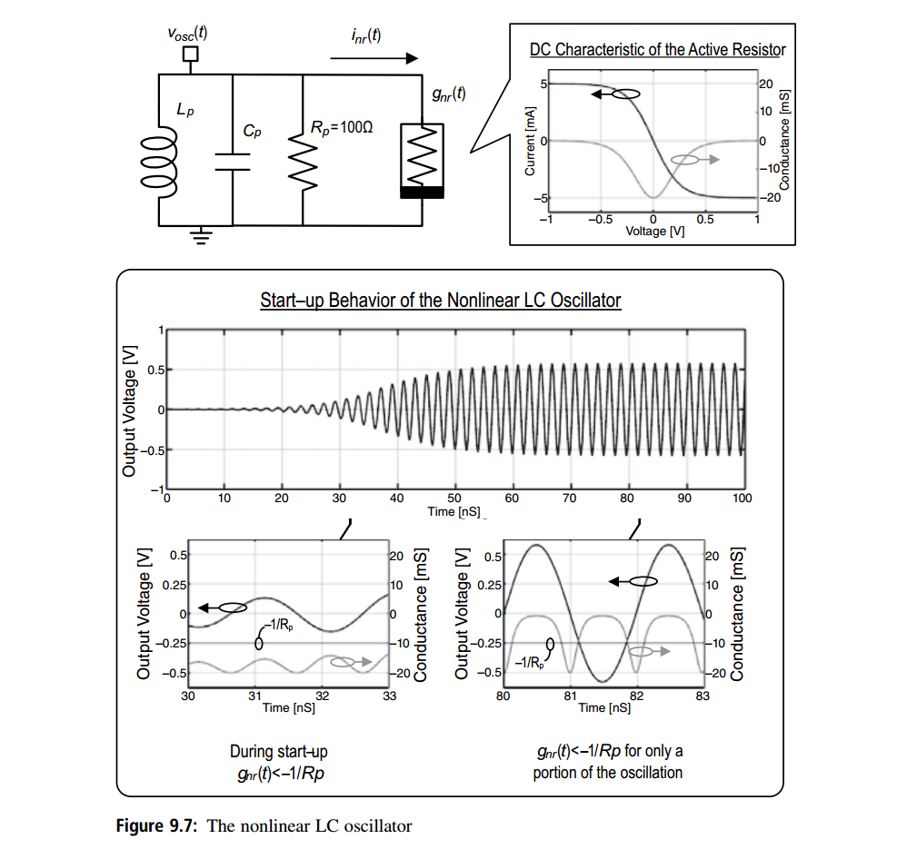

Note that the gnr frequency is twice of oscillator voltage frequency

---

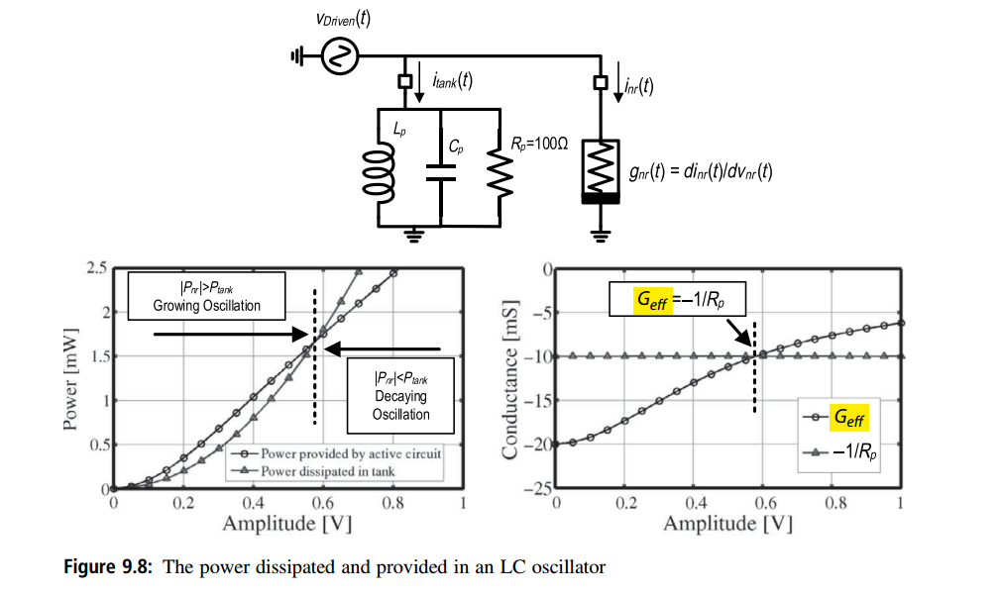

***Power Conservation Requirements***

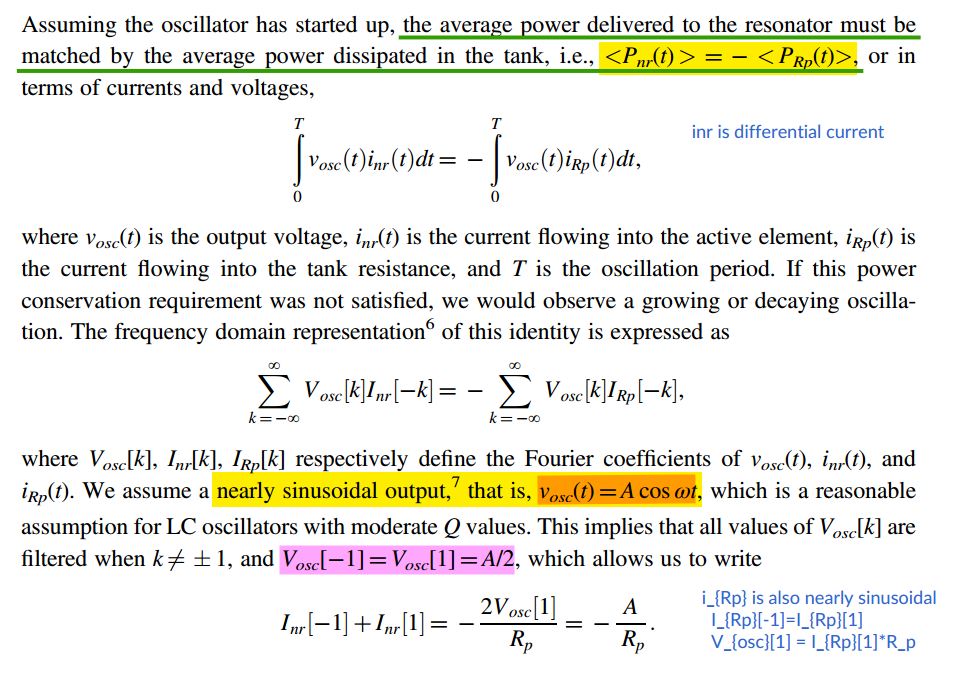

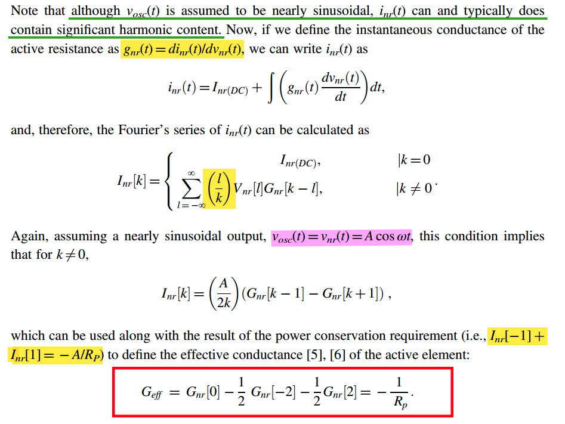

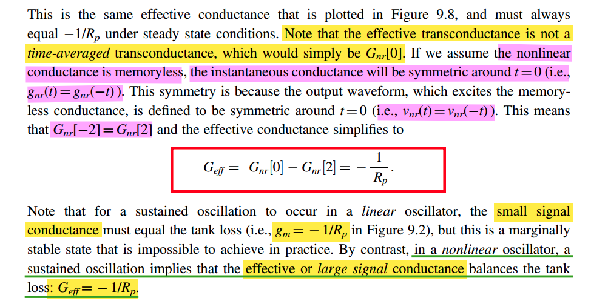

Since the Fourier transform of a real and even function is also real and even, the derivation above assumes that $V_{\text{osc}}(t)$ is real and even, which implies that **$g_{\text{nr}}(t)$ is likewise real and even** — $G_\text{nr}$ is **real and even**

---

---

***[[credits to Claude Fable 5](https://gist.github.com/raytroop/d0aaa3c9fc1a1fe9c1a62e5319e56771)]***

```verilog
`include "constants.vams"
`include "disciplines.vams"

module gnr (p, n, gnr_t);

  inout p, n;
  output gnr_t;
  electrical p, n, gnr_t;

  // defaults reproduce the figure
  parameter real isat = 5.0e-3  from (0:inf);  // saturation current  [A]
  parameter real g0   = 20.0e-3 from (0:inf);  // |g_nr(0)|           [S]

  real v0;     // characteristic voltage isat/g0 (= 0.25 V)
  real th;     // tanh(v/v0)
  real gnr_val; // instantaneous conductance g_nr(t) [S].

  analog begin
    v0    = isat / g0;
    th    = tanh( V(p,n) / v0 );
    gnr_val = -g0 * (1.0 - th*th);      // = -g0 * sech^2(v/v0)

    I(p,n) <+ -isat * th;
    V(gnr_t) <+ gnr_val;
  end

endmodule
```


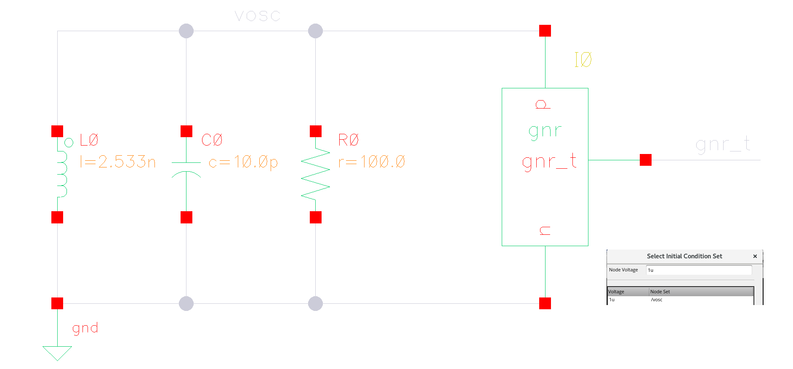

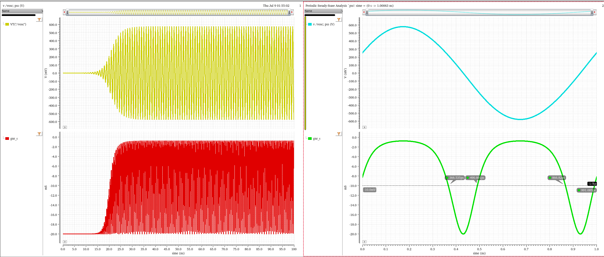

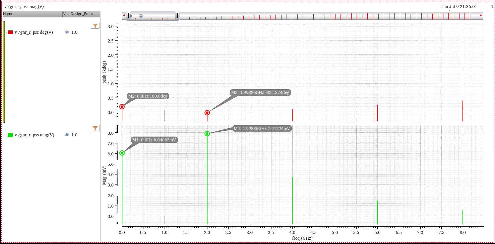

For a symmetric signal $g_\text{nr}(t)$, the phase angle $\theta$ is absorbed into the phase shift, transforming the second-harmonic component as:
$$
h_{2}(t)=\mathcal{Re}\{2Ae^{j(2\omega _{0}t+\theta )}\}\rightarrow h_{2}(t)=2A\cos (2\omega _{0}t)
$$

This yields $G_\text{nr}[2] = G_\text{nr}[-2] = A = 3.956$. Consequently, the effective gain is evaluated as:
$$
G_{\text{eff}}=G_{\text{nr}}[0]-G_{\text{nr}}[2]=-9.9968 \approx -\frac{1}{R_p}
$$

Because the magnitude of $G_\text{nr}[2]$ is comparable to that of $G_\text{nr}[0]$, $G_\text{nr}[2]$ must be retained

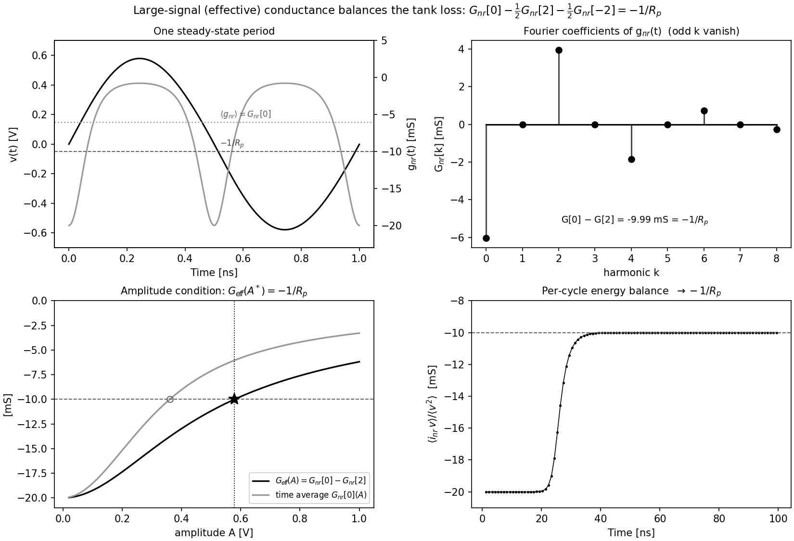


---

***[[credits to Claude Fable 5, GPT 5.6 Sol](https://gist.github.com/raytroop/72608dac30e7b2da6d86745d9ac10e3e)]***

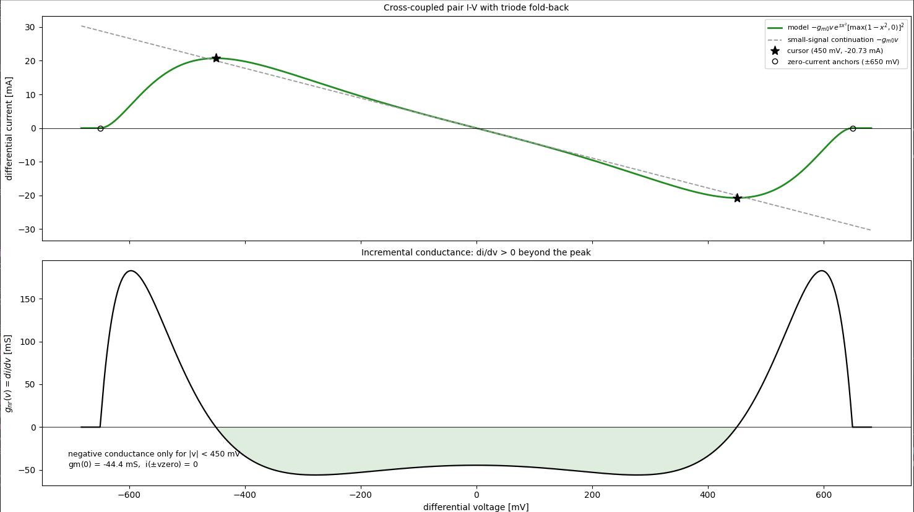

The implemented equation is

$$
i(v)=-g_{m0}v\,e^{s x^2}\left[\max(1-x^2,0)\right]^2, \qquad x=\frac{v}{v_{\mathrm{zero}}}
$$

where $s$ is `shape`.

Parameter meanings:

- `v`: differential voltage in volts.
- `gm0`: magnitude of the small-signal negative conductance in siemens.
- `vzero`: voltage where current reaches zero.
- `shape`: dimensionless parameter controlling where the current peak occurs.

At $v=0$, $\left.\frac{di}{dv}\right|_{v=0}=-g_{m0}$

```python
VPK, IPK, VZERO = 0.45, 20.73e-3, 0.65
vzero = VZERO
xpk = VPK/vzero
shape = 2.0/(1.0 - xpk*xpk) - 1.0/(2.0*xpk*xpk)
gm0 = IPK/(VPK*np.exp(shape*xpk*xpk)*(1.0 - xpk*xpk)**2)


gm0, vzero, shape = 44.447e-3, 650e-3, 2.79770

def f(v):                                       # i_nr(v)
    x = np.asarray(v)/vzero
    window = np.maximum(1.0 - x*x, 0.0)
    ex = np.exp(shape*np.minimum(x*x, 1.0))
    return -gm0*np.asarray(v)*ex*window*window

def gd(v):                                      # g_nr(v) = di/dv
    x = np.asarray(v)/vzero
    window = np.maximum(1.0 - x*x, 0.0)
    inside = np.abs(x) < 1.0
    ex = np.exp(shape*np.minimum(x*x, 1.0))
    value = -gm0*ex * (
        window*window*(1.0 + 2.0*shape*x*x) - 4.0*x*x*window)
    return np.where(inside, value, 0.0)


# ---- one-cycle FFT sweep (pure sinusoid) ---------------------------------------
Nfft = 8192
th_fft = 2*np.pi*np.arange(Nfft)/Nfft    # one cycle; do not duplicate 2*pi

def fft_series(A):
    gq = gd(A*np.cos(th_fft))
    C = np.fft.fft(gq)/Nfft              # C[k]: complex Fourier coefficient
    C0 = C[0].real
    C2mag = abs(C[2])
    Geff_fft = C0 - C2mag
    return C0, C2mag, Geff_fft
```

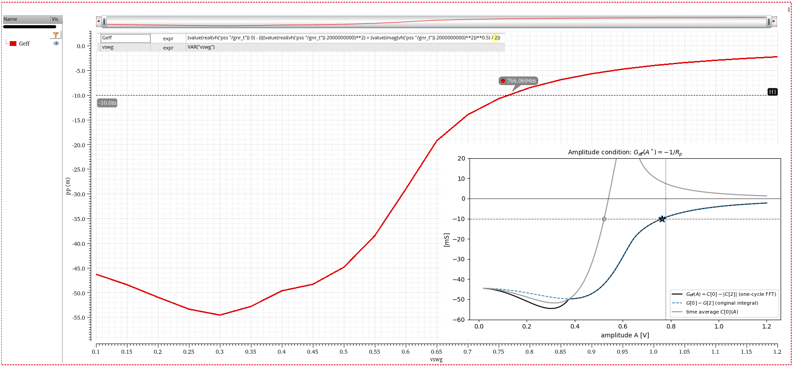


---

---

***Derivation of $I_{nr}[k]$ Using Fourier Series and Fourier Transform***

Let

$$
v_{nr}(t)=\sum_{l=-\infty}^{\infty}V_{nr}[l]e^{jl\omega_0 t}
$$

$$
g_{nr}(t)=\sum_{m=-\infty}^{\infty}G_{nr}[m]e^{jm\omega_0 t}
$$

and

$$
i_{nr}(t)=\sum_{k=-\infty}^{\infty}I_{nr}[k]e^{jk\omega_0 t}.
$$

The starting equation is

$$
\frac{d i_{nr}(t)}{dt}
=
g_{nr}(t)\frac{d v_{nr}(t)}{dt}.
$$

---

***Method 1: Directly Using Fourier Series***

Differentiate $v_{nr}(t)$:

$$
\frac{d v_{nr}(t)}{dt}
=
\sum_l jl\omega_0 V_{nr}[l]e^{jl\omega_0 t}
$$

Multiply by $g_{nr}(t)$:

$$
g_{nr}(t)\frac{d v_{nr}(t)}{dt}
=
\left(\sum_m G_{nr}[m]e^{jm\omega_0 t}\right)
\left(\sum_l jl\omega_0 V_{nr}[l]e^{jl\omega_0 t}\right)
$$

$$
=
\sum_m\sum_l
jl\omega_0 V_{nr}[l]G_{nr}[m]
e^{j(l+m)\omega_0 t}
$$

For the $k$-th harmonic,

$$
l+m=k
$$

so

$$
m=k-l.
$$

Therefore,

$$
\left[g_{nr}(t)\frac{d v_{nr}(t)}{dt}\right]_k
=
\sum_l jl\omega_0 V_{nr}[l]G_{nr}[k-l]
$$

But

$$
\frac{d i_{nr}(t)}{dt}
=
\sum_k jk\omega_0 I_{nr}[k]e^{jk\omega_0 t}
$$

so the $k$-th coefficient is

$$
jk\omega_0 I_{nr}[k].
$$

Therefore, for $k\neq 0$,

$$
jk\omega_0 I_{nr}[k]
=
\sum_l jl\omega_0 V_{nr}[l]G_{nr}[k-l]
$$

so

$$
\boxed{
I_{nr}[k]
=
\sum_{l=-\infty}^{\infty}
\frac{l}{k}
V_{nr}[l]G_{nr}[k-l],
\qquad k\neq 0
}
$$

The $l/k$ comes from

$$
\frac{jl\omega_0}{jk\omega_0}
=
\frac{l}{k}.
$$

---

***Method 2: Indirectly Using Fourier Transform***

Use the continuous-time Fourier transform of a periodic signal:

$$
x(t)=\sum_k X[k]e^{jk\omega_0 t}
$$

has Fourier transform

$$
X(\omega)=2\pi\sum_k X[k]\delta(\omega-k\omega_0).
$$

So

$$
V_{nr}(\omega)
=
2\pi\sum_l V_{nr}[l]\delta(\omega-l\omega_0)
$$

and

$$
G_{nr}(\omega)
=
2\pi\sum_m G_{nr}[m]\delta(\omega-m\omega_0).
$$

Now,

$$
\frac{d v_{nr}(t)}{dt}
\quad \Longleftrightarrow \quad
j\omega V_{nr}(\omega).
$$

Therefore,

$$
j\omega V_{nr}(\omega)
=
2\pi\sum_l jl\omega_0 V_{nr}[l]\delta(\omega-l\omega_0).
$$

Since

$$
\frac{d i_{nr}(t)}{dt}
=
g_{nr}(t)\frac{d v_{nr}(t)}{dt},
$$

multiplication in time becomes convolution in frequency:

$$
\mathcal{F}\left\{
g_{nr}(t)\frac{d v_{nr}(t)}{dt}
\right\}
=
\frac{1}{2\pi}
G_{nr}(\omega)*
\left(j\omega V_{nr}(\omega)\right).
$$

Substitute the impulse-train spectra:

$$
=
\frac{1}{2\pi}
\left(
2\pi\sum_m G_{nr}[m]\delta(\omega-m\omega_0)
\right)
*
\left(
2\pi\sum_l jl\omega_0 V_{nr}[l]\delta(\omega-l\omega_0)
\right)
$$

$$
=
2\pi
\sum_m\sum_l
jl\omega_0
G_{nr}[m]V_{nr}[l]
\delta(\omega-(m+l)\omega_0).
$$

For the $k$-th harmonic,

$$
m+l=k
$$

so

$$
m=k-l.
$$

Thus,

$$
\mathcal{F}\left\{
g_{nr}(t)\frac{d v_{nr}(t)}{dt}
\right\}
=
2\pi
\sum_k
\left[
\sum_l jl\omega_0 V_{nr}[l]G_{nr}[k-l]
\right]
\delta(\omega-k\omega_0).
$$

But

$$
\frac{d i_{nr}(t)}{dt}
\quad \Longleftrightarrow \quad
j\omega I_{nr}(\omega).
$$

Since

$$
I_{nr}(\omega)
=
2\pi\sum_k I_{nr}[k]\delta(\omega-k\omega_0),
$$

we get

$$
j\omega I_{nr}(\omega)
=
2\pi\sum_k jk\omega_0 I_{nr}[k]\delta(\omega-k\omega_0).
$$

Equating the $k$-th impulse coefficient:

$$
jk\omega_0 I_{nr}[k]
=
\sum_l jl\omega_0 V_{nr}[l]G_{nr}[k-l].
$$

Therefore,

$$
\boxed{
I_{nr}[k]
=
\sum_l
\frac{l}{k}
V_{nr}[l]G_{nr}[k-l],
\qquad k\neq 0
}
$$


## Frequency Modulation Effects

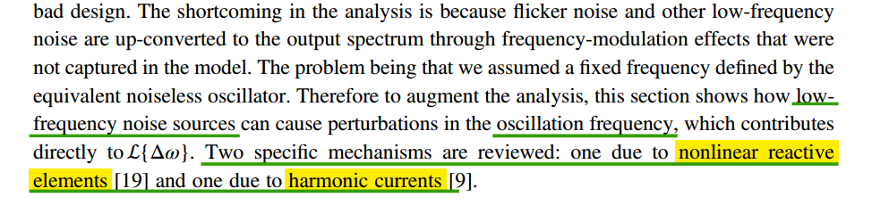

### C<sub>eff</sub> - large signal capacitance

> E. Hegazi and A. A. Abidi, "Varactor characteristics, oscillator tuning curves, and AM-FM conversion," in *IEEE Journal of Solid-State Circuits*, vol. 38, no. 6, pp. 1033-1039, June 2003 [[https://sci-hub.jp/10.1109/JSSC.2003.811968](https://sci-hub.jp/10.1109/JSSC.2003.811968)]

*TODO* &#128197;




$$
\boxed{\oint i_{nr}\,dv_{nr}
=
\int_0^T i_{nr}(t)\frac{dv_{nr}(t)}{dt}\,dt}
$$
It is the **signed area-related quantity** swept in the $i$-$v$ plane **over one period**, which is used as a *memory detector* — a one-line mathematical test for whether an element's behavior depends on its history


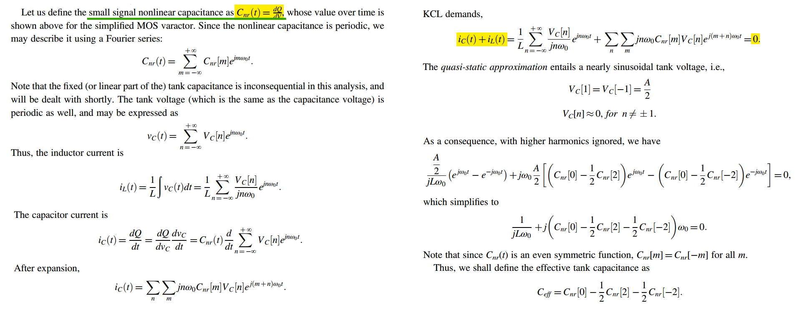

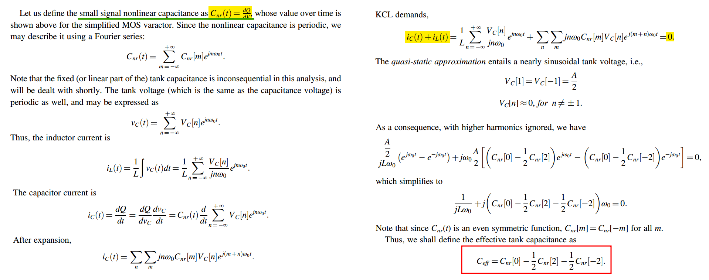


### Groszkowski's Effect

> credits to *GPT-5.5 High*

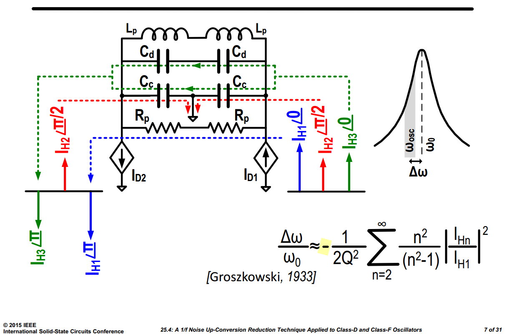

**Groszkowski's effect** is an oscillator **frequency shift caused by harmonic content** in the oscillation waveform/current

For a **periodic** LC oscillation, t**he average stored energy must balance** between $C$ and $L$

**average energy balance** $\overline{W_L}=\overline{W_C}$, or equivalently
$$
\sum L I_n^2 = \sum C V_n^2
$$
$I_n$ here is the **reactive tank current harmonic**, not directly the transistor current harmonic $I_{Hn}$ in the slide

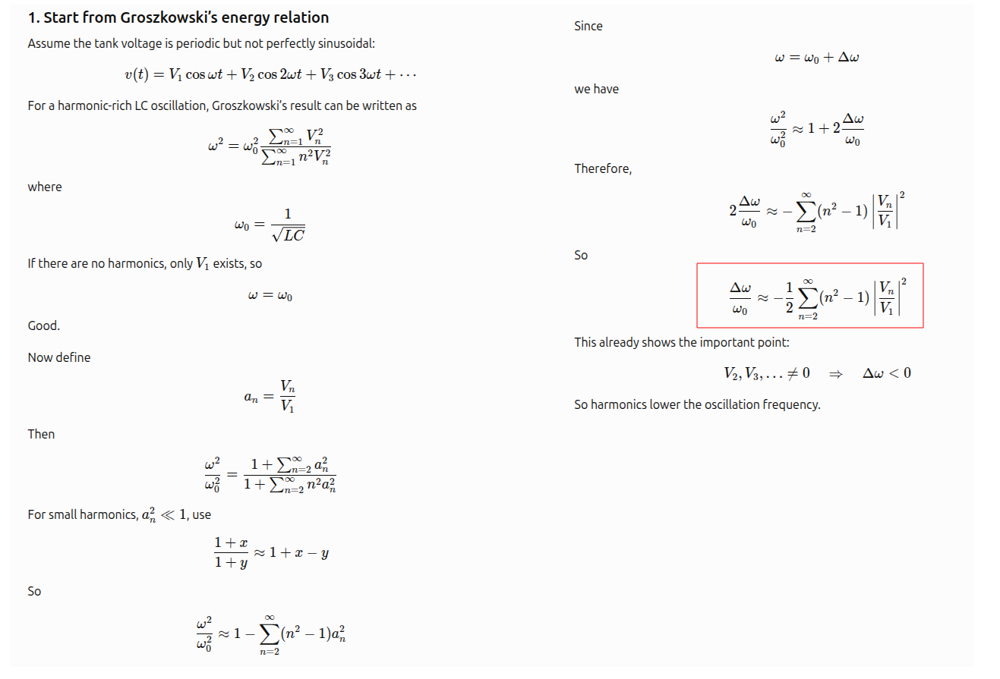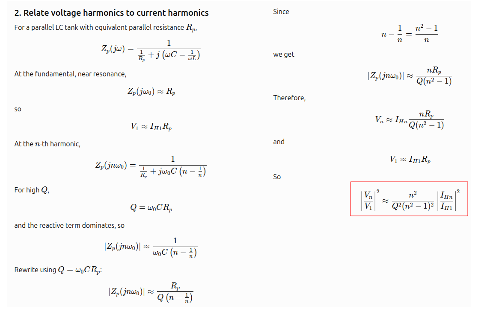

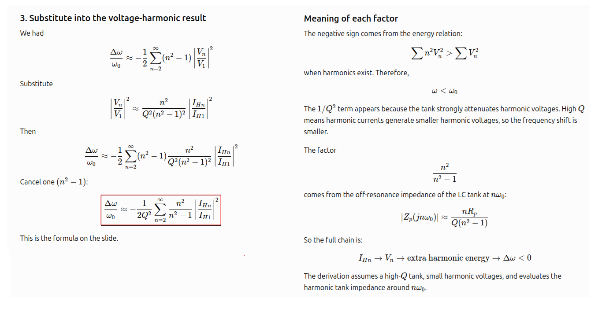

---

---


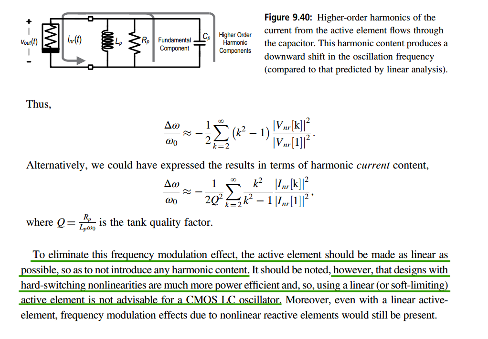


## On-Chip Inductors and Transformer

> hai-kun, 片上电感的版图优化方法 [[https://zhuanlan.zhihu.com/p/37479700](https://zhuanlan.zhihu.com/p/37479700)]
>
> —, 电磁场仿真与片上电感的优化讲座实录 [[https://zhuanlan.zhihu.com/p/37942671](https://zhuanlan.zhihu.com/p/37942671)]
>
> —, 片上变压器的应用与设计 （二）多峰值谐振腔 [[https://zhuanlan.zhihu.com/p/45799676](https://zhuanlan.zhihu.com/p/45799676)]
>
> Sunderarajan S. Mohan, Modeling, Design and Optimization of On-Chip Inductors and Transformers [[http://www-smirc.stanford.edu/papers/Orals99s-mohan.pdf](http://www-smirc.stanford.edu/papers/Orals99s-mohan.pdf)]


### 8-shaped inductor

> NXP BV, US8183971B2, *8-shaped inductor* [[pdf](https://patentimages.storage.googleapis.com/41/b1/ff/e53534a029c34d/US8183971.pdf)]
>
> Marvell, US9077310B2, *Pseudo-8-shaped inductor* [[pdf](https://patentimages.storage.googleapis.com/36/ad/f1/d8b740bb7b80d9/US9697938.pdf)]
> 
> P. Guan et al., "8-Shaped Inductors: An Essential Addition to RFIC Designers' Toolbox," in IEEE Open Journal of the Solid-State Circuits Society, vol. 4, pp. 131-146, 2024 [[pdf](https://ieeexplore.ieee.org/stamp/stamp.jsp?arnumber=10668829)]
>
> M. Pisati et al., "A 243-mW 1.25–56-Gb/s Continuous Range PAM-4 42.5-dB IL ADC/DAC-Based Transceiver in 7-nm FinFET," in IEEE Journal of Solid-State Circuits, vol. 55, no. 1, pp. 6-18, Jan. 2020 [[https://sci-hub.ru/10.1109/JSSC.2019.2936307](https://sci-hub.ru/10.1109/JSSC.2019.2936307)]

An **8-shaped (figure-8) inductor** is a specialized on-chip, high-Q component used to mitigate **electromagnetic coupling** and reduce **frequency pulling** in VCOs by generating opposing, self-canceling magnetic fields

*TODO* &#128197;


---

> Zou, Wei & Zou, Xuecheng & Ren, Daming & Zhang, Kefeng & Liu, Dongsheng & Ren, Zhixiong. (2019). 2.49-4.91 GHz wideband VCO with optimised 8-shaped inductor. Electronics Letters. [[https://sci-hub.jp/10.1049/el.2018.6012](https://sci-hub.jp/10.1049/el.2018.6012)]


### Transformer

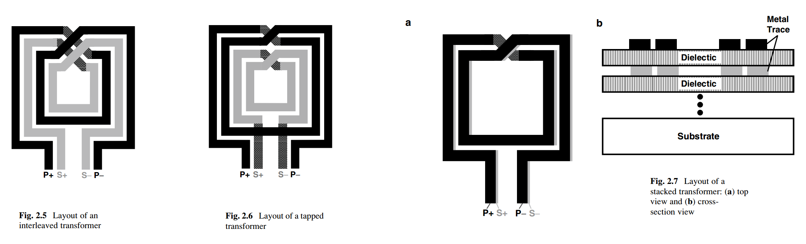

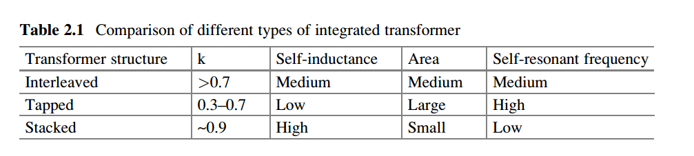


## On-Chip Capacitor

***monolithic C-V characteristic***

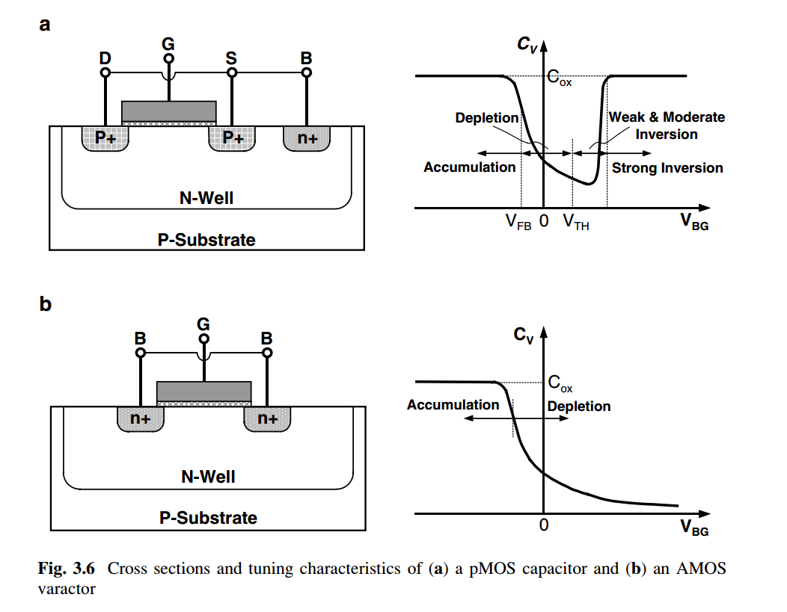

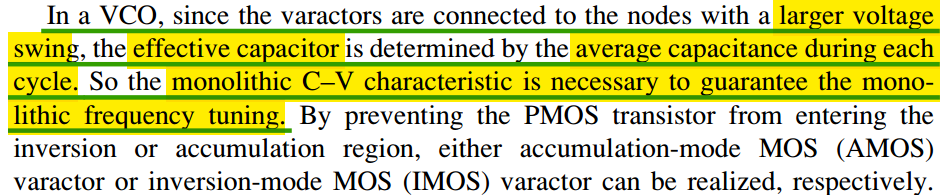


### MOS varactor

characterized by by ***quality factor*** and ***capacitance ratio factor***

 ***tuning range***

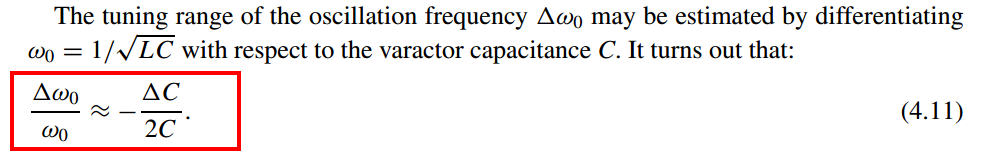
$$
\Delta\omega_0 = \frac{\partial \omega_0}{\partial C}\cdot \Delta C = -\frac{\Delta C}{2C}\cdot \omega_0
$$
For tuning range, use the magnitude:
$$
TR_{\text{approx}}
\approx
\frac{1}{2}\frac{C_{\max}-C_{\min}}{C_{\text{avg}}}
$$
where $C_{\text{avg}}=\frac{C_{\max}+C_{\min}}{2}$ 


Therefore:
$$
TR_{\text{approx}}
\approx
\frac{1}{2}
\frac{C_{\max}-C_{\min}}
{(C_{\max}+C_{\min})/2}
$$
Now divide numerator and denominator by $C_{\min}$:
$$
TR_{\text{approx}}
=
\frac{C_{\max}/C_{\min}-1}
{C_{\max}/C_{\min}+1}
$$
Since $k=\frac{C_{\max}}{C_{\min}}$

we get
$$
\boxed{
TR_{\text{approx}}
=
\frac{k-1}{k+1}
}
$$


---

---


 ***capacitance ratio factor***

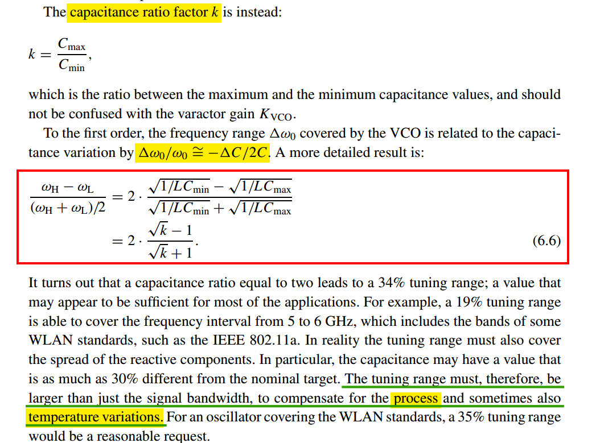

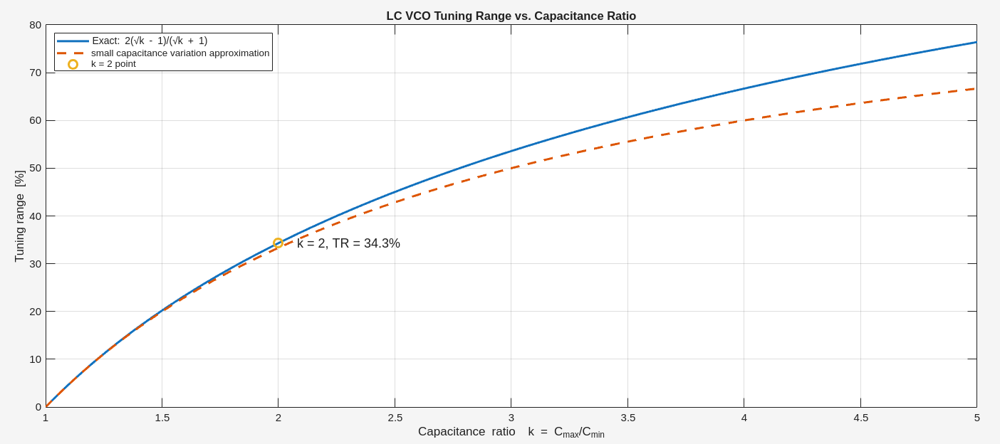


---

---

***quality factor***

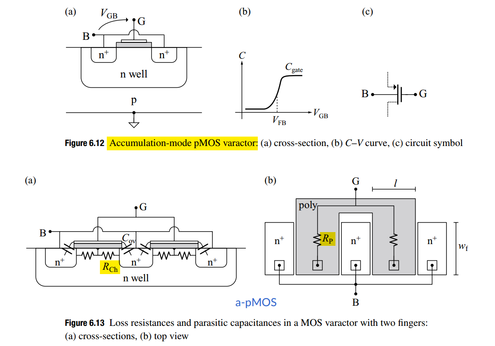

Two resistances, both in series with the variable capacitance:

- **R<sub>Ch</sub>** is the **channel resistance** of the accumulation layer
- **R<sub>P</sub>** is the **gate resistance** due to the finite polysilicon conductivity

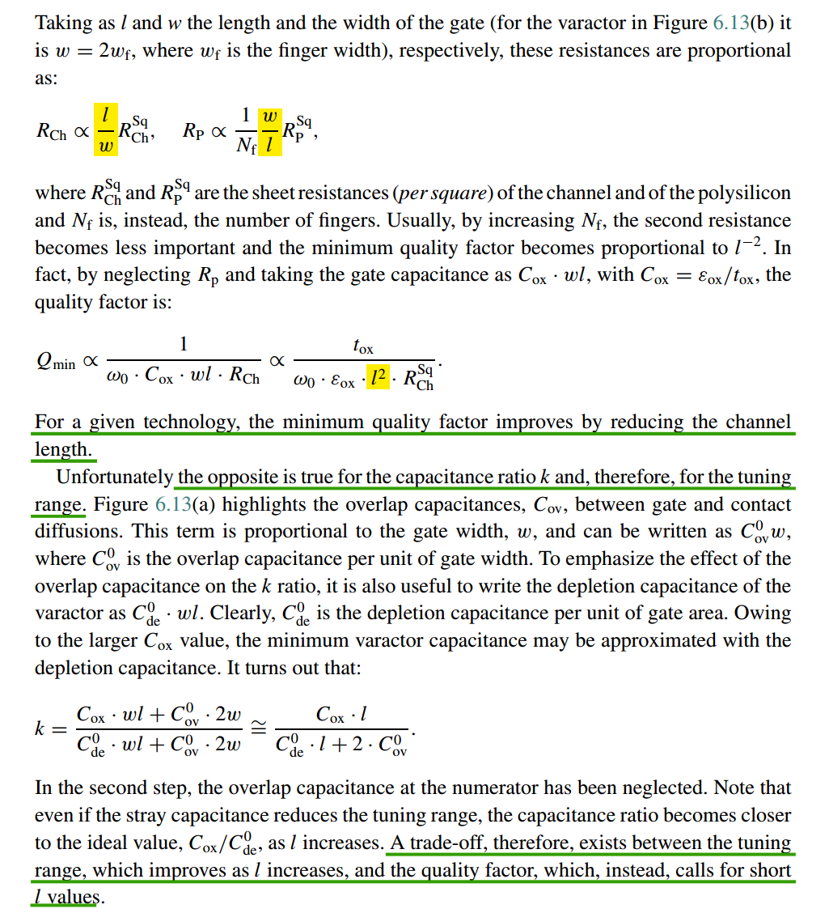


### Capacitor Bank

> B. Sadhu and R. Harjani, "Capacitor bank design for wide tuning range LC VCOs: 850MHz-7.1GHz (157%)," Proceedings of 2010 IEEE International Symposium on Circuits and Systems, Paris, France, 2010 [[https://sci-hub.st/10.1109/ISCAS.2010.5537040](https://sci-hub.st/10.1109/ISCAS.2010.5537040)]

*TODO* &#128197;


>  large value KVCO is not favorable due to noise and possibly spurs at the control voltage


## LC Tank Q


---

---

***Definitions of Q***


Assuming **RLC** oscillator waveform is $V(t)=V_0\sin\omega_0 t$, $\omega_0 = \frac{1}{\sqrt{LC}}$ is resonant frequency

Energy stored
$$
E_t = \frac{1}{2}LI_0^2 = \frac{1}{2}CV_0^2
$$
Energy Dissipated per Cycle
$$
E_d = \frac{V_0^2}{2R}\frac{2\pi}{\omega_0}
$$
For $Q_4$, with $I_0=C\omega_0V_0$
$$
\boxed{Q_4  = 2\pi\frac{E_s}{E_d} = R\omega_0C = \frac{R}{\omega_0L}}
$$

which holds **at resonance**


For $Q_3$, suppose RLC tank is driven by $V_o\cos \omega t$ voltage source, then

*Peak Magnetic Energy*
$$
E_{pL} = \frac{1}{2}LI_0^2 = \frac{1}{2}L\left(\frac{V_0}{L\omega}\right)^2
$$
*Peak Electric Energy*
$$
E_{pC} = \frac{1}{2}CV_0^2
$$
with *Energy Lost per Cycle* $E_d = \frac{V_0^2}{2R}\frac{2\pi}{\omega_0}$, we have
$$
Q_3 = \frac{E_{pL} - E_{pC}}{E_d} = \left(\frac{1}{L\omega^2}-C\right)R\omega=\frac{R}{L\omega}\left(1 - \frac{\omega^2}{\omega^2_{SR}}\right)
$$


---

> EEE 211 ANALOG ELECTRONICS [[https://www.ee.bilkent.edu.tr/~eee211/LectureNotes/Chapter%20-%2004.pdf](https://www.ee.bilkent.edu.tr/~eee211/LectureNotes/Chapter%20-%2004.pdf)]


---

---

***Tank Impedance Near Resonance***


$$
\boxed{|Z(\omega_0\pm \omega_m)|^2 \cong \frac{1}{(2\omega_m C)^2}}\qquad\qquad \boxed{|Z(\omega_0\pm \omega_m)|^2 \cong R^2\left(\frac{\omega_0}{2Q\omega_m}\right)^2}
$$


## Temperature Compensation

> A. L. S. Loke *et al*., "A versatile low-jitter PLL in 90-nm CMOS for SerDes transmitter clocking," *Proceedings of the IEEE 2005 Custom Integrated Circuits Conference, 2005.*, San Jose, CA, USA, 2005 [[slides](https://ewh.ieee.org/r5/denver/sscs/Presentations/2005_09_Loke.pdf), [paper](https://sci-hub.se/10.1109/CICC.2005.1568728)]


$$
f=\frac{1}{2\pi\sqrt{L_p C_p}} = \frac{1}{2\pi\sqrt{L_s\frac{Q_L^2+1}{Q_L^2} C_s\frac{Q_C^2}{Q_C^2+1}}} = \frac{1}{2\pi\sqrt{L_sC_s}}\cdot \sqrt{\frac{1+1/Q_c^2}{1+1/Q_L^2}}
$$
Assuming the tank's Q is limited by the inductor's quality factor $Q_L$, i.e. $Q_L\ll Q_c$
$$
f\approx  \frac{1}{2\pi\sqrt{L_sC_s}}\cdot \sqrt{1-\frac{1}{Q_L^2}} =f_0\cdot\sqrt{1-\frac{1}{Q_L^2}}
$$
where $f_0=\frac{1}{\sqrt{L_sC_s}}$ is the first order approximation of the resonant frequency


## Automatic Amplitude Control (AAC)

**peak detector**, **envelope detector**

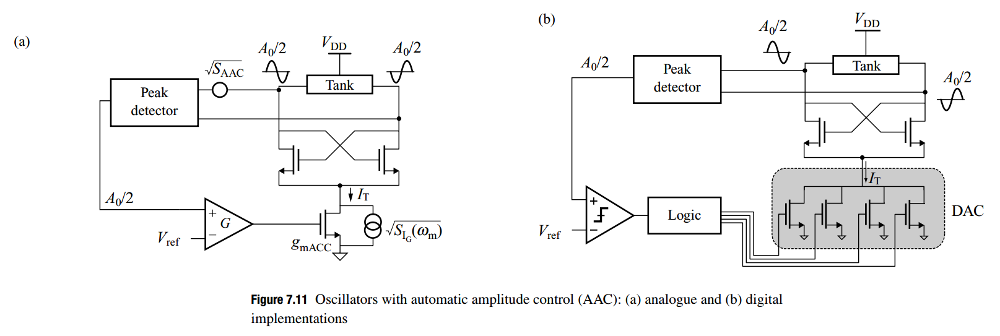

The digital AAC regulates the amplitude without increasing the amplitude modulation noise

---


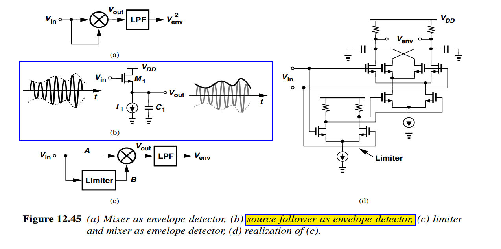

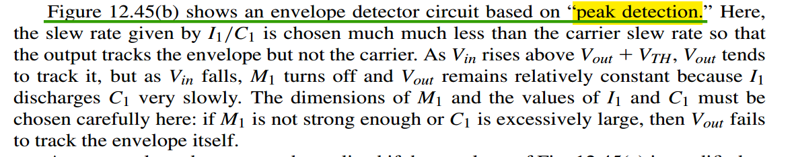


## PN Reduction Techniques

> Y. Hu, T. Siriburanon and R. B. Staszewski, "Oscillator Flicker Phase Noise: A Tutorial," in *IEEE Transactions on Circuits and Systems II: Express Briefs*, vol. 68, no. 2, pp. 538-544, Feb. 2021 [[paper](https://ieeexplore.ieee.org/stamp/stamp.jsp?tp=&arnumber=9286468)] [[slides](https://www.researchgate.net/publication/352173342_Oscillator_Flicker_Phase_Noise_A_Tutorial)]

### Tank current Harmonics

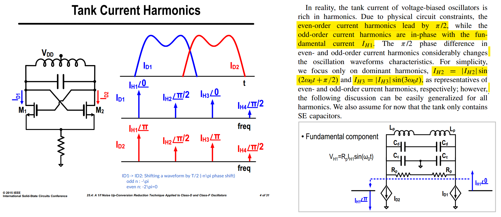

Due to **MOS nonlinearity**

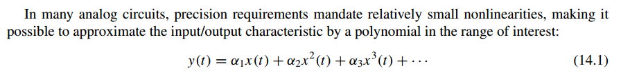

with $\boxed{x(t) = \sin(\omega_0 t)}$
$$
y_{\sin}(t) = \alpha_1 \sin(\omega_0 t)+ \alpha_2\frac{1-\cos(2\omega_0t)}{2} + \alpha_3 \frac{3\sin(\omega_0 t) -\sin(3\omega_0 t)}{4} +\alpha_4\frac{3-4\cos(2\omega_0 t)+\cos(4\omega_0 t)}{8}
$$

and using $\cos \theta = \sin(\theta + \pi/2)$

$$
y_{\sin}(t) = \underbrace{\frac{\alpha_2}{2} + \frac{3\alpha_4}{8}}_{\text{DC}}
+ \underbrace{\left(\alpha_1 + \frac{3\alpha_3}{4}\right)\sin(\omega_0 t)}_{\omega_0}
- \underbrace{\frac{\alpha_2 + \alpha_4}{2}\,\sin\!\left(2\omega_0 t + \textcolor{blue}{\frac{\pi}{2}}\right)}_{2\omega_0}
- \underbrace{\frac{\alpha_3}{4}\,\sin(3\omega_0 t)}_{3\omega_0}
+ \underbrace{\frac{\alpha_4}{8}\,\sin\!\left(4\omega_0 t + \textcolor{blue}{\frac{\pi}{2}}\right)}_{4\omega_0}
$$

with $\boxed{x(t) = \cos(\omega_0 t)}$
$$
y_{\cos}(t) = \underbrace{\frac{\alpha_2}{2}+\frac{3\alpha_4}{8}}_{\text{DC}}
+ \underbrace{\left(\alpha_1+\frac{3\alpha_3}{4}\right)\cos(\omega_0 t)}_{\omega_0}
+ \underbrace{\frac{\alpha_2+\alpha_4}{2}\cos(2\omega_0 t)}_{2\omega_0}
+ \underbrace{\frac{\alpha_3}{4}\cos(3\omega_0 t)}_{3\omega_0}
+ \underbrace{\frac{\alpha_4}{8}\cos(4\omega_0 t)}_{4\omega_0}
$$
They're the same waveform; one is the other shifted in time by a quarter of the fundamental period:
$$
y_{\cos}(t) = y_{\sin}\!\left(t + \frac{T}{4}\right), \qquad T = \frac{2\pi}{\omega_0}
$$

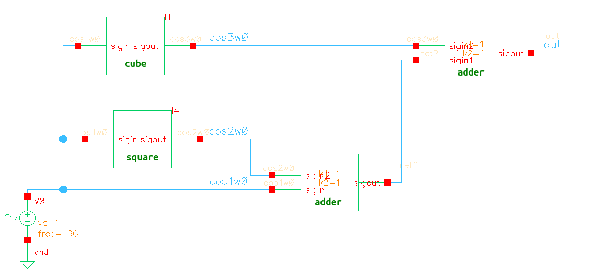

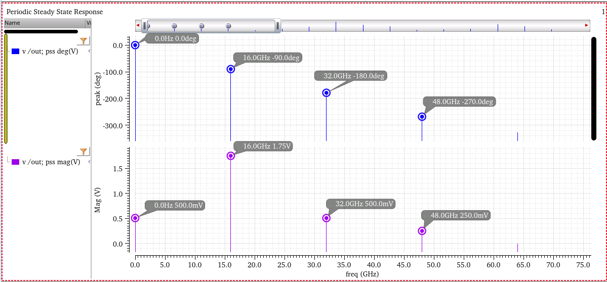

given $\Delta t$ is constant
$$
\boxed{\Delta t = \frac{\Delta\Phi_N}{N\omega_0} \implies \Delta\Phi_N = N\Delta\Phi_0 \quad (\Delta t = \text{constant})}
$$
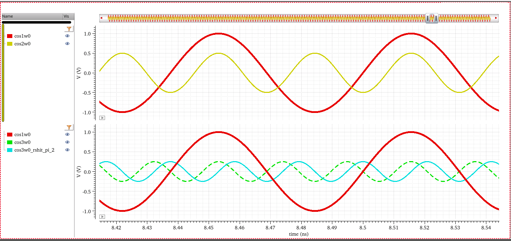


### Harmonic Shaping

> E. Hegazi, H. Sjoland and A. Abidi, "A filtering technique to lower oscillator phase noise," *2001 IEEE International Solid-State Circuits Conference. Digest of Technical Papers. ISSCC (Cat. No.01CH37177)*, San Francisco, CA, USA, 2001 [[paper](https://engineering.purdue.edu/oxidemems/conferences/isscc2001/DATA/D23_4.pdf), [slides](https://engineering.purdue.edu/oxidemems/conferences/isscc2001/DATA/SS23_4.pdf)]
>
> —, "A filtering technique to lower LC oscillator phase noise," in *IEEE Journal of Solid-State Circuits*, vol. 36, no. 12, pp. 1921-1930, Dec. 2001 [[https://people.engr.tamu.edu/spalermo/ecen620/filtering_tech_lc_osc_hegazi_jssc_2001.pdf](https://people.engr.tamu.edu/spalermo/ecen620/filtering_tech_lc_osc_hegazi_jssc_2001.pdf)]
>
> A. Bevilacqua and P. Andreani, "An Analysis of  1/f  Noise to Phase Noise Conversion in CMOS Harmonic Oscillators," in IEEE Transactions on Circuits and Systems I: Regular Papers, vol. 59, no. 5, pp. 938-945, May 2012
>
> D. Murphy, H. Darabi and H. Wu, "Implicit Common-Mode Resonance in LC Oscillators," in IEEE Journal of Solid-State Circuits, vol. 52, no. 3, pp. 812-821, March 2017, [[https://sci-hub.st/10.1109/JSSC.2016.2642207](https://sci-hub.st/10.1109/JSSC.2016.2642207)]
>
> —, "25.3 A VCO with implicit common-mode resonance," 2015 IEEE International Solid-State Circuits Conference - (ISSCC) Digest of Technical Papers, San Francisco, CA, USA, 2015 [[https://sci-hub.st/10.1109/ISSCC.2015.7063116](https://sci-hub.st/10.1109/ISSCC.2015.7063116)]
>
> M. Shahmohammadi, M. Babaie and R. B. Staszewski, "25.4 A 1/f noise upconversion reduction technique applied to Class-D and Class-F oscillators," 2015 IEEE International Solid-State Circuits Conference - (ISSCC) Digest of Technical Papers, San Francisco, CA, USA, 2015 [[https://sci-hub.ru/10.1109/ISSCC.2015.7063117](https://sci-hub.ru/10.1109/ISSCC.2015.7063117)]
>
> —, "A 1/f Noise Upconversion Reduction Technique for Voltage-Biased RF CMOS Oscillators," in IEEE Journal of Solid-State Circuits, vol. 51, no. 11, pp. 2610-2624, Nov. 2016 [[https://pure.tudelft.nl/ws/portalfiles/portal/30880387/07571191.pdf](https://pure.tudelft.nl/ws/portalfiles/portal/30880387/07571191.pdf)]
>
> Michael Perrott August 12, 2008, Short Course On Phase-Locked Loops and Their Applications Day 2, AM Lecture *Basic Building Blocks Voltage-Controlled Oscillators* [[https://www.cppsim.com/PLL_Lectures/day2_am.pdf](https://www.cppsim.com/PLL_Lectures/day2_am.pdf)]
>
> *Yunbo Huang, Zunsong Yang*, et al., "A 7.0-to-8.6GHz Balanced Class-F-1 VCO with a Trifilar Transformer-Based Tank Achieving 194.5dBc/Hz FoM," IEEE MTT-S Radio Frequency Integrated Circuits (**RFIC**), June 2026


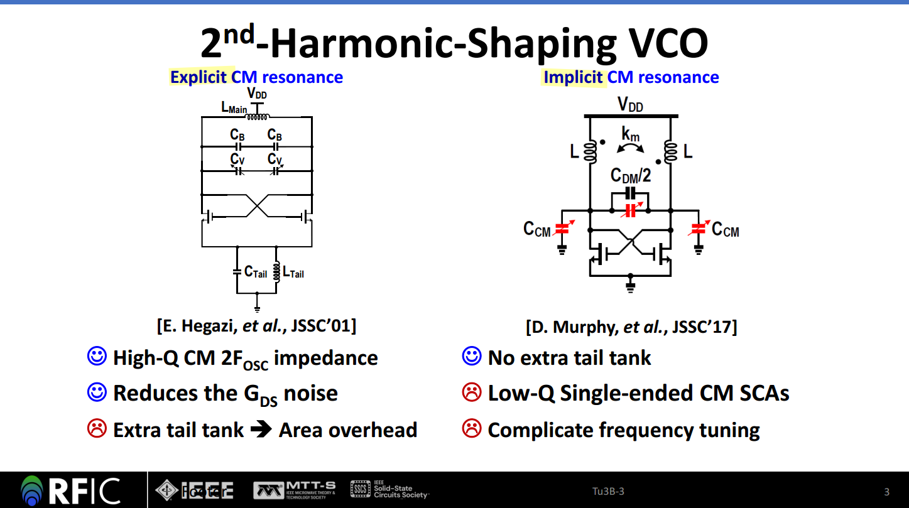

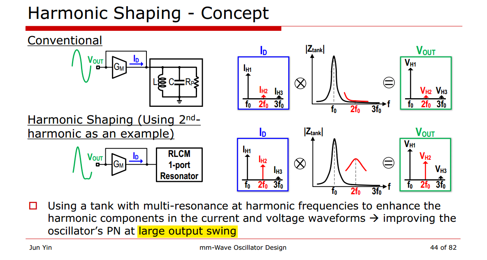

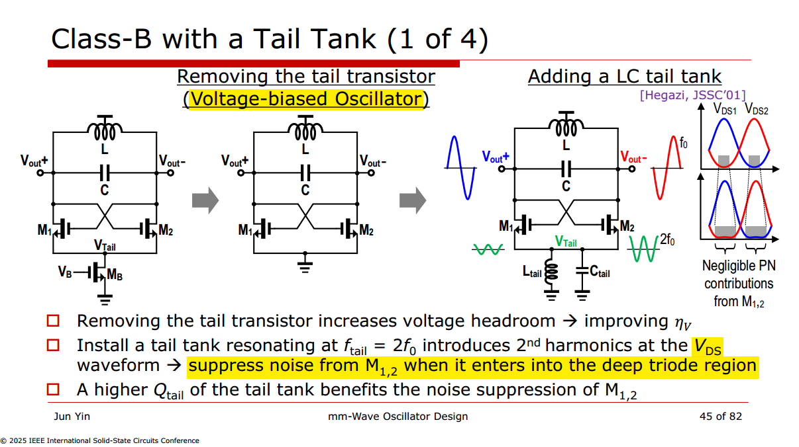

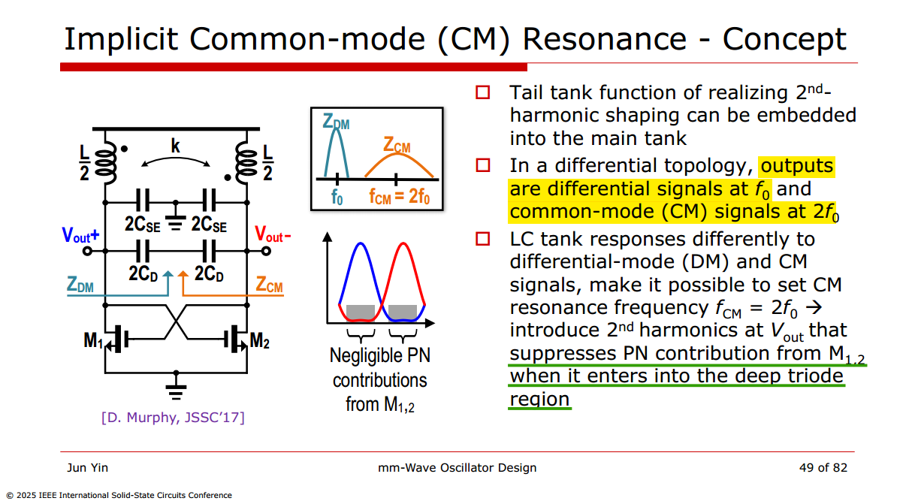

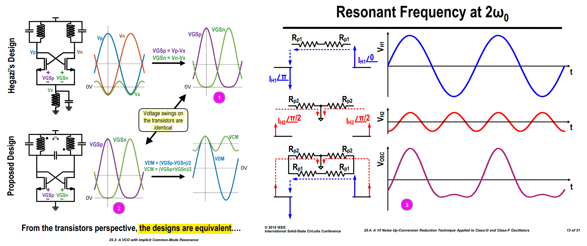


---

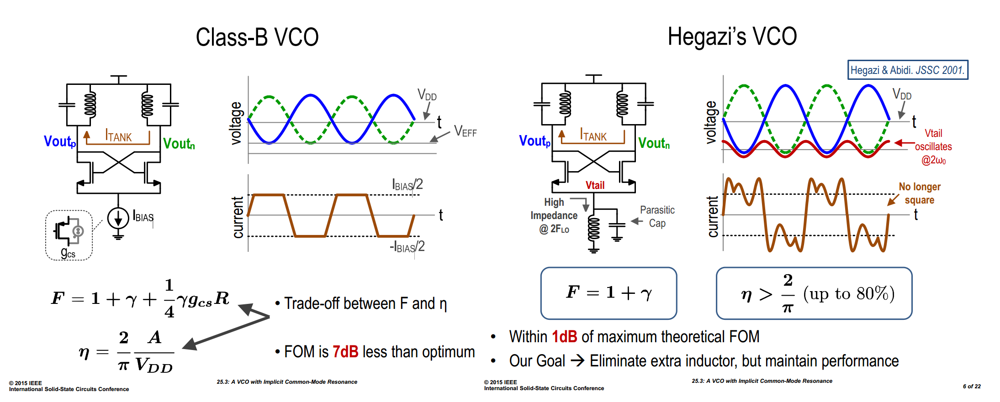


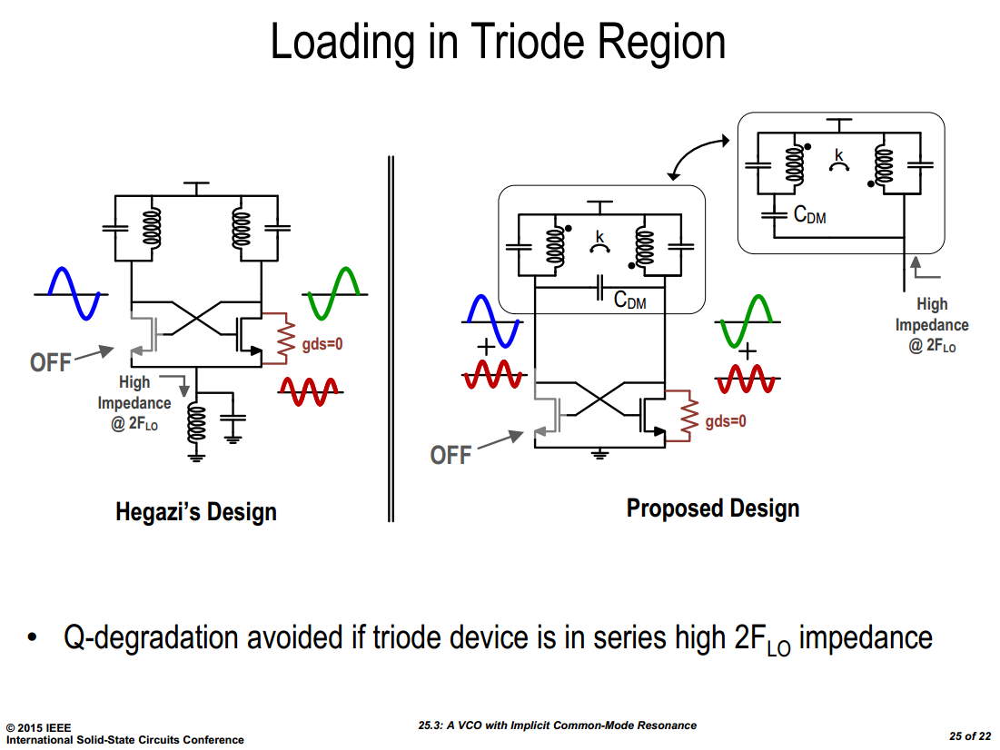

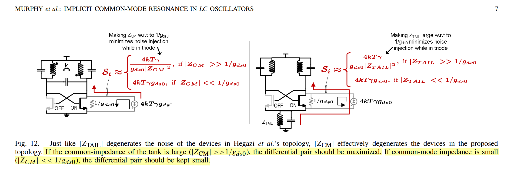


---

---

> S. Gallucci *et al*., "A Low-Noise Digital PLL With an Adaptive Common-Mode Resonance Tuning Technique for Voltage-Biased Oscillators," in *IEEE Journal of Solid-State Circuits*, vol. 60, no. 12, pp. 4572-4586, Dec. 2025
> P. Liu et al., "A 128Gb/s ADC/DAC Based PAM-4 Transceiver with >45dB Reach in 3nm FinFET," 2025 Symposium on VLSI Technology and Circuits (VLSI Technology and Circuits), Kyoto, Japan, 2025

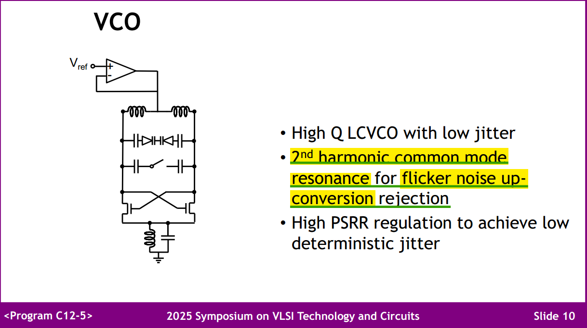


### Narrowing of conduction angle

> Y. Hu, T. Siriburanon and R. B. Staszewski, "Intuitive Understanding of Flicker Noise Reduction via Narrowing of Conduction Angle in Voltage-Biased Oscillators," in IEEE Transactions on Circuits and Systems II: Express Briefs, vol. 66, no. 12, pp. 1962-1966, Dec. 2019 [[https://sci-hub.se/10.1109/TCSII.2019.2896483](https://sci-hub.se/10.1109/TCSII.2019.2896483)]

*TODO* &#128197;


### Gate-drain phase shift

*TODO* &#128197;


## simulation in oscillator

### varactor simulation

Three methods:

- PSS +PSP (*pay attention to port termination and voltage amplitude*)
- PSS +PAC
- PSS Only


---

`rms` only scale magnitude $1/\sqrt{2}$ but retain phase for complex number, like harmonic

- `mag(vh('pss "/P5"))` = `mag(rms(vh('pss "/P5"))) * (2**0.5)` 
- `phaseDegUnwrapped(vh('pss "/P5"))` = `phaseDegUnwrapped(rms(vh('pss "/P5")))`


## reference

Pietro Andreani. ISSCC 2011 T1: Integrated LC oscillators

—. ISSCC 2017 F2: Integrated Harmonic Oscillators

—. SSCS Distinguished Lecture: RF Harmonic Oscillators Integrated in Silicon Technologies [[https://www.ieeetoronto.ca/wp-content/uploads/2020/06/DL-Toronto.pdf](https://www.ieeetoronto.ca/wp-content/uploads/2020/06/DL-Toronto.pdf)]

—. ESSCIRC 2019 Tutorials: RF Harmonic Oscillators Integrated in Silicon Technologies [[https://youtu.be/k1I9nP9eEHE](https://youtu.be/k1I9nP9eEHE)]

—. "Harmonic Oscillators in CMOS—A Tutorial Overview," in IEEE Open Journal of the Solid-State Circuits Society, vol. 1, pp. 2-17, 2021 [[https://ieeexplore.ieee.org/stamp/stamp.jsp?tp=&arnumber=9530265](https://ieeexplore.ieee.org/stamp/stamp.jsp?tp=&arnumber=9530265)]

A. A. Abidi and D. Murphy, "How to Design a Differential CMOS LC Oscillator," in IEEE Open Journal of the Solid-State Circuits Society, vol. 5, pp. 45-59, 2025 [[https://ieeexplore.ieee.org/stamp/stamp.jsp?arnumber=10818782](https://ieeexplore.ieee.org/stamp/stamp.jsp?arnumber=10818782)]

C. Samori, "Tutorial: Understanding Phase Noise in LC VCOs," *2016 IEEE International Solid-State Circuits Conference (ISSCC)*, San Francisco, CA, USA, 2016

—, "Understanding Phase Noise in LC VCOs: A Key Problem in RF Integrated Circuits," in *IEEE Solid-State Circuits Magazine*, vol. 8, no. 4, pp. 81-91, Fall 2016 [[https://sci-hub.se/10.1109/MSSC.2016.2573979](https://sci-hub.se/10.1109/MSSC.2016.2573979)]

—, Phase Noise in LC Oscillators: From Basic Concepts to Advanced Topologies [[https://www.ieeetoronto.ca/wp-content/uploads/2020/06/DL-VCO-short.pdf](https://www.ieeetoronto.ca/wp-content/uploads/2020/06/DL-VCO-short.pdf)]

Jun Yin. ISSCC 2025  T10:  mm-Wave Oscillator Design

J. Bank, "A harmonic-oscillator design methodology based on describing functions," Ph.D. dissertation, Dept. Signals Syst., Sch. Elect. Eng., Chalmers Univ. Techn., Chalmers, Sweden, 2006. [[https://publications.lib.chalmers.se/records/fulltext/17376.pdf](https://publications.lib.chalmers.se/records/fulltext/17376.pdf)]

---

Razavi, Behzad. RF Microelectronics. 2nd ed. Prentice Hall, 2012.

—. Design of CMOS Phase-Locked Loops: From Circuit Level to Architecture Level. Cambridge University Press; 2020. 

Lacaita, Andrea Leonardo, Salvatore Levantino, and Carlo Samori. *Integrated frequency synthesizers for wireless systems*. Cambridge University Press, 2007

M. Babaie, M. Shahmohammadi, R. B. Staszewski, (2019) "*RF CMOS Oscillators for Modern Wireless Applications"* River Publishers [[https://www.riverpublishers.com/pdf/ebook/RP_E9788793609488.pdf](https://www.riverpublishers.com/pdf/ebook/RP_E9788793609488.pdf)]

Luong, H. C., & Yin, J. (2016). *Transformer-based design techniques for oscillators and frequency dividers*. Springer International Publishing

Darabi H. Radio Frequency Integrated Circuits and Systems. 2nd ed. Cambridge University Press; 2020. 

Manetakis, K. (2023). *Topics in LC Oscillators: Principles, phase noise, pulling, inductor design*. Springer Nature Switzerland Springer. [[eetop link](https://bbs.eetop.cn/thread-974577-1-1.html)]

Hajimiri, A., & Lee, T. H. (1999). The design of low noise oscillators. Norwell, MA: Kluwer

Hegazi, Emad, Asad Abidi, and Jacob Rael. *The Designer's Guide to High-purity Oscillators*. [New York]: Kluwer Academic Publishers, 2005.

