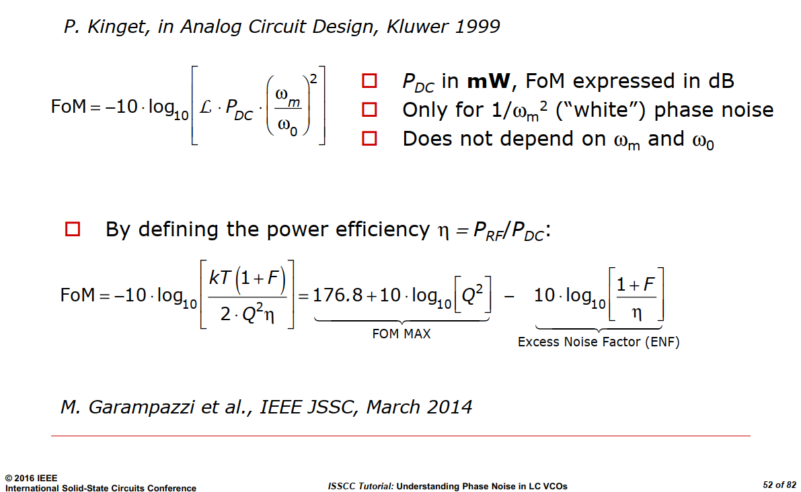
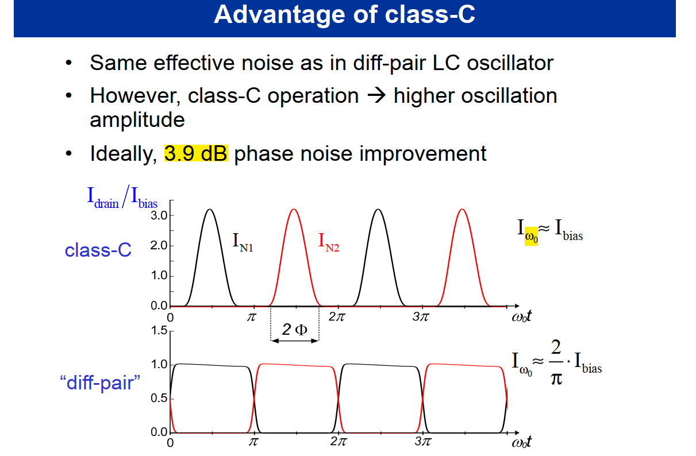
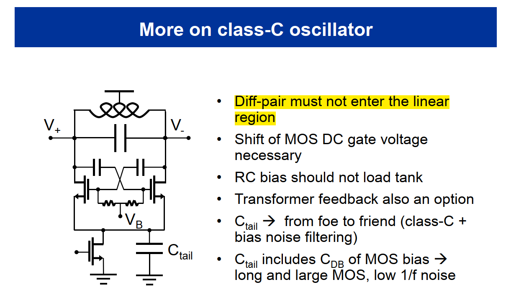
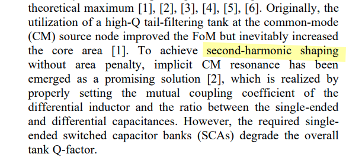
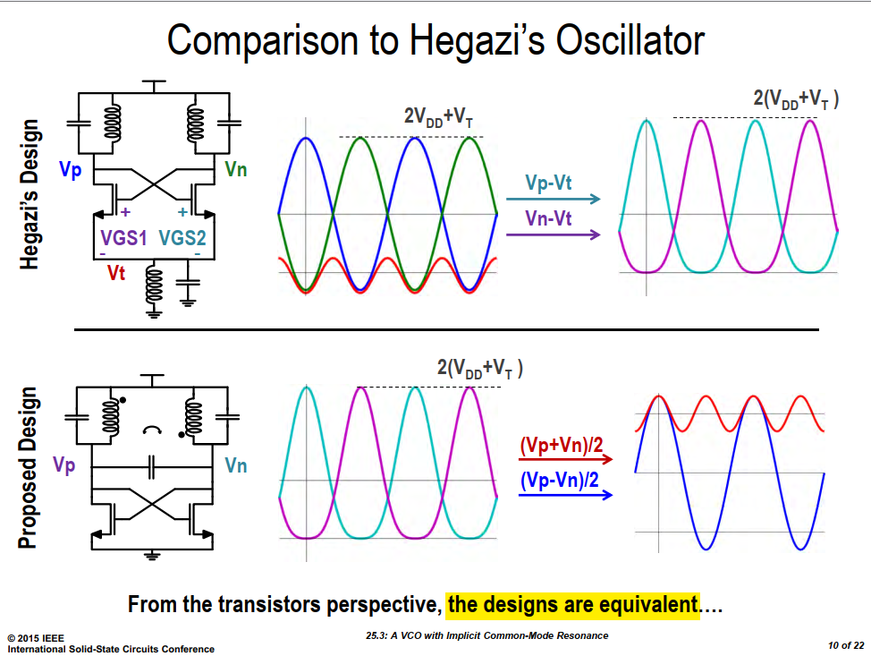

## Oscillator Figure of Merit (FoM)

> M. Garampazzi *et al*., "An Intuitive Analysis of Phase Noise Fundamental Limits Suitable for Benchmarking LC Oscillators," in *IEEE Journal of Solid-State Circuits*, vol. 49, no. 3, pp. 635-645, March 2014 [[https://sci-hub.jp/10.1109/JSSC.2014.2301760](https://sci-hub.jp/10.1109/JSSC.2014.2301760)]

*TODO* &#128197;



---


```matlab
Sphi_1M = -47; % dBc/Hz
Sphi_100M = -104; % dBc/Hz
Pdc = 57e-6; % W
f0 = 22.6e9; % Hz

FoM_1M = 10*log10(1/(10^(Sphi_1M/10)*Pdc*1e3)*(f0/1e6)^2);  % 146.5234
FoM_100M = 10*log10(1/(10^(Sphi_100M/10)*Pdc*1e3)*(f0/100e6)^2);  % 163.5234
```


---


---


## LC Oscillator Structures

### Class-C CMOS Oscillator

> A. Mazzanti and P. Andreani, "Class-C Harmonic CMOS VCOs, With a General Result on Phase Noise," in IEEE Journal of Solid-State Circuits, vol. 43, no. 12, pp. 2716-2729, Dec. 2008 [[https://sci-hub.ru/10.1109/JSSC.2008.2004867](https://sci-hub.ru/10.1109/JSSC.2008.2004867)]

*TODO* &#128197;






### Class-D CMOS Oscillator

> L. Fanori and P. Andreani, "A 2.5-to-3.3GHz CMOS Class-D VCO," 2013 IEEE International Solid-State Circuits Conference Digest of Technical Papers, San Francisco, CA, USA, 2013 [[https://sci-hub.red/10.1109/ISSCC.2013.6487763](https://sci-hub.red/10.1109/ISSCC.2013.6487763)]
>
> —, "Class-D CMOS Oscillators," in IEEE Journal of Solid-State Circuits, vol. 48, no. 12, pp. 3105-3119, Dec. 2013 [[https://sci-hub.red/10.1109/JSSC.2013.2271531](https://sci-hub.red/10.1109/JSSC.2013.2271531)]
>
> —, "A Class-D CMOS DCO with an on-chip LDO," ESSCIRC 2014 - 40th European Solid State Circuits Conference (ESSCIRC), Venice Lido, Italy, 2014 [[https://sci-hub.red/10.1109/ESSCIRC.2014.6942090](https://sci-hub.red/10.1109/ESSCIRC.2014.6942090)]

*TODO* &#128197;


### Class-F CMOS Oscillator

> Huijung Kim, Seonghan Ryu, Yujin Chung, Jinsung Choi and Bumman Kim, "A low phase-noise CMOS VCO with harmonic tuned LC tank," in IEEE Transactions on Microwave Theory and Techniques, vol. 54, no. 7, pp. 2917-2924, July 2006 [[https://sci-hub.ru/10.1109/tmtt.2006.877439](https://sci-hub.ru/10.1109/tmtt.2006.877439)]
>
> M. Babaie and R. B. Staszewski, "Third-harmonic injection technique applied to a 5.87-to-7.56GHz 65nm CMOS Class-F oscillator with 192dBc/Hz FOM," 2013 IEEE International Solid-State Circuits Conference Digest of Technical Papers, San Francisco, CA, USA, 2013 [[https://sci-hub.ru/10.1109/ISSCC.2013.6487764](https://sci-hub.ru/10.1109/ISSCC.2013.6487764)]
>
> —, "A Class-F CMOS Oscillator," in IEEE Journal of Solid-State Circuits, vol. 48, no. 12, pp. 3120-3133, Dec. 2013 [[https://ieeexplore.ieee.org/stamp/stamp.jsp?tp=&arnumber=6576263](https://ieeexplore.ieee.org/stamp/stamp.jsp?tp=&arnumber=6576263)]

*TODO* &#128197;


### Class-F<sub>2</sub> CMOS Oscillator

*TODO* &#128197;


### Class-F<sub>3</sub> CMOS Oscillator

*TODO* &#128197;


### Class-F<sub>23</sub> CMOS Oscillator

*TODO* &#128197;


### Class-F<sup>-1</sup> CMOS Oscillator

> C. -C. Lim, J. Yin, P. -I. Mak, H. Ramiah and R. P. Martins, "An inverse-class-F CMOS VCO with intrinsic-high-Q 1st- and 2nd-harmonic resonances for 1/f2-to-1/f3 phase-noise suppression achieving 196.2dBc/Hz FOM," *2018 IEEE International Solid-State Circuits Conference - (ISSCC)*, San Francisco, CA, USA, 2018 [[paper](https://ime.um.edu.mo/wp-content/uploads/presentations/25bad4fd3e900415db6f2fc2ebf49cc7.pdf)]
>
> —, "An Inverse-Class-F CMOS Oscillator With Intrinsic-High-Q First Harmonic and Second Harmonic Resonances," in *IEEE Journal of Solid-State Circuits*, vol. 53, no. 12, pp. 3528-3539, Dec. 2018 [[https://sci-hub.jp/10.1109/JSSC.2018.2875099](https://sci-hub.jp/10.1109/JSSC.2018.2875099)]
>
> X. Meng, H. Li, P. Chen, J. Yin, P. -I. Mak and R. P. Martins, "Analysis and Design of a 15.2-to-18.2-GHz Inverse-Class-F VCO With a Balanced Dual-Core Topology Suppressing the Flicker Noise Upconversion," in *IEEE Transactions on Circuits and Systems I: Regular Papers*, vol. 70, no. 12, pp. 5110-5123, Dec. 2023

*TODO* &#128197;


Higher $Q_\text{CM}$ is preferred for better FoM


## Class-B Oscillators


### Output Amplitude

> Edgar Sanchez-Sinencio. ECEN 665, OSCILLATORS [[https://people.engr.tamu.edu/s-sanchez/665%20Oscillators.pdf](https://people.engr.tamu.edu/s-sanchez/665%20Oscillators.pdf)]


---

---

***NMOS Realization — single pair***


*common mode current don't contribute to output amplitude*

---


> 

---


```matlab
L0 = 1e-9 * 2;
RL0 = 0.25133 * 2;
C0 = 6.333e-12 / 2;
RC0 = 0.50264 * 2;

w0 = 1/sqrt(L0*C0);   % 12.566 Grad/s

QL = w0*L0/RL0;       % 50
QC = 1/(w0*C0)/RC0;   % 25

RLp0 = QL^2 * RL0;
RCp0 = QC^2 * RC0;
Rp = RLp0 * RCp0 / (RLp0 + RCp0);  % 418.8576 Ohm
Qtot_by_L = Rp/(w0*L0);    % 16.6664
Qtot_by_C = Rp*(w0*C0);    % 16.6664

I0 = 0.5e-3;
vp_p = 2/pi * I0 * Rp/2;     % 66.6633 mV

%%%% compute Qtot from simulation waveform
vp_p2p_sim = 132.8e-3;
Qtot_calc_L0 = vp_p2p_sim*pi/2/I0/(w0*L0);   % 16.6006
Qtot_calc_C0 = vp_p2p_sim*pi/2/I0*(w0*C0);   % 16.6006
```

---

---

***CMOS Realization — double pair***


Owing to switch-off PMOS eliminating common mode current, all $I_T$ is differentially flowing in the tank


---


> 


---

---

***current limited vs voltage limited***


### Class-B Power/Current Efficiency

> Z. Wang, S. Diao, L. He, X. Jiang and F. Lin, "Analysis of Current Efficiency for CMOS Class-B LC Oscillators," in *IEEE Transactions on Circuits and Systems I: Regular Papers*, vol. 62, no. 5, pp. 1345-1352, May 2015 [[https://sci-hub.jp/10.1109/TCSI.2015.2411792](https://sci-hub.jp/10.1109/TCSI.2015.2411792)]
>
> L. Bertulessi, S. Levantino and C. Samori, "Analysis of power efficiency in high-performance class-B oscillators," *2016 12th Conference on Ph.D. Research in Microelectronics and Electronics (PRIME)*, Lisbon, Portugal, 2016 [[https://sci-hub.jp/10.1109/PRIME.2016.7519525](https://sci-hub.jp/10.1109/PRIME.2016.7519525)]

*TODO* &#128197;


### Current-biased & voltage-biased

> S. Gallucci *et al*., "A Low-Noise Digital PLL With an Adaptive Common-Mode Resonance Tuning Technique for Voltage-Biased Oscillators," in *IEEE Journal of Solid-State Circuits*, vol. 60, no. 12, pp. 4572-4586, Dec. 2025

*TODO* &#128197;


## Colpitts oscillator

*TODO* &#128197;


## 8-shaped inductor

> NXP BV, US8183971B2, *8-shaped inductor* [[pdf](https://patentimages.storage.googleapis.com/41/b1/ff/e53534a029c34d/US8183971.pdf)]
>
> Marvell, US9077310B2, *Pseudo-8-shaped inductor* [[pdf](https://patentimages.storage.googleapis.com/36/ad/f1/d8b740bb7b80d9/US9697938.pdf)]
> 
> P. Guan et al., "8-Shaped Inductors: An Essential Addition to RFIC Designers' Toolbox," in IEEE Open Journal of the Solid-State Circuits Society, vol. 4, pp. 131-146, 2024 [[pdf](https://ieeexplore.ieee.org/stamp/stamp.jsp?arnumber=10668829)]
>
> M. Pisati et al., "A 243-mW 1.25–56-Gb/s Continuous Range PAM-4 42.5-dB IL ADC/DAC-Based Transceiver in 7-nm FinFET," in IEEE Journal of Solid-State Circuits, vol. 55, no. 1, pp. 6-18, Jan. 2020 [[https://sci-hub.ru/10.1109/JSSC.2019.2936307](https://sci-hub.ru/10.1109/JSSC.2019.2936307)]

An **8-shaped (figure-8) inductor** is a specialized on-chip, high-Q component used to mitigate **electromagnetic coupling** and reduce **frequency pulling** in VCOs by generating opposing, self-canceling magnetic fields

*TODO* &#128197;


---

> Zou, Wei & Zou, Xuecheng & Ren, Daming & Zhang, Kefeng & Liu, Dongsheng & Ren, Zhixiong. (2019). 2.49-4.91 GHz wideband VCO with optimised 8-shaped inductor. Electronics Letters. [[https://sci-hub.jp/10.1049/el.2018.6012](https://sci-hub.jp/10.1049/el.2018.6012)]


## Capacitor Bank

> B. Sadhu and R. Harjani, "Capacitor bank design for wide tuning range LC VCOs: 850MHz-7.1GHz (157%)," Proceedings of 2010 IEEE International Symposium on Circuits and Systems, Paris, France, 2010 [[https://sci-hub.st/10.1109/ISCAS.2010.5537040](https://sci-hub.st/10.1109/ISCAS.2010.5537040)]

*TODO* &#128197;


>  large value KVCO is not favorable due to noise and possibly spurs at the control voltage


## LC Tank Q


---

---

***Definitions of Q***


Assuming **RLC** oscillator waveform is $V(t)=V_0\sin\omega_0 t$, $\omega_0 = \frac{1}{\sqrt{LC}}$ is resonant frequency

Energy stored
$$
E_t = \frac{1}{2}LI_0^2 = \frac{1}{2}CV_0^2
$$
Energy Dissipated per Cycle
$$
E_d = \frac{V_0^2}{2R}\frac{2\pi}{\omega_0}
$$
For $Q_4$, with $I_0=C\omega_0V_0$
$$
\boxed{Q_4  = 2\pi\frac{E_s}{E_d} = R\omega_0C = \frac{R}{\omega_0L}}
$$

which holds **at resonance**


For $Q_3$, suppose RLC tank is driven by $V_o\cos \omega t$ voltage source, then

*Peak Magnetic Energy*
$$
E_{pL} = \frac{1}{2}LI_0^2 = \frac{1}{2}L\left(\frac{V_0}{L\omega}\right)^2
$$
*Peak Electric Energy*
$$
E_{pC} = \frac{1}{2}CV_0^2
$$
with *Energy Lost per Cycle* $E_d = \frac{V_0^2}{2R}\frac{2\pi}{\omega_0}$, we have
$$
Q_3 = \frac{E_{pL} - E_{pC}}{E_d} = \left(\frac{1}{L\omega^2}-C\right)R\omega=\frac{R}{L\omega}\left(1 - \frac{\omega^2}{\omega^2_{SR}}\right)
$$


---

> EEE 211 ANALOG ELECTRONICS [[https://www.ee.bilkent.edu.tr/~eee211/LectureNotes/Chapter%20-%2004.pdf](https://www.ee.bilkent.edu.tr/~eee211/LectureNotes/Chapter%20-%2004.pdf)]


---

---

***Tank Impedance Near Resonance***


$$
\boxed{|Z(\omega_0\pm \omega_m)|^2 \cong \frac{1}{(2\omega_m C)^2}}\qquad\qquad \boxed{|Z(\omega_0\pm \omega_m)|^2 \cong R^2\left(\frac{\omega_0}{2Q\omega_m}\right)^2}
$$


## Temperature Compensation

> A. L. S. Loke *et al*., "A versatile low-jitter PLL in 90-nm CMOS for SerDes transmitter clocking," *Proceedings of the IEEE 2005 Custom Integrated Circuits Conference, 2005.*, San Jose, CA, USA, 2005 [[slides](https://ewh.ieee.org/r5/denver/sscs/Presentations/2005_09_Loke.pdf), [paper](https://sci-hub.se/10.1109/CICC.2005.1568728)]


$$
f=\frac{1}{2\pi\sqrt{L_p C_p}} = \frac{1}{2\pi\sqrt{L_s\frac{Q_L^2+1}{Q_L^2} C_s\frac{Q_C^2}{Q_C^2+1}}} = \frac{1}{2\pi\sqrt{L_sC_s}}\cdot \sqrt{\frac{1+1/Q_c^2}{1+1/Q_L^2}}
$$
Assuming the tank's Q is limited by the inductor's quality factor $Q_L$, i.e. $Q_L\ll Q_c$
$$
f\approx  \frac{1}{2\pi\sqrt{L_sC_s}}\cdot \sqrt{1-\frac{1}{Q_L^2}} =f_0\cdot\sqrt{1-\frac{1}{Q_L^2}}
$$
where $f_0=\frac{1}{\sqrt{L_sC_s}}$ is the first order approximation of the resonant frequency


## PN Reduction Techniques

> Y. Hu, T. Siriburanon and R. B. Staszewski, , "Oscillator Flicker Phase Noise: A Tutorial," in *IEEE Transactions on Circuits and Systems II: Express Briefs*, vol. 68, no. 2, pp. 538-544, Feb. 2021 [[paper](https://ieeexplore.ieee.org/stamp/stamp.jsp?tp=&arnumber=9286468)] [[slides](https://www.researchgate.net/publication/352173342_Oscillator_Flicker_Phase_Noise_A_Tutorial)]


### Groszkowski's Effect

> credits to *GPT-5.5 High*


**Groszkowski’s effect** is an oscillator **frequency shift caused by harmonic content** in the oscillation waveform/current.

For a **periodic** LC oscillation, t**he average stored energy must balance** between $C$ and $L$


### Symmetrising waveform (2nd harmonic resonance)

> E. Hegazi, H. Sjoland and A. Abidi, "A filtering technique to lower oscillator phase noise," *2001 IEEE International Solid-State Circuits Conference. Digest of Technical Papers. ISSCC (Cat. No.01CH37177)*, San Francisco, CA, USA, 2001 [[paper](https://engineering.purdue.edu/oxidemems/conferences/isscc2001/DATA/D23_4.pdf), [slides](https://engineering.purdue.edu/oxidemems/conferences/isscc2001/DATA/SS23_4.pdf)]
>
> —, "A filtering technique to lower LC oscillator phase noise," in *IEEE Journal of Solid-State Circuits*, vol. 36, no. 12, pp. 1921-1930, Dec. 2001 [[https://people.engr.tamu.edu/spalermo/ecen620/filtering_tech_lc_osc_hegazi_jssc_2001.pdf](https://people.engr.tamu.edu/spalermo/ecen620/filtering_tech_lc_osc_hegazi_jssc_2001.pdf)]
>
> A. Bevilacqua and P. Andreani, "An Analysis of  1/f  Noise to Phase Noise Conversion in CMOS Harmonic Oscillators," in IEEE Transactions on Circuits and Systems I: Regular Papers, vol. 59, no. 5, pp. 938-945, May 2012
>
> D. Murphy, H. Darabi and H. Wu, "Implicit Common-Mode Resonance in LC Oscillators," in IEEE Journal of Solid-State Circuits, vol. 52, no. 3, pp. 812-821, March 2017, [[https://sci-hub.st/10.1109/JSSC.2016.2642207](https://sci-hub.st/10.1109/JSSC.2016.2642207)]
>
> —, "25.3 A VCO with implicit common-mode resonance," 2015 IEEE International Solid-State Circuits Conference - (ISSCC) Digest of Technical Papers, San Francisco, CA, USA, 2015 [[https://sci-hub.st/10.1109/ISSCC.2015.7063116](https://sci-hub.st/10.1109/ISSCC.2015.7063116)]
>
> M. Shahmohammadi, M. Babaie and R. B. Staszewski, "25.4 A 1/f noise upconversion reduction technique applied to Class-D and Class-F oscillators," 2015 IEEE International Solid-State Circuits Conference - (ISSCC) Digest of Technical Papers, San Francisco, CA, USA, 2015 [[https://sci-hub.ru/10.1109/ISSCC.2015.7063117](https://sci-hub.ru/10.1109/ISSCC.2015.7063117)]
>
> —, "A 1/f Noise Upconversion Reduction Technique for Voltage-Biased RF CMOS Oscillators," in IEEE Journal of Solid-State Circuits, vol. 51, no. 11, pp. 2610-2624, Nov. 2016 [[https://pure.tudelft.nl/ws/portalfiles/portal/30880387/07571191.pdf](https://pure.tudelft.nl/ws/portalfiles/portal/30880387/07571191.pdf)]
>
> Michael Perrott August 12, 2008, Short Course On Phase-Locked Loops and Their Applications Day 2, AM Lecture *Basic Building Blocks Voltage-Controlled Oscillators* [[https://www.cppsim.com/PLL_Lectures/day2_am.pdf](https://www.cppsim.com/PLL_Lectures/day2_am.pdf)]




> *Yunbo Huang, **Zunsong Yang\***, et al., "A 7.0-to-8.6GHz Balanced Class-F-1 VCO with a Trifilar Transformer-Based Tank Achieving 194.5dBc/Hz FoM," IEEE MTT-S Radio Frequency Integrated Circuits (**RFIC**), June 2026*





---


with $\boxed{x(t) = \sin(\omega_0 t)}$
$$
y_{\sin}(t) = \alpha_1 \sin(\omega_0 t)+ \alpha_2\frac{1-\cos(2\omega_0t)}{2} + \alpha_3 \frac{3\sin(\omega_0 t) -\sin(3\omega_0 t)}{4} +\alpha_4\frac{3-4\cos(2\omega_0 t)+\cos(4\omega_0 t)}{8}
$$

and using $\cos \theta = \sin(\theta + \pi/2)$

$$
y_{\sin}(t) = \underbrace{\frac{\alpha_2}{2} + \frac{3\alpha_4}{8}}_{\text{DC}}
+ \underbrace{\left(\alpha_1 + \frac{3\alpha_3}{4}\right)\sin(\omega_0 t)}_{\omega_0}
- \underbrace{\frac{\alpha_2 + \alpha_4}{2}\,\sin\!\left(2\omega_0 t + \textcolor{blue}{\frac{\pi}{2}}\right)}_{2\omega_0}
- \underbrace{\frac{\alpha_3}{4}\,\sin(3\omega_0 t)}_{3\omega_0}
+ \underbrace{\frac{\alpha_4}{8}\,\sin\!\left(4\omega_0 t + \textcolor{blue}{\frac{\pi}{2}}\right)}_{4\omega_0}
$$

with $\boxed{x(t) = \cos(\omega_0 t)}$
$$
y_{\cos}(t) = \underbrace{\frac{\alpha_2}{2}+\frac{3\alpha_4}{8}}_{\text{DC}}
+ \underbrace{\left(\alpha_1+\frac{3\alpha_3}{4}\right)\cos(\omega_0 t)}_{\omega_0}
+ \underbrace{\frac{\alpha_2+\alpha_4}{2}\cos(2\omega_0 t)}_{2\omega_0}
+ \underbrace{\frac{\alpha_3}{4}\cos(3\omega_0 t)}_{3\omega_0}
+ \underbrace{\frac{\alpha_4}{8}\cos(4\omega_0 t)}_{4\omega_0}
$$
They're the same waveform; one is the other shifted in time by a quarter of the fundamental period:
$$
y_{\cos}(t) = y_{\sin}\!\left(t + \frac{T}{4}\right), \qquad T = \frac{2\pi}{\omega_0}
$$


---

---

> S. Gallucci *et al*., "A Low-Noise Digital PLL With an Adaptive Common-Mode Resonance Tuning Technique for Voltage-Biased Oscillators," in *IEEE Journal of Solid-State Circuits*, vol. 60, no. 12, pp. 4572-4586, Dec. 2025
> P. Liu et al., "A 128Gb/s ADC/DAC Based PAM-4 Transceiver with >45dB Reach in 3nm FinFET," 2025 Symposium on VLSI Technology and Circuits (VLSI Technology and Circuits), Kyoto, Japan, 2025


### Narrowing of conduction angle

> Y. Hu, T. Siriburanon and R. B. Staszewski, "Intuitive Understanding of Flicker Noise Reduction via Narrowing of Conduction Angle in Voltage-Biased Oscillators," in IEEE Transactions on Circuits and Systems II: Express Briefs, vol. 66, no. 12, pp. 1962-1966, Dec. 2019 [[https://sci-hub.se/10.1109/TCSII.2019.2896483](https://sci-hub.se/10.1109/TCSII.2019.2896483)]

*TODO* &#128197;


### Gate-drain phase shift

*TODO* &#128197;


## simulation in oscillator

### varactor simulation

Three methods:

- PSS +PSP (*pay attention to port termination and voltage amplitude*)
- PSS +PAC
- PSS Only


---

`rms` only scale magnitude $1/\sqrt{2}$ but retain phase for complex number, like harmonic

- `mag(vh('pss "/P5"))` = `mag(rms(vh('pss "/P5"))) * (2**0.5)` 
- `phaseDegUnwrapped(vh('pss "/P5"))` = `phaseDegUnwrapped(rms(vh('pss "/P5")))`


## reference

A. A. Abidi and D. Murphy, "How to Design a Differential CMOS LC Oscillator," in IEEE Open Journal of the Solid-State Circuits Society, vol. 5, pp. 45-59, 2025 [[https://ieeexplore.ieee.org/stamp/stamp.jsp?arnumber=10818782](https://ieeexplore.ieee.org/stamp/stamp.jsp?arnumber=10818782)]

Pietro Andreani. ISSCC 2011 T1: Integrated LC oscillators

—. ISSCC 2017 F2: Integrated Harmonic Oscillators

—. SSCS Distinguished Lecture: RF Harmonic Oscillators Integrated in Silicon Technologies [[https://www.ieeetoronto.ca/wp-content/uploads/2020/06/DL-Toronto.pdf](https://www.ieeetoronto.ca/wp-content/uploads/2020/06/DL-Toronto.pdf)]

—. ESSCIRC 2019 Tutorials: RF Harmonic Oscillators Integrated in Silicon Technologies [[https://youtu.be/k1I9nP9eEHE](https://youtu.be/k1I9nP9eEHE)]

—. "Harmonic Oscillators in CMOS—A Tutorial Overview," in IEEE Open Journal of the Solid-State Circuits Society, vol. 1, pp. 2-17, 2021 [[pdf](https://ieeexplore.ieee.org/stamp/stamp.jsp?tp=&arnumber=9530265)]

C. Samori, "Tutorial: Understanding Phase Noise in LC VCOs," *2016 IEEE International Solid-State Circuits Conference (ISSCC)*, San Francisco, CA, USA, 2016

—, "Understanding Phase Noise in LC VCOs: A Key Problem in RF Integrated Circuits," in *IEEE Solid-State Circuits Magazine*, vol. 8, no. 4, pp. 81-91, Fall 2016 [[https://sci-hub.se/10.1109/MSSC.2016.2573979](https://sci-hub.se/10.1109/MSSC.2016.2573979)]

—, Phase Noise in LC Oscillators: From Basic Concepts to Advanced Topologies [[https://www.ieeetoronto.ca/wp-content/uploads/2020/06/DL-VCO-short.pdf](https://www.ieeetoronto.ca/wp-content/uploads/2020/06/DL-VCO-short.pdf)]

Jun Yin. ISSCC 2025  T10:  mm-Wave Oscillator Design

---

Razavi, Behzad. RF Microelectronics. 2nd ed. Prentice Hall, 2012.

—. Design of CMOS Phase-Locked Loops: From Circuit Level to Architecture Level. Cambridge University Press; 2020. 

Lacaita, Andrea Leonardo, Salvatore Levantino, and Carlo Samori. *Integrated frequency synthesizers for wireless systems*. Cambridge University Press, 2007

M. Babaie, M. Shahmohammadi, R. B. Staszewski, (2019) "*RF CMOS Oscillators for Modern Wireless Applications"* River Publishers [[https://www.riverpublishers.com/pdf/ebook/RP_E9788793609488.pdf](https://www.riverpublishers.com/pdf/ebook/RP_E9788793609488.pdf)]

Manetakis, K. (2023). *Topics in LC Oscillators: Principles, phase noise, pulling, inductor design*. Springer Nature Switzerland Springer. [[eetop link](https://bbs.eetop.cn/thread-974577-1-1.html)]

Luong HC, Yin J. *Transformer-Based Design Techniques for Oscillators and Frequency Dividers*. Springer; 2015.

Hajimiri, A., & Lee, T. H. (1999). The design of low noise oscillators. Norwell, MA: Kluwer

Hegazi, Emad, Asad Abidi, and Jacob Rael. *The Designer's Guide to High-purity Oscillators*. [New York]: Kluwer Academic Publishers, 2005. *The Designer's Guide to High-Purity Oscillators*

---

hai-kun, 片上电感的版图优化方法 [[https://zhuanlan.zhihu.com/p/37479700](https://zhuanlan.zhihu.com/p/37479700)]

—, 电磁场仿真与片上电感的优化讲座实录 [[https://zhuanlan.zhihu.com/p/37942671](https://zhuanlan.zhihu.com/p/37942671)]

—, 片上变压器的应用与设计 （二）多峰值谐振腔 [[https://zhuanlan.zhihu.com/p/45799676](https://zhuanlan.zhihu.com/p/45799676)]
