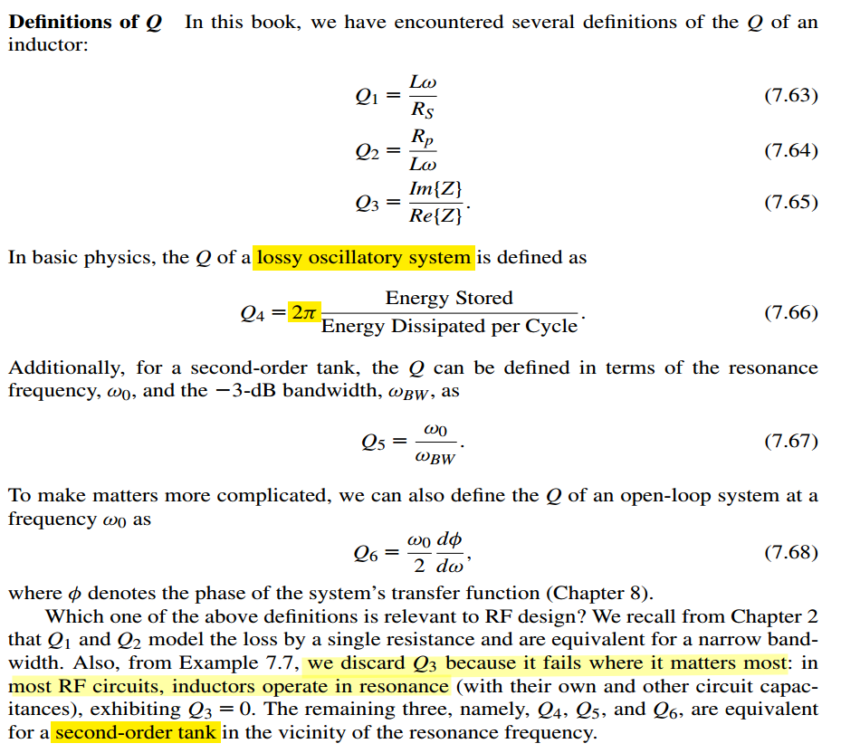

## Capacitor Bank

> B. Sadhu and R. Harjani, "Capacitor bank design for wide tuning range LC VCOs: 850MHz-7.1GHz (157%)," Proceedings of 2010 IEEE International Symposium on Circuits and Systems, Paris, France, 2010 [[https://sci-hub.st/10.1109/ISCAS.2010.5537040](https://sci-hub.st/10.1109/ISCAS.2010.5537040)]

*TODO* &#128197;


>  large value KVCO is not favorable due to noise and possibly spurs at the control voltage


## LC Tank


> 


### Definitions of Q



Assuming RLC oscillator waveform is $V_0\sin\omega_0 t$ and $\omega_0 = \frac{1}{\sqrt{LC}}$ is resonance frequency. suppose the current through $R$ is cancelled out by additional $-R$

Energy stored
$$
E_t = \frac{1}{2}LI_0^2 = \frac{1}{2}L(C\omega_0V_0)^2=\frac{1}{2}LC^2\omega_0^2 V_0^2 = \frac{1}{2}CV_0^2
$$
Energy Dissipated per Cycle
$$
E_d = \frac{V_0^2}{2R}\frac{2\pi}{\omega_0}
$$
For $Q_4$
$$
Q_4  = 2\pi\frac{E_s}{E_d} = R\omega_0C = \frac{R}{\omega_0L}
$$


For $Q_3$, suppose RLC tank is driven by $V_o\cos \omega t$ voltage source, then

*Peak Magnetic Energy*
$$
E_{pL} = \frac{1}{2}LI_0^2 = \frac{1}{2}L\left(\frac{V_0}{L\omega}\right)^2
$$
*Peak Electric Energy*
$$
E_{pC} = \frac{1}{2}CV_0^2
$$
with *Energy Lost per Cycle* $E_d = \frac{V_0^2}{2R}\frac{2\pi}{\omega_0}$, we have
$$
Q_3 = \frac{E_{pL} - E_{pC}}{E_d} = \left(\frac{1}{L\omega^2}-C\right)R\omega=\frac{R}{L\omega}\left(1 - \frac{\omega^2}{\omega^2_{SR}}\right)
$$

> 

---

> Makarov, Sergey & Ludwig, Reinhold & Bitar, Joyce. (2016). Practical Electrical Engineering. 10.1007/978-3-319-21173-2.  [[pdf](https://weblibrary.mila.edu.my/upload/ebook/engineering/2016_Book_PracticalElectricalEngineering.pdf)]

*TODO* &#128197;

---

> EEE 211 ANALOG ELECTRONICS [[https://www.ee.bilkent.edu.tr/~eee211/LectureNotes/Chapter%20-%2004.pdf](https://www.ee.bilkent.edu.tr/~eee211/LectureNotes/Chapter%20-%2004.pdf)]


## Output Amplitude

> Edgar Sanchez-Sinencio. ECEN 665, OSCILLATORS [[https://people.engr.tamu.edu/s-sanchez/665%20Oscillators.pdf](https://people.engr.tamu.edu/s-sanchez/665%20Oscillators.pdf)]


### NMOS Realization


*common mode current don't contribute to output amplitude*

---


> 

---


```matlab
L0 = 1e-9 * 2;
RL0 = 0.25133 * 2;
C0 = 6.333e-12 / 2;
RC0 = 0.50264 * 2;

w0 = 1/sqrt(L0*C0);   % 12.566 Grad/s

QL = w0*L0/RL0;       % 50
QC = 1/(w0*C0)/RC0;   % 25

RLp0 = QL^2 * RL0;
RCp0 = QC^2 * RC0;
Rp = RLp0 * RCp0 / (RLp0 + RCp0);  % 418.8576 Ohm
Qtot_by_L = Rp/(w0*L0);    % 16.6664
Qtot_by_C = Rp*(w0*C0);    % 16.6664

I0 = 0.5e-3;
vp_p = 2/pi * I0 * Rp/2;     % 66.6633 mV

%%%% compute Qtot from simulation waveform
vp_p2p_sim = 132.8e-3;
Qtot_calc_L0 = vp_p2p_sim*pi/2/I0/(w0*L0);   % 16.6006
Qtot_calc_C0 = vp_p2p_sim*pi/2/I0*(w0*C0);   % 16.6006
```

---


### CMOS Realization


Owing to switch-off PMOS eliminating common mode current, all $I_T$ is differentially flowing in the tank.


---


> 

### current limited vs voltage limited


## Cross-coupled Differential-pair


?? Triode MOS noise


## Current-biased & voltage-biased DCO

> S. Gallucci *et al*., "A Low-Noise Digital PLL With an Adaptive Common-Mode Resonance Tuning Technique for Voltage-Biased Oscillators," in *IEEE Journal of Solid-State Circuits*, vol. 60, no. 12, pp. 4572-4586, Dec. 2025

*TODO* &#128197;


## LC-VCO Temperature Sensitivities

> A. L. S. Loke *et al*., "A versatile low-jitter PLL in 90-nm CMOS for SerDes transmitter clocking," *Proceedings of the IEEE 2005 Custom Integrated Circuits Conference, 2005.*, San Jose, CA, USA, 2005 [[slides](https://ewh.ieee.org/r5/denver/sscs/Presentations/2005_09_Loke.pdf), [paper](https://sci-hub.se/10.1109/CICC.2005.1568728)]


$$
f=\frac{1}{2\pi\sqrt{L_p C_p}} = \frac{1}{2\pi\sqrt{L_s\frac{Q_L^2+1}{Q_L^2} C_s\frac{Q_C^2}{Q_C^2+1}}} = \frac{1}{2\pi\sqrt{L_sC_s}}\cdot \sqrt{\frac{1+1/Q_c^2}{1+1/Q_L^2}}
$$
Assuming the tank's Q is limited by the inductor's quality factor $Q_L$, i.e. $Q_L\ll Q_c$
$$
f\approx  \frac{1}{2\pi\sqrt{L_sC_s}}\cdot \sqrt{1-\frac{1}{Q_L^2}} =f_0\cdot\sqrt{1-\frac{1}{Q_L^2}}
$$
where $f_0=\frac{1}{\sqrt{L_sC_s}}$ is the first order approximation of the resonant frequency


## varactor simulation

Three methods:

- PSS +PSP (*pay attention to port termination and voltage amplitude*)
- PSS +PAC
- PSS Only


---

`rms` only scale magnitude $1/\sqrt{2}$ but retain phase for complex number, like harmonic

- `mag(vh('pss "/P5"))` = `mag(rms(vh('pss "/P5"))) * (2**0.5)` 
- `phaseDegUnwrapped(vh('pss "/P5"))` = `phaseDegUnwrapped(rms(vh('pss "/P5")))`


## Common-Mode Resonance

> P. Liu et al., "A 128Gb/s ADC/DAC Based PAM-4 Transceiver with >45dB Reach in 3nm FinFET," 2025 Symposium on VLSI Technology and Circuits (VLSI Technology and Circuits), Kyoto, Japan, 2025
>
> E. Hegazi, H. Sjoland and A. Abidi, "A filtering technique to lower oscillator phase noise," *2001 IEEE International Solid-State Circuits Conference. Digest of Technical Papers. ISSCC (Cat. No.01CH37177)*, San Francisco, CA, USA, 2001 [[paper](https://engineering.purdue.edu/oxidemems/conferences/isscc2001/DATA/D23_4.pdf), [slides](https://engineering.purdue.edu/oxidemems/conferences/isscc2001/DATA/SS23_4.pdf)]
>
> —, "A filtering technique to lower LC oscillator phase noise," in *IEEE Journal of Solid-State Circuits*, vol. 36, no. 12, pp. 1921-1930, Dec. 2001 [[https://people.engr.tamu.edu/spalermo/ecen620/filtering_tech_lc_osc_hegazi_jssc_2001.pdf](https://people.engr.tamu.edu/spalermo/ecen620/filtering_tech_lc_osc_hegazi_jssc_2001.pdf)]
>
> —, "25.3 A VCO with implicit common-mode resonance," 2015 IEEE International Solid-State Circuits Conference - (ISSCC) Digest of Technical Papers, San Francisco, CA, USA, 2015 [[https://sci-hub.st/10.1109/ISSCC.2015.7063116](https://sci-hub.st/10.1109/ISSCC.2015.7063116)]
>
> Lecture 16: VCO Phase Noise [[https://people.engr.tamu.edu/spalermo/ecen620/lecture16_ee620_vco_pn.pdf](https://people.engr.tamu.edu/spalermo/ecen620/lecture16_ee620_vco_pn.pdf)]
>
> S. Gallucci *et al*., "A Low-Noise Digital PLL With an Adaptive Common-Mode Resonance Tuning Technique for Voltage-Biased Oscillators," in *IEEE Journal of Solid-State Circuits*, vol. 60, no. 12, pp. 4572-4586, Dec. 2025


*TODO* &#128197;


### Tail filter

> D. Murphy, H. Darabi and H. Wu, "Implicit Common-Mode Resonance in LC Oscillators," in IEEE Journal of Solid-State Circuits, vol. 52, no. 3, pp. 812-821, March 2017, [[https://sci-hub.st/10.1109/JSSC.2016.2642207](https://sci-hub.st/10.1109/JSSC.2016.2642207)]
>
> M. Shahmohammadi, M. Babaie and R. B. Staszewski, "A 1/f Noise Upconversion Reduction Technique for Voltage-Biased RF CMOS Oscillators," in IEEE Journal of Solid-State Circuits, vol. 51, no. 11, pp. 2610-2624, Nov. 2016 [[pdf](https://pure.tudelft.nl/ws/portalfiles/portal/30880387/07571191.pdf)]
>
> M. Babaie, M. Shahmohammadi, R. B. Staszewski, (2019) "RF CMOS Oscillators for Modern Wireless Applications" River Publishers [[https://www.riverpublishers.com/pdf/ebook/RP_E9788793609488.pdf](https://www.riverpublishers.com/pdf/ebook/RP_E9788793609488.pdf)]

*TODO* &#128197;


## reference

A. A. Abidi and D. Murphy, "How to Design a Differential CMOS LC Oscillator," in IEEE Open Journal of the Solid-State Circuits Society, vol. 5, pp. 45-59, 2025 [[https://ieeexplore.ieee.org/stamp/stamp.jsp?arnumber=10818782](https://ieeexplore.ieee.org/stamp/stamp.jsp?arnumber=10818782)]

Pietro Andreani. ISSCC 2011 T1: Integrated LC oscillators [[slides](https://www.nishanchettri.com/isscc-slides/2011%20ISSCC/TUTORIALS/ISSCC2011Visuals-T1.pdf),[transcript](https://www.nishanchettri.com/isscc-slides/2011%20ISSCC/TUTORIALS/Transcription_T1.pdf)]

—. ISSCC 2017 F2: Integrated Harmonic Oscillators

—. SSCS Distinguished Lecture: RF Harmonic Oscillators Integrated in Silicon Technologies [[https://www.ieeetoronto.ca/wp-content/uploads/2020/06/DL-Toronto.pdf](https://www.ieeetoronto.ca/wp-content/uploads/2020/06/DL-Toronto.pdf)]

—. ESSCIRC 2019 Tutorials: RF Harmonic Oscillators Integrated in Silicon Technologies [[https://youtu.be/k1I9nP9eEHE](https://youtu.be/k1I9nP9eEHE)]

—. "Harmonic Oscillators in CMOS—A Tutorial Overview," in IEEE Open Journal of the Solid-State Circuits Society, vol. 1, pp. 2-17, 2021 [[pdf](https://ieeexplore.ieee.org/stamp/stamp.jsp?tp=&arnumber=9530265)]

C. Samori, "Tutorial: Understanding Phase Noise in LC VCOs," *2016 IEEE International Solid-State Circuits Conference (ISSCC)*, San Francisco, CA, USA, 2016

—, "Understanding Phase Noise in LC VCOs: A Key Problem in RF Integrated Circuits," in *IEEE Solid-State Circuits Magazine*, vol. 8, no. 4, pp. 81-91, Fall 2016 [[https://sci-hub.se/10.1109/MSSC.2016.2573979](https://sci-hub.se/10.1109/MSSC.2016.2573979)]

—, Phase Noise in LC Oscillators: From Basic Concepts to Advanced Topologies [[https://www.ieeetoronto.ca/wp-content/uploads/2020/06/DL-VCO-short.pdf](https://www.ieeetoronto.ca/wp-content/uploads/2020/06/DL-VCO-short.pdf)]

Jun Yin. ISSCC 2025  T10:  mm-Wave Oscillator Design

---

Razavi, Behzad. RF Microelectronics. 2nd ed. Prentice Hall, 2012. [[pdf](https://picture.iczhiku.com/resource/eetop/WYKgsQqKzSDpFmbM.pdf)]

Lacaita, Andrea Leonardo, Salvatore Levantino, and Carlo Samori. *Integrated frequency synthesizers for wireless systems*. Cambridge University Press, 2007

Manetakis, K. (2023). *Topics in LC Oscillators: Principles, phase noise, pulling, inductor design*. Springer Nature Switzerland Springer. [[eetop link](https://bbs.eetop.cn/thread-974577-1-1.html)]
