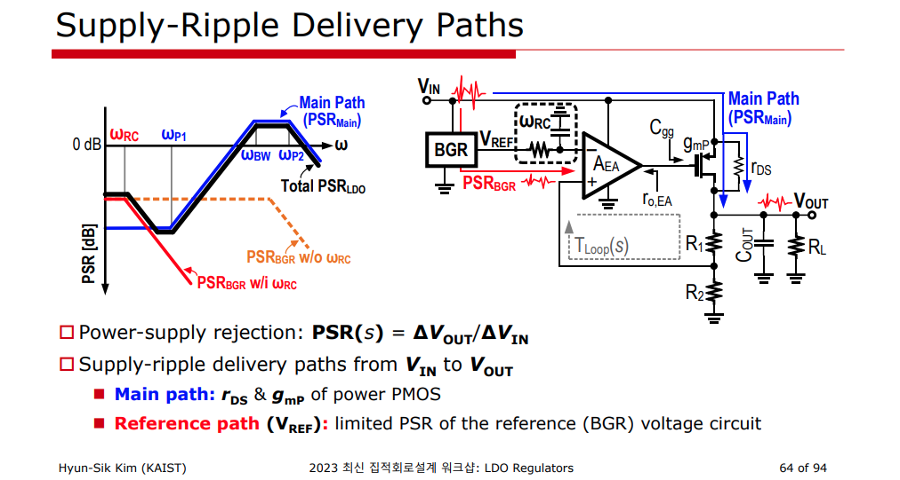

## PSRR (Power Supply Rejection Ratio)

A good PSRR is important when an LDO is used as a sub-regulator in cascade with a switching regulator

> The LDO would need to have a sufficiently high rejection at the switching frequency of the switching converter to filter out the ripples at that frequency

## PMOS LDO

A large output capacitor solves the sudden load change problem, but the stability decreases because the large output capacitor forces the output pole toward the origin with the role of dominant pole

## DC output impedance 

The output impedance of the LDO at DC is known as its **load regulation**

DC output impedance of NMOS and PMOS LDO is the ***same*** for the same error amplifier gain

$$
R_{\text{out}} = \frac{1}{\beta A_{o1} g_{m2}}
$$

> The NMOS LDO has a faster response to line transients than the PMOS LDO since it has better (smaller) PSRR

## Power MOS gain affect on PMOS LDO

DC gain
$$
A_{dc} = g_mR_\text{ota} A_2
$$
3dB bandwidth
$$
\omega_p = \frac{1}{R_\text{ota}(C_g+A_2C_c)}
$$
and GBW
$$
\omega_u = \frac{g_m}{\frac{C_g}{A_2}+C_c}
$$

## Feedforward Compensation with $C_\text{FF}$

- Improved Noise
- Improved Stability and Transient Response
- Improved PSRR

$$\begin{align}
R_1 \parallel \frac{1}{sC_{FF}} &= \frac{R_1}{1+sR_1C_{FF}} \\
Z_o &= \left( R_1\parallel \frac{1}{sC_{FF}}+R_2\right)\parallel \frac{1}{sC_L} \\
&=\frac{R_1+R_2+sR_1R_2C_{FF}}{s^2R_1R_2C_{FF}C_L + s[(R_1+R_2)C_L+R_1C_{FF}]+1} \\
A_{V2} &= g_m Z_o \\
&= g_m \frac{R_1+R_2+sR_1R_2C_{FF}}{s^2R_1R_2C_{FF}C_L + s[(R_1+R_2)C_L+R_1C_{FF}]+1} \\
\beta &= \frac{R_2}{\frac{R_1}{1+sR_1C_{FF}}+R_2} \\
&= \frac{R_2(1+sR_1C_{FF})}{R_1+R_2+sR_1R_2C_{FF}} \\
A_{V2}\beta &= \frac{g_mR_2(1+sR_1C_{FF})}{s^2R_1R_2C_{FF}C_L+s[(R_1+R_2)C_L+R_1C_{FF}]+1} 
\end{align}$$

That is, adding a $C_{FF}$ also introduces a zero ($\omega_z$) and pole ($\omega_p$) into the *LDO feedback loop*

$$\begin{align}
\omega_{po} &= \frac{1}{(R_1+R_2)C_L} \\
\omega_z &= \frac{1}{R_1C_{FF}} \\
\omega_{p} &= \frac{1}{(R_1 \parallel R_2)C_{FF}}
\end{align}$$

> Application Report SBVA042–July 2014, Pros and Cons of Using a Feedforward Capacitor with a Low-Dropout Regulator [[https://www.ti.com/lit/an/sbva042/sbva042.pdf](https://www.ti.com/lit/an/sbva042/sbva042.pdf)]
>
> LDO Basics: Noise – How a Feed-forward Capacitor Improves System Performance [[https://www.ti.com/document-viewer/lit/html/SSZTA13](https://www.ti.com/document-viewer/lit/html/SSZTA13)]
>
> LDO Basics: Noise – How a Noise-reduction Pin Improves System Performance [[https://www.ti.com/document-viewer/lit/html/SSZTA40](https://www.ti.com/document-viewer/lit/html/SSZTA40)]

## NMOS Slave LDO

$$\begin{align}
\frac{V_g}{V_i} &=\frac{R||\frac{1}{s(C_g+C_{gs})}}{R||\frac{1}{s(C_g+C_{gs})}+\frac{1}{sC_{gd}}} \\
&= \frac{sRC_{gd}}{sR(C+C_{gd}+C_{gs})+1} \\
\frac{V_g}{V_i} &= -\frac{sC_{ds}+g_{ds}}{sC_{gs}+g_m}
\end{align}$$

That is,
$$
\omega_{z,d} \approx \frac{1}{R(\frac{g_m}{g_{ds}}C_{gd}+C)}
$$

To calculate PSRR pole is similar with PSRR zero method, just $V_o/V_i=0$, i.e. set $V_0$ *0* potential
$$
\omega_{p,d} \approx \frac{1}{R(\frac{C_s}{g_mR}+C)}
$$

DC PSRR
$$
\text{PSRR} = \frac{1}{g_mr_o}
$$

---

---

## PSRR @Vgate

KCL at output node

$$
g_m(-V_o\beta A_{E} - V_o) + \frac{V_i - V_o}{r_o} = \frac{V_o}{R_1+R_2}
$$

Hence
$$
\frac{V_o}{V_i} = \frac{1}{A_E\beta g_mr_o+g_mr_o +\frac{r_o}{R_1+R_2}+1} \approx \frac{1}{A_E\beta g_m r_o}
$$

Through feedback loop, we derive
$$
V_g = V_o \beta (-A_E) \approx \frac{V_i}{A_E\beta g_m r_o} \beta (-A_E) = -\frac{V_i}{g_mr_o}
$$

That is
$$
\frac{V_g}{V_i} \approx  -\frac{1}{g_mr_o}
$$

> Due to closed loop, $V_g$ and $V_o$ is **not** source follower

## High frequency PSRR

## feedback resistor divider noise

> assuming $\text{LG} \gg 1$

$$\begin{align}
I_\text{t} &= \frac{V_\text{ref} - v_\text{n2}}{R_\text{2}} \\
V_\text{o} &= V_\text{ref} +v_\text{n1} + I_\text{t}R_\text{1} \\
\end{align}$$

Then
$$
V_\text{o} = \frac{R_1+R_2}{R_2}V_\text{ref} + v_\text{n1} - \frac{R_1}{R_2}v_\text{n2}
$$
that is

$$
v_\text{no}^2 = v_\text{n1}^2 + \left(\frac{R_1}{R_2}\right)^2 v_\text{n2}^2
$$

---

$$
\text{vno1}^2= \text{vn1}^2+\text{vn2}^2/6^2=16.5758 + 99.45453/6^2 = 19.338425833
$$

## reference

Hinojo, J.M., Martinez, C.I., & Torralba, A.J. (2018). Internally Compensated LDO Regulators for Modern System-on-Chip Design.

Chen, K.-H. (2016). *Power Management Techniques for Integrated Circuit Design*. Wiley-IEEE Press.

Morita, B.G. (2014). Understand Low-Dropout Regulator ( LDO ) Concepts to Achieve Optimal Designs.

H. -S. Kim, "Exploring Ways to Minimize Dropout Voltage for Energy-Efficient Low-Dropout Regulators: Viable approaches that preserve performance," in IEEE Solid-State Circuits Magazine, vol. 15, no. 2, pp. 59-68, Spring 2023, doi: 10.1109/MSSC.2023.3262767.

Ali Sheikholeslami, Circuit Intuitions: Voltage Regulators IEEE Solid-State Circuits Magazine, Vol. 12, Issue 4, to appear, Fall 2020.

Operational Transconductance Amplifier II Multi-Stage Designs [[https://people.eecs.berkeley.edu/~boser/courses/240B/lectures/M07%20OTA%20II.pdf](https://people.eecs.berkeley.edu/~boser/courses/240B/lectures/M07%20OTA%20II.pdf)]

Toshiba, Load Transient Response of LDO and Methods to Improve it Application Note [[https://toshiba.semicon-storage.com/info/application_note_en_20210326_AKX00312.pdf?did=66268](https://toshiba.semicon-storage.com/info/application_note_en_20210326_AKX00312.pdf?did=66268)]

Carusone, Tony Chan, David Johns, and Kenneth Martin. *Analog integrated circuit design*. John wiley & sons, 2011. [[https://mrce.in/ebooks/Analog%20Integrated%20Circuit%20Design%202nd%20Ed.pdf](https://mrce.in/ebooks/Analog%20Integrated%20Circuit%20Design%202nd%20Ed.pdf)]

---

Pavan Kumar Hanumolu. CICC 2015. "Low Dropout Regulators" [[https://uofi.app.box.com/v/CICC15-LDO](https://uofi.app.box.com/v/CICC15-LDO)]

Mingoo Seok. ISSCC 2020 T7: "Basics of Digital Low-Dropout (LDO) Integrated Voltage Regulator" [[https://www.nishanchettri.com/isscc-slides/2020%20ISSCC/TUTORIALS/T7Visuals.pdf](https://www.nishanchettri.com/isscc-slides/2020%20ISSCC/TUTORIALS/T7Visuals.pdf)]

Yan Lu, ISSCC2021 T10: "Fundamentals of Fully Integrated Voltage Regulators" [[https://www.nishanchettri.com/isscc-slides/2021%20ISSCC/TUTORIALS/ISSCC2021-T10.pdf](https://www.nishanchettri.com/isscc-slides/2021%20ISSCC/TUTORIALS/ISSCC2021-T10.pdf)]

Hyun-Sik Kim, Low-Dropout (LDO) Voltage Regulators – From Basics to Recent Design Trends (presented in A-SSCC 2022) [[pdf](https://www.theise.org/wp-content/uploads/2023/10/Analog_4_%EA%B9%80%ED%98%84%EC%8B%9D%EA%B5%90%EC%88%98%EB%8B%98_KAIST_LectureNote-%EB%B0%B0%ED%8F%AC%EC%9A%A9-Min-Jae-Seo.pdf)]

A. Raychowdhury. ISSCC 2024 T2: Fundamentals of Digital and Digitally-Assisted Linear Voltage Regulators

Yan Lu (Tsinghua U.) Preview - “Precision Low-Dropout Regulators” Online Course (2025) [[https://youtu.be/IgWTou7Ikbs](https://youtu.be/IgWTou7Ikbs)]

