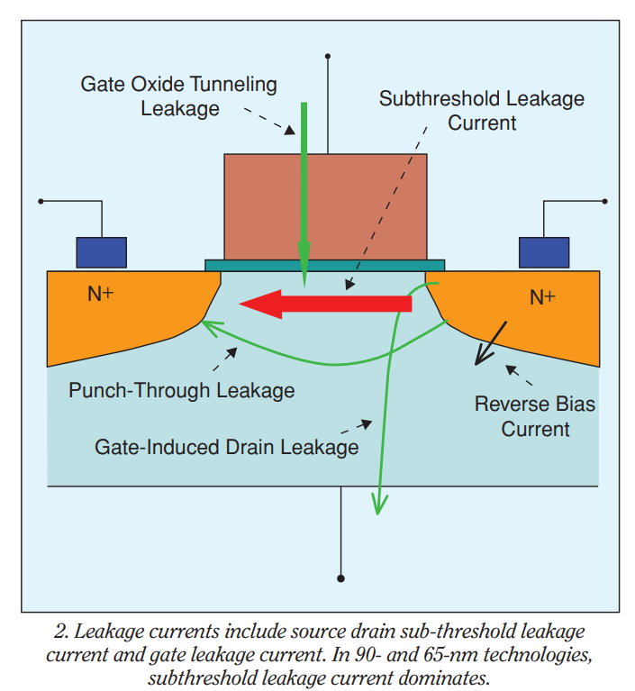

## reference

W. M. Elgharbawy and M. A. Bayoumi, "Leakage sources and possible solutions in nanometer CMOS technologies," in IEEE Circuits and Systems Magazine, vol. 5, no. 4, pp. 6-17, Fourth Quarter 2005, doi: 10.1109/MCAS.2005.1550165.

X. Qi et al., "Efficient subthreshold leakage current optimization - Leakage current optimization and layout migration for 90- and 65- nm ASIC libraries," in IEEE Circuits and Devices Magazine, vol. 22, no. 5, pp. 39-47, Sept.-Oct. 2006, doi: 10.1109/MCD.2006.272999.

P. Monsurró, S. Pennisi, G. Scotti and A. Trifiletti, "Exploiting the Body of MOS Devices for High Performance Analog Design," in IEEE Circuits and Systems Magazine, vol. 11, no. 4, pp. 8-23, Fourthquarter 2011, doi: 10.1109/MCAS.2011.942751.

