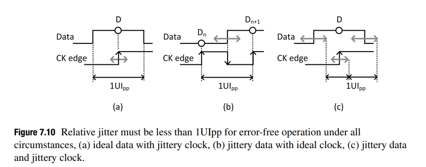

> condition:
>
> Linear model of the CDR is used in a **frequency lock condition** and is approaching to achieve **phase lock**

Using this model, the power spectral density (PSD) of jitter in the recovered clock $S_{out}(f)$ is
$$
S_{out}(f)=|H_T(f)|^2S_{in}(f)+|H_G(f)|^2S_{VCO}(f)
$$
Here, we assume $\varphi_{in}$ and $\varphi_{VCO}$ are uncorrelated as they come from independent sources.

#### Jitter Transfer

$$
H_T(s) = \frac{\varphi_{out}(s)}{\varphi_{in}(s)}|_{\varphi_{vco}=0}=\frac{K_{PD}K_{VCO}R_s+\frac{K_{PD}K_{VCO}}{C}}{s^2+K_{PD}K_{VCO}R_s+\frac{K_{PD}K_{VCO}}{C}}
$$

Using below notation
$$\begin{align}
\omega_n^2=\frac{K_{PD}K_{VCO}}{C} \\
\xi=\frac{K_{PD}K_{VCO}}{2\omega_n^2}
\end{align}$$

We can rewrite transfer function as follows
$$
H_T(s)=\frac{2\xi\omega_n s+\omega_n^2}{s^2+2\xi \omega_n s+\omega_n^2}
$$

> The jitter transfer represents a **low-pass filter** whose magnitude is around 1 (0 dB) for low jitter frequencies and drops at 20 db/decade for frequencies above $\omega_n$

- the recovered clock **track** the *low-frequency jitter* of the input data
- the recovered clock **DONT** track the *high-frequency jitter* of the input data

The recovered clock does not suffer from high-frequency jitter even though the input signal may contain high-frequency jitter, which will limit the CDR tolerance to high-frequency jitter.

#### Jitter Peaking in Jitter Transfer Function

The peak, slightly larger than 1 (0dB) implies that jitter will be **amplified** at some frequencies in the CDR, producing a jitter amplitude in the recovered clock, and thus also in the recovered data, that is slightly **larger** than the jitter amplitude in the input data.

This is certainly undesirable, especially in applications such as repeaters.

#### Jitter Generation

If the input data to the CDR is clean with no jitter, i.e., $\varphi_{in}=0$, the jitter of the recovered clock comes directly from the VCO jitter. The transfer function that relates the VCO jitter to the recovered clock jitter is known as **jitter generation**.
$$
H_G(s)=\frac{\varphi_{out}}{\varphi_{VCO}}|_{\varphi_{in}=0}=\frac{s^2}{s^2+2\xi \omega_n s+\omega_n^2}
$$
Jitter generation is **high-pass filter** with two zeros, at zero frequency, and two poles identical to those of the jitter transfer function

#### Jitter Tolerance

To quantify jitter tolerance, we often apply a sinusoidal jitter of a fixed frequency to the CDR input data and observe the BER of the CDR

The jitter tolerance curve **DONT** capture a CDR's true tolerance to **random** jitter. Because we are applying "sinusoidal" jitter, which is **deterministic** signal.

We can deal only with the jitter's amplitude and frequency instead of the PSD of the jitter thanks to deterministic sinusoidal jitter signal.
$$
JTOL(f) = \left | \varphi_{in}(f)  \right |_{\text{pp-max}} \quad \text{for a fixed BER}
$$
Where the subscript $\text{pp-max}$ indicates the maximum peak-to-peak amplitude. We can further expand this equation as follows
$$
JTOL(f)=\left| \frac{\varphi_{in}(f)}{\varphi_{e}(f)} \right| \cdot |\varphi_e(f)|_{pp-max}
$$

> Relative jitter, $\varphi_e$ must be less than 1UIpp for error-free operation

In an ideal CDR, the **maximum peak-to-peak amplitude** of $|\varphi_e(f)|$ is **1UI**, i.e.,$|\varphi_e(f)|_{pp-max}=1UI$

Accordingly, jitter tolerance can be expressed in terms of the number of UIs as
$$
JTOL(f)=\left| \frac{\varphi_{in}(f)}{\varphi_{e}(f)} \right|\quad \text{[UI]}
$$
Given the linear CDR model, we can write
$$
JTOL(f)=\left| 1+\frac{K_{PD}K_{VCO}H_{LF}(f)}{j2\pi f} \right|\quad \text{[UI]}
$$
Expand $H_{LF}(f)$ for the CDR, we can write
$$
JTOL(f)=\left| 1-2\xi j \left(\frac{f_n}{f}\right) - \left(\frac{f_n}{f}\right)^2 \right|\quad \text{[UI]}
$$

At frequencies far below and above the natural frequency, the jitter tolerance can be approximated by the following
$$
JTOL(f) = \left\{ \begin{array}{cl}
\left(\frac{f_n}{f}\right)^2 & : \ f\ll f_n \\
1 & : \ f\gg f_n
\end{array} \right.
$$

- the jitter tolerance at very **high jitter frequencies** is limited to **1UIpp**
  - This is consistent with that the recovered clock does not track the high-frequency jitter, limiting the maximum peak-to-peak deviation of the data edge from its nominal position to 1UI
  - The circumstance, (b) jittery data with ideal clock
- the jitter tolerance is increased at 40dB/decade for jitter frequencies below $f_c$
  - This is consistent with our obervation earlier that the recovered clock better tracks data jitter at lower jitter frequencies
  - Equivalently, the data edge and the clock edge move together in the **same direction**. As a result, the relative jitter between the data and the clock remains small, i.e., below 1UI peak-to-peak
  - The circumstance, (c) jittery data and jittery clock

#### reference

Dalt, Nicola Da and Ali Sheikholeslami. “Understanding Jitter and Phase Noise: A Circuits and Systems Perspective.” (2018).
