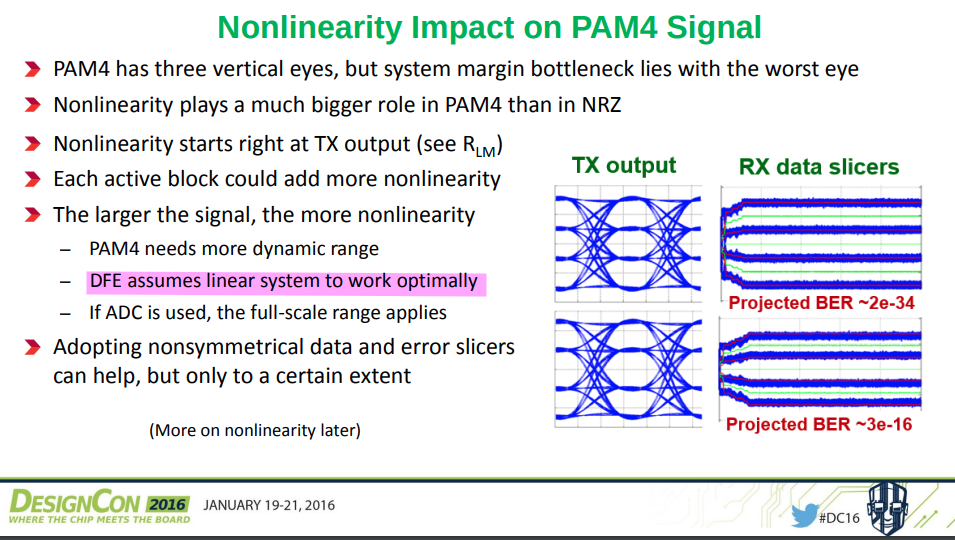
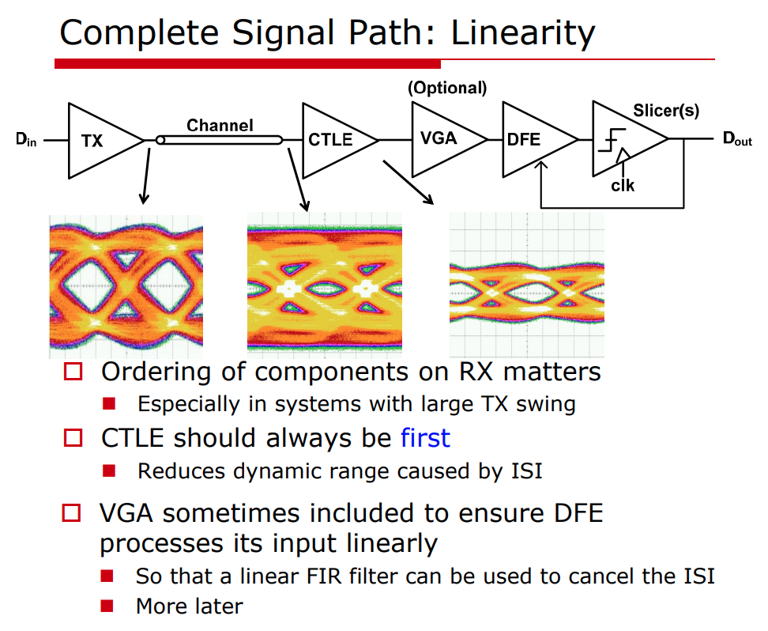
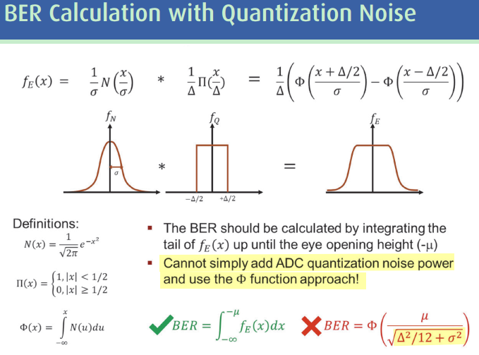
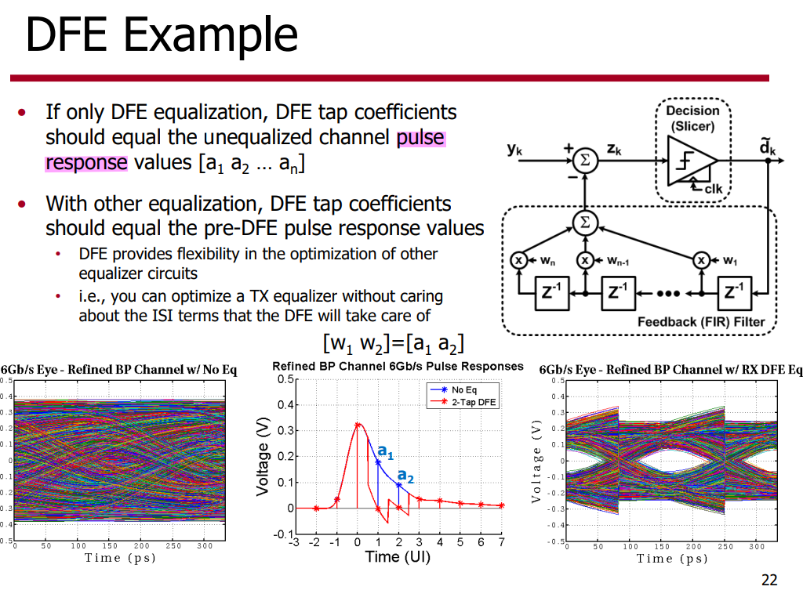
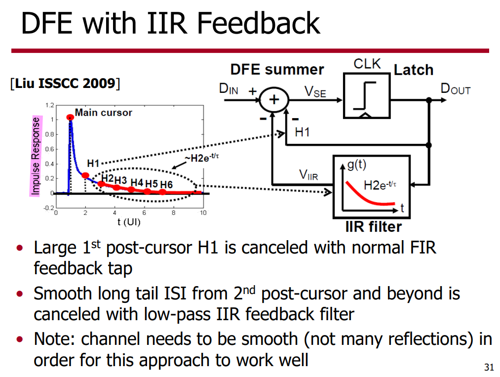
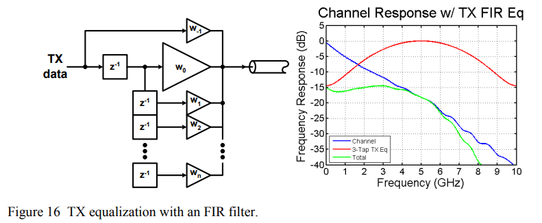
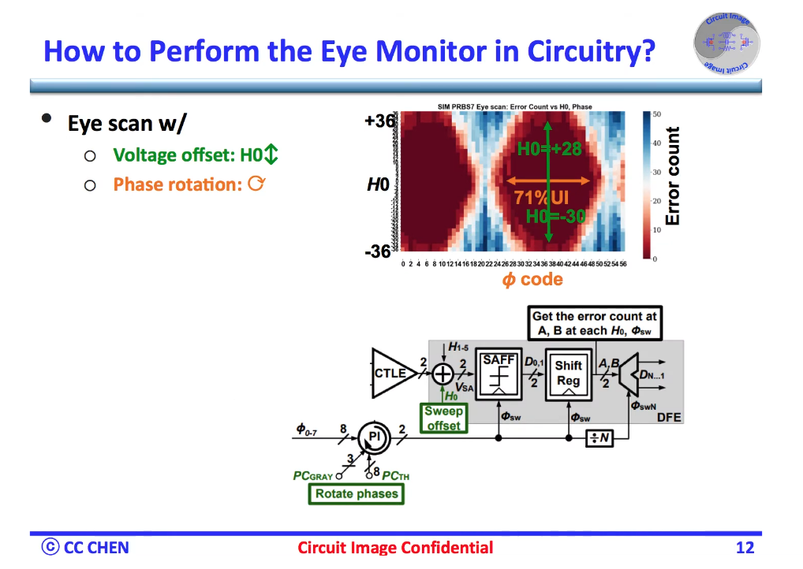

## VCO model

*TODO* &#128197;

> respone to vctrl
> focus on phase

> [[https://designers-guide.org/verilog-ams/functional-blocks/vco/vco.va](https://designers-guide.org/verilog-ams/functional-blocks/vco/vco.va)]

## ADC Spec

*TODO* &#128197;

ENOB - Not sufficient & not accurate enough
- Based on SNDR
- Assume unbounded Gaussian distribution

> quantization noise is ~ bounded uniform distribution
> 
> Using unbounded Gaussian -> pessimistic BER prediction

## AFE Nonlinearity

> ***"total harmonic distortion" (THD)*** in AFE

Relative to NRZ-based systems, PAM4 transceivers require more stringent circuit linearity, equalizers which can implement multi-level inter-symbol interference (ISI) cancellation, and improved sensitivity

Because if it compresses, it turns out you have to use a much more complicated feedback filter. As long as *it behaves linearly*, the feedback filter itself can remain *a linear FIR*

Linearity can actually be a critical constraint in these signal paths, and you really want to stay as linear as you can all the way up until the point where you've canceled all of the ISI

> A. Roshan-Zamir, O. Elhadidy, H. -W. Yang and S. Palermo, "A Reconfigurable 16/32 Gb/s Dual-Mode NRZ/PAM4 SerDes in 65-nm CMOS," in *IEEE Journal of Solid-State Circuits*, vol. 52, no. 9, pp. 2430-2447, Sept. 2017  [[https://people.engr.tamu.edu/spalermo/ecen689/2017_reconfigurable_16_32Gbps_NRZ_PAM4_SERDES_roshanzamir_jssc.pdf](https://people.engr.tamu.edu/spalermo/ecen689/2017_reconfigurable_16_32Gbps_NRZ_PAM4_SERDES_roshanzamir_jssc.pdf)]
>
> Hongtao Zhang, designcon2016. "PAM4 Signaling for 56G Serial Link Applications − A Tutorial"[[https://www.xilinx.com/publications/events/designcon/2016/slides-pam4signalingfor56gserial-zhang-designcon.pdf](https://www.xilinx.com/publications/events/designcon/2016/slides-pam4signalingfor56gserial-zhang-designcon.pdf)]
>
> Elad Alon, ISSCC 2014, "T6: Analog Front-End Design for Gb/s Wireline Receivers"

## BER with Quantization Noise

> $$
> \text{Var}(X) = E[X^2] - E[X]^2
> $$
> 

## Impulse Response or Pulse Response

##  TX FFE

TX FFE suffers from the peak power constraint, which in effect attenuates the average power of the outgoing signal -  the low-frequency signal content has been attenuated down to the high-frequency level

> [[https://www.signalintegrityjournal.com/articles/1228-feedforward-equalizer-location-study-for-high-speed-serial-systems](https://www.signalintegrityjournal.com/articles/1228-feedforward-equalizer-location-study-for-high-speed-serial-systems)]
>
> **S. Palermo**, "CMOS Nanoelectronics Analog and RF VLSI Circuits," [Chapter 9: High-Speed Serial I/O Design for Channel-Limited and Power-Constrained Systems](https://people.engr.tamu.edu/spalermo/docs/serial_links_chapter_palermo_2011.pdf), McGraw-Hill, 2011.

## Eye-Opening Monitor (EOM)

An architecture that evaluates the received signal quality

> data slicers, phase slicers, error slicers, scope slicers

> Analui, Behnam & Rylyakov, Alexander & Rylov, Sergey & Meghelli, Mounir & Hajimiri, Ali. (2006). A 10-Gb/s two-dimensional eye-opening monitor in 0.13-??m standard CMOS. Solid-State Circuits, IEEE Journal of. 40. 2689 - 2699, [[https://chic.caltech.edu/wp-content/uploads/2013/05/B-Analui_JSSC_10-Gbs_05.pdf](https://chic.caltech.edu/wp-content/uploads/2013/05/B-Analui_JSSC_10-Gbs_05.pdf)]

## reference

G. Balamurugan, A. Balankutty and C. -M. Hsu, "56G/112G Link Foundations Standards, Link Budgets & Models," *2019 IEEE Custom Integrated Circuits Conference (CICC)*, Austin, TX, USA, 2019, pp. 1-95 [[https://youtu.be/OABG3u2H2J4?si=CxryBSGbxrUpZNBT](https://youtu.be/OABG3u2H2J4?si=CxryBSGbxrUpZNBT)]

Paul Muller Yusuf Leblebici École Polytechnique Fédérale de Lausanne (EPFL). [Pattern generator model for jitter-tolerance simulation](https://designers-guide.org/modeling/JTOL_rev1.0.pdf); [VHDL-AMS models](https://designers-guide.org/modeling/fc_jtol_src_ns.vhd)

Savo Bajic, ECE1392, Integrated Circuits for Digital Communications: **StatOpt in Python** [[https://savobajic.ca/projects/academic/statopt](https://savobajic.ca/projects/academic/statopt/)]

Anritsu Company, "Measuring Channel Operating Margin," 2016. [[https://dl.cdn-anritsu.com/en-us/test-measurement/files/Technical-Notes/White-Paper/11410-00989A.pdf](https://dl.cdn-anritsu.com/en-us/test-measurement/files/Technical-Notes/White-Paper/11410-00989A.pdf)]

JLSD - Julia SerDe [[https://github.com/kevjzheng/JLSD](https://github.com/kevjzheng/JLSD)]

Kiran Gunnam, Selected Topics in RF, Analog and Mixed Signal Circuits and Systems

H. Shakiba, D. Tonietto and A. Sheikholeslami, "High-Speed Wireline Links-Part I: Modeling," in IEEE Open Journal of the Solid-State Circuits Society, vol. 4, pp. 97-109, 2024 [[https://ieeexplore.ieee.org/stamp/stamp.jsp?arnumber=10608184](https://ieeexplore.ieee.org/stamp/stamp.jsp?arnumber=10608184)]

H. Shakiba, D. Tonietto and A. Sheikholeslami, "High-Speed Wireline Links-Part II: Optimization and Performance Assessment," in IEEE Open Journal of the Solid-State Circuits Society, vol. 4, pp. 110-121, 2024 [[https://ieeexplore.ieee.org/stamp/stamp.jsp?tp=&arnumber=10579874](https://ieeexplore.ieee.org/stamp/stamp.jsp?tp=&arnumber=10579874)]

G. Souliotis, A. Tsimpos and S. Vlassis, "Phase Interpolator-Based Clock and Data Recovery With Jitter Optimization," in IEEE Open Journal of Circuits and Systems, vol. 4, pp. 203-217, 2023 [[https://ieeexplore.ieee.org/stamp/stamp.jsp?tp=&arnumber=10184121](https://ieeexplore.ieee.org/stamp/stamp.jsp?tp=&arnumber=10184121)]

