## Time domain modeling

While many different analysis methods exist, including frequency and statistical analysis, *time domain results* remain the final *sign-off*

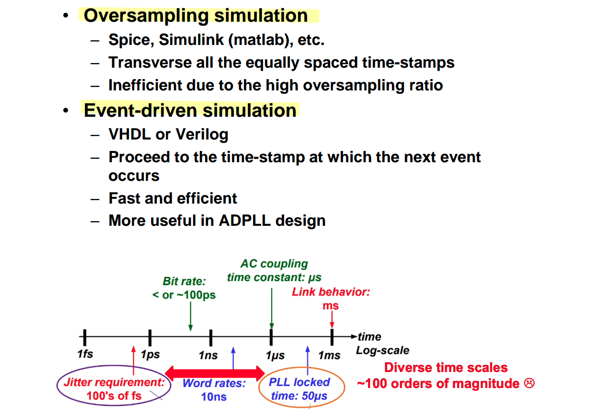

### serdespy

> Richard Barrie. serdespy — A python library for system-level SerDes modelling and simulation [[https://github.com/richard259/serdespy](https://github.com/richard259/serdespy)]
>
> `python 3.10, samplerate`


***ifft of sampling continuous-time transfer function***


```python
def freq2impulse(H, f):
    #Returns the impulse response, h, and (optionally) the step response,
    #hstep, for a system with complex frequency response stored in the array H
    #and corresponding frequency vector f.  The time array is
    #returned in t.  The frequency array must be linearly spaced.

    Hd = np.concatenate((H,np.conj(np.flip(H[1:H.size-1]))))
    h = np.real(np.fft.ifft(Hd))
    #hstep = sp.convolve(h,np.ones(h.size))
    #hstep = hstep[0:h.size]
    t= np.linspace(0,1/f[1],h.size+1)
    t = t[0:-1]

    return h,t
```

Maybe, the more straightforward method is sampling impulse response of continuous-time transfer function directly


```python
import numpy as np
from scipy import signal
import matplotlib.pyplot as plt

fbw = 20e9
wbw = fbw * 2 * np.pi
samples_per_symbol = 64
UI = 1/50e9
Ts = UI/samples_per_symbol
fs = 1/Ts
ws = fs * 2 * np.pi
ttot = 4/fbw # heuristic
N = int(0.5 * fs * ttot)+1
w, H = signal.freqs([1], [1/wbw, 1], np.linspace(0, 0.5*ws, N))

## freq2impulse(H, f), ifft - using sample of continuous-time tranfer function
f = w/(2*np.pi)
Hd = np.concatenate((H,np.conj(np.flip(H[1:H.size-1]))))
hd = np.real(np.fft.ifft(Hd))
t= np.linspace(0,1/f[1],hd.size+1)
t = t[0:-1]

## continuous-time transfer function - impulse
t, hc = signal.impulse(([1], [1/wbw, 1]), T = t)

## hd(kTs) = Ts*hc(kTs)
plt.figure(figsize = (14,10))
plt.plot(t, hc, t, hd/Ts, '--r', linewidth=3)
plt.grid(); plt.legend(['impulse response by continuous-time transfer function','impulse response/Ts by ifft of sampling transfer function'])
plt.ylabel('Mag'); plt.xlabel('time (s)'); plt.show()
```


### JLSD

> Kevin Zheng. JLSD — Julia SerDes [[https://github.com/kevjzheng/JLSD](https://github.com/kevjzheng/JLSD)]
>
> *boundary conditions internally*, *remembering states from the previous (sub-)block*

---

```julia
out = conv(ir, vbits)*tui/osr
lines(tt, out[1:length(vbits)])
```


```julia
#call our convolution function; let's keep the input memory zero for now
#change the drv parameters in the struct definition to see the waveform/eye change
u_conv!(drv.Vo_conv, Vosr, drv.ir, Vi_mem=zeros(1), gain = drv.swing * param.dt);


#we will also create a non-mutating u_conv function for other uses
function u_conv(input, ir; Vi_mem = zeros(1), gain = 1)
    vconv = gain .* conv(ir, input)
    vconv[eachindex(Vi_mem)] += Vi_mem

    return vconv
end
```

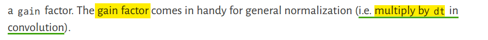


---


***Kronecker product*** to create ***oversampled*** waveform

```julia
function gen_wvfm(bits; tui, osr)
	#helper function used to generate oversampled waveform
	
	Vbits = kron(bits, ones(osr)) #Kronecker product to create oversampled waveform
	dt = tui/osr
	tt = 0:dt:(length(Vbits)-1)*dt

	return tt, Vbits
end
```


***normalized to the time step***
$$
\frac{\alpha}{s+\alpha} \overset{\mathcal{L}^{-1}}{\longrightarrow} \alpha\cdot e^{-\alpha t}
$$

The integral of impulse response of low pass RC filter $\int_{0}^{+\infty} \alpha\cdot e^{-\alpha t}dt = 1$ — `sum(ir*dt)`

```julia
function gen_ir_rc(dt,bw,t_len)
	#helper function that directly calculates a first order RC response, normalized to the time step
    tt = [0:dt:t_len-dt;]

	#checkout the intuitive symbols!
    ω = (2*π*bw)
    ir = ω*exp.(-tt*ω)
    ir .= ir/sum(ir*dt)

    return ir
end
```

> `sum(ir)*dt = 1`, i.e. the step response `1`


```julia
using Plots
using LaTeXStrings

tui = 1/10e9;
tlen_ir = 20*tui;


osr_list = [4, 8, 16, 32, 64, 128, 256, 512, 1024];
bw_ir = 8e9;

ω = (2*π*bw_ir);

ir_dt_sum_list = [];

for osr_cur in osr_list
    dt = tui/osr_cur; # Simulation time step
    tt = [0:dt:tlen_ir-dt;]
    ir = ω*exp.(-tt*ω);
    ir_dt_sum = sum(ir*dt);
    push!(ir_dt_sum_list, ir_dt_sum)
end

println(ir_dt_sum_list)
# Any[1.756575097878581, 1.3468434968519964, 1.1652908056870317, 1.0805951388547221, 1.0397838972257087, 1.0197634612560418, 1.0098496044545267, 1.0049167704129547, 1.0024563772359665]

p = plot(osr_list, ir_dt_sum_list, label = "OSR")
gui(p)
```


---

***generate PAM symbols***

> here *Big Endian*

```julia
	#generate PAM symbols
    fill!(So, zero(Float64)) #reset So to all 0
    for n = 1:bits_per_sym
        @. So = So + 2^(bits_per_sym-n)*So_bits[n:bits_per_sym:end]
    end
```

```julia
function int2bits(num, nbit)
    return [Bool((num>>k)%2) for k in nbit-1:-1:0]
end


 Si_bits .= vec(stack(int2bits.(Si, bits_per_sym)))
```

---

***Detailed Transmitter***


```julia
function drv_top!(drv, input)
	@unpack all parameters and vectors

    apply_fir_filter!(Sfir, input, fir, kwargs...)

	oversample!(Vfir,Sfir)

	if jitter_en
        # !!! jitter gen before impulse response convolution
        # !!! jitter information at each edge location
		add_jitter!(drv, Vfir)
	end
	
    # impulse response of the driver (and subsequent channel, RX front end, etc.) plays a crucial role 
    # in low-pass filtering the jittered waveform to give it a "smoother look"
	convolve!(Vo_conv, Vfir, ir, kwargs...)

end
```


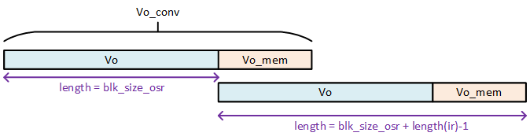

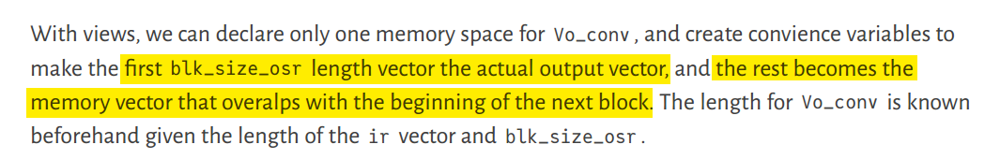

```julia
Vo_conv::Vector = zeros(param.blk_size_osr+lastindex(ir)-1) 
Vo = @views Vo_conv[1:param.blk_size_osr] 
Vo_mem = @views Vo_conv[param.blk_size_osr+1:end]
```


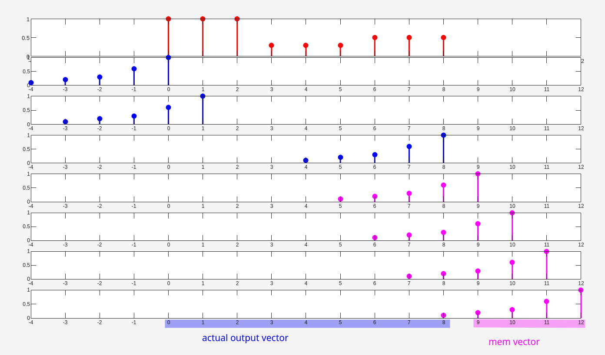

```matlab
si = [1,0.3,0.5];
vi = kron(si, ones(1,3));
xi = 0:1:(length(vi)-1);


subplot(6,1,1)
stem(xi, vi, "filled", 'r', LineWidth=2); xlim([-4,12]); xticks(-4:1:12)

ir = [0.1, 0.2, 0.3, 0.6, 1];
xir = -length(ir)+1:1:0;

subplot(8,1,2)
stem(xir, ir, "filled", 'b', LineWidth=2); xlim([-4,12]); xticks(-4:1:12)

subplot(8,1,3)
stem(xir+1, ir, "filled", 'b', LineWidth=2); xlim([-4,12]); xticks(-4:1:12)

subplot(8,1,4)
stem(xir+8, ir, "filled", 'b', LineWidth=2); xlim([-4,12]); xticks(-4:1:12)

subplot(8,1,5)
stem(xir+9, ir, "filled", 'm', LineWidth=2); xlim([-4,12]); xticks(-4:1:12)

subplot(8,1,6)
stem(xir+10, ir, "filled", 'm', LineWidth=2); xlim([-4,12]); xticks(-4:1:12)

subplot(8,1,7)
stem(xir+11, ir, "filled", 'm', LineWidth=2); xlim([-4,12]); xticks(-4:1:12)

subplot(8,1,8)
stem(xir+12, ir, "filled", 'm', LineWidth=2); xlim([-4,12]); xticks(-4:1:12)
```

---

***eye diagram*** based on `heatmap`

```julia
function w_gen_eye_simple_test(input,x_npts_ui, x_npts, y_range, y_npts; osr, x_ofst=0)
    heatmap = zeros(x_npts, y_npts)

    input_x = 0:1/osr:(lastindex(input)-1)/osr
    itp_resample = linear_interpolation(input_x, input) # interpolation object
    idx_itp = 0:1/x_npts_ui:input_x[end]
    input_itp = itp_resample.(idx_itp)

    for n = 1:x_npts
        heatmap[n,:] = u_hist(input_itp[n:x_npts:end], -y_range/2, y_range/2, y_npts)
    end
   
    return circshift(heatmap, (Int(x_ofst), 0))
end
```

> Julia's interpolation return a *function object* that can operate on any values you throw at it


```julia
function u_hist(samples, minval, maxval, nbin)
    weights = zeros(Float64, nbin)
    bin_size = (maxval-minval)/nbin

    for s in samples
        idx = Int(floor((s-minval)/bin_size))+1
        idx = idx < 1 ? 1 : idx > nbin ? nbin : idx
        weights[idx] += 1.0
    end
    return weights
end


feye = Figure()
heatmap!(Axis(feye[1,1]), x_grid, y_grid, eye_tx, 
            colormap=:turbo, #try :inferno, :hot, :viridis
        )
feye
```

---

FIR filter typically is much shorter (<10 taps) than the symbol vector, using *FFT convolution might be an overkill*. For optimization, a simple ***shift-and-add filter*** function can be written

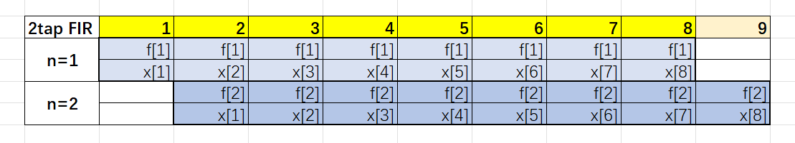

```julia
function u_filt(So_conv, input, fir; Si_mem=Float64[])
    sconv = zeros(length(input) + length(fir) - 1)

    s_in = lastindex(input)
    
    for n=eachindex(fir)
        sconv[n:s_in+n-1] .+= fir[n] .* input
    end

    sconv[eachindex(Si_mem)] .+= Si_mem

    return sconv
end
```

---

***model jitter*** with ***fixed simulation time step***

**warp** or **remap** a *"jittery time grid"* onto our *"uniform time grid"*

```julia
prev_nui = 4
Vext::Vector = zeros(prev_nui*param.osr+param.blk_size_osr)
V_prev_nui = @views Vext[end-prev_nui*param.osr+1:end]  # prev_nui*osr
tt_Vext::Vector = zeros(prev_nui*param.osr+param.blk_size_osr)
Δtt_ext = zeros(param.blk_size+prev_nui+1)  # blk_size + prev_nui + 1
Δtt = zeros(param.blk_size)
Δtt_prev_nui = @views Δtt_ext[end-prev_nui:end]  # prev_nui +  1
tt_uniform::Vector = (0:param.blk_size_osr-1) .+ prev_nui/2*param.osr
```

`Δtt*` vectors store the jitter information *at each edge location*

`tt_Vext` vector is the jittered time grid vector

`tt_uniform` is the convience vector to remap the jittered waveform back to our simulation grid

> using **intermediate voltages** embed jitter information at fractional time steps
>
> 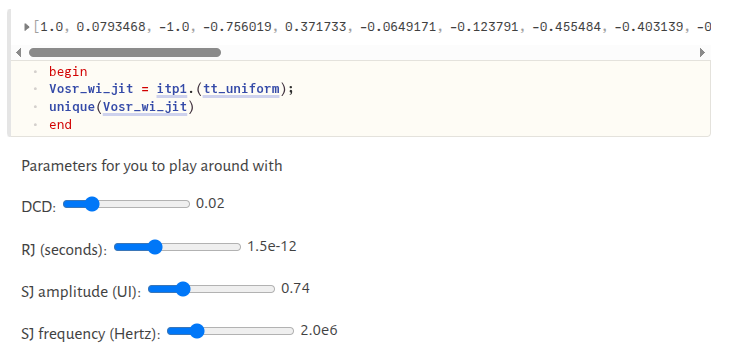

```julia
drv.Δtt_ext[eachindex(drv.Δtt_prev_nui)] .= drv.Δtt_prev_nui  # 1
drv.Δtt_ext[lastindex(drv.Δtt_prev_nui)+1:end] .= Δtt  # 2
```


```julia
drv.Vext[eachindex(drv.V_prev_nui)] .= drv.V_prev_nui  # 1
drv.Vext[lastindex(drv.V_prev_nui)+1:end] .= Vosr  # 2
```


```julia
function drv_jitter_tvec!(tt_Vext, Δtt_ext, osr)
    for n = 1:lastindex(Δtt_ext)-1
        tt_Vext[(n-1)*osr+1:n*osr] .= LinRange((n-1)*osr+Δtt_ext[n], n*osr+Δtt_ext[n+1], osr+1)[1:end-1]
    end

    return nothing
end

drv_jitter_tvec!(drv.tt_Vext, drv.Δtt_ext, param.osr);

itp = linear_interpolation(drv.tt_Vext, drv.Vext); #itp is a function object

#note here tt_uniform is shifted by prev_nui/2 to give wiggle room for sampling "before" and "after" the current block. This is necessary for sinusoidal jitter
tt_uniform = (0:param.blk_size_osr-1) .+ drv.prev_nui/2*param.osr;

#To interpolate, use the itp object like a function and broadcast to a vector
Vosr_jittered = itp.(tt_uniform); 

# `interp_linear_extrap = linear_interpolation(xs, A, extrapolation_bc=Line())` create #linear interpolation object **with extrapolation**
```

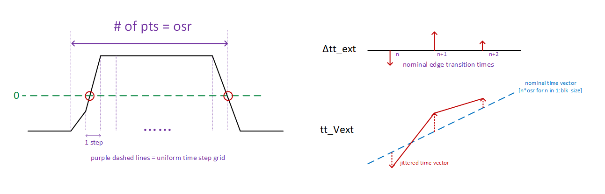

`itp = linear_interpolation(drv.tt_Vext, drv.Vext)` create linear interpolation object **without extrapolation**

extrapolation shall **not** be used to avoid introducing any error

- `prev_nui` denotes the number of previous symbols to be stitched to the current block's signal to *prevent overflow/underflow when jitter is introduced*

- `tt_uniform` is shifted by `prev_nui/2` to give wiggle room for sampling "before" and "after" the current block. This is necessary for sinusoidal jitter


> a specialized interpolation function to optimize for performance, which support interpolation only
>
> ```julia
> function drv_interp_jitter!(vo, tt_jitter, vi, tt_uniform)
>     last_idx = 1
>     for n = eachindex(tt_uniform)
>         t = tt_uniform[n]
>         for m = last_idx:lastindex(tt_jitter)-1
>             if (t >= tt_jitter[m]) && (t < tt_jitter[m+1])
>                 k = (vi[m+1]-vi[m])/(tt_jitter[m+1]-tt_jitter[m])
>                 vo[n] = vi[m] + k*(t-tt_jitter[m])
>                 last_idx = m
>                 break
>             end
>         end
>     end
> 
>     return nothing
> end
> ```

```julia
drv.Δtt_ext[eachindex(drv.Δtt_prev_nui)] .= drv.Δtt_prev_nui
drv.Δtt_ext[lastindex(drv.Δtt_prev_nui)+1:end] .= Δtt

drv.Vext[eachindex(drv.V_prev_nui)] .= drv.V_prev_nui
drv.Vext[lastindex(drv.V_prev_nui)+1:end] .= Vosr
```


---

***channel***

```julia
noise_Z::Float64 = 50  # termination impedance with thermal noise
noise_dbm_hz::Float64 = -174
noise_rms::Float64 = sqrt(0.5/param.dt*10^((noise_dbm_hz-30.0)/10)*noise_Z)

ch.Vch .+= noise_rms .* randn(blk_size_osr)
```

$$
P_\text{n,dBm/Hz} = 10\times\log_{10} (k_B T / 10^{-3}) = 10\times\log_{10} (k_B T) + 30=-174
$$

Then, $k_B T = 10^{\frac{-174 - 30}{10}}$

we have

$$
\sigma_n^2 = 4\cdot k_B T \cdot R \cdot \frac{f_s}{2} =  k_B T \cdot R \cdot 2f_s= \frac{\color{red}{2}}{T_s} \cdot 10^{\frac{-174 - 30}{10}} \cdot R
$$

> `noise_rms::Float64 = sqrt(2/param.dt*10^((noise_dbm_hz-30.0)/10)` rather than ~~`sqrt(0.5/param.dt*10^((noise_dbm_hz-30.0)/10)`~~

---


run simulation by **recursion** 

```julia
function run_blk_iter(trx, idx, n_tot_blk, blk_func::Function)
    if idx < n_tot_blk
        blk_func(trx, idx+1)
        run_blk_iter(trx, idx+1, n_tot_blk, blk_func)
    end
end
```


### Sam Palermo's

continuous time filter (channel, ctle); impulse response

digital filter (FFE, DFE): `repmat` by samples per UI 

---

> Sam Palermo. ECEN 720: High-Speed Links Circuits and Systems [[https://people.engr.tamu.edu/spalermo/ecen720.html](https://people.engr.tamu.edu/spalermo/ecen720.html)]

`repmat`

```matlab
>> repmat([1,2,3], 3, 1)

ans =

     1     2     3
     1     2     3
     1     2     3
```


```matlab
>> reshape(repmat([1,2,3], 3, 1), 1, 3*3)

ans =

     1     1     1     2     2     2     3     3     3
```


***Generating an Impulse Response from S-Parameters***

> ECEN720: High-Speed Links Circuits and Systems Spring 2025 [[https://people.engr.tamu.edu/spalermo/ecen689/lecture3_ee720_tdr_spar.pdf](https://people.engr.tamu.edu/spalermo/ecen689/lecture3_ee720_tdr_spar.pdf)]

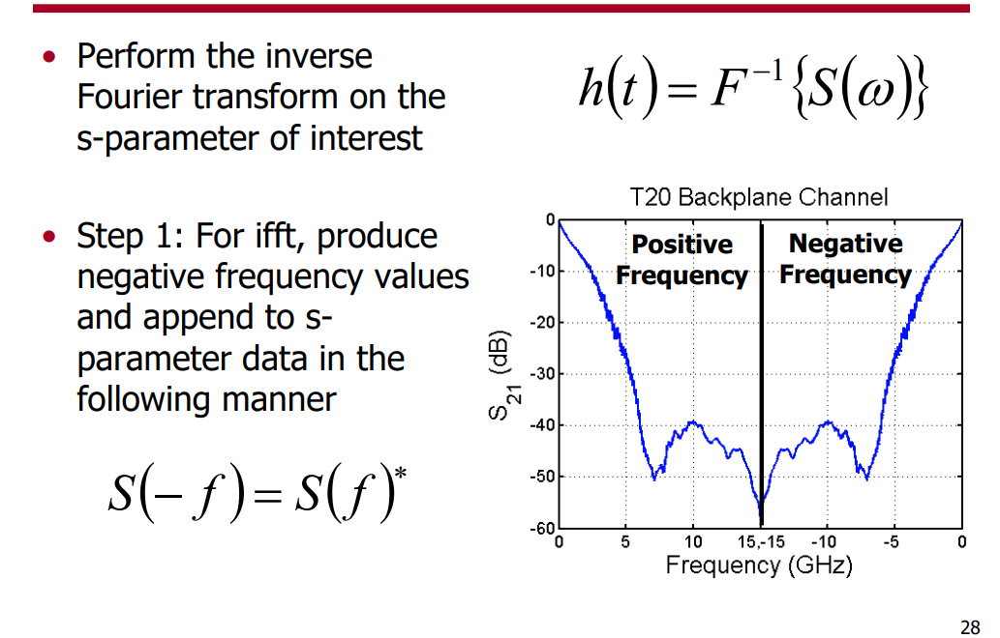

> `spline`: Cubic spline data interpolation
>
> 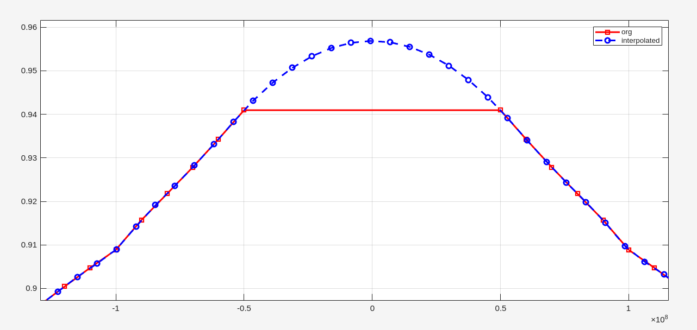
>
> ```matlab
> Hm_ds_interp=spline(fds_m,Hm_ds,f_ds_interp); % Interpolate for FFT point number
> figure(Name='spline function')
> plot(fds_m, Hm_ds, '-rs', LineWidth=2)
> hold on
> plot(f_ds_interp, Hm_ds_interp, '--bo', LineWidth=2)
> legend('org', 'interpolated'); grid on
> ```


***impulse response from ifft of interpolated frequency response***

```matlab
% https://people.engr.tamu.edu/spalermo/ecen689/xfr_fn_to_imp.m

% Generate Random Data
nt=1e3;         %number of bits
m=rand(1,nt+1);     %random numbers between 1 and zero, will be quantized later
m=-1*sign(m-0.5).^2+sign(m-0.5)+1;


% TX FIR Equalization Taps
eq_taps=[1];
m_fir=filter(eq_taps,1,m);


m_dr=reshape(repmat(m_fir,bit_period,1),1,bit_period*size(m_fir,2));

data_channel=0.5*conv(sig_ir(:,1),m_dr(1:nt*bit_period));
```


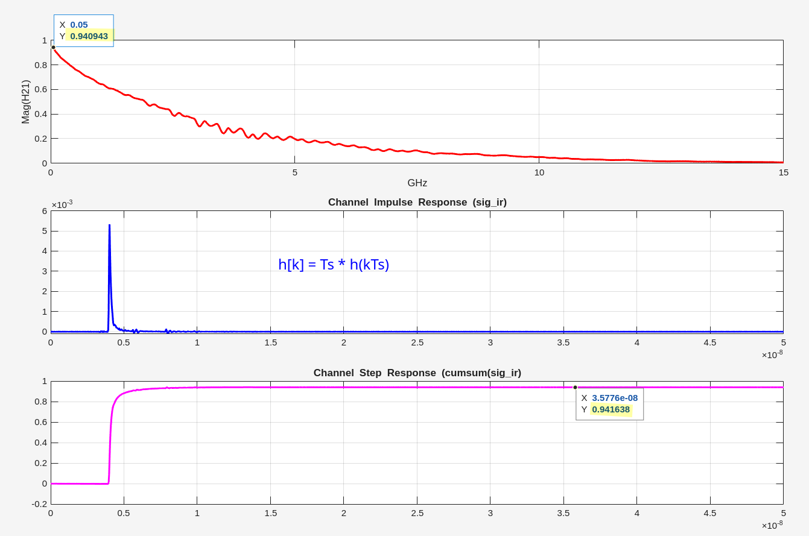

```matlab
subplot(3,1,1)

FileName = './peters_01_0605_B12_thru.s4p';
SingleEndedData = read(rfdata.data, FileName);
Freq = SingleEndedData.Freq;
DifferentialSparams = s2sdd(SingleEndedData.S_Parameters);
rfdata.network('Data', DifferentialSparams, 'Freq', Freq);
H21 = DifferentialSparams(2,1,:);

plot(Freq'*1e-9, abs(H21(:)),'-r', LineWidth=2);
xlabel('GHz'); ylabel('Mag(H21)'); grid on;


subplot(3,1,2)
load './ir_B12.mat';
tsample=1e-12;  % Impluse response has 1ps time step
sample_num=size(ir,1);  
sig_ir=ir(:,1); 

time=(1:size(sig_ir,1))*1e-12;

plot(time, sig_ir, '-b', LineWidth=2);
title('Channel Impulse Response (sig_ir)'); grid on;


subplot(3,1,3)
step_resp = cumsum(sig_ir); % Ts factor embedded in sig_ir
plot(time, step_resp, '-m', LineWidth=2);
title('Channel Step Response (cumsum(sig_ir)'); grid on;
```


> ```matlab
> plot(ch1_freqs,20*log10(abs(ch1)),'-b',Freq'*1e-9,20*log10(abs(H21)),'-r');
> legend('From Impulse Response','Measured');
> ```
>
> 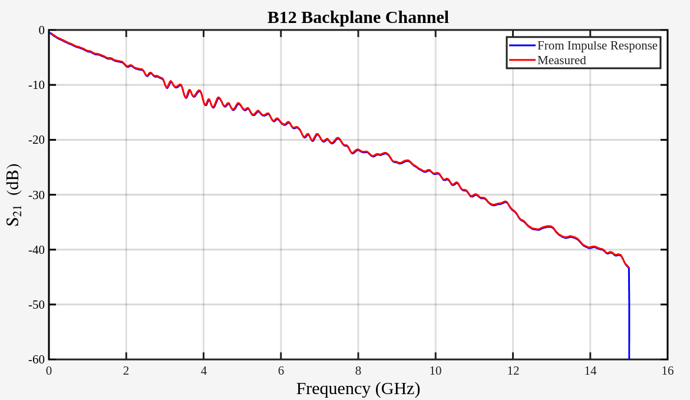

---

***plot eye diagram***

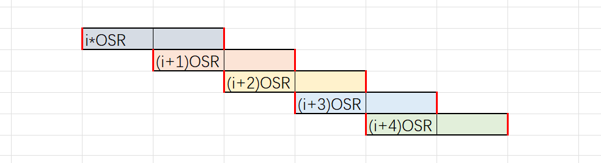

```matlab
% https://people.engr.tamu.edu/spalermo/ecen689/channel_data.m

data_channel=0.5*conv(sig_ir(:,1),m_dr(1:nt*bit_period));

j=1;
offset=144;

for ( i=55:floor(size(data_channel,2) / bit_period)-500)
    eye_data(:,j) = 2*data_channel(floor((bit_period*(i-1)))+offset: floor((bit_period*(i+1)))+offset);
    j=j+1;
end

time=0:2*bit_period;
plot(time,eye_data);
```

> If your 2D array represents multiple data series (e.g.*, each column is a separate line series* *sharing the same x-axis values*), the `plot()` function is the most straightforward method.


---

> [[https://people.engr.tamu.edu/spalermo/ecen689/lecture4_ee720_channel_pulse_model.pdf](https://people.engr.tamu.edu/spalermo/ecen689/lecture4_ee720_channel_pulse_model.pdf)]

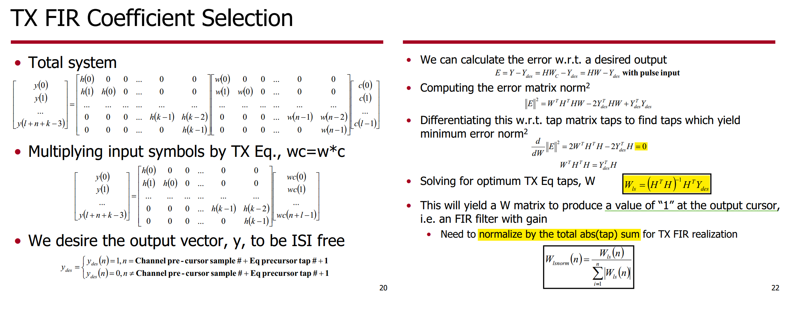

```matlab
% https://people.engr.tamu.edu/spalermo/ecen689/tx_eq.m

precursor_samples=10;
pulse_response=conv(ir_process,ones(1,bit_period));
[max_pulse_value,max_pulse_time]=max(pulse_response);
sample_times=[max_pulse_time-1*precursor_samples*bit_period:bit_period:max_pulse_time+30*bit_period];
sample_values=pulse_response(sample_times);

% Construct H matrix
H(:,1)=sample_values';
H(size(sample_values,1)+1:size(sample_values,1)+eq_tap_number-1,1)=0;
for i=2:eq_tap_number
    H(1:i-1,i)=0;
    H(i:size(sample_values,1)+i-1,i)=sample_values';
    H(size(sample_values,1)+i:size(sample_values,1)+eq_tap_number-1,1)=0;
end;


% Construct Y matrix
Ydes(1:precursor_samples+precursor_number,1)=0;
Ydes(precursor_samples+precursor_number+1,1)=1;
Ydes(precursor_samples+precursor_number+2:size(H,1),1)=0;

W=(H'*H)^(-1)*H'*Ydes

Itot=1;
taps=Itot*W/sum(abs(W));
```


***TX FIR Tap Resolution***

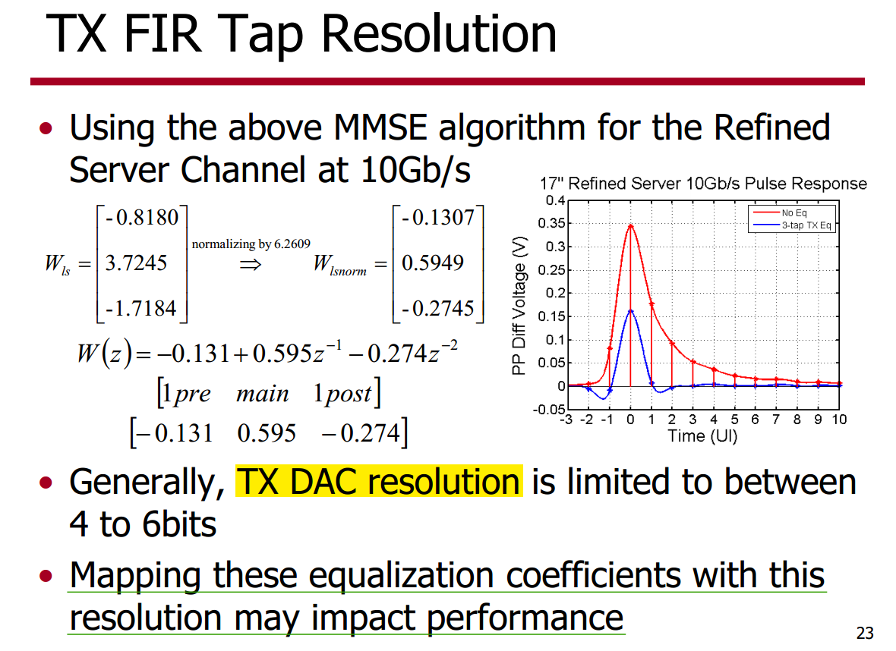

```matlab
% https://people.engr.tamu.edu/spalermo/ecen689/tx_eq.m

taps_abs=abs(taps);
taps_sign=sign(taps);

partition=[1/(2*(2^num_bits-1)):1/(2^num_bits-1):1-1/(2*(2^num_bits-1))];
codebook=[0:1/(2^num_bits-1):1];
[index,abs_taps_quan]=quantiz(abs(taps),partition,codebook);
taps_quan=taps_sign'.*abs_taps_quan;
taps_quan(precursor_number+1)=sign(taps_quan(precursor_number+1))*(1-(sum(abs(taps_quan))-abs(taps_quan(precursor_number+1))));
```

---

***CTLE modeling by impulse response***

Given two impulse response $h_0(t)$, $h_1(t)$ and $h_0(t)*h_1(t) = h_{tot}(t)$, we have
$$
T_s h_0(kT_s) * T_sh_1(kT_s) = T_s h_{tot}(kT_s)
$$

> To use the `filter` function with the `b` coefficients from an FIR filter, use `y = filter(b,1,x)`


***CTLE response from frequency response using*** `ifft`

> data-driven frequency table

```matlab
% https://people.engr.tamu.edu/spalermo/ecen689/gen_ctle.m

Hk_ext = [Hk conj(Hk(end-1:-1:2))] ;

hn_ext_ifft = real(ifft(Hk_ext, 'symmetric'));
hn_ext_ifft(1) = (2 * hn_ext_ifft(1));
%interpolate ifft
N = length(ctle.f_arr);
Ts = (1 / (2*fmax));
t_arr = ((0 : (N-1)) * Ts); Tmax = t_arr(end); %10e-9; 
treqd = (0 : time_step : Tmax);
%interpolate step response instead of impulse response
sr_ifft = cumsum(hn_ext_ifft(1:length(t_arr))); sr_ifft_t = t_arr;
sr_interp = interp1(sr_ifft_t, sr_ifft, treqd, 'spline');
ir_interp = diff(sr_interp);
ir_ctle = ir_interp; clear ir_interp;

%scale by gain adjustment factor
ir_ctle = (ir_ctle * ctle.gain_adjust_fac);
ir_out = filter(ir_ctle, 1, ir_in);
```


***CTLE response from pole/zero using** `tf` & `impulse`*

```matlab
H21 = tf();
tsamples = 0:Ts:nUI
ir = Ts*impulse(H21, tsamples)  % scaling by Ts is necessary
```


***CTLE response from pole/zero using*** `bilinear` ***discretization***

> analytical pole/zero transfer function, [[Google AI Mode](https://share.google/aimode/J1uwT2df4YZxwk2f9)]

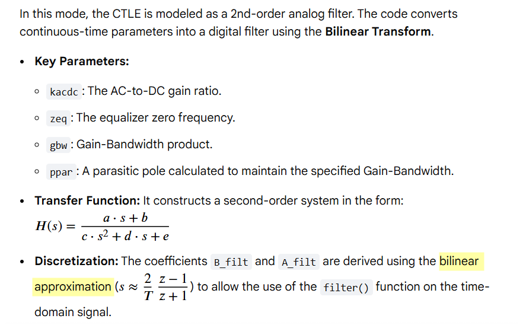

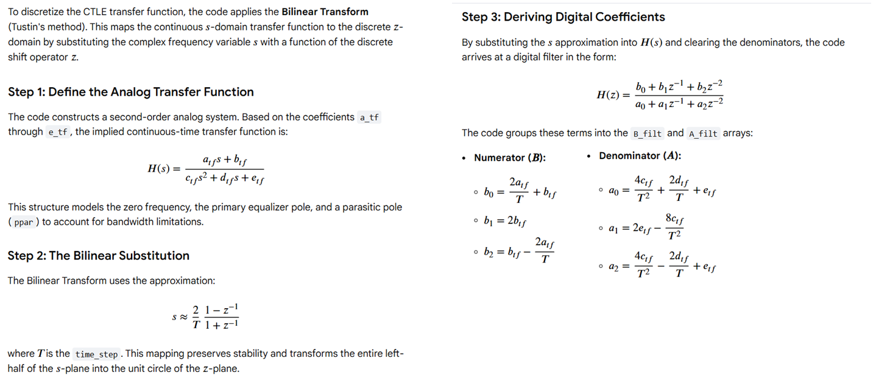

```matlab
% https://people.engr.tamu.edu/spalermo/ecen689/gen_ctle.m

A_dc=max(A_dc,1e-3);
zeq=max(zeq,1);
peq=max(peq,1);

gbw_rad=gbw*2*pi;
zeq_rad=zeq*2*pi;
peq_rad=peq*2*pi;

ppar=(gbw_rad*zeq_rad)/(A_dc*peq_rad);

a_tf=A_dc*peq_rad*ppar;
b_tf=A_dc*peq_rad*ppar*zeq_rad;
c_tf=zeq_rad;
d_tf=(peq_rad+ppar)*zeq_rad;
e_tf=peq_rad*ppar*zeq_rad;


B_filt=[2*a_tf/time_step+b_tf;
    2*b_tf;
    b_tf-2*a_tf/time_step]';

A_filt=[4*c_tf/time_step^2+2*d_tf/time_step+e_tf;
    2*e_tf-8*c_tf/time_step^2;
    4*c_tf/time_step^2-2*d_tf/time_step+e_tf]';

B_filt=B_filt/A_filt(1);
A_filt=A_filt/A_filt(1);

ir_out=filter(B_filt,A_filt,ir_in);
```

---

***rx dfe***

pseudo linear equalizer

```matlab
% https://people.engr.tamu.edu/spalermo/ecen689/channel_data_pulse_pda_dfe.m

% Take 10 pre-cursor, cursor, and 90 post-cursor samples
sample_offset=opt_sample*bit_period;
for i=1:101
sample_points(i)=max_data_ch_idx+sample_offset+(i-11)*bit_period;
end
sample_values=data_channel(sample_points);
sample_points=(sample_points-max_data_ch_idx)./bit_period;

channel_delay=max_data_ch_idx-(20*bit_period+1);  % !! 20*bit_period = 2000

% Include DFE Equalization
dfe_tap_num=2;
dfe_taps(1:dfe_tap_num)=sample_values(12:12+dfe_tap_num-1);  % h1, h2...

% Note this isn't a strtict DFE implementation - as I am not making a
% decision on the incoming data.  Rather, I am just using the known data
% that I transmitted, delay matching this with the channel data, and using 
% it to subtract the ISI after weighting with the tap values.  But, I think 
% it is good enough for these simulations.
m_dfe=filter(dfe_taps,1,m);
m_dfe_dr=reshape(repmat(m_dfe,bit_period,1),1,bit_period*size(m_dfe,2));

data_channel=data_channel';
dfe_fb_offset=floor(bit_period/2); % Point at which the DFE taps are subtracted - can be anything from 0 to UI-1*time_step
data_channel_dfe=data_channel(channel_delay+dfe_fb_offset:channel_delay+dfe_fb_offset+size(m_dfe_dr,2)-1)-m_dfe_dr;
```


> 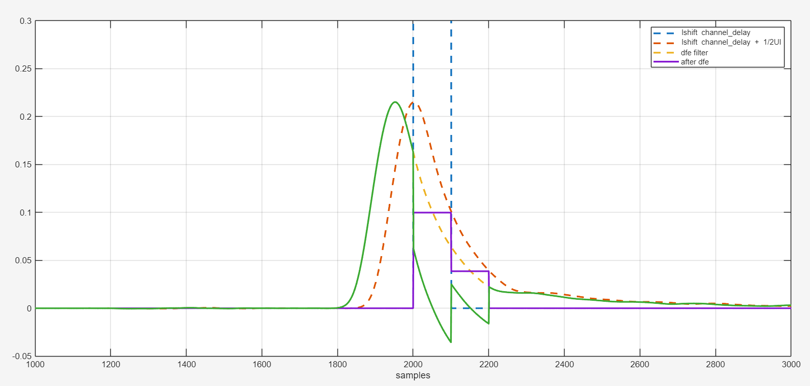
>
> ```matlab
> plot(m_dr, '--', LineWidth=2); hold on
> plot(data_channel(channel_delay:end), '--', LineWidth=2)
> hold on
> plot(data_channel(channel_delay+dfe_fb_offset:channel_delay+dfe_fb_offset+size(m_dfe_dr,2)-1), '--', LineWidth=2)
> plot(m_dfe_dr, LineWidth=2); plot(data_channel_dfe, LineWidth=2)
> xlim([1000, 3000]); ylim([-0.05, 0.3]); xlabel('samples'); grid on
> legend('lshift channel\_delay', 'lshift channel\_delay + 1/2UI', 'dfe filter', 'after dfe')
> ```


### DaVE

> Byongchan Lim. DaVE — tools regarding on analog modeling, validation, and generation, [[https://github.com/StanfordVLSI/DaVE](https://github.com/StanfordVLSI/DaVE)]

*TODO* &#128197;


## Statistical Eye

> Sanders, Anthony, Michael Resso and John D'Ambrosia. “Channel Compliance Testing Utilizing Novel Statistical Eye Methodology.” (2004) [[https://people.engr.tamu.edu/spalermo/ecen689/stateye_theory_sanders_designcon_2004.pdf](https://people.engr.tamu.edu/spalermo/ecen689/stateye_theory_sanders_designcon_2004.pdf)]
>
> X. Chu, W. Guo, J. Wang, F. Wu, Y. Luo and Y. Li, "Fast and Accurate Estimation of Statistical Eye Diagram for Nonlinear High-Speed Links," in IEEE Transactions on Very Large Scale Integration (VLSI) Systems, vol. 29, no. 7, pp. 1370-1378, July 2021 [[https://sci-hub.se/10.1109/TVLSI.2021.3082208](https://sci-hub.se/10.1109/TVLSI.2021.3082208)]
>
> HSPICE® User Guide: Signal Integrity Modeling and Analysis, Version Q-2020.03, March 2020
>
> IA Title: Common Electrical I/O (CEI) - Electrical and Jitter Interoperability agreements for 6G+ bps, 11G+ bps, 25G+ bps I/O and 56G+ bps IA # OIF-CEI-04.0 December 29, 2017 [[pdf](https://www.oiforum.com/wp-content/uploads/2019/01/OIF-CEI-04.0.pdf)]
>
> J. Park and D. Kim, "Statistical Eye Diagrams for High-Speed Interconnects of Packages: A Review," in *IEEE Access*, vol. 12, pp. 22880-22891, 2024 [[pdf](https://ieeexplore.ieee.org/stamp/stamp.jsp?tp=&arnumber=10415105)]


### StatOpt

> Savo Bajic, ECE1392, Integrated Circuits for Digital Communications: **StatOpt in Python** [[https://savobajic.ca/projects/academic/statopt](https://savobajic.ca/projects/academic/statopt/)] [[https://www.eecg.utoronto.ca/~ali/statopt/main.html](https://www.eecg.utoronto.ca/~ali/statopt/main.html)]

*TODO* &#128197;


### pystateye

> Chris Li. pystateye - A Python Implementation of Statistical Eye Analysis and Visualization [[https://github.com/ChrisZonghaoLi/pystateye](https://github.com/ChrisZonghaoLi/pystateye)]

*TODO* &#128197;


## other framework

### pyBERT

> David Banas. pyBERT: Free software for signal-integrity analysis [[https://github.com/capn-freako/PyBERT](https://github.com/capn-freako/PyBERT)], [[intro](https://youtu.be/OOl5SCQZY8I?)]
>
> —. Free yourself from IBIS-AMI models with PyBERT [[https://www.edn.com/free-yourself-from-ibis-ami-models-with-pybert/](https://www.edn.com/free-yourself-from-ibis-ami-models-with-pybert/)]

*TODO* &#128197;


### PyChOpMarg

> David Banas. Python implementation of COM, as per IEEE 802.3-22 Annex 93A. [[https://github.com/capn-freako/PyChOpMarg](https://github.com/capn-freako/PyChOpMarg)]
>
> CC Chen. Why Channel Operating Margin? [[https://youtu.be/mrXur-WbrR8](https://youtu.be/mrXur-WbrR8)] 

*TODO* &#128197;


### mmse_dfe

> Chris Li, jointly optimizing feed-forward equalizer (FFE) and decision-feedback equalizer (DFE) tap weights [[https://github.com/ChrisZonghaoLi/mmse_dfe](https://github.com/ChrisZonghaoLi/mmse_dfe)]
>
> John M. Cioffi, Chapter 3 - Equalization [[https://cioffi-group.stanford.edu/doc/book/chap3.pdf](https://cioffi-group.stanford.edu/doc/book/chap3.pdf)]

*TODO* &#128197;


## Helper Functions

### int2bits

> [[https://github.com/kevjzheng/JLSD/blob/4ac92476b67ce78e01820502eb3b4afb6d31bcd7/src/blks/BlkBIST.jl#L126-L128](https://github.com/kevjzheng/JLSD/blob/4ac92476b67ce78e01820502eb3b4afb6d31bcd7/src/blks/BlkBIST.jl#L126-L128)]

```julia
function int2bits(num, nbit)
	return [Bool((num>>k)%2) for k in nbit-1:-1:0]
end
```

### PRBS Generator


> [[https://opencpi.gitlab.io/releases/latest/rst/comp_sdr/components/generator/prbs_generator_b.comp/prbs_generator_b-index.html](https://opencpi.gitlab.io/releases/latest/rst/comp_sdr/components/generator/prbs_generator_b.comp/prbs_generator_b-index.html)]


```julia
# Julia

function bist_prbs_gen(;poly, inv, Nsym, seed)
    seq = Vector{Bool}(undef,Nsym)
    for n = 1:Nsym
        seq[n] = inv
        for p in poly
            seq[n] ⊻= seed[p]
        end
        seed .= [seq[n]; seed[1:end-1]]
    end
    return seq, seed
end
```

```matlab
%% Matlab

function [seq, seed] = bist_prbs_gen(poly,inv, Nsym, seed)
    seq = zeros(1,Nsym);
    for n = 1:Nsym
        seq(n) = inv;
        for p = poly
            seq(n) = xor(seq(n), seed(p));
        end
       seed = [seq(n), seed(1:end-1)];
    end
end
```


> [[https://github.com/kevjzheng/JLSD/blob/main/Pluto%20Notebooks/pdf/JLSD_pt1_background.pdf](https://github.com/kevjzheng/JLSD/blob/main/Pluto%20Notebooks/pdf/JLSD_pt1_background.pdf)]


### PRBS Checker

> [[https://github.com/kevjzheng/JLSD/blob/4ac92476b67ce78e01820502eb3b4afb6d31bcd7/Pluto%20Notebooks/jl/JLSD_pt2_framework.jl#L198-L235](https://github.com/kevjzheng/JLSD/blob/4ac92476b67ce78e01820502eb3b4afb6d31bcd7/Pluto%20Notebooks/jl/JLSD_pt2_framework.jl#L198-L235)]

previous bit determine current bit


1. current LSFR generate `btst`
2. compare `bst` with current `brcv`
3. push current `brcv` into LSFR


## Analog Signals Representation

> Ben Yochret Sabrine, 2020, "BEHAVIORAL MODELING WITH SYSTEMVERILOG FOR MIXED-SIGNAL VALIDATION" [[https://di.uqo.ca/id/eprint/1224/1/Ben-Yochret_Sabrine_2020_memoire.pdf](https://di.uqo.ca/id/eprint/1224/1/Ben-Yochret_Sabrine_2020_memoire.pdf)]


---


## Reference

MATLAB® and Simulink® RF and Mixed Signal [[https://www.mathworks.com/help/overview/rf-and-mixed-signal.html](https://www.mathworks.com/help/overview/rf-and-mixed-signal.html)]

---

Lim, Byong Chan, M. Horowitz, "Error Control and Limit Cycle Elimination in Event-Driven Piecewise Linear Analog Functional Models," in IEEE Transactions on Circuits and Systems I: Regular Papers, vol. 63, no. 1, pp. 23-33, Jan. 2016 [[https://sci-hub.se/10.1109/TCSI.2015.2512699](https://sci-hub.se/10.1109/TCSI.2015.2512699)]

—, Ph.D. Dissertation 2012. "Model validation of mixed-signal systems" [[https://stacks.stanford.edu/file/druid:xq068rv3398/bclim-thesis-submission-augmented.pdf](https://stacks.stanford.edu/file/druid:xq068rv3398/bclim-thesis-submission-augmented.pdf)]

—, J. -E. Jang, J. Mao, J. Kim and M. Horowitz, "Digital Analog Design: Enabling Mixed-Signal System Validation," in *IEEE Design & Test*, vol. 32, no. 1, pp. 44-52, Feb. 2015 [[http://iot.stanford.edu/pubs/lim-mixed-design15.pdf](http://iot.stanford.edu/pubs/lim-mixed-design15.pdf)]

— , Mao, James & Horowitz, Mark & Jang, Ji-Eun & Kim, Jaeha. (2015). Digital Analog Design: Enabling Mixed-Signal System Validation. Design & Test, IEEE. 32. 44-52. [[https://iot.stanford.edu/pubs/lim-mixed-design15.pdf](https://iot.stanford.edu/pubs/lim-mixed-design15.pdf)]

S. Liao and M. Horowitz, "A Verilog piecewise-linear analog behavior model for mixed-signal validation," *Proceedings of the IEEE 2013 Custom Integrated Circuits Conference*, San Jose, CA, USA, 2013 [[https://sci-hub.se/10.1109/CICC.2013.6658461](https://sci-hub.se/10.1109/CICC.2013.6658461)]

—, M. Horowitz, "A Verilog Piecewise-Linear Analog Behavior Model for Mixed-Signal Validation," in *IEEE Transactions on Circuits and Systems I: Regular Papers*, vol. 61, no. 8, pp. 2229-2235, Aug. 2014 [[https://sci-hub.se/10.1109/TCSI.2014.2332265](https://sci-hub.se/10.1109/TCSI.2014.2332265)]

—,Ph.D. Dissertation 2012. Verilog Piecewise Linear Behavioral Modeling For Mixed-Signal Validation [[https://stacks.stanford.edu/file/druid:pb381vh2919/Thesis_submission-augmented.pdf](https://stacks.stanford.edu/file/druid:pb381vh2919/Thesis_submission-augmented.pdf)]

Ji-Eun Jang et al. “True event-driven simulation of analog/mixed-signal behaviors in SystemVerilog: A decision-feedback equalizing (DFE) receiver example”. In: Proceedings of the
IEEE 2012 Custom Integrated Circuits Conference. 2012 [[https://sci-hub.se/10.1109/CICC.2012.6330558](https://sci-hub.se/10.1109/CICC.2012.6330558)]

—, Si-Jung Yang, and Jaeha Kim. “Event-driven simulation of Volterra series models
in SystemVerilog”. In: Proceedings of the IEEE 2013 Custom Integrated Circuits Conference.
2013 [[https://sci-hub.se/10.1109/CICC.2013.6658460](https://sci-hub.se/10.1109/CICC.2013.6658460)]

—, Ph.D. Dissertation 2015. Event-Driven Simulation Methodology for Analog/Mixed-Signal Systems [[file:///home/anon/Downloads/000000028723.pdf](file:///home/anon/Downloads/000000028723.pdf)]

---

"Creating Analog Behavioral Models VERILOG-AMS ANALOG MODELING" [[https://www.eecis.udel.edu/~vsaxena/courses/ece614/Handouts/CDN_Creating_Analog_Behavioral_Models.pdf](https://www.eecis.udel.edu/~vsaxena/courses/ece614/Handouts/CDN_Creating_Analog_Behavioral_Models.pdf)]

Rainer Findenig, Infineon Technologies. "Behavioral Modeling for SoC Simulation Bridging Analog and Firmware Demands" [[https://www.coseda-tech.com/files/Files/Dokumente/Behavioral_Modeling_for_SoC_Simulation_COSEDA_UGM_2018.pdf](https://www.coseda-tech.com/files/Files/Dokumente/Behavioral_Modeling_for_SoC_Simulation_COSEDA_UGM_2018.pdf)]

---

CC Chen. Why Efficient SPICE Simulation Techniques for BB CDR Verification? [[https://youtu.be/Z54MV9nuGUI](https://youtu.be/Z54MV9nuGUI)]

---

T. Wen and T. Kwasniewski, "Phase Noise Simulation and Modeling of ADPLL by SystemVerilog," *2008 IEEE International Behavioral Modeling and Simulation Workshop*, San Jose, CA, USA, 2008 [[slides](https://bmas.designers-guide.org/2008/2-1_Presentation.pdf), [paper](https://bmas.designers-guide.org/2008/2-1_Paper.pdf)]

---

Jaeha Kim,Scientific Analog. UCIe PHY Modeling and Simulation with XMODEL [[pdf](https://www.theise.org/wp-content/uploads/2023/10/Tutorial1-1_%EA%B9%80%EC%9E%AC%ED%95%98%EA%B5%90%EC%88%98%EB%8B%98_%EC%84%9C%EC%9A%B8%EB%8C%80%ED%95%99%EA%B5%90.pdf)]

---

S. Katare, "Novel Framework for Modelling High Speed Interface Using Python for Architecture Evaluation," *2020 IEEE REGION 10 CONFERENCE (TENCON)*, Osaka, Japan, 2020 [[https://sci-hub.se/10.1109/TENCON50793.2020.9293846](https://sci-hub.se/10.1109/TENCON50793.2020.9293846)]

---

G. Balamurugan, A. Balankutty and C. -M. Hsu, "56G/112G Link Foundations Standards, Link Budgets & Models," *2019 IEEE Custom Integrated Circuits Conference (CICC)*, Austin, TX, USA, 2019, pp. 1-95 [https://youtu.be/OABG3u2H2J4] [https://picture.iczhiku.com/resource/ieee/SHKhwYfGotkIymBx.pdf]

Mathuranathan Viswanathan. Digital Modulations using Matlab: Build Simulation Models from Scratch
