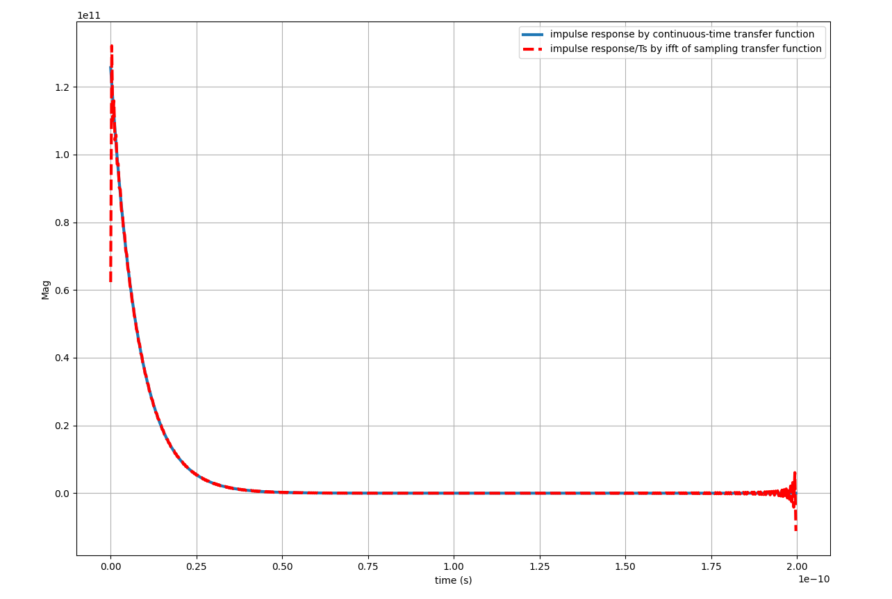
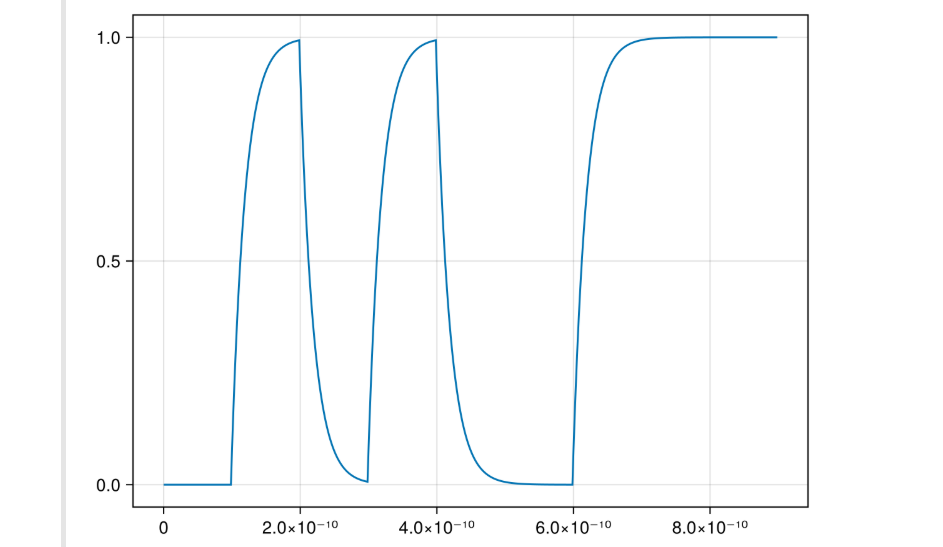
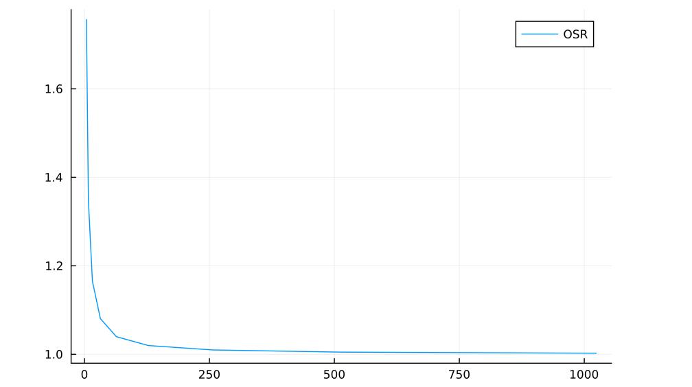
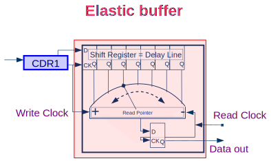
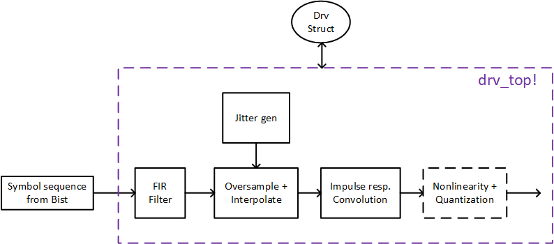
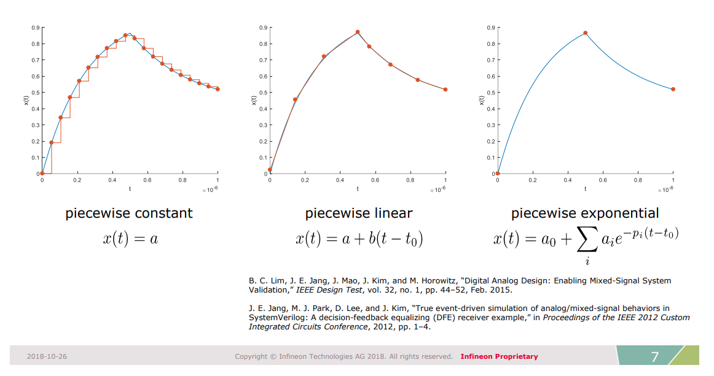
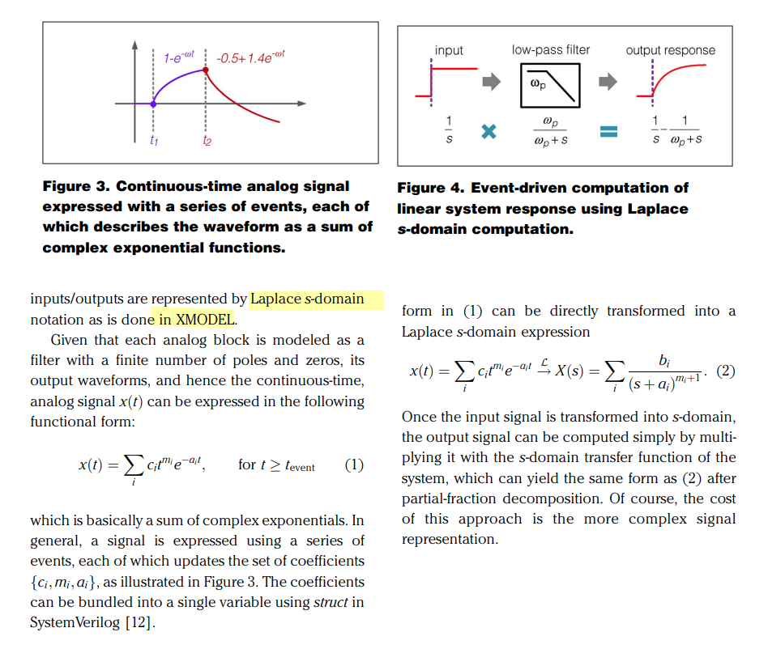
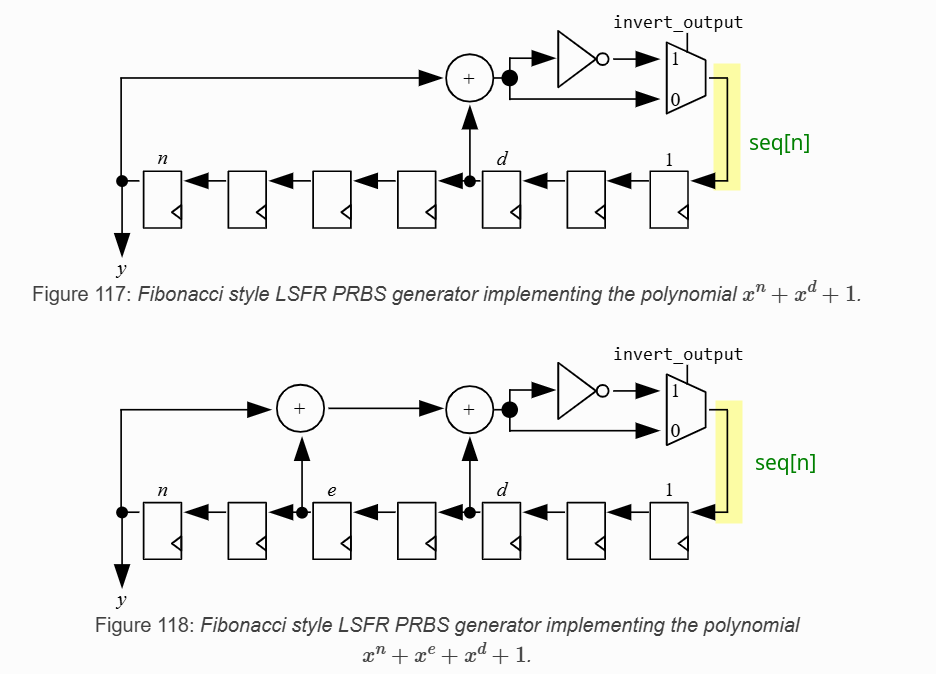
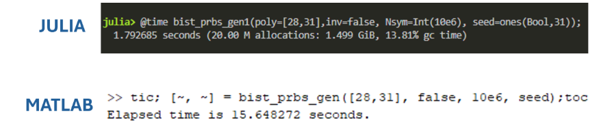

## Time domain modeling

While many different analysis methods exist, including frequency and statistical analysis, *time domain results* remain the final *sign-off*


### serdespy

> Richard Barrie. serdespy — A python library for system-level SerDes modelling and simulation [[https://github.com/richard259/serdespy](https://github.com/richard259/serdespy)]
>
> `python 3.10, samplerate`


***ifft of sampling continuous-time transfer function***


```python
def freq2impulse(H, f):
    #Returns the impulse response, h, and (optionally) the step response,
    #hstep, for a system with complex frequency response stored in the array H
    #and corresponding frequency vector f.  The time array is
    #returned in t.  The frequency array must be linearly spaced.

    Hd = np.concatenate((H,np.conj(np.flip(H[1:H.size-1]))))
    h = np.real(np.fft.ifft(Hd))
    #hstep = sp.convolve(h,np.ones(h.size))
    #hstep = hstep[0:h.size]
    t= np.linspace(0,1/f[1],h.size+1)
    t = t[0:-1]

    return h,t
```

Maybe, the more straightforward method is sampling impulse response of continuous-time transfer function directly



```python
import numpy as np
from scipy import signal
import matplotlib.pyplot as plt

fbw = 20e9
wbw = fbw * 2 * np.pi
samples_per_symbol = 64
UI = 1/50e9
Ts = UI/samples_per_symbol
fs = 1/Ts
ws = fs * 2 * np.pi
ttot = 4/fbw # heuristic
N = int(0.5 * fs * ttot)+1
w, H = signal.freqs([1], [1/wbw, 1], np.linspace(0, 0.5*ws, N))

## freq2impulse(H, f), ifft - using sample of continuous-time tranfer function
f = w/(2*np.pi)
Hd = np.concatenate((H,np.conj(np.flip(H[1:H.size-1]))))
hd = np.real(np.fft.ifft(Hd))
t= np.linspace(0,1/f[1],hd.size+1)
t = t[0:-1]

## continuous-time transfer function - impulse
t, hc = signal.impulse(([1], [1/wbw, 1]), T = t)

## hd(kTs) = Ts*hc(kTs)
plt.figure(figsize = (14,10))
plt.plot(t, hc, t, hd/Ts, '--r', linewidth=3)
plt.grid(); plt.legend(['impulse response by continuous-time transfer function','impulse response/Ts by ifft of sampling transfer function'])
plt.ylabel('Mag'); plt.xlabel('time (s)'); plt.show()
```


### JLSD

> Kevin Zheng. JLSD — Julia SerDes [[https://github.com/kevjzheng/JLSD](https://github.com/kevjzheng/JLSD)]

---

```julia
out = conv(ir, vbits)*tui/osr
lines(tt, out[1:length(vbits)])
```




---


***Kronecker product*** to create ***oversampled*** waveform

```julia
function gen_wvfm(bits; tui, osr)
	#helper function used to generate oversampled waveform
	
	Vbits = kron(bits, ones(osr)) #Kronecker product to create oversampled waveform
	dt = tui/osr
	tt = 0:dt:(length(Vbits)-1)*dt

	return tt, Vbits
end
```

---

***normalized to the time step***
$$
\frac{\alpha}{s+\alpha} \overset{\mathcal{L}^{-1}}{\longrightarrow} \alpha\cdot e^{-\alpha t}
$$

The integral of impulse response of low pass RC filter $\int_{0}^{+\infty} \alpha\cdot e^{-\alpha t}dt = 1$ — `sum(ir*dt)`

```julia
function gen_ir_rc(dt,bw,t_len)
	#helper function that directly calculates a first order RC response, normalized to the time step
    tt = [0:dt:t_len-dt;]

	#checkout the intuitive symbols!
    ω = (2*π*bw)
    ir = ω*exp.(-tt*ω)
    ir .= ir/sum(ir*dt)

    return ir
end
```


```julia
using Plots
using LaTeXStrings

tui = 1/10e9;
tlen_ir = 20*tui;


osr_list = [4, 8, 16, 32, 64, 128, 256, 512, 1024];
bw_ir = 8e9;

ω = (2*π*bw_ir);

ir_dt_sum_list = [];

for osr_cur in osr_list
    dt = tui/osr_cur; # Simulation time step
    tt = [0:dt:tlen_ir-dt;]
    ir = ω*exp.(-tt*ω);
    ir_dt_sum = sum(ir*dt);
    push!(ir_dt_sum_list, ir_dt_sum)
end

println(ir_dt_sum_list)
# Any[1.756575097878581, 1.3468434968519964, 1.1652908056870317, 1.0805951388547221, 1.0397838972257087, 1.0197634612560418, 1.0098496044545267, 1.0049167704129547, 1.0024563772359665]

p = plot(osr_list, ir_dt_sum_list, label = "OSR")
gui(p)
```



---

***Elastic Buffer***

the elastic buffer approach would be the most general for modeling say frequency offsets between TX and RX (will be addressed in future development)




---

***generate PAM symbols***

> here *Big Endian*

```julia
	#generate PAM symbols
    fill!(So, zero(Float64)) #reset So to all 0
    for n = 1:bits_per_sym
        @. So = So + 2^(bits_per_sym-n)*So_bits[n:bits_per_sym:end]
    end
```

```julia
function int2bits(num, nbit)
    return [Bool((num>>k)%2) for k in nbit-1:-1:0]
end


 Si_bits .= vec(stack(int2bits.(Si, bits_per_sym)))
```

---

***Detailed Transmitter***




### DaVE

> DaVE — tools regarding on analog modeling, validation, and generation, [[https://github.com/StanfordVLSI/DaVE](https://github.com/StanfordVLSI/DaVE)]


## Statistical Eye

> Sanders, Anthony, Michael Resso and John D'Ambrosia. “Channel Compliance Testing Utilizing Novel Statistical Eye Methodology.” (2004).
>
> X. Chu, W. Guo, J. Wang, F. Wu, Y. Luo and Y. Li, "Fast and Accurate Estimation of Statistical Eye Diagram for Nonlinear High-Speed Links," in IEEE Transactions on Very Large Scale Integration (VLSI) Systems, vol. 29, no. 7, pp. 1370-1378, July 2021, doi: 10.1109/TVLSI.2021.3082208.
>
> HSPICE® User Guide: Signal Integrity Modeling and Analysis, Version Q-2020.03, March 2020
>
> IA Title: Common Electrical I/O (CEI) - Electrical and Jitter Interoperability agreements for 6G+ bps, 11G+ bps, 25G+ bps I/O and 56G+ bps IA # OIF-CEI-04.0 December 29, 2017 [[pdf](https://www.oiforum.com/wp-content/uploads/2019/01/OIF-CEI-04.0.pdf)]
>
> J. Park and D. Kim, "Statistical Eye Diagrams for High-Speed Interconnects of Packages: A Review," in *IEEE Access*, vol. 12, pp. 22880-22891, 2024 [[pdf](https://ieeexplore.ieee.org/stamp/stamp.jsp?tp=&arnumber=10415105)]


### StatOpt

> Savo Bajic, ECE1392, Integrated Circuits for Digital Communications: **StatOpt in Python** [[https://savobajic.ca/projects/academic/statopt](https://savobajic.ca/projects/academic/statopt/)] [[https://www.eecg.utoronto.ca/~ali/statopt/main.html](https://www.eecg.utoronto.ca/~ali/statopt/main.html)]


## Analog Signals Representation

> Ben Yochret Sabrine, 2020, "BEHAVIORAL MODELING WITH SYSTEMVERILOG FOR MIXED-SIGNAL VALIDATION" [[https://di.uqo.ca/id/eprint/1224/1/Ben-Yochret_Sabrine_2020_memoire.pdf](https://di.uqo.ca/id/eprint/1224/1/Ben-Yochret_Sabrine_2020_memoire.pdf)]



---



## PRBS Generator & Checker

### PRBS Generator



> [[https://opencpi.gitlab.io/releases/latest/rst/comp_sdr/components/generator/prbs_generator_b.comp/prbs_generator_b-index.html](https://opencpi.gitlab.io/releases/latest/rst/comp_sdr/components/generator/prbs_generator_b.comp/prbs_generator_b-index.html)]


```julia
# Julia

function bist_prbs_gen(;poly, inv, Nsym, seed)
    seq = Vector{Bool}(undef,Nsym)
    for n = 1:Nsym
        seq[n] = inv
        for p in poly
            seq[n] ⊻= seed[p]
        end
        seed .= [seq[n]; seed[1:end-1]]
    end
    return seq, seed
end
```

```matlab
%% Matlab

function [seq, seed] = bist_prbs_gen(poly,inv, Nsym, seed)
    seq = zeros(1,Nsym);
    for n = 1:Nsym
        seq(n) = inv;
        for p = poly
            seq(n) = xor(seq(n), seed(p));
        end
       seed = [seq(n), seed(1:end-1)];
    end
end
```




> [[https://github.com/kevjzheng/JLSD/blob/main/Pluto%20Notebooks/pdf/JLSD_pt1_background.pdf](https://github.com/kevjzheng/JLSD/blob/main/Pluto%20Notebooks/pdf/JLSD_pt1_background.pdf)]


### PRBS Checker

previous bit determine current bit


```julia
function ber_check_prbs(rcvd_bits; poly, inv, seed, lock_status, lock_cnt, lock_threshold, ber_err_cnt, ber_tot_cnt)
	
	nbits_rcvd = lastindex(rcvd_bits)
	
    if lock_status #if prbs already locked, use prbs_gen for reference bits
        ref_bits, seed = bist_prbs_gen(poly=poly, inv=inv,
										Nsym=nbits_rcvd, seed=seed)
        ber_err_cnt += sum(rcvd_bits .⊻ ref_bits)
		ber_tot_cnt += nbits_rcvd

    else # if not locked yet, use received bits as seed
        for n = 1:nbits_rcvd
            brcv = rcvd_bits[n]
            btst = inv
			for p in poly
            	btst ⊻= seed[p]
			end
            seed .= [brcv; seed[1:end-1]]

			#need consecutive non-error for lock. reset when error happens
            lock_cnt = (btst == brcv) ? lock_cnt+1 : 0

            if lock_cnt == lock_threshold
                lock_status = true
                println("prbs locked")
				#run prbs till end
                ref_bits, seed = bist_prbs_gen(poly=poly, inv=inv,
										Nsym=nbits_rcvd-n, seed=seed)
				ber_err_cnt += sum(rcvd_bits[n+1:end] .⊻ ref_bits)
				ber_tot_cnt += nbits_rcvd - n

                break
            end
        end
    end

	return seed, lock_status, lock_cnt, ber_err_cnt, ber_tot_cnt
end
```


## Reference

MATLAB® and Simulink® RF and Mixed Signal [[https://www.mathworks.com/help/overview/rf-and-mixed-signal.html](https://www.mathworks.com/help/overview/rf-and-mixed-signal.html)]

---

Lim, Byong Chan, M. Horowitz, "Error Control and Limit Cycle Elimination in Event-Driven Piecewise Linear Analog Functional Models," in IEEE Transactions on Circuits and Systems I: Regular Papers, vol. 63, no. 1, pp. 23-33, Jan. 2016 [[https://sci-hub.se/10.1109/TCSI.2015.2512699](https://sci-hub.se/10.1109/TCSI.2015.2512699)]

—, Ph.D. Dissertation 2012. "Model validation of mixed-signal systems" [[https://stacks.stanford.edu/file/druid:xq068rv3398/bclim-thesis-submission-augmented.pdf](https://stacks.stanford.edu/file/druid:xq068rv3398/bclim-thesis-submission-augmented.pdf)]

—, J. -E. Jang, J. Mao, J. Kim and M. Horowitz, "Digital Analog Design: Enabling Mixed-Signal System Validation," in *IEEE Design & Test*, vol. 32, no. 1, pp. 44-52, Feb. 2015 [[http://iot.stanford.edu/pubs/lim-mixed-design15.pdf](http://iot.stanford.edu/pubs/lim-mixed-design15.pdf)]

— , Mao, James & Horowitz, Mark & Jang, Ji-Eun & Kim, Jaeha. (2015). Digital Analog Design: Enabling Mixed-Signal System Validation. Design & Test, IEEE. 32. 44-52. [[https://iot.stanford.edu/pubs/lim-mixed-design15.pdf](https://iot.stanford.edu/pubs/lim-mixed-design15.pdf)]

S. Liao and M. Horowitz, "A Verilog piecewise-linear analog behavior model for mixed-signal validation," *Proceedings of the IEEE 2013 Custom Integrated Circuits Conference*, San Jose, CA, USA, 2013 [[https://sci-hub.se/10.1109/CICC.2013.6658461](https://sci-hub.se/10.1109/CICC.2013.6658461)]

—, M. Horowitz, "A Verilog Piecewise-Linear Analog Behavior Model for Mixed-Signal Validation," in *IEEE Transactions on Circuits and Systems I: Regular Papers*, vol. 61, no. 8, pp. 2229-2235, Aug. 2014 [[https://sci-hub.se/10.1109/TCSI.2014.2332265](https://sci-hub.se/10.1109/TCSI.2014.2332265)]

—,Ph.D. Dissertation 2012. Verilog Piecewise Linear Behavioral Modeling For Mixed-Signal Validation [[https://stacks.stanford.edu/file/druid:pb381vh2919/Thesis_submission-augmented.pdf](https://stacks.stanford.edu/file/druid:pb381vh2919/Thesis_submission-augmented.pdf)]

Ji-Eun Jang et al. “True event-driven simulation of analog/mixed-signal behaviors in SystemVerilog: A decision-feedback equalizing (DFE) receiver example”. In: Proceedings of the
IEEE 2012 Custom Integrated Circuits Conference. 2012 [[https://sci-hub.se/10.1109/CICC.2012.6330558](https://sci-hub.se/10.1109/CICC.2012.6330558)]

—, Si-Jung Yang, and Jaeha Kim. “Event-driven simulation of Volterra series models
in SystemVerilog”. In: Proceedings of the IEEE 2013 Custom Integrated Circuits Conference.
2013 [[https://sci-hub.se/10.1109/CICC.2013.6658460](https://sci-hub.se/10.1109/CICC.2013.6658460)]

—, Ph.D. Dissertation 2015. Event-Driven Simulation Methodology for Analog/Mixed-Signal Systems [[file:///home/anon/Downloads/000000028723.pdf](file:///home/anon/Downloads/000000028723.pdf)]

---

"Creating Analog Behavioral Models VERILOG-AMS ANALOG MODELING" [[https://www.eecis.udel.edu/~vsaxena/courses/ece614/Handouts/CDN_Creating_Analog_Behavioral_Models.pdf](https://www.eecis.udel.edu/~vsaxena/courses/ece614/Handouts/CDN_Creating_Analog_Behavioral_Models.pdf)]

Rainer Findenig, Infineon Technologies. "Behavioral Modeling for SoC Simulation Bridging Analog and Firmware Demands" [[https://www.coseda-tech.com/files/Files/Dokumente/Behavioral_Modeling_for_SoC_Simulation_COSEDA_UGM_2018.pdf](https://www.coseda-tech.com/files/Files/Dokumente/Behavioral_Modeling_for_SoC_Simulation_COSEDA_UGM_2018.pdf)]

---

CC Chen. Why Efficient SPICE Simulation Techniques for BB CDR Verification? [[https://youtu.be/Z54MV9nuGUI](https://youtu.be/Z54MV9nuGUI)]

---

T. Wen and T. Kwasniewski, "Phase Noise Simulation and Modeling of ADPLL by SystemVerilog," *2008 IEEE International Behavioral Modeling and Simulation Workshop*, San Jose, CA, USA, 2008 [[slides](https://bmas.designers-guide.org/2008/2-1_Presentation.pdf), [paper](https://bmas.designers-guide.org/2008/2-1_Paper.pdf)]

---

Jaeha Kim,Scientific Analog. UCIe PHY Modeling and Simulation with XMODEL [[pdf](https://www.theise.org/wp-content/uploads/2023/10/Tutorial1-1_%EA%B9%80%EC%9E%AC%ED%95%98%EA%B5%90%EC%88%98%EB%8B%98_%EC%84%9C%EC%9A%B8%EB%8C%80%ED%95%99%EA%B5%90.pdf)]

---

S. Katare, "Novel Framework for Modelling High Speed Interface Using Python for Architecture Evaluation," *2020 IEEE REGION 10 CONFERENCE (TENCON)*, Osaka, Japan, 2020 [[https://sci-hub.se/10.1109/TENCON50793.2020.9293846](https://sci-hub.se/10.1109/TENCON50793.2020.9293846)]

