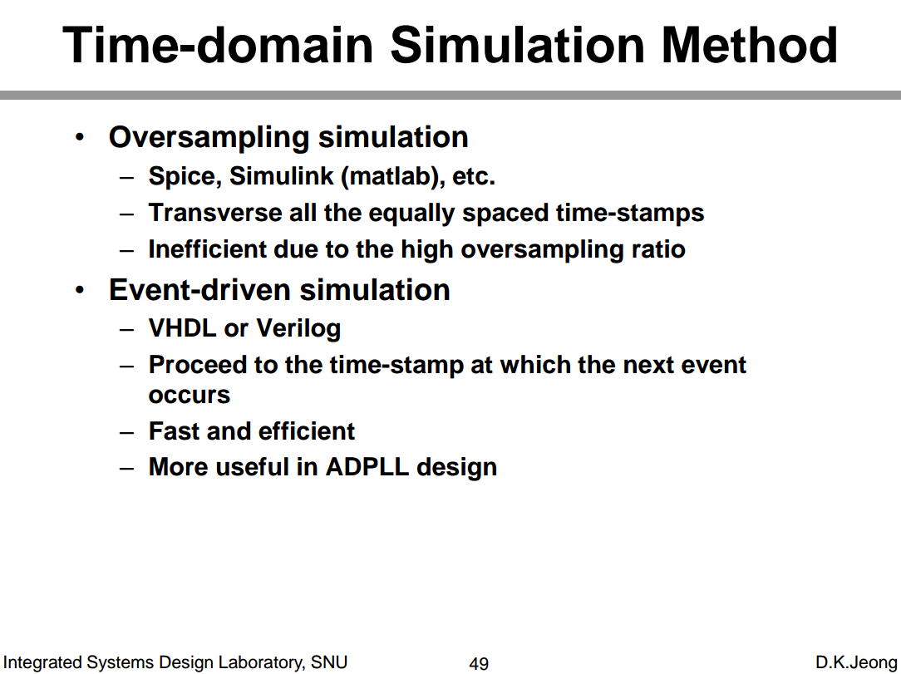
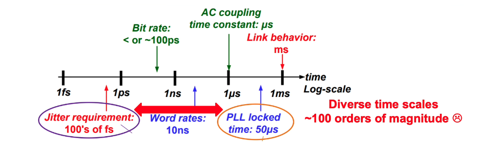

*TODO* &#128197;

---

## Reference

DaVE - tools regarding on analog modeling,validation, and generation, [[https://github.com/StanfordVLSI/DaVE](https://github.com/StanfordVLSI/DaVE)]

Savo Bajic, ECE1392, Integrated Circuits for Digital Communications: **StatOpt in Python** [[https://savobajic.ca/projects/academic/statopt](https://savobajic.ca/projects/academic/statopt/)] [[https://www.eecg.utoronto.ca/~ali/statopt/main.html](https://www.eecg.utoronto.ca/~ali/statopt/main.html)]

Kevin Zheng. JLSD - Julia SerDe [https://github.com/kevjzheng/JLSD]

MATLAB® and Simulink® RF and Mixed Signal [[https://www.mathworks.com/help/overview/rf-and-mixed-signal.html](https://www.mathworks.com/help/overview/rf-and-mixed-signal.html)]

---

Lim, Byong Chan,Ph.D. Dissertation 2012. "Model validation of mixed-signal systems" [[https://stacks.stanford.edu/file/druid:xq068rv3398/bclim-thesis-submission-augmented.pdf](https://stacks.stanford.edu/file/druid:xq068rv3398/bclim-thesis-submission-augmented.pdf)]

—, J. -E. Jang, J. Mao, J. Kim and M. Horowitz, "Digital Analog Design: Enabling Mixed-Signal System Validation," in *IEEE Design & Test*, vol. 32, no. 1, pp. 44-52, Feb. 2015 [[http://iot.stanford.edu/pubs/lim-mixed-design15.pdf](http://iot.stanford.edu/pubs/lim-mixed-design15.pdf)]

— , Mao, James & Horowitz, Mark & Jang, Ji-Eun & Kim, Jaeha. (2015). Digital Analog Design: Enabling Mixed-Signal System Validation. Design & Test, IEEE. 32. 44-52. [[https://iot.stanford.edu/pubs/lim-mixed-design15.pdf](https://iot.stanford.edu/pubs/lim-mixed-design15.pdf)]

—, M. Horowitz, "Error Control and Limit Cycle Elimination in Event-Driven Piecewise Linear Analog Functional Models," in IEEE Transactions on Circuits and Systems I: Regular Papers, vol. 63, no. 1, pp. 23-33, Jan. 2016 [[https://sci-hub.se/10.1109/TCSI.2015.2512699](https://sci-hub.se/10.1109/TCSI.2015.2512699)]

---

Ben Yochret Sabrine, 2020, "BEHAVIORAL MODELING WITH SYSTEMVERILOG FOR MIXED-SIGNAL VALIDATION" [[https://di.uqo.ca/id/eprint/1224/1/Ben-Yochret_Sabrine_2020_memoire.pdf](https://di.uqo.ca/id/eprint/1224/1/Ben-Yochret_Sabrine_2020_memoire.pdf)]

"Creating Analog Behavioral Models VERILOG-AMS ANALOG MODELING" [[https://www.eecis.udel.edu/~vsaxena/courses/ece614/Handouts/CDN_Creating_Analog_Behavioral_Models.pdf](https://www.eecis.udel.edu/~vsaxena/courses/ece614/Handouts/CDN_Creating_Analog_Behavioral_Models.pdf)]

Rainer Findenig, Infineon Technologies. "Behavioral Modeling for SoC Simulation Bridging Analog and Firmware Demands" [[https://www.coseda-tech.com/files/Files/Dokumente/Behavioral_Modeling_for_SoC_Simulation_COSEDA_UGM_2018.pdf](https://www.coseda-tech.com/files/Files/Dokumente/Behavioral_Modeling_for_SoC_Simulation_COSEDA_UGM_2018.pdf)]

---

CC Chen. Why Efficient SPICE Simulation Techniques for BB CDR Verification? [[https://youtu.be/Z54MV9nuGUI](https://youtu.be/Z54MV9nuGUI)]

