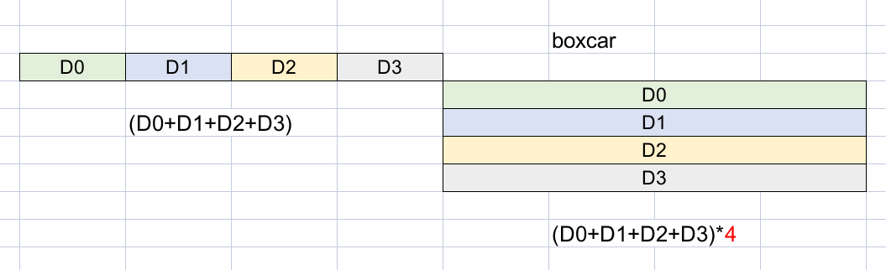

## ADC requirement

*TODO* &#128197;

ENOB - Not sufficient & not accurate enough
- Based on SNDR
- Assume unbounded Gaussian distribution

> quantization noise is ~ bounded uniform distribution
> 
> Using unbounded Gaussian -> pessimistic BER prediction

## Decimation

- Decimation is commonly employed to alleviate the high-speed requirement. However, decimation increases loop-latency which causes excessive dither jitter.

- Decimation is basically, widen the data and slowing it down
- Decimating by $L$ means frequency register only added once every $L$ UI, thus *integral path gain* reduced by $L$ in linear model

### Decimation by Summing

> In DSP this is called *boxcar filter*
>
> $\sum d_n$, where $d_n \in \{-1, 0, 1\}$

- Decimation via boxcar filter produces a DC gain, $K_b$, corresponding to the *decimation factor*. 

Loop gain of *proportional path* is unchanged

### Decimation by Voting
> equivalent $\sum d_n \lt 0 \to -1$, $\sum d_n = 0 \to 0$ and $\sum d_n\gt 0 \to 1$
>
> Compared to the boxcar filter, voting is able to reduce the loop delay and lower the output noise of the MMPD

- Decimation via voting has a reduced gain, $K_V$, which can be determined through simulation

> P. K. Hanumolu, M. G. Kim, G. -y. Wei and U. -k. Moon, "A 1.6Gbps Digital Clock and Data Recovery Circuit," *IEEE Custom Integrated Circuits Conference 2006*, San Jose, CA, USA, 2006, pp. 603-606
>
> J. L. Sonntag and J. Stonick, "A Digital Clock and Data Recovery Architecture for Multi-Gigabit/s Binary Links," in *IEEE Journal of Solid-State Circuits*, vol. 41, no. 8, pp. 1867-1875, Aug. 2006
>
> John T. Stonick, ISSCC 2011 tutorial. "DPLL Based Clock and Data Recovery" [[https://www.nishanchettri.com/isscc-slides/2011%20ISSCC/TUTORIALS/ISSCC2011Visuals-T5.pdf](https://www.nishanchettri.com/isscc-slides/2011%20ISSCC/TUTORIALS/ISSCC2011Visuals-T5.pdf)]
>
> Pavan Hanumolu, ISSCC 2015 tutorial. "Clock and Data Recovery Architectures & Circuits" 
>
> Liu, Tao, Tiejun Li, Fangxu Lv, Bin Liang, Xuqiang Zheng, Heming Wang, Miaomiao Wu, Dechao Lu, and Feng Zhao. 2021. "Analysis and Modeling of Mueller-Muller Clock and Data Recovery Circuits" *Electronics* 10, no. 16: 1888. https://doi.org/10.3390/electronics10161888
>
> Gu, Youzhi & Feng, Xinjie & Chi, Runze & Chen, Yongzhen & Wu, Jiangfeng. (2022). Analysis of Mueller-Muller Clock and Data Recovery Circuits with a Linearized Model. 10.21203/rs.3.rs-1817774/v1. 

## Phase Integrator

sub-resolution bits: gain reduction through sub-resolution bits

> John T. Stonick, ISSCC 2011 tutorial. "DPLL Based Clock and Data Recovery" [[https://www.nishanchettri.com/isscc-slides/2011%20ISSCC/TUTORIALS/ISSCC2011Visuals-T5.pdf](https://www.nishanchettri.com/isscc-slides/2011%20ISSCC/TUTORIALS/ISSCC2011Visuals-T5.pdf)]

## BER with Quantization Noise

> $$
> \text{Var}(X) = E[X^2] - E[X]^2
> $$
> 

## Impulse Response or Pulse Response

##  TX FFE

TX FFE suffers from the peak power constraint, which in effect attenuates the average power of the outgoing signal -  the low-frequency signal content has been attenuated down to the high-frequency level

> [[https://www.signalintegrityjournal.com/articles/1228-feedforward-equalizer-location-study-for-high-speed-serial-systems](https://www.signalintegrityjournal.com/articles/1228-feedforward-equalizer-location-study-for-high-speed-serial-systems)]
>
> **S. Palermo**, "CMOS Nanoelectronics Analog and RF VLSI Circuits," [Chapter 9: High-Speed Serial I/O Design for Channel-Limited and Power-Constrained Systems](https://people.engr.tamu.edu/spalermo/docs/serial_links_chapter_palermo_2011.pdf), McGraw-Hill, 2011.

## statistical eye

*TODO* &#128197;

> Sanders, Anthony, Michael Resso and John D'Ambrosia. "Channel Compliance Testing Utilizing Novel Statistical Eye Methodology." (2004).

## reference

Paul Muller Yusuf Leblebici École Polytechnique Fédérale de Lausanne (EPFL). [Pattern generator model for jitter-tolerance simulation](https://designers-guide.org/modeling/JTOL_rev1.0.pdf); [VHDL-AMS models](https://designers-guide.org/modeling/fc_jtol_src_ns.vhd)

G. Balamurugan, A. Balankutty and C. -M. Hsu, "56G/112G Link Foundations Standards, Link Budgets & Models," 2019 IEEE Custom Integrated Circuits Conference (CICC), Austin, TX, USA, 2019, pp. 1-95, doi: 10.1109/CICC.2019.8780223.

Savo Bajic, ECE1392, Integrated Circuits for Digital Communications: **StatOpt in Python** [[https://savobajic.ca/projects/academic/statopt](https://savobajic.ca/projects/academic/statopt/)]

Anritsu Company, "Measuring Channel Operating Margin," 2016. [[https://dl.cdn-anritsu.com/en-us/test-measurement/files/Technical-Notes/White-Paper/11410-00989A.pdf](https://dl.cdn-anritsu.com/en-us/test-measurement/files/Technical-Notes/White-Paper/11410-00989A.pdf)]

JLSD - Julia SerDe [[https://github.com/kevjzheng/JLSD](https://github.com/kevjzheng/JLSD)]

