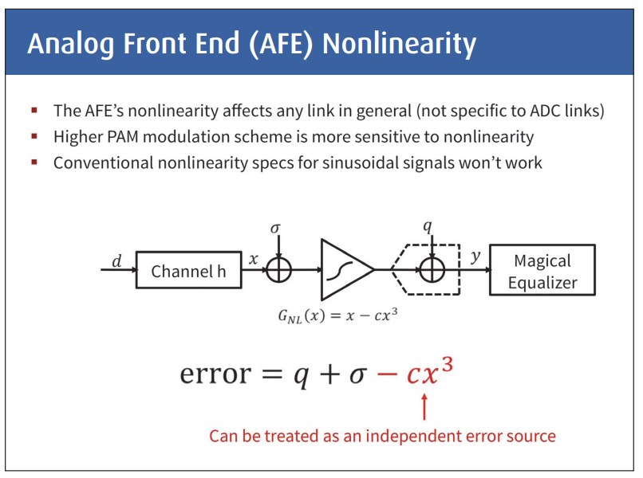
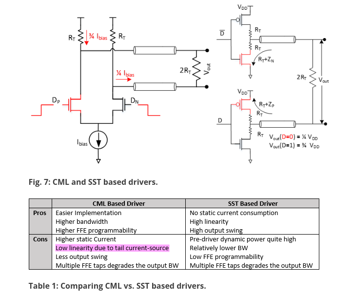
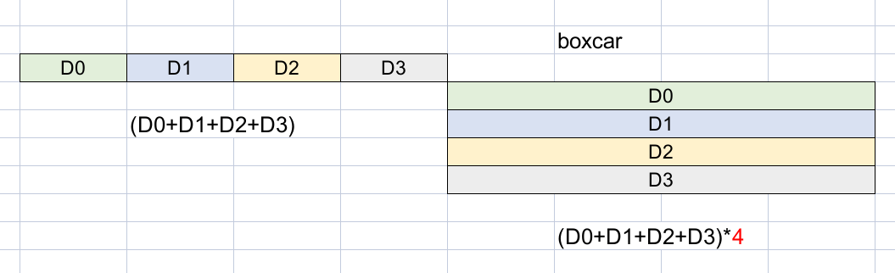
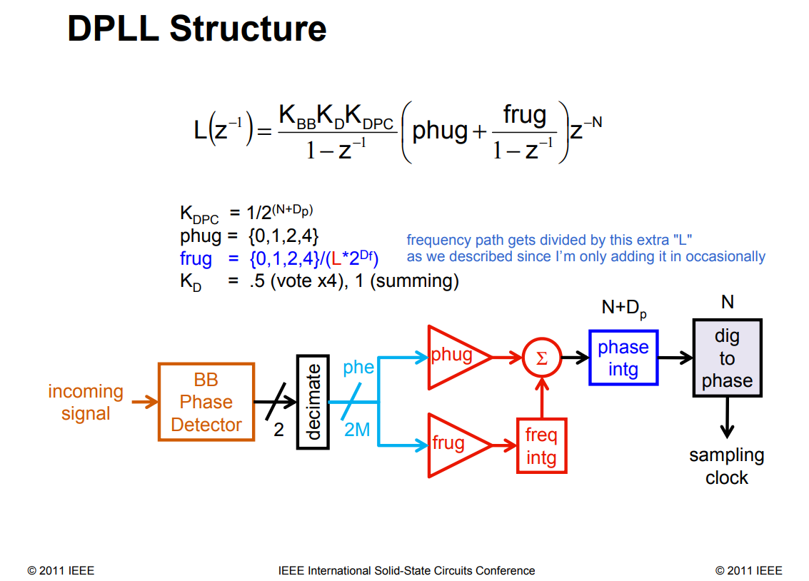
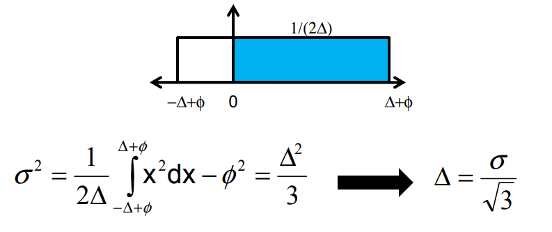
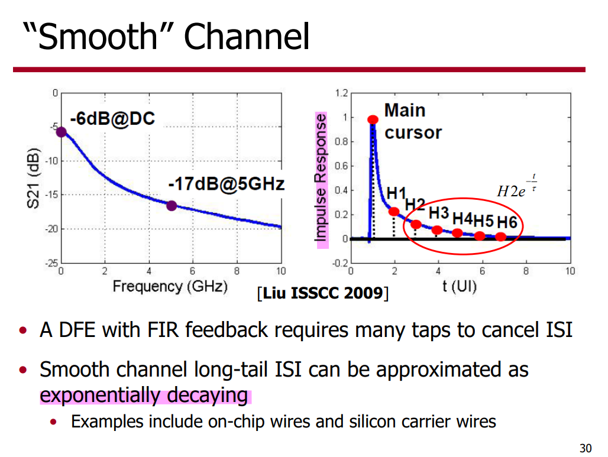
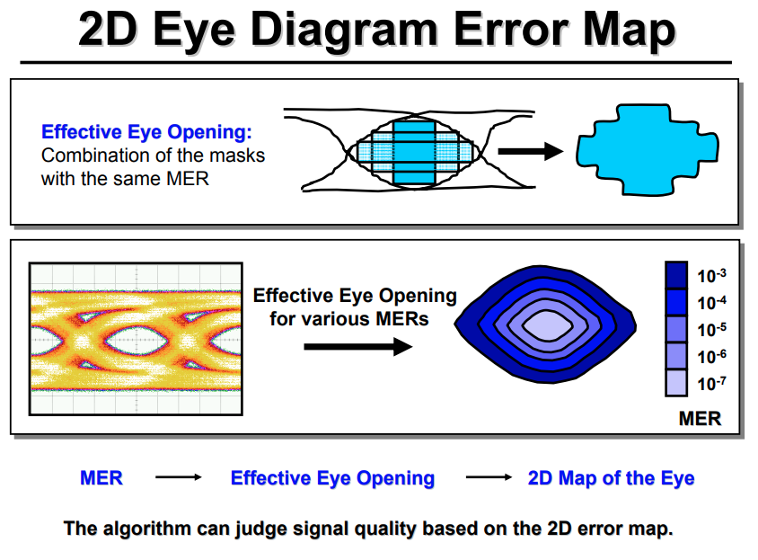

## VCO model

*TODO* &#128197;

> respone to vctrl
> focus on phase

> [[https://designers-guide.org/verilog-ams/functional-blocks/vco/vco.va](https://designers-guide.org/verilog-ams/functional-blocks/vco/vco.va)]

## majority voting

*TODO* &#128197;

> H. Kang et al., "A 42.7Gb/s Optical Receiver With Digital Clock and Data Recovery in 28nm CMOS," in IEEE Access, vol. 12, pp. 109900-109911, 2024 [[https://ieeexplore.ieee.org/stamp/stamp.jsp?arnumber=10630516](https://ieeexplore.ieee.org/stamp/stamp.jsp?arnumber=10630516)]

## Digital to Phase Converter (DPC) 

Converts *digital code* from the phase integrator into an edge location with respect to the local
reference clock

- Phase Interpolator (PI), phase rotator, DLL, etc

> Phase interpolators realize digital-to-phase conversion (DPC)

> P. Palestri *et al*., "Analytical Modeling of Jitter in Bang-Bang CDR Circuits Featuring Phase Interpolation," in *IEEE Transactions on Very Large Scale Integration (VLSI) Systems*, vol. 29, no. 7, pp. 1392-1401, July 2021 [[https://sci-hub.se/10.1109/TVLSI.2021.3068450](https://sci-hub.se/10.1109/TVLSI.2021.3068450)]

## ADC requirement

*TODO* &#128197;

ENOB - Not sufficient & not accurate enough
- Based on SNDR
- Assume unbounded Gaussian distribution

> quantization noise is ~ bounded uniform distribution
> 
> Using unbounded Gaussian -> pessimistic BER prediction

## AFE Nonlinearity

> ***"total harmonic distortion" (THD)*** in AFE

Relative to NRZ-based systems, PAM4 transceivers require more stringent circuit linearity, equalizers which can implement multi-level inter-symbol interference (ISI) cancellation, and improved sensitivity

Because if it compresses, it turns out you have to use a much more complicated feedback filter. As long as *it behaves linearly*, the feedback filter itself can remain *a linear FIR*

Linearity can actually be a critical constraint in these signal paths, and you really want to stay as linear as you can all the way up until the point where you've canceled all of the ISI

> A. Roshan-Zamir, O. Elhadidy, H. -W. Yang and S. Palermo, "A Reconfigurable 16/32 Gb/s Dual-Mode NRZ/PAM4 SerDes in 65-nm CMOS," in *IEEE Journal of Solid-State Circuits*, vol. 52, no. 9, pp. 2430-2447, Sept. 2017  [[https://people.engr.tamu.edu/spalermo/ecen689/2017_reconfigurable_16_32Gbps_NRZ_PAM4_SERDES_roshanzamir_jssc.pdf](https://people.engr.tamu.edu/spalermo/ecen689/2017_reconfigurable_16_32Gbps_NRZ_PAM4_SERDES_roshanzamir_jssc.pdf)]
>
> Hongtao Zhang, designcon2016. "PAM4 Signaling for 56G Serial Link Applications − A Tutorial"[[https://www.xilinx.com/publications/events/designcon/2016/slides-pam4signalingfor56gserial-zhang-designcon.pdf](https://www.xilinx.com/publications/events/designcon/2016/slides-pam4signalingfor56gserial-zhang-designcon.pdf)]
>
> Elad Alon, ISSCC 2014, "T6: Analog Front-End Design for Gb/s Wireline Receivers"

## CML vs. SST based driver

> Design Challenges Of High-Speed Wireline Transmitters [[https://semiengineering.com/design-challenges-of-high-speed-wireline-transmitters/](https://semiengineering.com/design-challenges-of-high-speed-wireline-transmitters/)]

## Decimation

- Decimation is commonly employed to alleviate the high-speed requirement. However, decimation increases loop-latency which causes excessive dither jitter.

- Decimation is basically, widen the data and slowing it down
- Decimating by $L$ means frequency register only added once every $L$ UI, thus *integral path gain* reduced by $L$ in linear model

### Decimation by Summing

> In DSP this is called *boxcar filter*
>
> $\sum d_n$, where $d_n \in \{-1, 0, 1\}$

- Decimation via boxcar filter produces a DC gain, $K_b$, corresponding to the *decimation factor*. 

Loop gain of *proportional path* is unchanged

### Decimation by Voting
> equivalent $\sum d_n \lt 0 \to -1$, $\sum d_n = 0 \to 0$ and $\sum d_n\gt 0 \to 1$
>
> Compared to the boxcar filter, voting is able to reduce the loop delay and lower the output noise of the MMPD

- Decimation via voting has a reduced gain, $K_V$, which can be determined through simulation

> P. K. Hanumolu, M. G. Kim, G. -y. Wei and U. -k. Moon, "A 1.6Gbps Digital Clock and Data Recovery Circuit," *IEEE Custom Integrated Circuits Conference 2006*, San Jose, CA, USA, 2006, pp. 603-606
>
> J. L. Sonntag and J. Stonick, "A Digital Clock and Data Recovery Architecture for Multi-Gigabit/s Binary Links," in *IEEE Journal of Solid-State Circuits*, vol. 41, no. 8, pp. 1867-1875, Aug. 2006
>
> John T. Stonick, ISSCC 2011 tutorial. "DPLL Based Clock and Data Recovery" [[https://www.nishanchettri.com/isscc-slides/2011%20ISSCC/TUTORIALS/ISSCC2011Visuals-T5.pdf](https://www.nishanchettri.com/isscc-slides/2011%20ISSCC/TUTORIALS/ISSCC2011Visuals-T5.pdf)]
>
> Pavan Hanumolu, ISSCC 2015 tutorial. "Clock and Data Recovery Architectures & Circuits" 
>
> Liu, Tao, Tiejun Li, Fangxu Lv, Bin Liang, Xuqiang Zheng, Heming Wang, Miaomiao Wu, Dechao Lu, and Feng Zhao. 2021. "Analysis and Modeling of Mueller-Muller Clock and Data Recovery Circuits" *Electronics* 10, no. 16: 1888. https://doi.org/10.3390/electronics10161888
>
> Gu, Youzhi & Feng, Xinjie & Chi, Runze & Chen, Yongzhen & Wu, Jiangfeng. (2022). Analysis of Mueller-Muller Clock and Data Recovery Circuits with a Linearized Model. 10.21203/rs.3.rs-1817774/v1. 

## BER with Quantization Noise

> $$
> \text{Var}(X) = E[X^2] - E[X]^2
> $$
> 

## Impulse Response or Pulse Response

##  TX FFE

TX FFE suffers from the peak power constraint, which in effect attenuates the average power of the outgoing signal -  the low-frequency signal content has been attenuated down to the high-frequency level

> [[https://www.signalintegrityjournal.com/articles/1228-feedforward-equalizer-location-study-for-high-speed-serial-systems](https://www.signalintegrityjournal.com/articles/1228-feedforward-equalizer-location-study-for-high-speed-serial-systems)]
>
> **S. Palermo**, "CMOS Nanoelectronics Analog and RF VLSI Circuits," [Chapter 9: High-Speed Serial I/O Design for Channel-Limited and Power-Constrained Systems](https://people.engr.tamu.edu/spalermo/docs/serial_links_chapter_palermo_2011.pdf), McGraw-Hill, 2011.

## statistical eye

*TODO* &#128197;

> Sanders, Anthony, Michael Resso and John D'Ambrosia. "Channel Compliance Testing Utilizing Novel Statistical Eye Methodology." (2004).

## Eye-Opening Monitor (EOM)

An architecture that evaluates the received signal quality

> data slicers, phase slicers, error slicers, scope slicers

> Analui, Behnam & Rylyakov, Alexander & Rylov, Sergey & Meghelli, Mounir & Hajimiri, Ali. (2006). A 10-Gb/s two-dimensional eye-opening monitor in 0.13-??m standard CMOS. Solid-State Circuits, IEEE Journal of. 40. 2689 - 2699, [[https://chic.caltech.edu/wp-content/uploads/2013/05/B-Analui_JSSC_10-Gbs_05.pdf](https://chic.caltech.edu/wp-content/uploads/2013/05/B-Analui_JSSC_10-Gbs_05.pdf)]

## reference

Paul Muller Yusuf Leblebici École Polytechnique Fédérale de Lausanne (EPFL). [Pattern generator model for jitter-tolerance simulation](https://designers-guide.org/modeling/JTOL_rev1.0.pdf); [VHDL-AMS models](https://designers-guide.org/modeling/fc_jtol_src_ns.vhd)

G. Balamurugan, A. Balankutty and C. -M. Hsu, "56G/112G Link Foundations Standards, Link Budgets & Models," 2019 IEEE Custom Integrated Circuits Conference (CICC), Austin, TX, USA, 2019, pp. 1-95, doi: 10.1109/CICC.2019.8780223.

Savo Bajic, ECE1392, Integrated Circuits for Digital Communications: **StatOpt in Python** [[https://savobajic.ca/projects/academic/statopt](https://savobajic.ca/projects/academic/statopt/)]

Anritsu Company, "Measuring Channel Operating Margin," 2016. [[https://dl.cdn-anritsu.com/en-us/test-measurement/files/Technical-Notes/White-Paper/11410-00989A.pdf](https://dl.cdn-anritsu.com/en-us/test-measurement/files/Technical-Notes/White-Paper/11410-00989A.pdf)]

JLSD - Julia SerDe [[https://github.com/kevjzheng/JLSD](https://github.com/kevjzheng/JLSD)]

Kiran Gunnam, Selected Topics in RF, Analog and Mixed Signal Circuits and Systems

H. Shakiba, D. Tonietto and A. Sheikholeslami, "High-Speed Wireline Links-Part I: Modeling," in IEEE Open Journal of the Solid-State Circuits Society, vol. 4, pp. 97-109, 2024 [[https://ieeexplore.ieee.org/stamp/stamp.jsp?arnumber=10608184](https://ieeexplore.ieee.org/stamp/stamp.jsp?arnumber=10608184)]

H. Shakiba, D. Tonietto and A. Sheikholeslami, "High-Speed Wireline Links-Part II: Optimization and Performance Assessment," in IEEE Open Journal of the Solid-State Circuits Society, vol. 4, pp. 110-121, 2024 [[https://ieeexplore.ieee.org/stamp/stamp.jsp?tp=&arnumber=10579874](https://ieeexplore.ieee.org/stamp/stamp.jsp?tp=&arnumber=10579874)]

