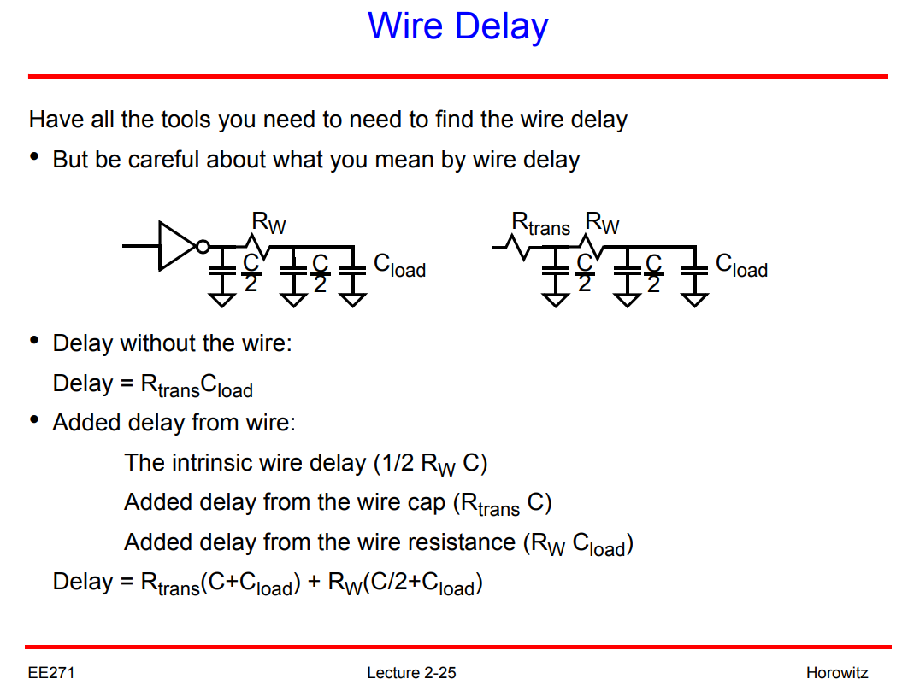

## Digital Delay Model

> Akio Kitagawa, Analog layout design [https://mixsignal.files.wordpress.com/2013/03/analog-layout.pdf](https://mixsignal.files.wordpress.com/2013/03/analog-layout.pdf)
>
> THE WIRE [http://bwrcs.eecs.berkeley.edu/Classes/icdesign/ee141_f01/Notes/chapter4.pdf](http://bwrcs.eecs.berkeley.edu/Classes/icdesign/ee141_f01/Notes/chapter4.pdf)
>
> Anoop Veliyath, Design Engineer, Cadence Design Systems. Accurately Modeling Transmission Line Behavior with an LC Network-based Approach [[pdf](https://www.pspice.com/sites/default/files/Transmission_Line_Modeling.pdf)]
>
> Mark Horowitz. Lecture 2: Wires and Wire Models [[pdf](https://web.stanford.edu/class/archive/ee/ee371/ee371.1066/lectures/Old/lect_02.pdf)]
>
> Neil Weste and David Harris. 2010. CMOS VLSI Design: A Circuits and Systems Perspective (4th. ed.). Addison-Wesley Publishing Company, USA.
>
> Cheng-Kok Koh. EE695K Modeling and Optimization of High Performance Interconnect [[lec3a_pdf](https://engineering.purdue.edu/~chengkok/ee695K/lec3a.pdf)]
>
> Vishal Saxena. ECE 445 Intro to VLSI Design: Lectures for Spring 2019 [https://www.eecis.udel.edu/~vsaxena/courses/ece445/s19/ECE445.htm](https://www.eecis.udel.edu/~vsaxena/courses/ece445/s19/ECE445.htm)
>

### Effective Switching resistance


> [https://www.eecis.udel.edu/~vsaxena/courses/ece445/s19/Lecture%20Notes/lec15_ece445.pdf](https://www.eecis.udel.edu/~vsaxena/courses/ece445/s19/Lecture%20Notes/lec15_ece445.pdf)




### wire delay

#### Elmore Delay


> Basic idea: use of **mean** of $v'(t)$ to approximate **median** of $v'(t)$


> Elmore delay approximates the **median** of $h(t)$ by the **mean** of $h(t)$


#### Distributed RC-Line


#### Lumped approximations

***$rc$-models***

If your simulator does not support a distributed $rc$-model, or if the computational complexity of these models slows down your simulation too much, you can construct a simple yet accurate model yourself by approximating the distributed $rc$ by a lumped RC network with a limited number of elements


> The accuracy of the model is determined by the number of stages. For instance, the error of the $\Pi -3$ model is less than 3%, which is generally sufficient.

---


***Why use "$\Pi$ Model"***


---


***examples***




### Wire Inductive Effect

- RC delay increases quadratically with length
- LC delay (speed of light flight time) increases linearly with length

> Inductance will only be important to the delay of low-resistance signals such as wide clock lines


---


***wave***

Signal propagates over the wire as a **wave** (rather than **diffusing** as in $rc$ only models)

> Signal propagates by alternately transferring energy from capacitive to inductive modes


## Glitches & Hazards

> CPE166/EEE 270 Advanced Logic Design-Digital Design: Time Behavior of Combinational Networks: [https://www.csus.edu/indiv/p/pangj/166/f/sram/Handout_Hazard.pdf](https://www.csus.edu/indiv/p/pangj/166/f/sram/Handout_Hazard.pdf)
>
> John Knight, ELEC3500 Glitches and Hazards in Digital Circuits [http://www.doe.carleton.ca/~shams/ELEC3500/hazards.pdf](http://www.doe.carleton.ca/~shams/ELEC3500/hazards.pdf)

- A **glitch** is an unwanted pulse at the output of a combinational logic network – **a momentary change** in an output that should not have changed
- A circuit with *the potential for a glitch* is said to have a **hazard**
- In other words a hazard is something intrinsic about a circuit; a circuit with hazard may or may not have a glitch depending on input patterns and the electric characteristics of the circuit.


### When do circuits have hazards ?

Hazards are potential unwanted transients that occur in the output when different paths from input to output have different propagation delays

### Types of Hazards (on an output)

static 1-hazard, static 0-hazard, dynamic hazard


### Hazard's Concern

- Hazards do not hurt synchronous circuits
- Hazards Kill Asynchronous Circuits
- Glitches Increase Power Consumption


## Isolation cells

> Isolation cells and Level Shifter cells URL: [https://vlsitutorials.com/isolation-cells-level-shifter-cells-low-power-vlsi/](https://vlsitutorials.com/isolation-cells-level-shifter-cells-low-power-vlsi/)

***Isolation cells*** are additional cells inserted by the synthesis tools for isolating the buses/wires crossing from **power-gated domain** of a circuit to its always-on domain (**AON**). 

> To prevent corruption of always-on domain, we clamp the nets crossing the power domains to a value depending upon the design.

*A simple circuit having a switchable (or gated) power domain*


*The circuit shown in Figure 1, after isolation cells are inserted*


### Always-On Buffer


## Clock Gating

> The Ultimate Guide to Clock Gating [https://anysilicon.com/the-ultimate-guide-to-clock-gating/ ](https://anysilicon.com/the-ultimate-guide-to-clock-gating/)

**Clock Gating** is defined as: "Clock gating is a technique/methodology to turn off the clock to certain parts of the digital design when not needed".

### AND gate-based clock gating

In *simplest form* a clock gating can be achieved by using an *AND gate* as shown in picture below


However, this simplest form of clock gating technique has some problem of generating **glitches** in the clock provide to the FF, which are not desirable.


> Glitches in enable/gated clock

### Latch based clock gating

These glitches can be removed by introducing a negative edge triggered FF (assuming downstream FFs are positive edge) or low-level sensitive latch at the output of the clock enable signal.


This will make sure that any glitch in the clock enable signal will not be visible to the gated clock output. The Latch output will only be updated during the negative clock cycle and thus input to AND gate will be stable high.


> Glitch Free Gated Clock


## OCV Derating With AOCV

> Genus Attribute Reference 22.1
>
> Innovus Text Command Reference 22.10
>
> Article (20416394) Title: Analysis with Advanced On-chip Variation (AOCV) derating in EDI system and ETS
> URL: https://support.cadence.com/apex/ArticleAttachmentPortal?id=a1Od000000050NxEAI


**timing_aocv_derate_mode**

```
timing_aocv_derate_mode{aocv_multiplicative | aocv_additive}
```

*Default:* `aocv_multiplicative`

Controls the AOCV derating mode.

When set to `aocv_multiplicative`, the derating factor will be calculated as AOCV derating * OCV derating, which is set using the `set_timing_derate` command.

When set to `aocv_additive`, the derating factor will be calculated as AOCV derating + OCV derating values.

When you use this global variable, the `report_timing` command shows the `total_derate` column in the timing report output, which allows you to view and cross-check the calculated total derate factor.

To set this global variable, use the `set_global` command.


## preserve hand-instantiated cells

To preserve the hand-instantiated cells

```
set_dont_touch [get_cells -hierarchical *dont_touch_*]
```

The instances whose name contain "dont_touch_" shall be preserved during synthesis


```verilog
// no performace concerns, rest sync use sync3 is enough

module CN_resetb_sync_cell
(
    input resetb_in,
    input clkdst,
    output resetb_out
);

`ifdef USE_VERILOG
reg [2:0] resetb_dly;
`else
wire [2:0] resetb_dly;
`endif

`ifdef USE_VERILOG
always @(posedge clkdst or negedge resetb_in)
    if (~resetb_in) resetb_dly <= 3'b000;
    else resetb_dly <= {resetb_dly[1:0], 1'b1};
`else
SDFCNQD4 dont_touch_sync_flop0 (
    .SI(1'b0),
    .SE(1'b0),
    .CP(clkdst),
    .CDN(resetb_in),
    .D(1'b1),
    .Q(resetb_dly[0])
);
SDFCNQD4 dont_touch_sync_flop1 (
    .SI(1'b0),
    .SE(1'b0),
    .CP(clkdst),
    .CDN(resetb_in),
    .D(resetb_dly[0]),
    .Q(resetb_dly[1])
);
SDFCNQD4 dont_touch_sync_flop2 (
    .SI(1'b0),
    .SE(1'b0),
    .CP(clkdst),
    .CDN(resetb_in),
    .D(resetb_dly[1]),
    .Q(resetb_dly[2])
);
`endif

assign resetb_out = resetb_dly[2];

endmodule
```

