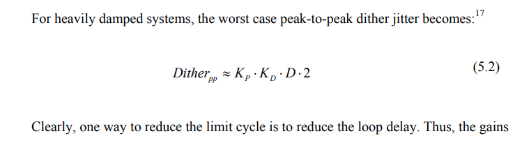
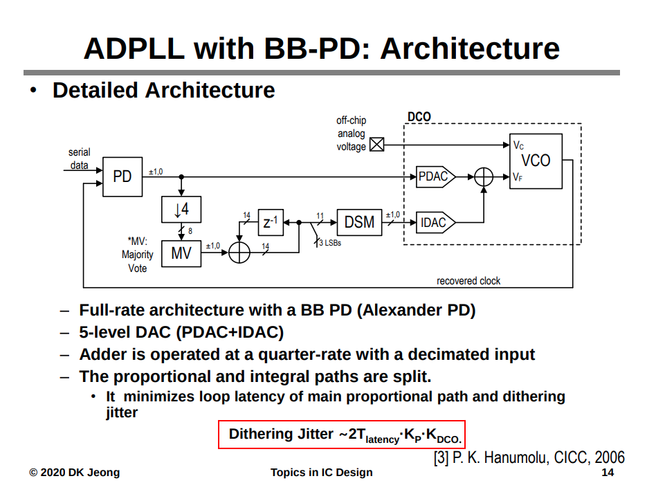
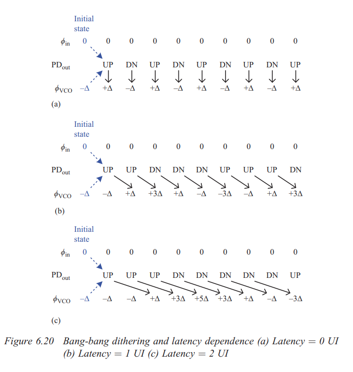
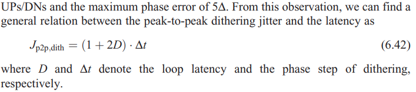
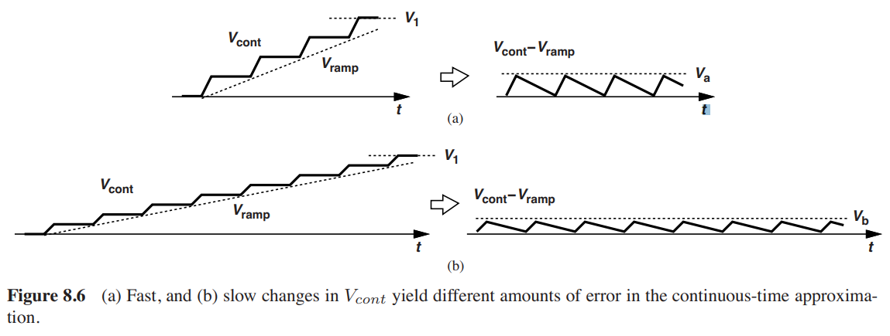

## dithering jitter

>  *hunting jitter* is also called as **dithering jitter**
>
>  - proportional gain 
>  - loop latency 

where the proportional gain ($K_P$) 

> Hanumolu, Pavan Kumar. 2006. *Design Techniques for Clocking High Performance Signaling Systems.* : Oregon State University. [https://ir.library.oregonstate.edu/concern/graduate_thesis_or_dissertations/1v53k219r](https://ir.library.oregonstate.edu/concern/graduate_thesis_or_dissertations/1v53k219r)]
>
> Hae-Chang Lee, "An Estimation Approach To Clock And Data Recovery" [[https://www-vlsi.stanford.edu/people/alum/pdf/0611_HaechangLee_Phase_Estimation.pdf](https://www-vlsi.stanford.edu/people/alum/pdf/0611_HaechangLee_Phase_Estimation.pdf)]
>
> R. Walker, “Designing Bang-Bang PLLs for Clock and Data Recovery in Serial Data Transmission Systems,” in Phase-Locking in High-Performance Systems, B. Razavi, Ed. New Jersey: IEEE Press, 2003, pp. 34-45. [[http://www.omnisterra.com/walker/pdfs.papers/BBPLL.pdf](http://www.omnisterra.com/walker/pdfs.papers/BBPLL.pdf)]
>
> J. Kim, Design of CMOS Adaptive-Supply Serial Links, Ph.D. Thesis, Stanford University, December 2002.  [[https://www-vlsi.stanford.edu/people/alum/pdf/0212_Kim_______Design_Of_CMOS_AdaptiveSu.pdf](https://www-vlsi.stanford.edu/people/alum/pdf/0212_Kim_______Design_Of_CMOS_AdaptiveSu.pdf)]
>
> P. K. Hanumolu, M. G. Kim, G. -y. Wei and U. -k. Moon, "A 1.6Gbps Digital Clock and Data Recovery Circuit," *IEEE Custom Integrated Circuits Conference 2006*, San Jose, CA, USA, 2006, pp. 603-606 [[https://sci-hub.se/10.1109/CICC.2006.320829](https://sci-hub.se/10.1109/CICC.2006.320829)]
>
> Da Dalt N. A design-oriented study of the nonlinear dynamics of digital bang-bang PLLs. IEEE Transactions on Circuits and Systems I: Regular Papers. 2005;52(1):21–31. [[https://sci-hub.se/10.1109/TCSI.2004.840089](https://sci-hub.se/10.1109/TCSI.2004.840089)]
>
> Jang S, Kim S, Chu SH, Jeong GS, Kim Y, Jeong DK. An optimum loop gain tracking all-digital PLL using autocorrelation of bang–bang phasefrequency detection. IEEE Transactions on Circuits and Systems II: Express Briefs. 2015;62(9):836–840. [[https://sci-hub.se/10.1109/TCSII.2015.2435691](https://sci-hub.se/10.1109/TCSII.2015.2435691)]

---

## CDR Loop Latency 

Denoting the CDR loop latency by $\Delta T$ , we note that the loop transmission is multiplied by $exp(-s\Delta T)\simeq 1-s\Delta T$.The resulting right-half-plane zero, $f_z$ degrades the phase margin and must remain about **one decade beyond the BW**
$$
f_z\simeq \frac{1}{2\pi \Delta T}
$$

> This assumption is true in practice since the bandwidth of the CDR (few mega Hertz) is much smaller than the data rate (multi giga bits/second).

> [Fernando , Marvell Italy."Considerations for CDR
> Bandwidth Proposal" [https://www.ieee802.org/3/bs/public/16_03/debernardinis_3bs_01_0316.pdf](https://www.ieee802.org/3/bs/public/16_03/debernardinis_3bs_01_0316.pdf)]
>
> 

## Loop Bandwidth

> The *closed-loop −3-dB bandwidth* is sometimes called the **“loop bandwidth”**

## Continuous-Time Approximation Limitations 

A rule of thumb often used to ensure slow changes in the loop is to select the *loop bandwidth* approximately equal to **one-tenth** of the *input frequency*. 

> Gardner, F.M. (1980). Charge-Pump Phase-Lock Loops. *IEEE Trans. Commun., 28*, 1849-1858.
>
> Homayoun, Aliakbar and Behzad Razavi. “On the Stability of Charge-Pump Phase-Locked Loops.” *IEEE Transactions on Circuits and Systems I: Regular Papers* 63 (2016): 741-750.
>
> N. Kuznetsov, A. Matveev, M. Yuldashev and R. Yuldashev, "Nonlinear Analysis of Charge-Pump Phase-Locked Loop: The Hold-In and Pull-In Ranges," in *IEEE Transactions on Circuits and Systems I: Regular Papers*, vol. 68, no. 10, pp. 4049-4061, Oct. 2021
>

