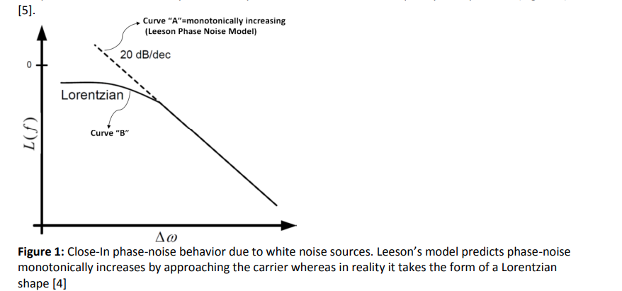

A more precise analysis shows that the spectrum of a free-running oscillator does indeed have a Lorentian profile: 

1. it is **flat** for frequencies below a given corner frequency 
2. and rolls off as $1/f^2$  above it.

The spectrum of the signal $x(t + α(t))$ can be expressed as
$$
S_x(f)=\sum_{n}\left| X_n \right|^2\frac{\omega_0^2 n^2 c}{\frac{1}{4}\omega_0^4 n^4 c^2+(\omega+n\omega_0)^2}
$$
The integral in above equation around each harmonic is equal to the power of the harmonic itself $\left| X_n \right|^2$

 This means that the **excess phase noise** **DONT** change the energy of the signal; it just spreads its energy over the frequency spectrum, blurring the very sharp frequency impulse of an ideal noiseless oscillator.

**reference:**

A. Demir, A. Mehrotra and J. Roychowdhury, "Phase noise in oscillators: a unifying theory and numerical methods for characterization," in IEEE Transactions on Circuits and Systems I: Fundamental Theory and Applications, vol. 47, no. 5, pp. 655-674, May 2000, doi: 10.1109/81.847872.

Dalt, Nicola Da and Ali Sheikholeslami. “Understanding Jitter and Phase Noise: A Circuits and Systems Perspective.” (2018).

Rubiola, E. (2008). Phase Noise and Frequency Stability in Oscillators (The Cambridge RF and Microwave Engineering Series). Cambridge: Cambridge University Press. doi:10.1017/CBO9780511812798

[Dr. Ulrich L. Rohde, Noise Analysis, Then and Today](https://www.microwavejournal.com/articles/29151-noise-analysis-then-and-today)
