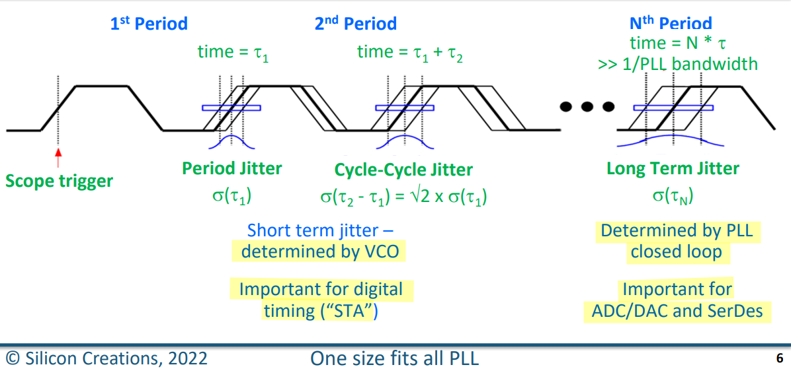
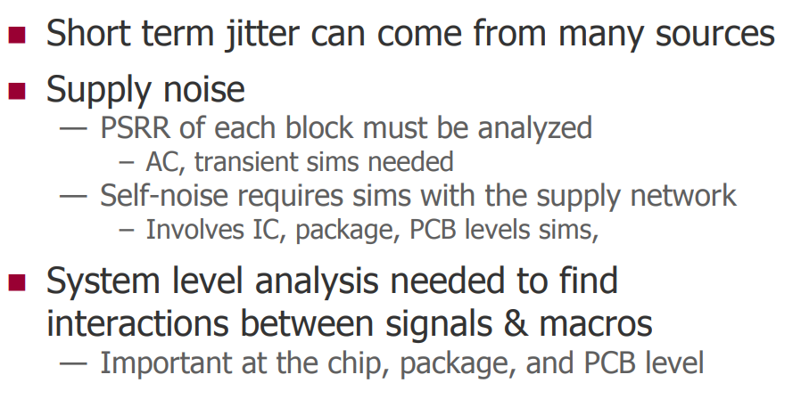
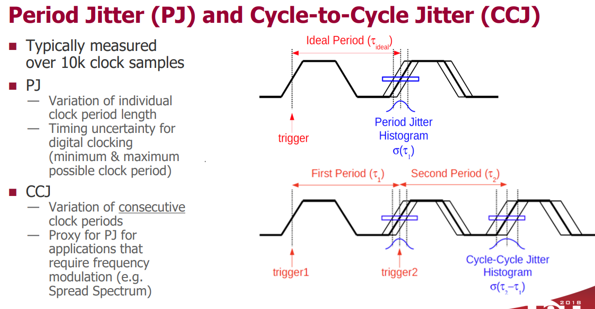

**long-term jitter**  is sometimes referred to as the **accumulated jitter**

- Cycle-Cycle Jitter
  $$
  \delta(\tau _2 - \tau _1) = \sqrt{2}\times\delta (\tau_1)
  $$
  

- Long Term Jitter
  $$
  \delta(\tau_N) = \sqrt{N}\times\delta (\tau_1)
  $$
  

##  Short Term Jitter

## Long Term Jitter (LTJ)

## measuring long-term jitter

## Jitter Calculation Examples

## references

AN10007 Clock Jitter Definitions and Measurement Methods, SiTime [[pdf](https://www.sitime.com/sites/default/files/hiddenresources/AN10007-Jitter-and-measurement-methods_SIT.pdf)]

SERDES Design and Simulation Using the Analog FastSPICE Platform, Silicon Creations [[pdf](https://www.siliconcr.com/sc-cms/uploads/u2u_presentation_sc_april25.pdf)]

Flexible clocking solutions in advanced processes from 180nm to 5nm, Silicon Creations [[pdf](https://www.siliconcr.com/sc-cms/uploads/siliconcreations_iccad_2019_v2_191020.pdf)]

One-size-fits-all PLLs for Advanced Samsung Foundry Processes, Silicon Creations [[pdf](https://www.siliconcr.com/sc-cms/uploads/siliconcreations_dac_2022_v2_22-07-12.pdf)]

Circuit Design and Verification of 7nm LowPower, Low-Jitter PLLs, Silicon Creations, [[pdf](https://www.siliconcr.com/sc-cms/uploads/u2u-2018-sicr-plls-v3-180509.pdf)]

Lecture 10: Jitter, ECEN720: High-Speed Links Circuits and Systems Spring 2023 [[pdf](https://people.engr.tamu.edu/spalermo/ecen689/lecture10_ee720_jitter.pdf)]
